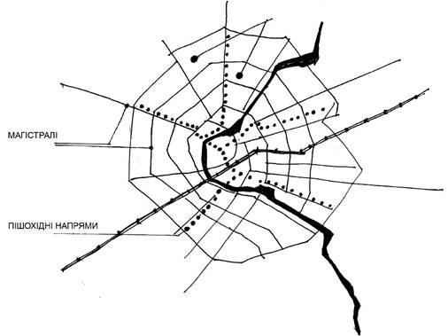
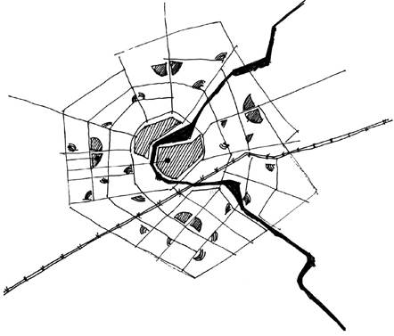
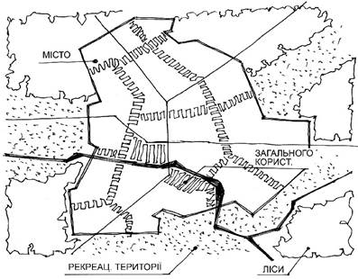
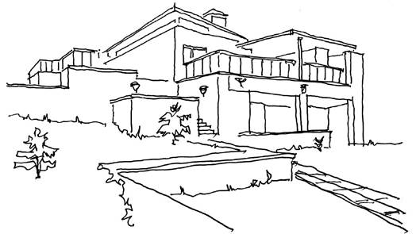
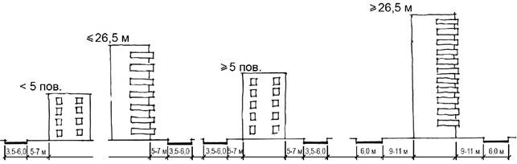
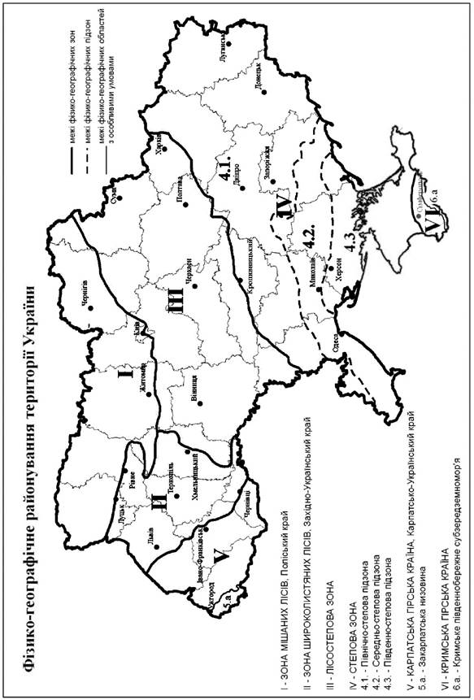
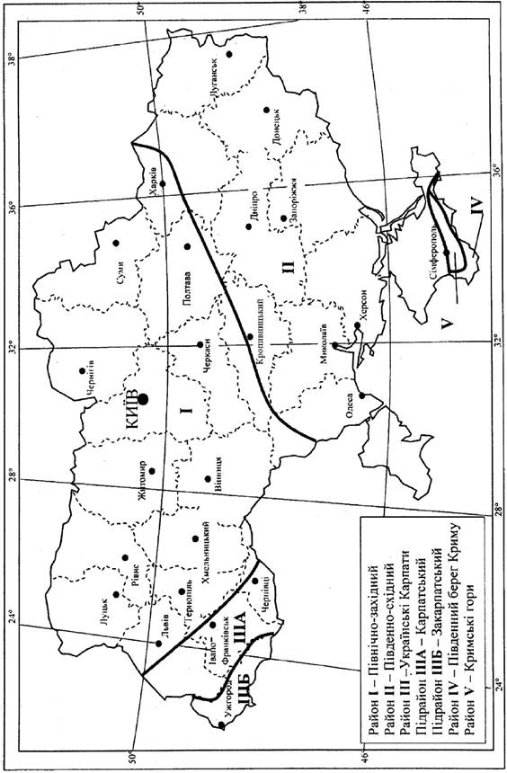

ДЕРЖАВНІ БУДІВЕЛЬНІ НОРМИ УКРАЇНИ

**ПЛАНУВАННЯ ТА ЗАБУДОВА ТЕРИТОРІЙ**

**ДБН Б.2.2-12:2019**

_Видання офіційне_

Київ

Міністерство регіонального розвитку, будівництва та житлово-комунального господарства України

2019

ДЕРЖАВНІ БУДІВЕЛЬНІ НОРМИ УКРАЇНИ

**ПЛАНУВАННЯ ТА ЗАБУДОВА ТЕРИТОРІЙ**

**ДБН Б.2.2-12:2019**

_Видання офіційне_

Київ

Мінрегіон України

2019

**ПЕРЕДМОВА**

1 РОЗРОБЛЕНО:

Державне підприємство "Український державний науково-дослідний інститут проектування міст "Діпромісто" імені Ю.М.Білоконя"

РОЗРОБНИКИ:

**І. Шпилевський** (керівник розробки); **Ю. Палеха** (науковий керівник, д-р. геогр. наук; **А. Економов**, відповідальний виконавець; **Г. Айлікова**, канд. техн. наук; **Л. Безкоровайна; Т. Губенко; Д. Жуков; В. Лавринчук; В. Ліговська; О. Малишева; В. Муха; А. Олещенко**, канд. геогр. наук;

**В. Токар**; **М. Христюк**

, канд. техн. наук

КНУБА (**М. Дьомін**, д-р. арх.; **В. Нудельман**, д-р. геогр. наук; **Т. Панченко**, д-р. арх.; **О. Сингаївська**, д-р. техн. наук; **О. Сергейчук**, д-р. техн. наук; **Л. Золотар**; **А. Мамедов,** канд. техн. наук; **О. Міщенко**; **А. Омшанська**, канд. арх.; **М. Осетрін**, канд. техн. наук; **О. Пантюхіна**, канд. арх.;

**О. Приймаченко**, канд. техн. наук; **М. Биваліна**, канд. техн. наук;

**П. Чередніченко**; **В. Яценко**, канд. арх.)

ДП "НДПІмістобудування" (**М. Сюр**; **В. Онищенко**, канд. арх.; **В. Глеба**, канд. держ. упр.; **І. Соколов; Т. Жаворонкова; Н. Соковніна**)

ДП "УКРНДПІЦИВІЛЬБУД" (**О. Чижевський**, канд. арх.; **С. Буравченко**, канд. арх.; **З. Денисенко**; **Т. Криштоп**, канд. техн. наук; **В. Максименко;**

**М. Омельчук; О. Ханенко; С. Шаманський**, канд. техн. наук)

КО "Інститут Генерального плану м. Києва" (**С. Броневицький**, д-р. техн. наук; **Т. Нечаєва**, канд. арх.; **Н. Гонтарик; О. Мішкіна; В. Присяжнюк;**

**М. Римар-Щербина; Н. Растовська; І. Соболєв**)

Інститут урбаністики ( **Г. Фільваров** , д-р. арх.; **А. Плешкановська**, д-р техн. наук)

ПРАТ "ХАРКІВСЬКИЙ ПРОМБУДНДІПРОЕКТ" (**О. Удовиченко**)

ПАТ "УкрНДІінжпроект" (**П. Зембицький; П. Матичин; Г. Шатило**)

ДП "УКРНДІВОДОКАНАЛПРОЕКТ" (**О. Оглобля**, д-р. техн. наук; **С. Краток**)

ПАТ "КиївЗНДІЕП" (**В. Куцевич**, д-р. арх.; **Б. Губов**)

УкрНдіЦЗ (**В. Ніжник**, канд. техн. наук; **Я. Балло**, канд. техн. наук;

**Р. Уханський**, канд. техн. наук; **С. Поздєєв**, д-р. техн. наук)

ДСНС України (**В. Федюк; О. Лановенко; А. Бобир**)

ДУ "Інститут громадського здоров’я імені О.М.Марзєєва НАМН України" (**А. Сердюк**, академік НАМНУ; **В. Махнюк**, д-р. мед. наук; **В. Акіменко**, д-р. мед. наук; **Ю. Думанський** , д-р. мед. наук; **В. Станкевич**, д-р. мед. наук;

**С. Могильний**)

ДП "НДКТІ МГ" (**І. Сатін**, канд. техн. наук)

ОДАБА (**Є. Вітвицька**, канд. техн. наук)

МІНРЕГІОНУкраїни (**С. Білоус**)

2 ВНЕСЕНО ТА

Департамент містобудування, архітектури та планування територій

ПІДГОТОВЛЕНО ДО Міністерства регіонального розвитку, будівництва та житлово-комунального ЗАТВЕРДЖЕННЯ: господарства України

3 ПОГОДЖЕНО: Державна служба України з надзвичайних ситуацій, лист від 13.03.2019 № 01-3868/261

Міністерство культури України, лист від 01.04.2019 № 964/10-1/14-19

Міністрество молоді та спорту України, лист від 07.03.2019 № 1658/11

Міністерство інфраструктури України, лист від 27.03.2019 № 3736/18/10-19

Міністерство освіти і науки України, лист від 02.04.2019 № 1/12-2048

Міністерство екології та природних ресурсів України, лист від 15.03.2019 № 5/1-7/2966-19

Міністерство охорони здоров’я, лист від 18.03.2019 № 26.1-16/561-19/7084

Міністерство внутрішніх справ України, лист від 01.04.2019 № 4442/05/25-2019

Державна служба України з питань безпечності харчових продуктів та захисту споживачів, лист від 02.04.2019 № 602-123-20-2/6707

4 ЗАТВЕРДЖЕНО: Наказ Міністерства регіонального розвитку, будівництва та житлово-

комунального господарства України від 26.04.2019 р. № 104

НАБРАННЯ з першого числа місяця, що настає через 90 днів з дня їх опублікування в

ЧИННОСТІ: офіційному друкованому виданні Міністерства "Інформаційний бюлетень

Міністерства регіонального розвитку, будівництва та житлово-комунального

господарства України" (з 2019-10-01)

НА ЗАМІНУ: ДБН Б.2.2-12:2018 "Планування і забудова територій"

**Мінрегіон Украї ни, 2019**

Видавець нормативних документів у галузі будівництва

і промисловості будівельних матеріалів Мінрегіону України

**Державне підприємство "Укрархбудінформ"**

III

**ЗМІСТ**

C.

[1 СФЕРА ЗАСТОСУВАННЯ.............................................................................................................................. 1](#_Toc316545)

[2 НОРМАТИВНІ ПОСИЛАННЯ.................................................................................................................................. 1](#_Toc316546)

[3 ТЕРМІНИ ТА ВИЗНАЧЕННЯ ПОНЯТЬ.................................................................................................................. 2](#_Toc316547)

[4 ЗАГАЛЬНІ ПОЛОЖЕННЯ.................................................................................................................................. 11](#_Toc316548)

[5 ПРОСТОРОВО-ПЛАНУВАЛЬНА ОРГАНІЗАЦІЯ ТЕРИТОРІЙ............................................................................... 14](#_Toc316549)

[6 СЕЛЬБИЩНІ ТЕРИТОРІЇ........................................................................................................................... 19](#_Toc316550)

[6.1 Зона житлової забудови................................................................................................................... 19](#_Toc316551)

[6.2 Зона громадської забудови............................................................................................................... 30](#_Toc316552)

[7 ВИРОБНИЧІ ТЕРИТОРІЇ............................................................................................................................. 33](#_Toc316553)

[7.1 Інноваційні об’єкти виробничих територій.......................................................................................... 33](#_Toc316554)

[7.2 Формування і планування виробничих територій................................................................................... 33](#_Toc316555)

[7.3 Зона науково-виробничої забудови..................................................................................................... 37](#_Toc316556)

[7.4 Комунальна зона.................................................................................................................................. 39](#_Toc316557)

[7.5 Зона транспортно-складської забудови............................................................................................. 39](#_Toc316558)

[7.6 Зона сільськогосподарських виробничих територій.......................................................................... 39](#_Toc316559)

[8 ЛАНДШАФТНІ ТА РЕКРЕАЦІЙНІ ТЕРИТОРІЇ............................................................................................ 43](#_Toc316560)

[8.1 Мережа ландшафтних та рекреаційних територій............................................................................ 43](#_Toc316561)

[8.2 Озеленені території населених пунктів.............................................................................................. 44](#_Toc316562)

[8.3 Позаміські ландшафтні території....................................................................................................... 47](#_Toc316563)

[8.4 Рекреаційні території.................................................................................................................... 48](#_Toc316564)

[8.5 Курортно-оздоровчі території............................................................................................................ 51](#_Toc316565)

[8.6 Туристичні зони............................................................................................................................... 53](#_Toc316566)

[8.7 Природно-заповідні території.............................................................................................................. 56](#_Toc316567)

[9 СОЦІАЛЬНА ІНФРАСТРУКТУРА (УСТАНОВИ ТА ОРГАНІЗАЦІЇ ГРОМАДСЬКОГО...........................................](#_Toc316568)

[ОБСЛУГОВУВАННЯ)................................................................................................................................. 57](#_Toc316569)

[10 ТРАНСПОРТНА ІНФРАСТРУКТУРА......................................................................................................... 60](#_Toc316570)

[10.1 Зовнішній транспорт......................................................................................................................... 60](#_Toc316571)

[10.2 Комплексна схема транспорту........................................................................................................... 64](#_Toc316572)

[10.3 Внутрішній транспорт...................................................................................................................... 66](#_Toc316573)

[10.4 Мережа громадського транспорту, велосипедного та пішохідного руху................................................. 67](#_Toc316574)

[10.5 Транспортно-пересадочні вузли........................................................................................................ 71](#_Toc316575)

[10.6 Комплексна схема організації дорожнього руху (КСОДР)................................................................... 72](#_Toc316576)

[10.7 Мережа вулиць і доріг населених пунктів....................................................................................... 73](#_Toc316577)

[10.8 Споруди та підприємства для зберігання та обслуговування транспортнихзасобів............................ 74](#_Toc316578)

[11 ІНЖЕНЕРНА ІНФРАСТРУКТУРА............................................................................................................. 83](#_Toc316579)

[11.1 Водопостачання, каналізація............................................................................................................. 83](#_Toc316580)

[11.2 Санітарне очищення.......................................................................................................................... 86](#_Toc316581)

[11.3 Енергопостачання............................................................................................................................. 88](#_Toc316582)

[11.4 Телекомунікаційні мережі............................................................................................................... 92](#_Toc316583)

[11.5 Розміщення інженерних мереж........................................................................................................... 93](#_Toc316584)

[12 ІНЖЕНЕРНА ПІДГОТОВКА І ЗАХИСТ ТЕРИТОРІЇ..................................................................................... 97](#_Toc316585)

[13 ТЕРИТОРІЇ ІСТОРИЧНОЇ ЗАБУДОВИ, ПАМ’ЯТОК ТА ОБ’ЄКТІВ КУЛЬТУРНОЇ ...............................................](#_Toc316586)

[СПАДЩИНИ............................................................................................................................................ 101](#_Toc316587)

[13.1 Збереження традиційного характеру середовища історичних населених місць..................................](#_Toc316588)

[та інших територій..................................................................................................................................... 101](#_Toc316589)

[13.2 Використання територій історичної забудови............................................................................... 104](#_Toc316590)

[14 ЕКОЛОГІЧНІ УМОВИ МІСТОБУДІВНОГО ПРОЕКТУВАННЯ.................................................................................. 105](#_Toc316591)

[14.1 Оцінка природного середовища життєдіяльності.............................................................................. 105](#_Toc316592)

[14.2 Оцінка екологічних умов.................................................................................................................. 106](#_Toc316593)

[14.3 Охорона повітря (атмосфери)............................................................................................................ 107](#_Toc316594)

[14.4 Охорона водних об’єктів................................................................................................................... 108](#_Toc316595)

[14.5 Захист від шуму.......................................................................................................................... 108](#_Toc316596)

[14.6 Захист від вібрації................................................................................................................... 109](#_Toc316597)

[14.7 Захист від електромагнітного забруднення.................................................................................... 109](#_Toc316598)

[14.8 Захист від випромінювань та опромінювань....................................................................................... 110](#_Toc316599)

[14.9 Регулювання мікроклімату............................................................................................................. 110](#_Toc316600)

[14.10 Розвиток природоохоронних територій та охорона ландшафту.......................................................... 111](#_Toc316601)

[14.11 Планувальні обмеження................................................................................................................. 111](#_Toc316602)

[15 ПРОТИПОЖЕЖНІ ВИМОГИ........................................................................................................................... 114](#_Toc316603)

[15.1 Розміщення пожежно-рятувальних підрозділів (частин)................................................................... 114](#_Toc316604)

[15.2 Вимоги до протипожежних відстаней.............................................................................................. 115](#_Toc316605)

[15.3 Вимоги до проїздів для пожежних автомобілів................................................................................ 124](#_Toc316606)

ДОДАТОК А (обов’язковий)

Фізико-географічне районування території України . . . . . . . . . . . . . . . . . . . . . 127

ДОДАТОК Б (обов’язковий)

Архітектурно-будівельне кліматичне районування території України . . . . . . . . . . . 128

ДОДАТОК В.1 (довідковий)

Розрахункові показники щільності багатоквартирного житлового фонду на території

мікрорайону (кварталу) . . . . . . . . . . . . . . . . . . . . . . . . . . . . . . . . . . . . 129

ДОДАТОК Г.1 (довідковий)

Показники мінімальної щільності забудови майданчиків промислових підприємств,

технопарків . . . . . . . . . . . . . . . . . . . . . . . . . . . . . . . . . . . . . . . . . . 130

ДОДАТОК Г.2 (довідковий)

Показники мінімальної щільності забудови територій сільськогосподарських

підприємств . . . . . . . . . . . . . . . . . . . . . . . . . . . . . . . . . . . . . . . . . . 132

ДОДАТОК Д (довідковий)

Номенклатура структурних елементів мережі природно-ландшафтних, рекреаційних

та інших озеленених територій . . . . . . . . . . . . . . . . . . . . . . . . . . . . . . . 136

ДОДАТОК Е.1 (обов’язковий)

Перелік і розрахункові показники нормативної забезпеченості об’єктами громадського

обслуговування населення . . . . . . . . . . . . . . . . . . . . . . . . . . . . . . . . . . 138

ДОДАТОК Е.2 (довідковий)

Орієнтовні норми додаткової місткості установ та організацій громадського

обслуговування, які враховують зону впливу центру . . . . . . . . . . . . . . . . . . . . 147

ДОДАТОК Е.3 (довідковий)

Орієнтовні норми розрахунку установ та організацій спеціалізованого курортного

обслуговування . . . . . . . . . . . . . . . . . . . . . . . . . . . . . . . . . . . . . . . . 150

V

ДОДАТОК Е.4 (довідковий)

Площі земельних ділянок установ та організацій громадського обслуговування . . . . . 151

ДОДАТОК Е.5 (обов’язковий)

Величина максимально допустимих радіусів обслуговування установ та організацій . . 158

ДОДАТОК Е.6 (довідковий)

Зменшення радіусів обслуговування залежно від ухилу місцевості . . . . . . . . . . . . 159

ДОДАТОК Ж.1 (обов’язковий)

Класифікація вулиць і доріг . . . . . . . . . . . . . . . . . . . . . . . . . . . . . . . . . 160

ДОДАТОК Ж.2 (довідковий)

Розміри земельних ділянок для зберігання та технічного обслуговування транспортних

засобів . . . . . . . . . . . . . . . . . . . . . . . . . . . . . . . . . . . . . . . . . . . . . 162

ДОДАТОК Ж.3 (обов’язковий)

Відстані від АЗС до споруд та інженерних мереж . . . . . . . . . . . . . . . . . . . . . . 164

ДОДАТОК И.1 (обов’язковий)

Відстані від найближчих підземних інженерних мереж . . . . . . . . . . . . . . . . . . . 165

ДОДАТОК И.2 (обов’язковий)

Відстані між сусідніми підземними інженерними мережами . . . . . . . . . . . . . . . . 167

ДОДАТОК И.3 (обов’язковий)

Розміри санітарно-захисних зон від каналізаційних очисних споруд і насосних

станцій . . . . . . . . . . . . . . . . . . . . . . . . . . . . . . . . . . . . . . . . . . . . . 169

ДОДАТОК К (обов’язковий)

Протипожежні відстані між відкритими наземними складами . . . . . . . . . . . . . . . 170

ДОДАТОК Л (довідковий)

Форма таблиці "Планувально-просторові обмеження щодо охорони культурної

спадщини" . . . . . . . . . . . . . . . . . . . . . . . . . . . . . . . . . . . . . . . . . . . 173 БІБЛІОГРАФІЯ . . . . . . . . . . . . . . . . . . . . . . . . . . . . . . . . . . . . . . . . . . . 174

**ДЕРЖАВНІ БУДІВЕЛЬНІ НОРМИ УКРАЇНИ**

ПЛАНУВАННЯ ТА ЗАБУДОВА ТЕРИТОРІЙ

ПЛАНИРОВКА И ЗАСТРОЙКА ТЕРРИТОРИЙ

PLANNING AND BULDING OF TERRITORIES

**Чинні від 2019-10-01**

# 1 СФЕРА ЗАСТОСУВАННЯ

## 1.1 
 Ці державні будівельні норми поширюються на планування і забудову територій населених пунктів та міжселенних територій на державному, регіональному та місцевому рівні й застосо вуються у відповідності з \[7\].

## 1.2 
 Ці норми обов’язкові для органів державного управління, місцевого самоврядування, підприємств і установ незалежно від форм власності та відомчого підпорядкування, громадських об’єднань і громадян, які здійснюють проектування, будівництво і благоустрій на території міських і сільських населених пунктів та інших територіях

## 1.3 
 Ці норми не поширюються на планування та забудову територій стратегічних об’єктів, об’єктів військово-промислового комплексу, пенітенціарних об’єктів, специфічних та вузько спеціа лізованих виробництв (у тому числі вугільних розрізів і шахт, газосховищ і газоперекачувальних станцій, кар’єрів відкритого видобутку корисних копалин).

# 2 НОРМАТИВНІ ПОСИЛАННЯ

У цих Нормах є посилання на такі документи:

- ДБН А.2.1-1-2008 Інженерні вишукування для будівництва
- ДБН Б 2.2-5:2011 Планування і забудова міст, селищ і функціональних територій. Благоустрій територій
- ДБН В.1.1-7:2016 Пожежна безпека об’єктів будівництва. Основні вимоги
- ДБН В.1.1-12:2014 Будівництво у сейсмічних районах України
- ДБН В.1.1-25-2009 Інженерний захист територіїй та споруд від підтоплення та затоплення
- ДБН В.1.1-31:2013 Захист територій, будинків і споруд від шуму
- ДБН В.1.2-4:2006 Інженерно-технічні заходи цивільного захисту (цивільної оборони)
- ДБН В.2.2-4:2018 Будинки і споруди. Заклади дошкільної освіти
- ДБН В.2.2-15-2005 Житлові будинки. Основні положення
- ДБН В.2.2-40:2018 Інклюзивність будівель і споруд для маломобільних груп населення
- ДБН В.2.3-4:2015 Автомобільні дороги. Частина 1. Проектування. Частина 2. Будівництво
- ДБН В.2.3-5:2018 Вулиці та дороги населених пунктів
- ДБН В.2.3-7:2018 Споруди транспорту. Метрополітени
- ДБН В.2.3-15:2007 Споруди транспорту. Автостоянки і гаражі для легкових автомобілів
- ДБН В.2.3-18:2007 Трамвайні та тролейбусні лінії. Загальні вимоги до проектування
- ДБН В.2.4-2-2005 Полігони твердих побутових відходів
- ДБН В.2.4-5:2012 Хвостосховища і шламонакопичувачі. Частина І. Проектування. Частина ІІ. Будівництво
- ДБН В.2.5-16-99 Визначення розмірів земельних ділянок для об’єктів електричних мереж
- ДБН В.2.5-20:2018 Інженерне обладнання будинків і споруд. Зовнішні мережі та споруди. Газопостачання
- ДБН В.2.5-23:2010 Інженерне обладнання будинків і споруд. Проектування електрообладнання об’єктів цивільного призначення
- ДБН В.2.5-39:2008 Інженерне обладнання будинків і споруд. Зовнішні мережі та споруди.  Теплові мережі
- ДБН В.2.5-64:2012 Внутрішній водопровід та каналізація
- ДБН В.2.5-74:2013 Водопостачання. Зовнішні мережі та споруди. Основні положення проек - тування
- ДБН В.2.5-75:2013 Каналізація. Зовнішні мережі та споруди. Основні положення проектування
- ДБН В.2.5-77:2014 Котельні
- ДБН В 2.6-31:2016 Теплова ізоляція будівель
- ДСП 145 Державні санітарні норми та правила утримання територій населених місць
- ДСП 173-96 Державні санітарні правила планування та забудови населених пунктів
- ДСП 1370/23902 Влаштування, обладнання, утримання дошкільних навчальних закладів та організації життєдіяльності дітей
- ДСП 2.2.4-171-10 Гігієнічні вимоги до води питної, призначеної для споживання людиною
- ДСН 239-96 Державні санітарні норми і правила захисту населення від впливу електро магніт - них випромінювань
- ДСТУ 8635:2016 Геліоенергетика. Площадки для фотоелектричних станцій
- ДСТУ 8767:2018 Пожежно-рятувальні частини. Вимоги до дислокації та району виїзду, комплек - тування пожежними автомобілями та проектування
- ДСТУ Б Б.2.2-10:2016 Склад та зміст науково-проектної документації щодо визначення меж і режимів використання зон охорони пам’яток архітектури та містобудування
- ДСТУ-Н Б Б.1.1-19:2013 Настанова з виконання розділу інженерно-технічних заходів цивіль - ного захисту (цивільної оборони) у містобудівній документації на мирний час
- ДСТУ-Н Б Б.2.2-7:2013 Настанова з улаштування контейнерних майданчиків
- ДСТУ-Н Б.Б 2.2-9:2013 Настанова щодо розподілу територій мікрорайонів (кварталів) для визначення прибудинкових територій багатоквартирної забудови
- ДСТУ-Н Б В.1.1-27:2010 Будівельна кліматологія
- ДСТУ-Н Б В.2.2-27:2010 Настанова з розрахунку інсоляції об’єктів цивільного призначення
- ДСТУ-Н Б В.2.3-34:2016 Настанова з виконання робіт при будівництві мостів та труб
- СНиП 2.05.06-85* Магистральные трубопроводы (Магістральні трубопроводи)
- СНиП 2.05.07-91 Аэродромы (Аеродроми)

# 3 ТЕРМІНИ ТА ВИЗНАЧЕННЯ ПОНЯТЬ

## У цих Нормах вживаються терміни, встановлені:

Законом України "Про місцеве самоврядування в Україні": територіальна громада;

Законом України "Про добровільне об’єднання територіальних громад": об’єднана терито ріальна громада;

Земельним Кодексом України: земельна ділянка, землі загального користування, землі природно-з аповідного фонду, землі оздоровчого призначення, землі рекреаційного призначення, землі історико-культурного призначення, землі лісогосподарського призначення, землі водного фонду; прибережні захисні смуги, водоохоронні зони, пляжні зони, межа області, району, села, селища, міста;

Законом України "Про інвестиційну діяльність": інвестиційний проект;

Повітряним кодексом України: аеродром, аеропорт, приаеродромна територія, землі аеро портів (аеродромів);

Кодексом цивільного захисту України: інженерно-технічні заходи цивільного захисту;

Законом України "Про регулювання містобудівної діяльності": Генеральна схема планування території України, генеральний план населеного пункту, детальний план території, інженерно транспортна інфраструктура, лінії регулювання забудови, містобудівна документація, містобудівні умови та обмеження забудови земельної ділянки (далі – містобудівні умови та обмеження), план зонування території (зонінг), планування території, приміська зона, проектна документація, схеми планування території на регіональному рівні, територія, червоні лінії;

Законом України "Про землі енергетики та правовий режим спеціальних зон енергетичних об’єктів": землі енергетики, зона впливу електромагнітного поля, кабельна лінія електропередачі, магістральна теплова мережа, об’єкт енергетики, охоронна зона магістральних теплових мереж, охоронні зони об’єктів енергетики, повітряна лінія електропередачі, санітарно-захисна зона об’єктів енергетики, теплова мережа, трансформаторна підстанція;

Законом України "Про забезпечення санітарного та епідемічного благополуччя населення":

санітарне та епідемічне благополуччя населення, середовище життєдіяльності людини (далі – сере до вище життєдіяльності), фактори середовища життєдіяльності;

Законом України "Про правовий режим земель охоронних зон об’єктів магістральних трубо проводів": магістральний трубопровід, охоронна зона об’єктів магістральних трубопроводів;

Законом України "Про об’єднання співвласників багатоквартирного будинку": багато квар тир ний будинок;

Законом України "Про автомобільні дороги": автомобільна дорога, об’єкти дорожнього сервісу, проїзна частина, смуга руху;

Законом України "Про благоустрій населених пунктів": вулично-дорожня мережа, зелені насад ження;

Законом України "Про мораторій на видалення зелених насаджень на окремих об’єктах благо устрою зеленого господарства м. Києва": зелена зона, лісопарк, ліс населеного пункту, парк, рекреаційна зона, сквер, урочище;

Законом України "Про природно-заповідний фонд України": природно-заповідний фонд, при родні території та об’єкти, природні заповідники, заказники, пам’ятки природи, ботанічні сади, дендрологічні парки, зоологічні парки та парки-пам’ятки садово-паркового мистецтва, регіональні ландшафтні парки, національні природні парки, біосферні заповідники;

Законом України "Про охорону земель": земельні ресурси;

Законом України "Про охорону навколишнього природного середовища": курортні і лікувально оздоровчі зони, рекреаційні зони;

Законом України "Про стратегічну екологічну оцінку": стратегічна екологічна оцінка;

Законом України "Про трубопровідний транспорт": магістральний трубопровід, об’єкти трубо провідного транспорту, охоронна зона;

Законом України "Про охорону культурної спадщини": об’єкт культурної спадщини, нерухомий об’єкт культурної спадщини, пам’ятка культурної спадщини, види об’єктів культурної спадщини: археологічні об’єкти культурної спадщини, історичні об’єкти культурної спадщини, об’єкти мону ментального мистецтва, об’єкти архітектури, об’єкти містобудування, об’єкти садово-паркового мистецтва, ландшафтні території, об’єкти науки і техніки; зони охорони пам’ятки, історичне насе лене місце, історичний ареал населеного місця, традиційний характер середовища, консервація, музеєфікація, пристосування, реабілітація, ремонт, реставрація, щойно виявлений об’єкт куль турної спадщини, об’єкт всесвітньої спадщини, буферна зона, історико-культурний заповідник, історико-культурна заповідна територія, режими використання пам’яток, охоронюваних архео логічних територій, історичних ареалів населених місць, межі та режими використання зон охорони пам’яток, план організації території історико-культурного заповідника, план організації історико культурної заповідної території;

Законом України "Про засади державної регіональної політики": регіон, державна регіональна політика, макрорегіон, мікрорегіон, регіональний розвиток, державна стратегія регіонального роз витку;

Законом України "Про стимулювання розвитку регіонів": промисловий район, сільський район;

Законом України "Про основи містобудування": містобудування (містобудівна діяльність), містоб удівна документація;

Законом України "Про основи національної безпеки України": національні інтереси, пріоритети національних інтересів;

Законом України "Про особливості здійснення права власності у багатоквартирному будинку": багатоквартирний будинок, прибудинкова територія;

Законом України "Про курорти": курорт, санаторно-курортні заклади, округ санітарної охорони, зони округу санітарної охорони;

Законом України "Про туризм": туризм, турист;

Законом України "Про індустріальні парки": індустріальний (промисловий) парк;

Законом України "Про спеціальний режим інноваційної діяльності технологічних парків": техно логічний парк (технопарк);

Законом України "Про інноваційну діяльність": інноваційна діяльність, інноваційне підп риєм ство;

Законом України "Про Загальнодержавну програму формування національної екологічної мережі України на 2000-2015 роки": буферна зона, екологічна мережа, природний коридор, при родний ландшафт, природний регіон;

Положенням "Про рекреаційну діяльність у межах територій та об’єктів природно-заповідного фонду України", затвердженим наказом Міністерства охорони навколишнього природного сере довища від 22.06.2009 р. № 330, зареєстрованим Міністерством юстиції України 22.07.2009 р. за № 679/166: екскурсант, рекреант, рекреація, рекреаційна діяльність;

Національним стандартом України ДСТУ 4527:2006 "Послуги туристичні. Засоби розміщення": база відпочинку, будинок відпочинку, готель, готель-люкс, апарт-готель, акватель, дитячий табір, індивідуальний засіб розміщення, кемпінг, мотель, пансіонат, санаторій, табір праці та відпочинку, туристична база, туристичний комплекс.

## В цих Нормах додатково використані такі терміни та визначення позначених ними понять:

## 3.1 автозаправний комплекс

Автозаправна станція з об’єктами (будинками, спорудами, приміщеннями) обслуг овування водіїв, пасажирів (роздрібна торгівля продуктами харчування), автотранспорту (техніч ного обслу говування, миття автомобілів, роздрібна торгівля запасними частинами, мастильними речовинами)

## 3.2 автозаправна станція

Комплекс будинків, споруд, технологічного обладнання, призначений для приймання, збе рi гання моторного палива та заправлення ним автотранспорту (мототранспорту) (далі – авто транспорт)

## 3.3 автомобільна газонаповнювальна компресорна станція (далі – АГНКС)

Автозаправна станція, технологічне обладнання якої призначене для заправлення авто транс порту тільки стисненим природним газом

## 3.4 архітектурно-планувальна структура

Просторове розміщення магістральної вулично-дорожньої мережі і прилеглих до неї гром ад ських просторів (планувальний каркас населеного пункту), що у сукупності з вулицями та проїздами формують інфраструктуру транспортного-пішохідного і велосипедного руху

## 3.5 багатоквартирна забудова

Територія житлової забудови або її частини, у межах якої розташовуються багатоквартирні житлові будинки.

## 3.6 багатопаливна автозаправна станція (далі – БП АЗС)

Автозаправна станція, технологічне обладнання якої призначено для заправлення автотранс порту моторним паливом двох або трьох видів, серед яких дозволяється рідке моторне паливо (бензин та/або дизельне паливо)

## 3.7 багатофункціональні споруди

Будинки і комплекси, які формуються з приміщень, їх груп, різного громадського, житлового та іншого призначення, поєднання яких обумовлене економічною доцільністю і містобудівними вимо гами

## 3.8 блакитні лінії

Лінії обмеження висоти та силуету забудови, спрямовані на регулювання естетичних та історико- містобудівних якостей забудови

## 3.9 блочна автозаправна станція

Автозаправна станція з підземним розташуванням резервуарів зберігання палива, техно логічне обладнання якої призначене для заправлення автотранспорту тільки рідким моторним паливом (бензином, дизельним паливом); характеризується розміщенням паливороздавальних колонок (далі – ПРК) над резервуаром зберігання палива та виконана як цілісний заводський виріб

## 3.10 будинок дачний

Житловий будинок садибного типу для використання протягом року для відпочинку, тимч асо вого перебування або постійного проживання

## 3.11 будинок садовий

Будівля для літнього (сезонного) використання, яка в частині нормування площі забудови, зовнішніх конструкцій та інженерного обладнання не відповідає нормативам, установленим для житлових будинків

## 3.12 відсоток забудови

Відношення площі під забудовою житлового будинку з урахуванням площі в контурах, що виступають, до площі земельної ділянки.

## 3.13 внутрішній транспорт

Сукупність транспортних ліній і вузлів та рухомий склад для здійснення внутрішніх пасаж ир ських та вантажних перевезень, що використовується у містах та інших населених пунктах

## 3.14 громадський центр

Територія концентрованого розміщення закладів та підприємств обслуговування населення, адміністративних будівель у планувальній структурі населеного пункту. Громадські центри поділя ються на: загальноміські багатофункціональні, центри міських адміністративних та планувальних районів, спеціалізовані центри, центри виробничих зон

## 3.15 демографічний прогноз

Прогноз динаміки чисельності населення населеного пункту, територіальної громади і їх основ них демографічних параметрів (чисельність постійного та наявного населення, статево-віковий склад, родинний стан, джерела росту, професійний склад, освіта, міграція, соціальний стан)

## 3.16 житлова група 

Два та більше житлових будинків, планувально об’єднаних загальним дворовим простором

## 3.17 житловий район

Елемент соціально-планувальної структури населеного пункту, що обмежений магістралями (міського або районного значення), природними рубежами з радіусом обслуговування 1,0 км – 1,5 км і складається з декількох мікрорайонів та повного комплексу об’єктів періодичного обслуго вування

## 3.18 жовті лінії

Лінії обмеження зон можливих завалів житлових, громадських, промислових та інших будівель і споруд, розміщених вздовж магістральних вулиць сталого функціонування, по яких проводиться евакуація населення категорованого міста, віднесеного до відповідної групи цивільного захисту в особливий період, та підтримується транспортне забезпечення виконання рятувальних і невід кладних аварійно-відновлювальних робіт.

Визначається при розробленні містобудівної документації для міст, віднесених до відповідних груп цивільного захисту

## 3.19 зблокований житловий будинок

Будинок квартирного типу, що складається з двох і більше квартир, кожна з яких має безпо середній вихід на приквартирну ділянку або вулицю

## 3.20 зелені лінії

Лінії що визначають площі усіх озеленених територій загального користування, рекреаційних лісів і лісопарків (існуючих та тих, що резервуються), об’єктів природнього заповідного фонду, зон охоронного ландшафту, в межах яких встановлені обмеження щодо розміщення об’єктів відповідно до законодавства

## 3.21 зовнішній транспорт

Сукупність транспортних ліній і вузлів та рухомий склад, що забезпечують і обслуговують зовнішні зв’язки населеного пункту

## 3.22 зона житлової забудови

Зона населеного пункту, призначена для розміщення житлової забудови і пов’язаних з нею громадських центрів, підприємств повсякденного та періодичного обслуговування населення, зелених насаджень та вулично-дорожньої мережі

## 3.23 зона обслуговування

Територія, яка охоплена певними видами обслуговування населення, що мешкає на цій території

## 3.24 зона охорони археологічного культурного шару

Територія за межами пам’ятки археології та її охоронної зони, де виявлені окремі археологічні знахідки або можливе існування археологічного культурного шару, призначена для забезпечення збереження і дослідження пам’яток археології

## 3.25 зона охоронюваного ландшафту

Природна незабудована чи переважно природна з розосередженою історичною мало повер хо вою забудовою територія за межами охоронної зони пам’яток культурної спадщини, з якою пам’ятки складають єдине композиційно-пейзажне ціле, яка встановлюється для збереження характерного історичного природного оточення пам’яток та відіграє разом з ними важливу роль у формуванні образу населеного пункту або окремого пейзажу

## 3.26 зона регулювання забудови

Забудована чи призначена під забудову територія за межами охоронної зони пам’яток куль турної спадщини, що визначається для збереження домінуючої ролі пам’яток у композиції і пейзажі населеного пункту

## 3.27 інженерна інфраструктура 

Комплекс інженерних споруд і мереж

## 3.28 історичне ядро населеного пункту

Цілісне історичне архітектурно-містобудівне утворення, яке зберегло своє домінуюче значення та продовжує відігравати вагому роль у соціально-культурному функціонуванні населеного пункту

## 3.29 квартал

Первинний елемент архітектурно-планувальної структури населеного пункту, що є частиною його території, обмеженої червоними лініями вулиць, у деяких випадках проїздами або природ ними межами

## 3.30 комплексні охоронні зони пам’яток культурної спадщини

Спільні охоронні зони, встановлені для певної сукупності пам’яток культурної спадщини на території з їх високою концентрацією

## 3.31 комплексна оцінка території

Системний аналіз зовнішніх та внутрішніх конкурентних переваг та обмежень у розвитку населеного пункту або території, що включає оцінку ресурсного, інженерно-транспортного, еконо мічного, науково-технічного, туристичного потенціалів з урахуванням демографічного прогнозу та екологічного стану території

## 3.32 контейнерна автозаправна станція

Установка для відпуску нафтопродуктів, яка складається з резервуара і паливороздавальної колонки, зблокованих в єдиному контейнері

## 3.33 міграція маятникова

Регулярне переміщення працівників до місць роботи або учнів, студентів до місць навчання, що знаходяться в інших населених пунктах з поверненням у місця постійного проживання

## 3.34 міжмагістральна територія

Частина території міста, обмежена магістральними вулицями міського та районного значення, у межах якої розміщуються житлові вулиці та квартали з забудовою

## 3.35 міжселенне обслуговування

Забезпечення адміністративних та соціальних потреб населення відповідної системи розсе лення комплексом розташованих у місті громадських центрів, установ та організацій обслуго ву вання

## 3.36 мікрорайон

Первинний елемент соціально-планувальної структури території населеного пункту, який містить житлову забудову, повний комплекс об’єктів повсякденного обслуговування, зелені насад ження, об’єкти інженерно-транспортної інфраструктури і обмежений магістральними вулицями загальноміського та районного значення, а подекуди проїздами

## 3.37 місто-центр

Міський населений пункт з найбільшою чисельністю населення і найвищим адміністративним статусом, соціально-економічним та культурним потенціалом, який домінує у відповідній системі розселення

## 3.38 модульна автозаправна станція

Автозаправна станція з наземним розташуванням резервуарів для зберігання палива, техно логічне обладнання якої призначене для заправлення автотранспорту тільки рідким моторним паливом (бензином, дизельним паливом); характеризується розосередженим розташуванням ПРК та резервуара зберігання палива

## 3.39 охоронна зона пам’ятки культурної спадщини

Прилегла до території пам’ятки (в тому числі пам’ятки, внесеної до Списку всесвітньої спад щини) територія, що визначається в установленому законодавством порядку

## 3.40 паливозаправний пункт

Автозаправна станція, яка розташована на території підприємства і призначена для заправ лення автотранспорту, який належить підприємству

## 3.41 пересувна АЗС

Комплексна установка технологічного обладнання, змонтованого на автомобільному шасі або причепі, для транспортування та відпуску нафтопродуктів

## 3.42 периметральна забудова

Забудова кварталів житловими та громадськими будинками, які розміщуються вздовж вулиць та проїздів, що їх оточують, без розривів між окремими будівлями

## 3.43 пішохідна зона

Площі, майданчики, парки, сквери, бульвари, проходи і вулиці в забудові населеного пункту, що призначені для руху пішоходів та можливості проїзду (під’їзду) лише спеціального транспорту

## 3.44 планувальна зона

Елемент соціально-планувальної структури найкрупнішого міста з громадським центром під приємств і закладів обслуговування, зона впливу якого розповсюджується на частину прилеглої території міста і приміської зони

## 3.45 планувальний район

Елемент соціально-планувальної структури крупного та найкрупнішого міста, який складається із двох або більше житлових районів та територій промислового або іншого виробничого при значення, а також центру громадського обслуговування

## 3.46 пожежне депо

Будівля (споруда) для зберігання та технічного обслуговування пожежних автомобілів й оснащення, розташування особового складу пожежно-рятувального підрозділу

## 3.47 радіус обслуговування

Умовна нормативна відстань від закладів та установ повсякденного, періодичного або епізо дичного обслуговування до житлових будинків або території житлової забудови населеного пункту, яка встановлюється містобудівною документацією з урахуванням пішохідної чи транспортної доступності

## 3.48 рекреаційно-оздоровчі ліси

Ліси, що опорядковуються та використовуються для рекреаційних цілей із відповідним рівнем благоустрою

## 3.49 рекреаційне житло

Різновид житла, представлений виключно приватними житловими будинками, призначеними для постійного проживання власників житла спільно з тимчасовим розміщенням обмеженої кіль кості відпочиваючих і які розміщені за межами озеленених територій загального користування

## 3.50 рекреаційне навантаження

Показник, що характеризується кількістю рекреантів на одиницю площі за певний період і визначає рівень сукупного антропогенного впливу на природний комплекс певної території в процесі рекреаційної діяльності

## 3.51 рекреаційні території (акваторії)

Ділянки суші (або водного простору), які призначені для здійснення рекреаційної діяльності та відпочинку рекреантів

## 3.52 реновація об’єктів історичної забудови

Відновлення зовнішнього вигляду морально й фізично застарілих будівель та споруд (за виключенням пам’яток та щойно виявлених об’єктів культурної спадщини) з модернізацією внут рішнього планування відповідно за сучасних вимог та з сучасними матеріалами

## 3.53 реновація територій історичної забудови

Комплексна реконструкція \[73\] територій історичної забудови зі збереженням первісної/існую чої функції

## 3.54 розрахунковий період

Відрізок часу щодо планування населених пунктів та інших територій, що характеризується розрахунковими параметрами та показниками територіального, соціально-економічного розвитку, розвитку соціальної, інженерної, транспортної інфраструктури та природно-ландшафтного комп лексу тривалістю 15-20 років

## 3.55 реконструкція території з існуючою забудовою

Оновлення території зі зміною її функціонального призначення або цільового використання окремих земельних ділянок, поліпшенням якості вуличної мережі, інженерного обладнання та благоустрою, знесенням або перебудовою застарілих будівель та споруд, а також спорудження нових об’єктів різного функціонального призначення відповідно до містобудівної документації

## 3.56 садибний будинок (індивідуальний будинок)

Житловий будинок з присадибною ділянкою та господарськими спорудами, призначеними для одного домогосподарства

## 3.57 садибна забудова 

Забудова, що сформована індивідуальними чи зблокованими житловими будинками

## 3.58 система розселення

Сукупність населених пунктів, об’єднаних сталими трудовими та культурно-побутовими зв’яз ками, орієнтованих на центр системи розселення

## 3.59 соціальна інфраструктура

Комплекс закладів, установ та підприємств обслуговування, які забезпечують соціальні запити населення у сфері охорони здоров’я, виховання й освіти, культури, фізичної культури та спорту, торгівлі, побутового, житлово-комунального обслуговування

## 3.60 соціально-планувальна структура

Просторова локалізація центрів громадського обслуговування населення різних рівнів і зон їхнього впливу, що поділяються за рівнем обслуговування: повсякденного, періодичного та епізо дичного

## 3.61 стратегічна перспектива

Загальна концептуальна модель планувальної організації території адміністративно- терито ріальних одиниць, яка не має конкретних часових рубежів розрахункових періодів, визначених містобудівною документацією

## 3.62 територіальна зона

Частина території населеного пункту з особливим, визначеним законодавством, містобудівною документацією, землевпорядною документацією, режимом використання, в тому числі з пере важним функціональним використанням, містобудівними умовами та обмеженнями

## 3.63 традиційна автозаправна станція

Автозаправна станція з підземним розташуванням резервуарів зберігання палива, техно логічне обладнання якої призначене для заправлення автотранспорту тільки рідким моторним паливом (бензином, дизельним паливом); характеризується розосередженим розташуванням резервуарів зберігання палива і паливно-роздавальних колонок

## 3.64 транспортна інфраструктура 

Система транспортних споруд і мереж

## 3.65 функціональна зона

Частина території населеного пункту з явно вираженою переважною функцією її містобудівного використання: житлова, громадська, виробнича та рекреаційна, що відображається у містобудівній документації

## 3.66 функціональне зонування

Визначення містобудівною документацією віднесення території до відповідної функціональної зони

## 3.67 функціонально-планувальна структура

Просторова модель пов’язаних між собою територій, призначених для розташування різних видів соціальної, виробничої, комунікаційної діяльності, рекреаційного та ландшафтного комплексу

## 3.68 центр населеного пункту

Центральна частина міста, селища, села, де концентруються головні функції управління, куль тури, соціального обслуговування населення та головні архітектурні ансамблі

## 3.69 цінна історична забудова

Будинки і споруди, що мають художню та історичну цінність, є характерними для конкретного історичного населеного місця або належать до характерних зразків архітектури та будівництва відповідної епохи і поряд з пам’ятками архітектури відіграють визначальну роль у традиційному міському середовищі.

## 3.70 цілісне історичне архітектурно-містобудівне утворення

Сукупність підпорядкованих просторових структур, що складається з історичних будівель, споруд, елементів планування (у тому числі незабудованих просторів – вулиць, площ, скверів, алей тощо) та природного ландшафту, об’єднаних територіально та композиційно, яка становить певну історичну, культурну, архітектурну, містобудівну, етнографічну та ін. цінність і потребує збереження. Особливістю цілісного історичного архітектурно-містобудівного утворення є зміню ваність в часі його окремих елементів при стабільності загальних композиційних зв’язків, визна чених природними і соціальними умовами

## 3.71 щільність населення 

Відношення кількості населення до певної площі території

## 3.72 щільність житлового фонду

Відношення сумарної загальної площі квартир у житлових будинках до площі території відпо відної територіальної одиниці.

Відношення площі під будівлями, включаючи виступаючі та нависаючі конструкції до загальної площі земельної ділянки

## У цих ДБН вжито такі познаки та скорочення:

АЗК – автозаправний комплекс;

АЗС – автозаправна станція;

АГЗС – автогазозаправочна станція;

АГЗП – автогазозаправочний пункт;

АГНКС – автомобільна газонаповнювальна компресорна станція;

АТС – автоматична телефонна станція;

ВЗ – водоохоронна зона;

ГНП – газонаповнювальні пункти;

КСОДР – комплексна схема організації дорожнього руху;

КСТ – комплексна схема транспорту;

РЛС – радіолокаційна станція;

СЗЗ – санітарно-захисна зона;

СТО – станція технічного обслуговування;

ТЕЦ – теплоелектроцентраль;

ТПВ – транспортно-пересадочний вузол.

# 4 ЗАГАЛЬНІ ПОЛОЖЕННЯ

## 4.1 
 Головним об’єктом містобудівного проектування є території адміністративно-тери торіа ль них одиниць та їх частин відповідно до \[13\].

## 4.2 
 Галузева спрямованість та масштаби соціально-економічного розвитку територій адмінi стративно-територіальних одиниць, функціональна структура та планувальна організація їх тери торій на перший етап (5 років), розрахунковий період (15-20 років) та стратегічна перспектива визначаються на основі комплексної оцінки території з урахуванням пріоритетності соціальних та екологічних критеріїв, потенціальних ресурсних можливостей і потреб населення. Для збалан су вання загальнодержавних, регіональних інтересів та інтересів територіальних громад урахо ву ються рішення Генеральної схеми планування території України, іншої містобудівної документації, програм соціально-економічного розвитку відповідних адміністративно-територіальних одиниць, планів об’єднаних територіальних громад, прогнозів і програм розвитку регіону за їх адмінi стра тивно-територіальним статусом, профілем та розгалуженістю економічної бази, місцем в системах розселення та економічного районування, рівнем надання послуг населенню. Відповідно до цього слід враховувати класифікацію населених пунктів – об’єктів містобудівного проектування (таблиця 4.1).

## 4.3 
 На етапі "стратегічна перспектива" на основі попередньої комплексної оцінки території обґрунтовується місія об’єкта містобудівного проектування (довгострокове бачення його майбут нього), головні напрями та основні параметри його соціально-економічного і територіального розвитку, які забезпечують реалізацію місії, концептуальна модель функціонально-планувальної організації території.

Рішення, що приймаються в межах розрахункового періоду та першого етапу, мають бути спрямовані на поступову реалізацію стратегічної перспективи.

## 4.4 
 При переході від стратегічної перспективи до розрахункового періоду та першого етапу має зростати деталізація рішень та, відповідно, масштаб графічних матеріалів, визначаються існуючі та прогнозовані проблеми використання територій, ступінь невідкладності їх вирішень.

## 4.5 
 На етапі "розрахунковий період" на основі комплексної оцінки території об’єкта місто будівного проектування деталізуються рішення попереднього етапу.

На цьому етапі (15-20 років), зокрема:

– здійснюється поділ території держави, її адміністративно-територіальних одиниць на окремічастини зі спільними проблемами розвитку (макрорегіони, мікрорегіони, територіальні зони), які мають бути об’єктами містобудівного проектування територій відповідного рівня, розроблення стратегій, прогнозів і програм розвитку на найближчі 5-7 років;

– визначаються найбільш інвестиційно привабливі та проблемні території в межах відповідноїадміністративно-територіальної одиниці.

## 4.6 
 Рішення щодо планування і забудови територій на першому етапі приймаються з ураху ванням результатів реалізації містобудівних рішень, передбачених на попередні 5-7 років.

Розробляються:

– перелік земельних ділянок, вільних від забудови, непрацюючих виробничих та інших об’єктів з визначенням їх місцерозташування, розміру території, умов освоєння для містобудівних потреб;

– перелік невідкладних заходів щодо соціально-економічного та територіального розвитку,покращення екологічного стану та природно-техногенної безпеки, розбудови інфраструктури, спів робітництва з суміжними адміністративно-територіальними одиницями.

## 4.7 
 Межі об’єктів містобудівного проектування визначаються з урахуванням документації від повідного вищого територіального рівня.

## 4.8 
 Інформаційною базою для планування і забудови населених пунктів та територій є:

– державні та громадські інтереси (за результатами громадських обговорень) на зазначенійтериторії відповідно до \[13\];

– містобудівна документація вищого територіального рівня;

– оцінка конкурентних переваг, обмежень розвитку, природно-ресурсного, економічного,науково- технічного, туристичного потенціалу, територіальних ресурсів, соціальної, інженерної та комунальної інфраструктури, екологічного стану території;

– історико-архітектурні опорні плани, режими використання пам’яток культурної спадщини,межі та режими використання зон охорони (буферних зон) пам’яток культурної спадщини, правовий режим охоронюваної археологічної території, план організації території історико-культурного запо відника, план організації історико-культурної заповідної території та план управління (менед ж мент- план) пам’яток, внесених до Списку всесвітньої спадщини ЮНЕСКО;

– інформація про об’єкти природно-заповідного фонду, СЗЗ від об’єктів, охоронні зони, при бережні захисні смуги;

– прогноз демографічного розвитку об’єкта проектування, стратегії та програми соціаль но- економічного розвитку регіонів та населених пунктів;

– дані державних кадастрів, реєстрів та інформаційних систем.

## 4.9 
 Встановлюється така містобудівна класифікація організацій, установ за категоріями – містоутворюючі і обслуговуючі. Критерієм віднесення до тієї чи іншої категорії слугує об’єкт, на який спрямована діяльність, – держава, регіон, населений пункт, людина.

Організації, установи та підприємства, результати діяльності яких частково чи повністю реалi зую ться за межами населених пунктів, відносяться до містоутворюючих.

Обслуговуюча група організацій, установ та підприємств поділяється на дві підгрупи: перша – що забезпечує життєдіяльність населеного пункту в цілому – містозабезпечуюча, та друга, що спеціалізується на обслуговуванні мешканців населеного пункту, в якому вони розташовані, – обслуговуюча населення з надання соціально-культурних послуг.

Містозабезпечуючі та обслуговуючі категорії взаємопов’язані із галузевою структурою госпо дарського комплексу населеного пункту.

Містобудівна класифікація організацій, установ та підприємств визначається відповідно до Державного класифікатора продукції та послуг, а також з урахуванням Класифікації видів цільового призначення земель, затвердженої наказом Державного комітету України з земельних ресурсів від 23.07.2010 р. № 548, який зареєстровано в Міністерстві юстиції України 1 листопада 2010 р. за № 1011/18306, санітарної класифікації виробництв, інших класифікаторів Державної системи класи фікації та кодування техніко-економічної та соціальної інформації.

## 4.10 
 Створення нових населених пунктів може передбачатися у зв’язку з потребою розміщення нових великих промислових підприємств, розробки корисних копалин, а також у зв’язку з відсе ленням населення із існуючих і потенційних зон катастроф та екологічного лиха, історико- куль турних чинників.

## 4.11 
 Адміністративно-територіальні одиниці, об’єднані територіальні громади та населені пункти слід проектувати як елементи єдиної системи розселення України з урахуванням адмінi стра тивно-територіального устрою, стану соціально-економічного розвитку, фізико-географічного та архітектурно-будівельного, кліматичного районування.

Фізико-географічне районування території України наведене у додатку А.

Архітектурно-будівельне кліматичне районування території України наведено у додатку Б.

## 4.12 
 Класифікація населених пунктів в залежності від соціально-кульнурного, промислового потенціалу та місця в системі розселення наведена в таблиці 4.1.

#### Таблиця 4.1 – Класифікація населених пунктів

Групи населених пунктів

Найкрупніші та крупні багатофункціональні міста, які частково дублюють функції наявних об’єктів громадського унікального та епізодичного обслуговування населення столиці країни, центри макрорегіонів – міжобласних систем розселення з надання послуг унікального попиту об’єктів обслуговування, адміністративних та соціальних послуг

Переважно великі багатофункціональні міста обласного значення, центри регіонів – обласних систем розселення з наданням послуг епізодичного попиту

Переважно середні міста обласного значення, значні промислові, промислово-транспортні центри мікрорегіонів – міжрайонних систем розселення з наданням послуг епізодичного та періодичного попиту

Малі міста обласного чи районного значення, місцеві центри економічної активності: промислові, промислово-аграрні, промислово-транспортні, переважно центри районних та внутрішньо район них систем розселення (об’єднаних територіальних громад) з наданням послуг міжселенного періодичного та повсякденного попиту

Малі міста районного значення, селища, села, переважно аграрні, центри об’єднаних терито ріальних громад з наданням послуг повсякденного попиту та розвитку зеленого туризму

## 4.13 
 Населені пункти в залежності від чисельності населення поділяються на групи (таб лиця 4.2).

#### Таблиця 4.2 – Групування населених пунктів за чисельністю населення

Групи населених пунктів

Населенн

я, тис. осіб

Міста

Сільські населені пункти

Найкрупніші (найзначніші)

Понад 800

Понад 5

Крупні (значні)

Понад 500 до 800

Понад 3 до 5

Великі

Понад 250 до 500

Понад 0,5 до 3

Середні

Понад 50 до 250

Понад 0,2 до 0,5

Малі\*

До 50

Менше 0,2

\* Включаючи селища.

## 4.14 
 З урахуванням вимог відповідних нормативно-правових актів щодо режиму використання територій визначаються:

– монофункціональні території, які можуть використовуватись переважно для виконання однієїоднорідної функції у межах визначеного законодавством особливого правового режиму їх вико ристання;

– території лімітованого використання, які розташовані в межах територій охоронних зоноб’єктів, що відповідно до вимог вказаних актів вимагає обмеженого режиму використання (зони санітарної охорони, санітарно-захисні зони, зони особливого режиму використання земель, інші зони, де законодавством встановлюються планувальні обмеження використання території);

– території багатофункціонального використання, які можуть використовуватись для виконання багатьох різнорідних функцій в межах адміністративно-територіальної одиниці.

## 4.15 
 Приміські зони визначаються для міст з чисельністю населення понад 100 тис. осіб. Для інших населених пунктів приміські зони визначаються в залежності від конкретних містобудівних умов та вимог соціально-економічного розвитку.

Місто-центр і його приміська зона є взаємнопов’язаними об’єктами містобудівного проекту вання на стадіях розроблення схем планування території, генеральних планів населених пунктів.

Генеральний план відповідного міста та проект його приміської зони, визначення меж, архi тектурно-планувальної структури, функціонального зонування, соціально-планувальної структури, формування зелених зон розробляються на основі містобудівної документації регіонального рівня.

При плануванні та забудові території приміської зони необхідно забезпечити створення сприят ливих умов для проживання населення, раціональне використання природних ресурсів, а також визначення територій для розміщення місць масового відпочинку населення.

:::note Примітка. 
  Як правило, зовнішньою межею приміської зони найкрупніших і крупних міст є ізохрона 45-60-хвилинної доступності транспортом загального користування до межі міста. Залежно від групи насе леного пункту в межах приміської зони можуть виділятися кілька підзон (рисунок 1).
:::

**Рисунок 1** – Приміська зона

## 4.16 
 Доцільно передбачати поступове формування багатофункціональних архітектурно- пла нувальних структур, в основному збалансованих за кількістю жителів та місць прикладання праці, переважно на основі пішохідних зв’язків.

## 4.17 
 Планування і забудова територій населених пунктів, інших територій на регіональному та місцевому рівні повинна здійснюватися за вимогами інженерно-технічних заходів цивільного захисту відповідно до ДБН В.1.2-4.

# 5 ПРОСТОРОВО-ПЛАНУВАЛЬНА ОРГАНІЗАЦІЯ ТЕРИТОРІЙ

## 5.1 
 У процесі містобудівного проектування території на місцевому рівні визначаються території:

сельбищна, виробнича, рекреаційна та ландшафтна, у межах яких окремі земельні ділянки мають бути планувально об’єднані у такі функціональні зони:

– житлової та громадської забудови, яка складається з прибудинкових територій багато квартирних будинків, земельних ділянок садибних будинків, гуртожитків, а також земельних діля нок, на яких розташовуються заклади дошкільної освіти, загальної середньої освіти, громадські центри мікрорайонів, заклади охорони здоров’я, соціального захисту, культури та мистецтва, фізкультурно-оздоровчі і спортивні споруди, підприємства торгівлі і харчування, побутового обслу говування, органи державної влади та місцевого самоврядування, громадських та релігійних орга нізацій, фінансово-кредитних установ, науково-дослідних та проектних організацій;

– виробничої забудови, на якій розташовані підприємства промисловості, енергетики, сільсь кого, лісового, водного господарства та інших виробничих об’єктів;

– комунально-складської забудови, на якій розташовані підприємства складського господ ар ства, житлово-комунального господарства, поводження з побутовими відходами, зооветеринар ного обслуговування, території місць поховання, пожежно-рятувальних підрозділів;

– ландшафтні та рекреаційні;

– курортно-оздоровчі;

– озеленених територій, що складаються із зелених насаджень загального користування, зеле них насаджень обмеженого користування та зелених насаджень спеціального призначення;

– природоохоронного призначення;

– історико-культурного призначення;

– транспортних комунікацій(транспортної інфраструктури), що складаються з вулиць, доріг,об’єктів підприємств та мереж міського і зовнішнього транспорту;

– інженерних комунікацій (інженерної інфраструктури), яка включає території інженерних спо руд і мереж;

– спеціального призначення, яка включає території закладів і організацій органів державноївлади з питань оборони та безпеки, військових містечок, пенітенціарних установ, режимних об’єктів зв’язку.

## 5.2 
 У процесі містобудівного проектування територій на регіональному рівні визначаються зони:

– містобудівного освоєння, яка включає території житлової, громадської, виробничої, кому нально- складської забудови, озеленення, а також об’єктів інженерної і транспортної інфра струк тури;

– переважно сільськогосподарського та лісогосподарського використання, яка включає сіль ськогосподарські угіддя, землі лісогосподарського призначення, сільськогосподарські та лісо госпо дарські підприємства та мисливські угіддя;

– природоохоронного призначення, яка включає території та об’єкти природно-заповідногофонду (природні заповідники, біосферні заповідники, національні природні парки, регіональні ландшафтні парки та інші природоохоронні території);

– оздоровчого та рекреаційного призначення;

– історико-культурного призначення, яка включає території, на яких розташовані пам’яткикультурної спадщини, пам’ятки, що внесені до Списку всесвітньої спадщини ЮНЕСКО, зони охорони (буферні зони) пам’яток культурної спадщини, історико-культурні заповідники, історико культурні заповідні території, охоронювані археологічні території, музеї просто неба, меморіальні музеї-садиби, історичні ареали населених місць.

## 5.3 
 Зонування території населених пунктів здійснюється за ознаками:

– функціонального використання – функціональне зонування;

– граничних значень показників щільності проживаючих осіб на 1 га, а також поверховостізабудови – будівельне зонування:

– за показниками співвідношення площ забудованих та відкритих просторів, у тому числіозеленених територій – ландшафтне зонування;

– за розташуванням об’єктів містобудування відносно центру населеного пункту: центральна(з визначенням меж ядра центру для найкрупніших, крупних та великих міст), серединна та периферійна частини.

:::note Примітка 1. 
  Зонування території населених пунктів виконується з урахуванням природоохоронних, екологічних, історико-культурних та інших планувальних обмежень.
:::

:::note Примітка 2. 
  Межі зон визначаються з урахуванням особливостей природних чинників, історичної ево люції міського планування, особливостей трасування мереж транспортної та інженерної інфраструктури.
:::

## 5.4 
 Під час планування території враховуються: цільове призначення існуючих земельнихділянок, їх правовий режим, юридично установлені межі, визначені види містобудівної діяльності, кількісні параметри, їх взаємне розташування у просторі, а також просторове розміщення елементів соціальної, транспортної та інженерної інфраструктури.

## 5.5 
 Містобудівна організація території населеного пункту має формуватися в напрямках:

– функціональному (функціонально-планувальна структура);– морфологічному (архітектурно-планувальна структура); – соціальному (соціально-планувальна структура).

## 5.6 
 Функціонально-планувальна структура формується шляхом відповідного розміщення діля нок, призначених для різних видів соціальної, виробничої, рекреаційної, комунікаційної діяльності.

:::note Примітка. 
  Окремі ділянки території природно-ландшафтного комплексу слід розглядати в якості еле ментів цілісної (неперервної) системи озеленених територій міста і його приміської зони
:::

## 5.7 
 Архітектурно-планувальна структура передбачає формування інфраструктури транс порт ного- пішохідного (велосипедного) руху (найбільш поширені схеми магістралей – радіальна, радіально-кільцева, прямокутна, діагональна, гексагональна тощо).

Основним елементом архітектурно-планувальної структури міста є частина території, обме жена магістральними вулицями міського та районного значення (міжмагістральна територія). У межах міжмагістральних територій розміщуються житлові вулиці та мікрорайони з забудовою різного функціонального призначення (рисунок 2).

Міжмагістральна територія має бути об’єктом розроблення містобудівної документації на стадії детального плану території.

**Рисунок 2** – Архітектурно-планувальна структура

## 5.8 
 Соціально-планувальна структура – це просторове розміщення центрів громадськогообслу говування населення різних рівнів і територій їхнього впливу: мікрорайон (квартал або групи кварталів, об’єднаних повним комплексом об’єктів повсякденного обслуговування), житловий (промисловий, ландшафтний, рекреаційний) район, планувальний район, планувальна зона, місто (рисунок 3).

Мікрорайон формується за принципами:

а) чіткого функціонального зонування території;

б) повного комплексу підприємств і закладів повсякденного обслуговування населення (зак лади дошкільної освіти, заклади загальної середньої освіти, підприємства торгівлі, підприємства громадського харчування та приймальні пункти підприємств побутового обслуговування), зупинки громадського транспорту та місць постійного зберігання автомобілів що належать мешканцям, ландшафтні та рекреаційні території загального користування (сади, сквери та бульвари) в радіусі пішохідної доступності;

в) розділення пішохідних і транспортних шляхів.

Площа мікрорайону з повним комплексом підприємств і закладів повсякденного обслу го вування населення – 15-60 га – визначається в залежності від містобудівної ситуації та плану вальної організації території населеного пункту. Пішохідна доступність об’єктів повсякденного обслуго вування – 500 м.

Житловий район може складатись із двох або більше мікрорайонів та комплексу підприємств і закладів періодичного обслуговування населення (громадського центру житлового району, полiклініки та інших закладів, об’єктів комунального господарства, території зелених насаджень загального користування районного значення – парки, сади, сквери та бульвари тощо). Містить магістралі районного значення, житлові вулиці, проїзди.

Площа території житлового району – 60 га – 400 га.

Планувальний район формується із житлових, виробничих і громадських територій. Містить підприємства і заклади епізодичного культурно-побутового та всіх інших видів обслуговування населення, комунальні установи і підприємства, території зелених насаджень загальноміського значення – лісопарки, парки, сади, сквери та бульвари, вулично-дорожню мережу.

Площа території планувального району 400 га – 1500 га.

Планувальна зона є елементом соціально-планувальної структури найкрупніших міст, зона впливу якого поширюється на частину прилеглої території міста і приміської зони.

Формування планувальних зон у найкрупніших та крупних містах може здійснюватися шляхом поєднання суміжних планувальних районів з високим ступенем працезбалансованості з форму ванням багатофункціональних центрів прикладання праці та обслуговування.

Громадський центр планувальної зони, розрахований на обслуговування населення міста і приміської зони, слід розташовувати на головних (міжміських) транспортних магістралях з радіусом обслуговування 4 км – 6 км у межах міста та 30 км – 40 км – у приміській зоні.

Площа території планувальної зони – 10 тис. га і більше. Чисельність населення – 500-800 тис. осіб.

**Рисунок 3** – Соціально-планувальна структура

## 5.9 
 При формуванні функціонально-планувальної структури міста слід прагнути до компакт ного розвитку його плану шляхом підвищення інтенсивності використання території з урахуванням неоднорідності функціонально-планувальних якостей територій, які визначаються різною інтенсив ністю їх освоєння і неоднаковими умовами транспортної доступності.

Містобудівну цінність території населеного пункту слід визначати за оцінками її доступності відносно житлових районів, місць прикладання праці, установ обслуговування загальноміського значення, місць масового відпочинку з урахуванням їх розміщення у зонах різної містобудівної якості, що визначаються відповідно до генерального плану.

## 5.10 
 Граничні показники доступності окремих об’єктів обслуговування для мешканців слід приймати згідно з таблицею 5.1.

#### Таблиця 5.1 – Граничні показники доступності (радіуси обслуговування) до об’єктів надання послуг населенню

№ з/п

Рівень соціально-планувальної структури

Радіус обслуговування, м

1

Мікрорайон

500

2

Житловий район

1000-1500\*

3

Планувальний район

1500-2000\*

4

Планувальна зона

4000-6000\*

\* Транспортна доступність.

## 5.11 
 Показники пішохідної доступності до об’єктів обслуговування допускається зменшувати залежно від ухилу рельєфу. Допустимі відстані до об’єктів обслуговування при різних ухилах рельєфу наведено у додатку Е.6.

## 5.12 
 У межах сельбищних територій, окрім житлової забудови, допускається розташування інших об’єктів:

– громадського призначення;

– виробничих, за умови відсутності шкідливих викидів, що вимагають створення санітарно- захисних зон;

– рекреаційного та оздоровчого призначення;

– озеленених територій загального і обмеженого користування;– об’єктів і мереж транспортної інфраструктури; – об’єктів і мереж інженерної інфраструктури.

## 5.13 
 У межах виробничих територій, окрім виробничих об’єктів, можуть бути розташованіоб’єкти громадського призначення, озеленені території, об’єкти і мережі транспортної та інженерної інфра структури.

## 5.14 
 У межах ландшафтних та рекреаційних територій загального користування допускаєтьсярозміщення об’єктів спорту, комунального обслуговування, підприємств громадського харчування. Розміщення об’єктів житлового, громадського та виробничого призначення, безпосередньо не пов’язаних з функціонуванням територій ландшафтних та рекреаційних територій, забороняється.

Функціональне використання та баланс озеленених і забудованих територій визначається у містобудівній документації.

## 5.15 
 З метою відображення меж зон з відповідними регламентами, що обмежують містобудівну діяльність на певних територіях, в містобудівній документації визначаються червоні, блакитні, зелені та жовті лінії, а також лінії регулювання забудови.

Розташування житлових будинків у межах виробничих зон не допускається.

# 6 СЕЛЬБИЩНІ ТЕРИТОРІЇ

Сельбищні території призначені для створення сприятливого життєвого середовища, яке має відповідати соціальним, екологічним та містобудівним умовам, що забезпечують процеси життєдіяльності населення, пов’язані з його демографічним і соціальним відтворенням.

Сельбищні території формуються переважно у вигляді зон житлової, громадської забудови, озеленених територій загального користування, а також інших функціональних елементів, наве дених у примітці до таблиці 6.1. Для попереднього визначення загальної потреби у сельбищних територіях слід приймати укрупнені показники, наведені в таблиці 6.1.

#### Таблиця 6.1 – Потреби в сельбищних територіях

Тип забудови

Середня поверховість забудови (поверхів)

Територія на 1000 осіб, га

Багатоквартирна

9 і більше

7

4-8

8

До 3 без урахування мансарди

10

Садибна

До 3 без урахування мансарди (з земельними ділянками)

50

1-3 (у сільських населених пунктах)

90

:::note Примітка. 
  Показники потреби у сельбищних територіях визначені з урахуванням усіх необхідних функціо нальних елементів територій (прибудинкові території житлових будинків, об’єкти повсякденного та періодичного обслуговування, громадські центри, озеленені території загального та обме женого користування, спеціального призначення, магістральна і вулично-дорожня мережа, ділянки для розміщення об’єктів комунального господарства, інженерного забезпечення жит лових районів, пожежних депо, гаражі та автостоянки, велостоянки тощо).
:::

## 6.1 Зона житлової забудови

### 6.1.1 
 Зона житлової забудови складається із земельних ділянок та територій: багатоквартирної, садибної (в тому числі блокованої) житлової забудови, житлово-громадської, а саме житлових будинків, будинків з приміщеннями громадського призначення у вбудовано-прибудованих та стило батних частинах, запроектованих або існуючих будiвель, які використовуються для різних видів призначення (житлового, адміністративного, громадського, установ та організацій сфери повсяк денного громадського обслуговування населення).

### 6.1.2 
 Планування зон житлової забудови має ґрунтуватися на принципах формування мікро району відповідно до 5.8.

### 6.1.3 
 Соціально-планувальна організація зон житлової забудови забезпечується комплексом установ і організацій сфери громадського обслуговування, що мають бути наближені до місць проживання на відстані, що не перевищує 500 м (повсякденний попит), та тих, що забезпечують періодичний попит за таблицею 5.1.

Максимально допустима висота\* (поверховість) житлової забудови визначається від чисель ності населення та класифікації населеного пункту, з врахуванням встановлених обмежень щодо охорони культурної спадщини, а саме:

– сільські населені пункти чисельністю до 1 тис. осіб – виключно садибна забудова;

– сільські населені пункти чисельністю понад 1 тис. осіб – садибна забудова та багатоквартирніжитлові будинки висотою до 12 м (до 4-х поверхів включно);

– селища (селища міського типу) – садибна забудова та багатоквартирні житлові будинкивисотою до 15 м (до 5 поверхів включно);

– міста чисельністю до 50 тис. осіб включно – садибна забудова та багатоквартирні житловібудинки висотою до 27 м (до 9 поверхів включно);

\* Висота визначається без врахування шатрової покрівлі у разі її влаштування.

– міста чисельністю понад 50 до 100 тис. осіб включно – садибна забудова та багатоквартирніжитлові будинки висотою до 48 м (до 16 поверхів включно);

– міста чисельністю понад 100 тис. осіб – висотність багатоквартирної житлової забудовивстановлюється містобудівною документацією;

:::note Примітка. 
  У разі будівництва об’єкта на складному рельєфі висота визначається з врахуванням цоколь ного поверху.
:::

## Багатоквартирна забудова

### 6.1.4 
 У межах зони багатоквартирної житлової забудови розташовуються ділянки, на яких розміщуються житлові будинки з прибудинковими територіями з необхідним переліком майдан чи ків, проїздів, зелених насаджень, а також земельні ділянки, на яких розташовані заклади дошкіль ної освіти, заклади загальної середньої освіти, торговельні підприємства з асортиментом товарів повсякденного попиту, з підприємствами харчування та приймальними пунктами підприємств побутового обслуговування, які у сукупності утворюють повноцінне безбар’єрне середовище повсяк денної життєдіяльності населення – житловий мікрорайон, що відноситься до житлово громадської забудови.

:::note Примітка. 
  Будівлі гуртожитків рекомендується розміщувати на спеціально відведених ділянках житлової території, а гуртожитків для студентів і учнів – на території закладів освіти.
:::

### 6.1.5 
 Допускається розміщення в житлових будинках закладів дошкільної освіти.

При розміщенні закладів дошкільної освіти необхідно враховувати вимоги ДБН В.2.2-4.

:::note Примітка. 
  Земельна ділянка, на якій розташований заклад дошкільної освіти (вбудований, вбудовано прибудований або прибудований до житлового будинку), повинна бути відокремлена огорожею і зеленими насадженнями від прибудинкової території житлового будинку. Організація та озеленення групових майдан чиків, інсоляція та освітленість приміщень вбудованих, вбудовано-прибудованого і прибудованого закладу дошкільної освіти має відповідати вимогам ДБН В.1.1-31 та \[44\].
:::

### 6.1.6 
 Мікрорайони формуються у міжмагістральному просторі і обмежуються магістральними вулицями загальноміського та районного значення. Площа мікрорайону та його конфігурація залежить від архітектурно-планувальної структури населеного пункту, чисельності населення, поверховості житлової забудови.

В умовах реконструкції наявні квартали чинної багатоквартирної житлової забудови можуть формуватися у мікрорайони у вигляді груп житлових кварталів, пов’язаних загальною мережею установ повсякденного обслуговування (закладів дошкільної освіти, загальної середньої освіти, закладів торгівлі, громадського харчування, побутового обслуговування, амбулаторій, фізкуль турних споруд, садів або скверів) в межах пішохідної досяжності із забезпеченням у житловому кварталі озеленених територій не менше 6 м2 на одну особу.

:::note Примітка. 
  Житлові вулиці і проїзди, які опинились в середині такого мікрорайону, можуть трансфор муватися у внутрішньомікрорайонні пішохідні шляхи і під’їзди до житлових і громадських будівель та повинні враховувати потреби маломобільних груп населення.
:::

### 6.1.7 
 При плануванні територій мікрорайонів кварталами, що формуються житловими групами з периметральною забудовою площею до 3 га, згідно з загальними принципами мікрорайонування слід передбачати:

– житлові групи з розміщенням в їх межах житлових будинків з прибудинковими озелененимитериторіями;

– території громадської забудови (ділянки закладів дошкільної освіти та загальної середньоїосвіти);

– житлові групи з об’єктами різного функціонального призначення (крім виробничих об’єктів) зокремо розміщеними або прибудованими до перших поверхів житлових будинків;

– зелені насадження обмеженого користування з дитячими ігровими та фізкультурно- спор тивними майданчиками, що формують рекреаційні ділянки для мешканців житлової забудови.

:::note Примітка 1. 
  Для житлових груп з периметральною забудовою, що проектуються, організація місць постійного та тимчасового (гостьових) зберігання засобів автотранспорту на відкритих автостоянках в сере дині житлової групи не допускається. Забезпечення мешканців житлових будинків необхідною кількістю паркомісць на автостоянках, які слід розташовувати з боку вулиць чи проїздів, у вбудованих у перші, цокольні і підвальні поверхи багатоповерхових житлових будинків або у підземних чи багатоповерхових окремо розташованих автостоянках.
 

В’їзд до внутрішнього простору житлової групи дозволяється автомобілям швидкої допомоги, пожежним автомобілям та іншій спецтехніці.

:::

:::note Примітка 2. 
  Місця зберігання велосипедів рекомендується розташовувати у добре освітленому та видимому місці, бажано під навісом для захисту від опадів або у приміщеннях на першому поверсі житлових будинків.
:::

### 6.1.8 
 У житлових мікрорайонах (кварталах) відповідно до завдання на проектування слід передбачати спеціалізовані житлові будинки або перші поверхи житлових будинків для розселення маломобільних груп населення.

### 6.1.9 
 Відстань від спеціалізованих житлових будинків до зупинок громадського транспорту, підприємств торгівлі повсякденного попиту, закладів охорони здоров’я (поліклінік, амбулаторій, диспансерів без стаціонарів) слід приймати не більше ніж 150 м, а в умовах існуючої забудови не більше 300 м;

### 6.1.10 
 До спеціалізованих житлових будинків, а також будинків з квартирами в перших поверхах для маломобільних груп населення слід передбачати проїзди, суміщені з тротуарами, при їх довжині не більше 150 м і загальній ширині не менше 4,2 м. Доріжки для проїзду крісел колісних необхідно прокладати за основними напрямками руху людей з інвалідністю у межах населених пунктів або їх районів до відповідних установ охорони здоров’я, соціального забезпечення, торгівлі, фізкультури тощо, при цьому необхідно передбачати обладнання перехресть (пандуси – з’їзди, світлофори), а також застосування тактильних поверхонь для орієнтації людей з вадами зору.

### 6.1.11 
 У житлових кварталах слід передбачати в’їзди на їх територію спеціалізованої техніки, а також при потребі наскрізні проїзди в будинках на відстані не більше 300 м один від одного, а при периметральній забудові – не більше 180 м (на відстані не менше 50 м до перехрестя вулиць).

### 6.1.12 
 Житлові райони як елементи соціально-планувальної структури зони житлової забуд ови складаються з декількох мікрорайонів, кварталів, комплексу закладів періодичного обслуго вування та громадських просторів, озеленених територій загального користування з радіусом пішохідної доступності до 1500 м.

### 6.1.13 
 Площі квартир державного і комунального житлового фонду для соціальних потреб розраховуються за нормативними показниками відповідно до норм ДБН В.2.2-15.

### 6.1.14 
 При розміщенні на земельній ділянці окремого житлового будинку або групи житлових будинків (без урахування розміщення гаражів, автостоянок, закладів дошкільної освіти, закладів загальної середньої освіти, закладів короткотривалого перебування дітей та інших об’єктів мікро районного обслуговування) слід дотримуватися розрахункових показників граничних параметрів забудови, як відношення площі під забудовою першого поверху житлового будинку по зовнішньому контуру, включаючи нормативну ширину вимощення, лоджій,вхідних груп, а також горизонтальних проекцій виступаючих конструкцій до площі земельної ділянки, наведених у таблиці 6.2 (рисунок 4).

#### Таблиця 6.2 – Показники граничних параметрів забудови земельної ділянки

Поверховість житлових будинків

Максимально допустимий відсоток забудови земельної ділянки при розміщенні житлового будинку\*

3 поверхи без урахування мансарди

50

4-5 поверхів

45

6-8 поверхів

40

9-10 поверхів

35

11 поверхів і вище

30

Кінець таблиці 6.2

\* При реконструкції кварталів історичної забудови та формування нової квартальної забудови або при новому будівництві в історичних ареалах міста (визначених генеральним планом) у випадках щільної забудови,в тому числі при зміні функціонального призначення земельної ділянки, показники, наведені у таблиці, не застосовуються.

:::note Примітка 1. 
  У разі розміщення на земельній ділянці житлових будинків або секцій різної поверховості при розрахунках слід визначати середню поверховість.
:::

:::note Примітка 2. 
  Вільна від забудови прибудинкова територія має використовуватися для благоустрою і озеле нення відповідно до показників таблиці 6.4.
:::

:::note Примітка 3. 
  Сумарна площа під забудовою житлового будинку, включаючи експлуатовані покрівлі стило батних частин, підземних та напівпідземних споруд, що використовуються під благоустрій та озеленення для мешканців житлових будинків, не повинна перевищувати 70 % земельної ділянки за умов забезпечення під\`їздів до вхідних груп житлового будинку, проїзду пожежної техніки, автомобілів швидкої допомоги та інженерного захисту території щодо відведення поверхневого стоку.
:::

**Рисунок 4** – Відсоток забудови земельної ділянки

### 6.1.15 
 Розрахункові показники обсягів і типів житлової забудови визначаються з урахуванням сформованої і прогнозованої соціально-демографічної ситуації.

:::note Примітка. 
  Рекомендується передбачати різноманітні групи житлових будинків (комерційне житло та житло для соціальних потреб). При цьому орієнтовна загальна площа на одну особу у масовій житловій забудові визначається відповідно до вимог ДБН В.2.2-15, ДБН В.2.2-40. Обсяги житла для соціальних потреб визначаються у містобудівній документації згідно із завданням на проектування.
:::

### 6.1.16 
 Граничні показники щільності населення мікрорайону слід приймати 150 – 450 осіб/га.

Показники щільності населення мікрорайону в крупних та найкрупніших містах допускається підвищувати, але не більше ніж на 20 % за умови:

– розміщення на території мікрорайону підземних та/або багатоповерхових гаражів з авто стоянками та велосипедними стоянками;

– вбудовано-прибудованих до житлових будинків закладів дошкільної освіти, створенні озеле нених відкритих терас у житлових та громадських будинках.

Величина збільшення показника визначається містобудівним розрахунком потреб у площі території мікрорайону.

У разі розміщення нових житлових будинків на земельних ділянках в межах існуючих мікро районів при проведенні розрахунків граничної щільності населення слід враховувати: населення, що мешкає в існуючих житлових будинках та новобудовах; рівень їх забезпечення об’єктами благоустрою відповідно до таблиці 6.4 цих норм; наявність об’єктів повсякденного обслуговування в межах відповідного мікрорайону; розмір земельних ділянок, визначених під нове будівництво. При цьому слід забезпечувати дотримання містобудівних, санітарних норм та протипожежних вимог.

:::note Примітка. 
  При розміщенні в межах мікрорайону об’єктів періодичного та епізодичного обслуговування, виробничих та інших закладів немікрорайонного значення площа земельних ділянок, на яких вони розта шовані, не враховується у балансі території мікрорайону.
:::

### 6.1.17 
 Розрахункові показники щільності багатоквартирного житлового фонду (сумарної загаль ної площі квартир житлових будинків) на території житлового мікрорайону наведено у додатку В.1.

### 6.1.18 
 Для міст, розташованих в районах сейсмічністю 7-8 балів, будівництво житлових будин ків вище 4-х поверхів може здійснюватись згідно з вимогами ДБН В.1.1-12. Будівництво житлових будинків на територіях сейсмічністю 9 балів і більше не допускається. Проектування будинків в сейсмічних районах повинне вестись на підставі карт сейсмомікрорайонування.

### 6.1.19 
 При визначенні потреб у території для розміщення житлової забудови слід виходити з умови розселення одного домогосподарства в окремій житловій одиниці (квартирі або будинку). Розрахункову житлову забезпеченість (на розрахунковий термін містобудівної документації) необ хідно визначати диференційовано для населених пунктів з урахуванням демографічних показників, типів житлових будинків, що передбачаються застосовувати, у тому числі обсяги соціального житла.

### 6.1.20 
 Відповідно до природно-кліматичних особливостей України (додаток Б) слід перед ба чати захист прибудинкової території житлових будинків, житлових груп від несприятливих зимов их вітрів, пилових бур, а також підвищеної аерації влітку, захист від перегріву, особливо для південних районів (розділ 14).

Відстань між житловими будинками, житловими і громадськими, а також між виробничими будівлями слід приймати на основі розрахунків інсоляції та освітленості, а також у відповідності з нормами протипожежних вимог (розділ 15).

### 6.1.21 
 Між фасадами з вікнами багатосекційних житлових будинків заввишки 2-3 поверхи (без урахування мансарди, в якій вікна розташовані в похилих конструкціях даху) слід приймати відстані (побутові розриви) не менше 15 м, заввишки в 4 поверхи і більше – 20 м.

В умовах, коли будівництво (нове будівництво, реконструкція) ведеться в зоні історичної забудови, яка має відповідний статус згідно з генеральним планои населеного пункту (зони охо рони пам’яток культурної спадщини, значні історичні будівлі, історичний ареал), побутові розриви між житловими будинками можуть прирівнюватися до існуючих для збереження характеру істо ричного розпланування вулиці, кварталу, площі тощо. Будівництво в таких зонах може вестися по істо рично сформованій лінії забудови.

### 6.1.22 
 При плануванні територій нових кварталів з периметральною забудовою допускається зменшувати розриви між будинками до однієї висоти вищого будинку за умов розміщення в перших поверхах приміщень громадського призначення, з дотриманням вимог пожежної безпеки, норм інсоляції та освітленості житлових приміщень.

:::note Примітка 1. 
  У великих містах, при розміщенні 9-16 та більше поверхових житлових будинків суміжно з кварталами садибної забудови, що зберігається, відстань від фасадів багатоповерхового будинку, що зво диться, до меж земельних ділянок садибних будинків приймається не менше 20 м, а до стіни найближчого садибного будинку – не менше висоти будинку, що зводиться.
 

При розміщенні багатоквартирних житлових будинків поверховістю від 4 поверхів до 8 поверхів суміжно з кварталами садибної забудови, що зберігається, відстань від фасадів багатоквартирного будинку, що зводиться, до меж земельних ділянок садибних будинків слід приймати не менше 15 м, а до стіни найближчого садибного будинку – не менше висоти будинку, що зводиться, для багатоквартирних будинків до 3 поверхів відстань від фасадів до меж земельних ділянок – не менше 10 м для забезпечення проїзду пожежних машин.

:::

:::note Примітка 2. 
  При різних вимогах (протипожежних, санітарно-гігієнічних тощо) до мінімально допустимих відстаней між будинками і спорудами при проектуванні треба приймати величини, найбільші з них.
:::

### 6.1.23 
 Багатоквартирні житлові будинки слід розміщувати з відступом від червоних ліній магiстральних вулиць – 6 м, житлових вулиць – 3 м. Вбудовано-прибудовані або прибудовані (стилобатні) частини з приміщеннями громадського призначення до житлових будинків, а також окремо розташовані будівлі громадського призначення допускається розміщувати по червоній лініїї вулиць згідно з містобудівною документацією, окрім будівель дитячих навчальних закладів.

### 6.1.24 
 Мінімальні розміри житлових кварталів та внутрішньоквартальних просторів у групах житлових будинків, кварталів визначаються вимогами: інсоляції та освітленості житлових прим i щень, забезпечення відстані між фасадами (довгими сторонами) з вікнами протилежно розта шованих будинків не менше 15 м при забудові до 4 поверхів, 20 м – при забудові більшої поверховості (побутовий розрив) та протипожежними вимогами.

### 6.1.25 
 Площу озеленених територій обмеженого користування у мікрорайоні, включаючи майданчики для відпочинку, для ігор, занять фізичною культурою, пішохідні доріжки, якщо вони займають не більше 30 % її загальної площі, слід приймати не менше 6 м2 на одну особу (без урахування території закладів дошкільної, загальної середньої освіти) або 12-15 м2 на одну житлову одиницю (квартиру) при розрахунковому середньому розмірі домогосподарства 2,5 особи, або приймається згідно з демографічними розрахунками розміру (величини) домогосподарства.

### 6.1.26 
 Мінімальну розрахункову площу ділянки для окремо розташованого житлового будинку, включаючи площу під забудовою (без урахування розміщення на ділянці закладів дошкільної освіти та загальної середньої освіти, підприємств обслуговування населення, гаражів та автостоянок, фізкультурних і спортивних споруд) слід приймати відповідно до кількості його мешканців, але не менше ніж у таблиці 6.3 (рисунок 5).

При цьому необхідно проводити розрахунки щодо дотримання норм інсоляції та освітленості житлових приміщень.

#### Таблиця 6.3 – Питомі розміри ділянки для розміщення окремого житлового будинку

Житлові будинки

Площа ділянки, м2/особу

3 поверхи без урахування мансарди

30,1-23,3

4-5 поверхів

20,2-17,0

6-8 поверхів

15,3-13,9

9-10 поверхів

12,2-12,0

11 поверхів і вище

Прий мат и за інтер по ляцією, але не мен ше 10,5

:::note Примітка 1. 
  У разі розміщення на земельній ділянці житлових будинків та секцій різної поверховості при розрахунках слід визначати середню поверховість.
:::

:::note Примітка 2. 
  Кількість мешканців житлового будинку комерційного житла рекоментується визначати згідно з кількістю житлових одиниць (квартир) або приймається згідно з демографічними розрахунками розміру (величини) домогосподарства та статистичних даних згідно із завданням на проек тування.
:::

### 6.1.27 
 Для під’їзду до будинків житлових груп, установ і підприємств обслуговування, торгових центрів слід передбачати двосмугові проїзди завширшки не менше 5,5 м, а до окремо розта шо ваних будинків – односмугові проїзди завширшки не менше 3,5 м.

На односмугових проїздах треба передбачати роз’їзні майданчики завширшки 6 м і завдовжки 15 м на відстані не більше ніж 75 м один від одного, при цьому тупикові проїзди повинні мати довжину не більше 150 м. Проїзди повинні закінчуватися розворотними майданчиками не менше 12 м ґ 12 м, які забезпечують можливість розвороту сміттєвозів, прибиральних і пожежних машин з урахуванням їх технічних характеристик. В стислих умовах дозволяється організація Т-подібних розворотних майданчиків з розмірами 12 м ґ 4 м.

**Рисунок 5** – Площа земельної ділянки житлового будинку (м2 на одну особу)

### 6.1.28 
 Розрахункові показники граничних розмірів майданчиків, що мають бути розташовані на прибудинкових територіях, наведені у таблиці 6.4.

#### Таблиця 6.4 – Розміри майданчиків у складі прибудинкових територій

Майданчики

Питомі розміри майданчиків

м2 на одну особу

одну житлову одиницю (квартиру)

Для ігор дітей дошкільного і молодшого шкільного віку

0,7

1,75

Для відпочинку дорослого населення

0,2

0,5

Для тимчасової стоянки автомобілів

Згідно з розділом 10

Для тимчасової стоянки велосипедів

0,1

0,25

Для занять фізкультурою\*\*

2,0/0,2

5,0/0,5

Для збирання побутових відходів\*

0,07 – на земн ий спосіб 0,03 – підзем ний спосіб

0,18

0,08

Для вигулу домашніх тварин\*\*\*

0,3

0,3

\* За розрахунком згідно з таблицею 6.5

\*\* Майданчики для занять фізкультурою рекомендується розміщувати як окрему озеленену зону, що обслуговує мікрорайон або групу житлових кварталів, які формують цілісний мікрорайон. За наявності озелененої зони з майданчиками для занять фізкультурою їх площу в межах прибудинкових територій слід передбачати за нормою 0,2м2 на одну особу при дотриманні нормативу зелених насаджень обме женого користування 6 м2 на одну особу.

\*\*\* Майданчики для вигулу домашніх тварин слід влаштовувати поза межами прибудинкових територій на спеціально визначених ділянках на відстані не менше ніж 40 м від вікон житлового будинку та май данчиків для ігор і відпочинку та занять фізкультурою.

:::note Примітка 1. 
  Відстані від майданчиків для занять фізкультурою встановлюються залежно від їхніх шумових характеристик.
:::

:::note Примітка 2. 
  За рішенням органів місцевого самоврядування на прибудинкових територіях можуть облашто вуватися майданчики для господарських цілей (для сушіння білизни та чищення килимів) з розрахунку 0,1 м2 на одну особу або 0,25 м2 на одну житлову одиницю (квартиру). Відстані від майданчиків для господарських цілей до найбільш віддаленого входу у житловий будинок слід приймати не більше 100 м.
:::

:::note Примітка 3. 
  Майданчики для ігор дітей та території озеленення мають розміщуватися усередині житлової групи з можливим їх улаштуванням на відкритих озеленених терасах житлових та громадських будинків, експлуатованих покрівлях споруд, стилобатних частинах (у т.ч. покрівлях), терасах та інших рівнях будинків, що використовуються під благоустрій та озеленення для мешканців житлових будинків відповідно до ДБН Б.2.2-5.
:::

### 6.1.29 
 У межах багатоквартирної забудови слід передбачати збирання побутових відходів (наземний, підземний або вакуумний спосіб). Збирання побутових відходів на житловій території передбачається майданчиками, на яких розміщують контейнери для роздільного зберігання побу тових відходів із зручними під’їздами для сміттєвозів згідно з ДБН Б.2.2-5 та ДСТУ-Н Б Б.2.2-7. Норми утворення побутових відходів для новоутворюваних населених пунктів приймають на одну розрахункову одиницю (особу, робоче місце) згідно з вимогами \[40\] або за таблицею 11.2. Площа контейнерних майданчиків для збирання побутових відходів та відстань їх розміщення від вікон житлових та громадських будинків наведено в таблиці 6.5.

#### Таблиця 6.5 – Площа та розміщення майданчика роздільного збирання побутових відходів на житловій території

Спосіб збирання

Площа планувального модуля, м2

Відстань від вікон житлових, громадських будівель, м

Планувальний модуль (1 контейнер)

Планувальний модуль (2 контейнери)

0,4 м3

1,1 м3

0,8 м3

2,2 м3

Наземний

7,5

10,0

11,00

16,00

20

Підземний

3,5

5,5

Визначаються технічними умовами

Вакуумний

3,5

5,5

Визначаються технічними умовами

:::note Примітка 1. 
 На місце розташування та площу майданчика для збирання побутових відходів впливає їх спосіб видалення: наземний та підземний або вакуумний (пневматичний).
:::

:::note Примітка 2. 
 Планувальний модуль підземного та вакуумного способу може збільшувати об’єм накопичення побутових відходів до 5-10 м3 відповідно, якщо це не суперечить технічним умовам.
:::

:::note Примітка 3. 
 Відстань від наземних майданчиків для збирання побутових відходів до фізкультурних май данчиків, майданчиків для ігор дітей і відпочинку дорослих слід приймати не менше 20 м.
 

Пішохідну доступність майданчика збирання побутових відходів слід приймати не більше 100 м. Площа наземних майданчиків вказана з урахуванням благоустрою.

:::

:::note Примітка 4. 
 Майданчики збирання побутових відходів для наземного способу проектуються відповідно до вимог ДСТУ-Н Б Б.2.2-7. Майданчики підземного та вакуумного способу збирання проектуються відповідно до містобудівних та технічних умов.
:::

:::note Примітка 5. 
 При блокуванні планувальних модулів на більшу кількість обладнання з додаванням кожного наступного планувального модуля площа суми блоків зменшується від 2 м2 до 5 м2 у залежності від типу модуля та способу їх блокування.
:::

:::note Примітка 6. 
 Майданчик збирання побутових відходів повинен бути обладнаний для прийому небезпечних відходів (хімічні джерела струму, побутові акумулятори тощо).
:::

:::note Примітка 7. 
 Місця збирання побутових відходів на житлових територіях слід розташовувати не з підвітряного
 боку, не на протягах, а з забезпеченням норм аерації території. Майданчик для збирання побутових відходів для установ громадського обслуговування допускається розміщувати за спеціальним завданням, погодженим з місцевими органами влади.
:::

:::note Примітка 8. 
  Місця збору великогабаритних побутових відходів (меблі, побутова техніка, будівельні відходи тощо) слід розміщувати на сельбищній території в комунальних кварталах або комунально складських зонах.
:::

#### Садибна забудова

### 6.1.30 
 Садибну забудову слід передбачати:

– у межах населеного пункту переважно на вільних територіях, на ділянках, потенційно при датних для будівництва;

– у приміських зонах – на резервних територіях, що плануються до включення у межу міста,за винятком зелених зон;

– у нових селищах і тих, що розвиваються, розміщених у межах 30-40-хвилинної транспортноїдоступності.

З метою збереження масштабу планування і забудови історичного населеного пункту у зонах існуючої індивідуальної садибної забудови слід забезпечувати збереження історичного характеру середовища.

У найкрупніших містах нову садибну або блоковану забудову слід розміщувати в існуючих районах садибної забудови лише за наявності територіальних ресурсів відповідно до містобудівної документації, окрім територій історичних ареалів, де будівництво вистотних будівель і споруд не допускається.

:::note Примітка. 
  Розміщення садибної забудови на приаеродромній території допускається за умови дотри мання вимог СНиП 2.05.08-85 та відсутності потенційного ризику авіаційної події.
:::

### 6.1.31 
 Зони садибної забудови мають формуватися за принципами мікрорайонування окре мими чи зблокованими житловими будинками з присадибними ділянками. Поверховість будинків в межах територій садибної забудови не може перевищувати 3-х поверхів без урахування мансарди.

Розміщення багатоквартирних (секційних) будинків в кварталах садибної забудови не допус кається.

### 6.1.32 
 Граничний розмір площі земельних ділянок, які надаються громадянам для нового житлового будівництва, має становити не менше 150 м2 для блокованої забудови і не менше 500 м2 для індивідуальної житлової забудови.

:::note Примітка 1. 
  До площі присадибної земельної ділянки включається площа під забудовою житлових будинків та господарських будівель.
:::

:::note Примітка 2. 
  При розміщенні земельної ділянки для будівництва індивідуального житлового будинку в межах сформованої забудови площа її може бути зменшена, але не більше ніж на 20 % за умов забезпе чення санітарних та протипожежних вимог.
:::

### 6.1.33 
 Житлові будинки на присадибних ділянках слід розміщувати з відступом від червоних ліній магістральних вулиць – 6 м, житлових – 3 м.

Частина присадибної ділянки між червоними лініями і лінією забудови одно-, двоквартирних і блокованих будинків входить до загальної площі ділянки.

В умовах реконструкції допускається зменшувати відступи від червоних ліній до будинків і споруд з урахуванням сформованої забудови.

### 6.1.34 
 Присадибні ділянки з боку вулиць та сусідніх ділянок допускається огороджувати. Висоту огорожі слід встановлювати згідно з вимогами ДБН Б.2.2-5 та правилами благоустрою населеного пункту. Встановлення огорожі не може погіршувати інсоляцію житлових будинків на суміжних територіях. Огорожа присадибних ділянок не може виступати за червону лінію та межі ділянки.

### 6.1.35 
 Показники площі території та розрахункової щільності населення для розміщення садиб ної забудови слід приймати за таблицями 6.1 та 6.6.

#### Таблиця 6.6 – Показники розрахункової щільності населення (брутто) для районів садибної забудови (рекомендовані)

Тип забудови

Розмір присадибної ділянки, м2

Кількість ділянок на 1 га

Щільність населення (брутто), осіб./га, при середньому складі сім’ї, осіб

2

3

4

5

6

Садибна

2500

3-4

6-8

9-12

12-16

15-20

18-24

Садибна

1500

5-6

10-12

15-18

20-24

25-30

30-36

Садибна

1200

6-7

12-14

18-21

24-28

30-35

36-42

Садибна

1000

8-9

17-18

26-27

34-35

43-44

51-52

Садибна

600

13-15

28-29

42-43

55-57

68-71

81-84

Садибна

500

16-17

34-35

50-52

66-68

82-84

97-99

Блокована

400

19-21

41-42

61-62

80-82

98-100

115-118

Кінець таблиці 6.6

Тип забудови

Розмір присадибної ділянки, м2

Кількість ділянок на 1 га

Щільність населення (брутто), осіб./га, при середньому складі сім’ї, осіб

2

3

4

5

6

Блокована

300

24-27

53-55

78-80

101-104

124-127

144-148

Блокована

200

32-38

75-77

109-112

134-143

169-173

196-200

Блокована

150

40-49

96-99

138-142

176-180

211-216

242-248

### 6.1.36 
 У зонах садибної забудови слід передбачати розміщення об’єктів обслуговування на територіях загального користування, на спеціально відведених ділянках, у складі громадських центрів населеного пункту або у вигляді окремих споруд на територіях громадського призначення, а також розміщення майданчиків для ігор дітей дошкільного і молодшого шкільного віку, занять фізкультурою, стоянок для тимчасового зберігання автомобілів, майданчиків для господарських цілей загального користування. Питомі розміри майданчиків для ігор дітей та автостоянок допус кається зменшувати відносно показників, наведених у таблиці 6.4, але не більше ніж на 30 %.

### 6.1.37 
 Озеленення вулиць, розмір яких в межах червоних ліній складає 12 м і менше, доцільно формувати за рахунок палісадників.

### 6.1.38 
 Допускається розміщення об’єктів обслуговування на присадибній ділянці згідно з нормами законодавства України. Прибудовані або окремо розміщені приміщення та тимчасові споруди для індивідуальної трудової та підприємницької діяльності допускається розташовувати на земельних ділянках по червоних лініях.

### 6.1.39 
 Гаражі слід передбачати вбудованими, прибудованими до житлових будинків або окремо розташованими по лінії забудови, а також в глибині ділянки. Відстані від в’їздів та інших технологічних прорізів гаражів до сусідніх житлових будинків, закладів загальної середньої освіти та закладів дошкільної освіти, інших споруд слід приймати за таблицею 10.6.

:::note Примітка. 
  Протипожежні відстані між будинками або господарськими будівлями, що розташовані окремо, відповідно до ступеня їх вогнестійкості, а також віддаленість ємностей горючої рідини на присадибній ділянці (при опаленні будинків рідким паливом) слід приймати відповідно до протипожежних вимог, наведених у таблиці 15.2.
:::

### 6.1.40 
 При розташуванні житлових будинків та громадських будівель на земельних ділянках необхідно забезпечувати вимоги санітарних норм та пожежних вимог ДСП 173-96, ДБН В.1.1-7, у тому числі для житлових та громадських будинків на суміжних земельних ділянках.

### 6.1.41 
 При розміщенні будинків в кварталах із сформованою забудовою для догляду за будин ками і здійснення поточного ремонту відстань до межі суміжної земельної ділянки від найбільш виступаючої конструкції стіни будинку слід приймати не менше ніж 1,0 м. При цьому, має бути забезпечене виконання необхідних інженерно-технічних заходів, що запобігатимуть попаданню атмосферних опадів з покрівель та карнизів будівель на територію суміжних ділянок або взаємо узгоджене водовідведення згідно з вимогами ДБН В.1.1-25.

Для новї садибної та дачної забудови відстань від межі слід встановлювати не менше 3 м.

Відстань від межі суміжної земельної ділянки до стовбурів дерев, які висаджуються, має бути від 4 м до 6 м в залежності від величини крони (але не менше 1/2 діаметра крони дерева), а до кущів – 1,0 м.

Допустимі відстані від житлових будинків до господарських будівель і споруд наведені в таблиці 6.7.

#### Таблиця 6.7 – Допустимі відстані від житлових будинків до господарських будівель і споруд

Будівлі та споруди

Відстань, м

Господарські будівлі / сараї / для худоби, інших

тварин та птахів площею до 50 м2

Майданчики для компосту, дворові

вбиральні, сміттє-

збірник, сховища

для добрив та ядохімікатів

Фільтруючий колодязь

продуктивністю, м3/добу

Септик продуктивністю, м3/добу

до 1

1-3

до 1

1-3

Житлові будинки та літня кухня

15

20

8

10

5

8

Артсвердловина водо поста чання (питний колодязь)

20

20

:::note Примітка 1. 
  Господарські будівлі і гаражі сусідніх ділянок допускається блокувати.
:::

:::note Примітка 2. 
 Господарські приміщення для утримання худоби та птиці площею до 50 м2 допускається прибудовувати до одно- та двоквартирних житлових будинків (крім будинків, що знаходяться в ІV кліматичному районі) за умов ізоляції від житлових кімнат та кухонь не менше ніж трьома підсобними приміщеннями та за умови забезпечення санітарних відстаней до житлових будин ків на суміжних земельних ділянках.
:::

:::note Примітка 3. 
 При продуктивності локальних каналізаційних очисних споруд до 3 м3 на добу водозабірні споруди місцевого господарсько-питного водопостачання допускається розміщувати на від стані 40-50 м вниз по течії ґрунтових вод, 20-25 м вверх по течії і 25-30 м по перпендикуляру до осі течії потоку ґрунтових вод. Відстані від артсвердловин та колодязів до окремих будівель і споруд та інших джерел забруднення слід приймати 20 м, місце розташування водозабірних споруд повинно бути вверх по течії ґрунтових вод і вище по відношенню до розташування каналізаційних споруд. За неможливості забезпечення цієї відстані в межах ділянки слід влаштовувати свердловини, колодязі або каптажі для групи будинків, які розміщуються вздовж житлових вулиць із відступом від червоної лінії на 2,5-3 м, на майданчиках розміром 2,5 м ґ 3 м із твердим покриттям та ухилом не більше 40-50 ‰.
:::

:::note Примітка 4. 
 Вигрібні ями дворових вбиралень повинні бути виконані з конструкцій, що запобігають фільтра ції фекальних стоків у ґрунт.
:::

### 6.1.42 
 За відсутності мереж міської (селищної) каналізації необхідно передбачити кана лізу вання садиб з використанням локальних очисних споруд згідно з вимогами ДБН В.2.5-64, ДБН В.2.5-75.

При введенні водопроводу у будинок та обладнання внутрішньобудинкової каналізації з відве денням побутових стоків у вигріб не допускається.

#### Дачна та садова забудова

### 6.1.43 
 Території дачної та садової забудови призначаються для організації відпочинку громадян, ведення садівництва та городництва з будівництвом дачних, садових будинків для тимчасового або постійного проживання.

### 6.1.44 
 Розміщення нової дачної та садової забудови в межах населених пунктів, а також на територіях, де діють планувальні обмеження, у т.ч. на територіях лісів та лісопарків, об’єктів природно-заповідного фонду та їх охоронних зон, у санітарно-охоронних зонах курортів, водо охоронних зонах, на резервних позаміських територіях, які передбачені містобудівною докумен тацією для подальшого розвитку населених пунктів, на територіях інженерно-транспортної та природоохоронної інфраструктури не допускається.

### 6.1.45 
 Нову дачну або садову забудову рекомендується розміщувати за межами населених пунктів на земельних ділянках з цільовим призначенням для дачного будівництва чи інди вi дуального садівництва.

Існуючі території дачної забудови, які розташовані в межах населених пунктів чи приміських зонах, відносяться до рекреаційних зон з озелененими територіями обмеженого використання.

### 6.1.46 
 Територію дачної та садової забудови слід розподіляти на зони індивідуального (сади, дачні ділянки) та загального користування. Зона індивідуального користування з вулично-дорож ньою мережею має складати до 90 % від загальної території такої забудови.

### 6.1.47 
 У межах зони загального користування розміщуються об’єкти і споруди, перелік яких та необхідна площа території наведені у таблиці 6.8.

#### Таблиця 6.8 – Об’єкти і споруди загального користування в межах територій дачної і садової забудови

Перелік будівель

Площа ділянок об’єктів і споруд загального користування в межах територій дачної і

садової забудови, із розрахунку м2 на одну

дачну (садівницьку) ділянку

малі

середні

крупні

Обов’язкові:

Споруди для зберігання засобів пожежогасіння

0,5

0,4

0,25

Майданчики для контейнерів ТПВ

0,1

0,1

0,1

Майданчики для стоянки автомобілів

1,1

1,1

1,1

Майданчики для стоянок велосипедів

0,65

0,65

0,65

Магазини змішаної торгівлі

2,5

2,0

1,5

Правління товариства, медпункт

1,0

1,0

1,0

Дитячі ігрові майданчики

1,0

1,0

1,0

Рекомендовані:

Універсальні фізкультурні майданчики

4,0

3,4

2,8

Пасіки

За за вдан ням на про ек ту ван ня\*

Споруда для охоронника

\* Площа ділянки на одну споруду приймається незалежно від кількості садових ділянок – 100 м2.

:::note Примітка. 
  Об’єкти загального користування доцільно поєднувати у адміністративно-господарський центр. Пасіки слід розміщувати на окремих ділянках у місцях, найбільш віддалених від руху людей і транспорту.
:::

### 6.1.48 
 На територіях дачної і садової забудови трасування доріг та проїздів, розміщення вбудовано-прибудованих або окремо розташованих гаражів, дачних та садових будинків, інших споруд та відстані між ними слід приймати у відповідності з вимогами підрозділу "Садибна забу дова" та розділу 15 "Протипожежні вимоги"

### 6.1.49 
 При переведенні існуючої дачної і садової забудови у райони садибної забудови має бути забезпечена відповідність показників соціальної, транспортної та інженерної інфраструктури нормативам садибної забудови в межах населених пунктів.

### 6.1.50 
 На території існуючої дачної і садової забудови використання садових або дачних ділянок для створення об’єктів торгівлі, побуту допускається за умови: відповідності площі земель ної ділянки показникам відповідно до таблиці 6.8, забезпечення проїзду до ділянки та влаштування інженерного обладнання – відповідно до вимог ДСП 173-96, ДБН В.2.5-39 та ДБН В.2.5-64.

## 6.2 Зона громадської забудови

### 6.2.1 
 Зона громадської забудови призначена для концентрованого розташування закладів і підприємств обслуговування населення населеного пункту та населення, що мешкає за його межами.

### 6.2.2 
 Зону громадської забудови слід формувати як функціонально-просторову систему центрів – багатофункціональних та спеціалізованих, які є органічно пов’язаними з соціально планувальною структурою населеного пункту.

### 6.2.3 
 Громадську забудову слід формувати у місцях найбільшої концентрації населення, що перебуває у денний час, – у межах центру міста та інших населених пунктів уздовж головних вулиць і площ.

### 6.2.4 
 Території багатофункціональних громадських центрів у населених пунктах залежить, окрім їх величини і місця в структурі адміністративно-територіального устрою та системи розсе лення, від особливостей функціонально-планувальної структури населених пунктів, історичних та природно-ландшафтних чинників.

У малих містах слід створювати єдиний громадський центр міста і житлового району.

У середніх і великих містах, сельбищна територія яких поділяється на житлові або планувальні райони, функції громадського центру можуть поєднуватись з функціями громадського центру одного із житлових або планувальних районів.

У найкрупніших та крупних містах зони громадської забудови слід формувати у вигляді системи загальноміського центру, яка крім центрального ядра складається також з громадських центрів планувальних зон та центрів житлових (виробничих, рекреаційних) районів і мікрорайонів.

Склад функціональних елементів, їх кількісні показники встановлюються у містобудівній доку ментації регіонального та місцевого рівнів.

:::note Примітка. 
  Міський центр, в залежності від величини міста, доцільно формувати або як площу, або як групу площ, поєднаних головною вулицею, серед яких визначається головна площа.
:::

### 6.2.5 
 Спеціалізовані громадські центри слід формувати переважно в найкрупніших, крупних та великих містах за рахунок групування об’єктів в єдиний комплекс.

:::note Примітка. 
  Спеціалізовані центри слід розміщувати відокремлено або у складі загальноміських громад ських центрів, центрів планувальних зон і планувальних районів, а також як окремі планувальні складові.
:::

### 6.2.6 
 До складу громадських центрів планувальних зон, крім установ і організацій обслуго ву вання, слід включати адміністративні, бізнес-центри, об’єкти транспортної інфраструктури (транс портно-пересадочні вузли, пішохідні зони, території зберігання транспортних засобів тощо), а також земельні ділянки, призначені для розташування житлових будинків.

Питомий розмір територій, зайнятих власне під громадські функції, визначається залежно від значення громадського центру, класифікації населеного пункту. Ця величина відносно території центру може коливатися від 60 % до 70 % для ядра загальноміського центру, або від 15 % до 20 % для центрів повсякденного та періодичного обслуговування.

В міських та крупних сільських населених пунктах громадські центри виконують функції між селенного обслуговування.

При розробленні містобудівної документації площу багатофункціонального загальноміського центру слід визначати відповідно до укрупнених показників:

– для найкрупніших, крупних і великих міст – від 3,5 м2/особу до 5 м2/особу;

– для середніх міст – від 5 м2/особу до 10 м2/особу;

– для малих міських та сільських населених пунктів – від 10 м2/особу до 20 м2/особу.

### 6.2.7 
 Розвиток загальноміських центрів може здійснюватися шляхом реконструкції і технічного переоснащення громадських будинків, перепрофілювання існуючих об’єктів, будівництва нових об’єктів; суміщення об’єктів різного типу, розміщення об’єктів повсякденного та періодичного обслуго вування у вбудовано-прибудованих приміщеннях, в тому числі у перших поверхах житлових будинків.

### 6.2.8 
 Загальну площу території громадських центрів у планувальних зонах найкрупніших, крупних міст слід приймати:

– за чисельності населення планувальної зони до 200 тис. осіб – від 15 га до 20 га;– за чисельності населення від 200 до 500 тис. осіб – від 20 га до 30 га; – за чисельності населення понад 500 тис. осіб – від 30 га до 60 га.

### 6.2.9 
 При розміщенні громадських об’єктів (при формуванні громадських центрів) слід врахо вувати показники граничної щільності громадської забудови відповідно до таблиці 6.9.

#### Таблиця 6.9 – Показники щільності забудови громадських центрів

Категорія населених пунктів

Щільність сумарної загальної площі, тис. м2 роб. пл./га

Найкрупніші й крупні міста

6,0 – 10,0

Великі міста

4,0 – 6,0

Середні міста

2,0 – 4,0

Малі міські і сільські населені пункти

0,8 – 2,0

:::note Примітка. 
  Для найкрупніших та крупних міст щільність громадських функцій визначається для ядра центру, а в середніх і малих міських і сільських населених пунктах – для громадського центру в цілому.
:::

### 6.2.10 
 При планувальній організації території громадських центрів, для реалізації комуніка тивної функції, необхідно передбачати формування розвинутих пішохідних зон (відкритих площ, пішохідних вулиць), які мають:

– забезпечувати можливість організації та проведення масових громадських заходів (полi тичних, святкових, спортивно-розважальних тощо);

– формувати зручні пішохідні зв’язки між об’єктами та комплексами обслуговування, зупинкамигромадського транспорту та транспортними вузлами, що забезпечують зв’язок населеного пункту з приміською зоною;

– забезпечувати організацію різноманітних функцій, що містять розвинений набір об’єктівобслу говування, а також місць для короткотривалого відпочинку;

– створювати індивідуальний архітектурний образ;

– забезпечувати збереження традиційного характеру історичного середовища та об’єктів куль турної спадщини.

### 6.2.11 
 Громадський простір багатофункціонального центру з розчленованою структурою формується на основі єдиної пішохідної зони, що забезпечує взаємозв’язок об’єктів центру, безпе рервність пішохідних комунікацій в межах всіх складових комплексу, зручність підходів до зупинок транспорту та озеленення рекреаційних майданчиків.

Для людей, що одночасно перебувають у пішохідній зоні, норма площі території має складати не менше ніж 20 м2 на одну особу.

### 6.2.12 
 Співвідношення між висотою будинків, що оточують майдан та його шириною доцільно приймати у межах 1:6 – 1:8. Відкритий простір слід передбачати не більше ніж 0,15 га в малих населених пунктах та 0,5-0,6 га – у великих.

При формуванні громадських центрів слід передбачати створення підземних просторів для розміщення об’єктів торгівлі, харчування, побутового обслуговування, а також для зберігання легкового автотранспорту, громадських вбиралень. Розміщені у підземному просторі об’єкти повинні бути обладнані спеціальними підйомними пристроями для забезпечення доступності до них маломобільних груп населення.

### 6.2.13 
 Доцільно передбачати безпосередній взаємозв’язок громадських центрів з озелененими територіями, розміри яких мають складати в межах громадських центрів не менше ніж 25 % від усієї території громадського центру. В історичних частинах громадських центрів цей показник має бути не менший ніж існуючий.

Парки загальноміського та районного значення рекомендується розміщувати на суміжних з громадськими центрами територіях і включати до системи планувальної організації центру.

# 7 ВИРОБНИЧІ ТЕРИТОРІЇ

До виробничих відносяться території підприємств, об’єктів, комунальних підприємств та об’єктів, транспортної інфраструктури, складської забудови, інноваційного розвитку (технопарки, індустріальні парки) в складі промислових зон, промислових районів, груп підприємств або роз ташованих окремо.

## 7.1 Інноваційні об’єкти виробничих територій

До інноваційних об’єктів виробничих територій слід відносити технопарки, індустріальні парки, виробничі території технополісів.

### 7.1.1 
 Містобудівний розвиток інноваційних територій передбачає:

а) розроблення містобудівної документації щодо розвитку промислових зон, промислових районів, груп підприємств з можливістю формування технопарків, індустріальних (промислових) парків, виробничих та інноваційно-технологічних кластерів;

б) розроблення програми перспективного розвитку промисловості, галузі (регіону, поселення);

в) раціональне використання земельних ресурсів за планом земельно-господарського устрою

територій;

г) стимулювання раціонального використання земельних ресурсів;

д) трансформацію виробничих територій з метою підвищення ефективності їх використання;

є) реконструкцію об’єктів інженерного забезпечення, які розміщуються на територіях інно ва ційного розвитку шляхом впровадженням методів ефективного використання інженерних та тери торіальних ресурсів з широким застосуванням ресурсозберігаючих технологій;

ж) оздоровлення річок і водойм, які розміщуються на територіях інноваційного розвитку шляхом

винесення за межі прибережних захисних смуг виробничих об’єктів, а також забезпечення від повідного режиму та умов використання промислових підприємств, розташованих на суміжних з водоохоронними зонами територіях;

з) розроблення містобудівної документації і заходів з ліквідації відвалів ливарного та інших виробництв, які розміщуються на територіях інноваційного розвитку, шляхом переробки і утилізації, подальшого проведення санації та рекультивації земель, визначення можливості їх подальшого використання;

и) розроблення пропозицій щодо оптимізації транспортних схем промислових формувань з урахуванням змін вантажообігу, пасажирських потоків, трансформації підприємств і чисельності працюючих.

## 7.2 Формування і планування виробничих територій

### 7.2.1 
 Розміщення виробничих територій не допускається:

а) у першому та другому поясі зони санітарної охорони джерел водопостачання;

б) у межах прибережних захисних смуг річок та водойм;

в) у першій зоні округу санітарної охорони курортів, а для кліматичних курортів в усіх зонах округу санітарної охорони, якщо об’єкти,що проектуються, не пов’язані безпосередньо з експлуа тацією природних лікувальних засобів курорту;

г) на землях рекреаційного і оздоровчого призначення;

д) на землях природно-заповідного та іншого природоохоронного призначення;

е) на землях історико-культурного призначення;

ж) у небезпечних зонах відвалів породи вугільних і сланцевих шахт або збагачувальних

фабрик;

и) у зонах активного карсту, зсувів, осідання або обвалення поверхні під впливом гірських розробок, селевих потоків і снігових лавин, які можуть загрожувати забудові та експлуатації підприємств;

к) на ділянках, забруднених органічними та радіоактивними відходами;

л) у зонах можливого катастрофічного затоплення в результаті руйнування гребель або дамб.

### 7.2.2 
 Відповідно до \[2\] допускається розміщення на прибережних ділянках річок та інших водойм гідротехнічних, гідрометричних та лінійних об’єктів, а також об’єктів навігаційного при значення. Планувальні відмітки майданчиків, на яких вони розміщуються, слід встановлювати щонайменше на 0,5 м вище від розрахункового найвищого горизонту води з урахуванням підпору і ухилу водотоку, а також нагону від розрахункової висоти хвилі. За розрахунковий горизонт слід приймати найвищий рівень води з ймовірністю його перевищення для підприємств та об’єктів оборонного значення один раз на 100 років, для інших підприємств – один раз у 50 років, а для підприємств зі строком експлуатації до 10 років – один раз на 10 років.

Об’єкти, що знаходяться у прибережній захисній смузі, можуть експлуатуватись, якщо при цьому не порушується її режим. Непридатні для експлуатації споруди, а також ті, що не від по відають встановленим режимам господарювання, підлягають винесенню з прибережних захисних смуг.

### 7.2.3 
 Улаштування вантажних причалів, пристаней чи інших портових споруд слід розміщувати за течією ріки нижче сельбищної території.

### 7.2.4 
 Розміщення підприємств поблизу об’єктів з виготовлення і зберігання вибухових речовин, матеріалів і виробів на їх основі необхідно здійснювати з урахуванням меж небезпечних зон і районів.

### 7.2.5 
 При проведенні реконструкції, технічному переоснащенні існуючих промислових районів і груп підприємств доцільно ці території, в межах яких вони розміщені, планувально розподіляти на складові з урахуванням формування технопарків, технополісів, промислових і індустріальних парків на основі загальних архітектурно-планувальних рішень з вираженими планувальними ме жами. При цьому слід передбачати поєднання інженерно-технічної інфраструктури, допоміжних виробництв та об’єктів громадського обслуговування.

### 7.2.6 
 При плануванні виробничих територій слід передбачати:

а) функціональне зонування території з урахуванням технологічних зв’язків, відповідних санi тарно- гігієнічних та протипожежних вимог, вантажообігу і видів транспорту, містобудівних обме жень;

б) раціональну організацію транспортної та інженерної інфраструктури з урахуванням вироб -

ничо-технічних зв’язків;

в) інтенсивне використання території, в тому числі наземний і підземний простір;

г) організацію єдиної мережі громадського обслуговування працюючих;

д) будівництво та введення в експлуатацію пусковими комплексами або чергами; е) благоустрій території;

ж) захист територій від небезпечних наслідків виробничої діяльності, ерозії, абразії, забо ло чування, засолення і забруднення підземних вод і відкритих водойм стічними водами, відходами виробництва;

и) відновлення (рекультивацію) відведених у користування земель, порушених в процесі вироб -

ничої діяльності, а також при будівництві.

### 7.2.7 
 За функціональним використанням територію підприємства слід розподіляти на зони:

а) передзаводську (за межами земельної ділянки підприємства або в її межах); б) виробничу;

в) підсобну;

г) складську.

### 7.2.8 
 У генеральних планах і схемах планування територій при розміщенні виробничих під приємств, технопарків, індустріальних парків у відповідних територіальних зонах слід визначати такі складові:

а) громадського центру;

б) підприємств, технопарків, у тому числі ділянок, які перебувають у складі технопарків, індустріальних парків;

в) загальних об’єктів допоміжних виробництв і господарств;

г) пожежних частин.

Розподіл на зони слід здійснювати з урахуванням конкретних містобудівних умов та особли востей виробництва.

### 7.2.9 
 Орієнтовні розміри передзаводських зон підприємств (га на 1000 працюючих) слід виз начати з розрахунку:

0,8 при кількості працюючих до 0,5 тис.;

0,7 » » » більше 0,5 до 1 тис.;

0,6 » » » від 1 до 4 тис.;

0,5 » » » від 4 до 10 тис.; 0,4 » » » більше 10 тис.

При визначенні розмірів передзаводських зон підприємств слід враховувати розрахункову кількість машиномісць на автостоянках для тимчасового зберігання автомобілів (таблиця 10.7), стоянок вантажного автотранспорту та благоустрою передзаводської території.

### 7.2.10 
 Відстані між будівлями, спорудами, в тому числі інженерними мережами, слід приймати не менше мінімально допустимих, при цьому щільність забудови ділянок (площадок) підприємств повинна бути не менше зазначеної у додатку Г.1.

### 7.2.11 
 Склад громадського центру виробничих територій слід визначати в кожному конкретному випадку з урахуванням розміщення виробничих об’єктів у планувальній структурі населеного пункту, кількості працюючих на підприємствах, наявності підприємств обслуговування в межах суміжної сельбищної території, виробничо-технологічних та санітарно-гігієнічних особливостей окремих підприємств.

### 7.2.12 
 У передзаводських зонах і в адміністративно-громадських центрах виробничих терито рій слід передбачати відкриті та/або закриті автостоянки для тимчасового зберігання легкових автомобілів. Відкриті автостоянки для тимчасового зберігання автомобілів людей з інвалідністю допускається розміщувати на території підприємства.

### 7.2.13 
 На підприємствах, де передбачається можливість використання праці осіб з обме же ними можливостями, які користуються кріслами колісними, входи у виробничі, адміністративно побутові та інші допоміжні будівлі повинні бути обладнані пандусами з ухилом не більше ніж 1:12 та іншими спеціалізованими підйомними пристроями.

### 7.2.14 
 У транспортних схемах промислових формувань необхідно передбачати:

а) поєднання транспортних споруд і обладнання для різних видів транспорту (суміщені авто мобільні та залізничні або автомобільні та трамвайні мости і шляхопроводи, загальне земляне полотно для автомобільних доріг і трамвайних колій, крім швидкісних видів транспорту);

б) використання споруд і обладнання, що проектуються для інших цілей (дамб водосховищ і гребель, водопропускних споруд), під земляне полотно і штучні споруди залізниць і автомобільних доріг;

в) можливість подальшого розвитку зовнішнього транспорту.

### 7.2.15 
 Ширину воріт автомобільних в’їздів на майданчик підприємства слід приймати по най більшій ширині застосовуваних автомобілів плюс 1,5 м, але не менше 4,5 м, а ширину воріт для залізничних в’їздів – не менше 4,9 м.

### 7.2.16 
 Відстань від будівель та споруд до краю проїзної частини автомобільних доріг слід приймати відповідно до таблиці 7.1.

#### Таблиця 7.1 – Відстані від бортового каменю або краю укріпленої смуги узбіччя автомобільних доріг до будівель і споруд слід приймати не менше зазначених

Будівлі та споруди

Відстань, м

1.Зовнішні межі стін будівель, включаючи тамбури та прибудови:

а) за відсутності в’їзду в будівлю і за довжиною будівлі до 20 м

1,5

б) те саме за довжиною будинку понад 20 м

3

в) за наявності в’їзду в будівлю двохосьових автомобілів і автонавантажувачів

8

г) за наявності в’їзду в будівлю тривісних автомобілів

12

д) за наявності в’їзду в будівлю тільки електрокарів

5

2\. Осі паралельно розташованих залізничних колій, мм:

1520 (1524)

3,75

750

3

3\. Огорожа майданчика підприємства

1,5

4\. Зовнішні межі опор естакад і шляхопроводів, димових труб, стовпів, щогл, виступаючих частин будівель: пілястр, контрфорсів, зовнішніх сходів тощо

0,5

5\. Вісь залізничної колії, по якій перевозиться рідкий метал, шлак, візки зі злитками та виливницями, візки з мульдами і коробами для перевезення шихтових матеріалів

5

:::note Примітка 1. 
 Відстані від бортового каменю, кромки проїзної частини або укріпленої смуги узбіччя до стовбурів дерев або до чагарників повинні визначатися в залежності від породи дерев і чагарників з тим, щоб крона дерев з урахуванням її підрізування і чагарники не нависали над проїзною частиною або узбіччям.
:::

:::note Примітка 2. 
 При в’їзді в цех автомобілів з причепами відстань від стіни цеха до дороги слід визначати розрахунком.
:::

### 7.2.17 
 Напівзамкнуті двори слід розташовувати довгою стороною паралельно переважному напрямку вітрів або з відхиленням не більше 45°, при цьому відкрита сторона двору повинна бути звернена на навітряну сторону вітрів переважного напрямку.

Ширина напівзамкненого двору при будівлях, освітлюваних через віконні отвори, повинна бути не менше півсуми висот до верхньої відмітки карнизу протилежних будинків, що утворюють двір, але не менше ніж 15 м.

За відсутності шкідливих виробничих виділень у простір двору його ширина може бути змен шена до 12 м.

### 7.2.18 
 Застосування будівель, що утворюють замкнуті з усіх боків двори, допускається тільки з дотриманням таких умов:

а) ширину двору рекомендується приймати не менше найбільшої висоти до верху карнизу

будівель, що утворюють двір, але не менше 18 м;

б) має бути забезпечене наскрізне провітрювання двору шляхом влаштування в будівлях отворів завширшки не менше 4 м і заввишки не менше 4,5 м (у кількості не менше двох) за можливості скупчення шкідливих речовин.

### 7.2.19 
 Для озеленення майданчиків підприємств, технопарків та території необхідно засто со вувати місцеві види деревно-чагарникових рослин з урахуванням їх санітарно-захисних та декора тивних властивостей і стійкості до шкідливих речовин, які виділяються підприємствами. Наявні деревні насадження слід, за можливості, зберігати.

### 7.2.20 
 На майданчиках підприємств, де можуть виділятися шкідливі речовини, не допускається розміщення деревно-чагарникових насаджень у вигляді щільних груп і смуг, що викликають скуп чення цих речовин.

### 7.2.21 
 Будівлі і споруди з урахуванням специфіки виробництва та природних умов доцільно розміщувати з обов’язковим дотриманням таких вимог:

а) поздовжні осі будівлі і світлові ліхтарі слід орієнтувати в межах від 45° до 110° до меридіану;

б) поздовжні осі аераційних ліхтарів і стіни будівель з прорізами, що використовуються для аерації приміщень, слід орієнтувати в плані перпендикулярно або під кутом не менше 45°до переважного напрямку вітрів літнього періоду року.

### 7.2.22 
 Будівлі і споруди з устаткуванням, яке спричиняє значні динамічні навантаження і вібрацію, слід розміщувати від будівель і споруд з виробництвами, особливо чутливими до вібрації, на відстані, яку визначають за підрахунками, з урахуванням геологічних умов території, фізико механічних властивостей грунту основи фундаментів, а також з урахуванням заходів для усунення впливу динамічних навантажень і вібрації на ґрунти.

### 7.2.23 
 Будівлі, споруди, відкриті установки з виробничими процесами, що виділяють в атмо сферу газ, дим і пил, вибухонебезпечні і пожежонебезпечні об’єкти не слід розташовувати по відношенню до інших виробничих будівель і споруд з навітряної сторони для вітрів переважного напрямку.

### 7.2.24 
 Охолоджувальні ставки, водойми, шламовідстійники тощо слід розміщувати так, щоб у разі аварії рідина при розтіканні не загрожувала затопленням підприємству або іншим пром ис ловим, житловим і громадським будівлям і спорудам.

### 7.2.25 
 Відстані між будівлями і спорудами в залежності від ступеня вогнестійкості і категорії виробництв слід приймати відповідно до розділу 15 "Протипожежні норми", таблиця 15.2.

### 7.2.26 
 Відстані від відкритих наземних складів до будівель і споруд, а також відстані між зазначеними складами слід приймати не менше зазначених у таблиці 15.6.

## 7.3 Зона науково-виробничої забудови

### 7.3.1 
 Технополіси і технопарки (далі – парки) є взаємопов’язаними (інтегрованими) об’єктами, що пов’язані розгалуженою інфраструктурою та розташовані на певній цілісній території.

### 7.3.2 
 У складі технопарку слід передбачати:

а) наукові центри;

б) офіси та лабораторії;

в) об’єкти експериментального (серійного) виробництва;

г) складські комплекси.

### 7.3.3 
 У складі технополісу на сельбищній території (громадської та житлової забудови) на земельних ділянках невиробничого призначення додатково також розміщуються:

а) готелі, житлові будинки для наукового та обслуговуючого персоналу;

б) заклади дошкільної освіти, заклади загальної середньої освіти, медичні установи;

в) торговельні комплекси та розважальні центри, заклади громадського обслуговування,

спортивні споруди;

г) озеленені території.

### 7.3.4 
 У складі інноваційного парку, на сельбищній території (громадської та житлової забудови) на земельних ділянках невиробничого призначення додатково також розміщуються:

а) офіси керуючої компанії, фінансові установи, об’єкти маркетингу та реклами;

б) заклади вищої та професійної (професійно-технічної) освіти;

в) бізнес-кампуси, акселератори, фонди, компанії-резиденти і R&D лабораторії (Re search &

Devel opm ent – лабораторії з розвитку інноваційних технологій);

г) готелі, апартаменти для наукового та обслуговуючого персоналу;

д) багатоцільові зали для проведення наукових конференцій та інших заходів;

є) торговельні комплекси та розважальні центри, заклади громадського обслуговування; є) пожежнічастини;

ж) озеленені території.

### 7.3.5 
 У складі індустріального парку відповідно до містобудівної документації територія облаш тована відповідною інфраструктурою, у межах якої учасники можуть здійснювати господарську діяльність у сфері переробної промисловості, інформації і телекомунікацій, а також науково дослідну діяльність на умовах, визначених Законом "Про індустріальні парки", та відповідним договором.

### 7.3.6 
 При розробленні містобудівної документації слід визначати території для розміщення і розвитку наукових установ, які пов’язані з дослідницькою діяльністю і специфікою виробництва.

### 7.3.7 
 Для розміщення індустріальних, інноваційних парків слід використовувати території, вільні від забудови, території існуючих підприємств та промислових районів, які втрачають своє виробниче значення.

### 7.3.8 
 Індустріальні, інноваційні парки доцільно розташовувати в зоні забезпеченості надійної транспортної доступності автомобільними і залізничними магістралями, транспортними вузлами – морськими і аеропортами, вокзалами і логістичними центрами.

### 7.3.9 
 Архітектурно-планувальна організація інноваційних об’єктів виробництва має забезпе чу вати умови для здійснення наукової та/або виробничої підприємницької діяльності, раціональне розміщення їх потужностей.

### 7.3.10 
 На території технологічних парків виділяються наступні функціональні зони:

а) промислових і/або наукових об’єктів;

б) соціального, торговельного обслуговування;

в) адміністративного центру і загальних служб;

г) відкритих просторів загального користування;

д) парків;

е) інженерно-допоміжних об’єктів;

ж) дорожньої мережі.

### 7.3.11 
 Територію слід розподіляти на ділянки, підготовлені до забудови, призначені для оренди, лізингу або для продажу окремим користувачам та забезпечені необхідною транспортною, інженерною та інформаційно-комунікаційною інфраструктурою, рівень забезпеченості якою виз начається конкретними умовами і призначенням парку.

### 7.3.12 
 Необхідно передбачати ділянки різної величини для забезпечення можливих запитів ймовірних користувачів:

– малі підприємства від 400 м2 до 1500 м2; – середні підприємства від 1500 м2 до 6000 м2; – підприємства понад 6000 м2.

Допускається об’єднання кількох ділянок для одного користувача.

### 7.3.13 
 У структурі індустріальних парків для підтримки підприємців доцільно передбачати виробничі та/або дослідницькі будівлі чи споруди з використанням універсальних модульних блоків.

### 7.3.14 
 Залежно від містобудівних умов і завдань організації технологічного процесу доцільно використовувати:

– індивідуальні модульні будівлі – одно-триповерхові, призначені для одного користувача.Будівлі можуть бути одинарні, подвійні, з трьох і більше зблокованих модулів, і які найбільшою мірою відповідають забудові парків у периферійних районах міста та за його межами;

– багатомодульні будівлі – багатоповерхові і підвищеної поверховості кооперовані будівлі,внутрішній простір яких ділиться на окремі модульні приміщення, призначені для декількох різних користувачів (наукові, промислові, готелі, багатофункціональні будівлі тощо), територія яких знахо диться в загальному користуванні. Такі будівлі доцільно використовувати для забудови парків в серединній частині міста і при розміщенні в межах сельбищних територій.

## 7.4 Комунальна зона

### 7.4.1 
 Комунальна зона призначена для розміщення підприємств, які забезпечують обслуго ву вання об’єктів та систем соціальної, транспортної, інженерної інфраструктури, а також житлово комунального господарства і надають послуги мешканцям населеного пункту.

### 7.4.2 
 В межах комунальної зони допускається розміщення:

а) підприємств транспорту (трамвайних та тролейбусних депо, автобусних та таксомоторних

парків, депо метрополітену, гаражів, станцій технічного обслуговування автомашин, автозаправних станцій);

б) підприємств побутового обслуговування (фабрик-пралень, хімічного чищення одягу,

ремонту побутової техніки, одягу, меблів);

в) підприємств житлово-комунального господарства;

г) об’єктів та мереж інженерно-технічного забезпечення (інженерних мереж, систем або кому нікацій, які безпосередньо використовуються в процесі тепло-, газо-, електро-, водопостачання та водовідведення);

д) підприємств поводження з побутовими відходами;

е) територій місць поховання;

ж) пожежних частин.

## 7.5 Зона транспортно-складської забудови

### 7.5.1 
 Зону транспортно-складської забудови (логістичні, складські центри) доцільно розміщу вати у периферійній зоні населеного пункту або за його межами біля відповідних транспортних комунікацій.

### 7.5.2 
 При плануванні території логістичного центру доцільно передбачати розміщення інфор мац ійно-аналітичного пункту, а також:

– майданчиків для очікування розвантаження та завантаження автотранспорту;

– складських приміщень, обладнаних пристосуваннями для розвантаження і комплектаціївантажів;

– відкритих контейнерних майданчиків для зберігання контейнерів;

– парків автотранспорту електронавантажувачів, що забезпечують перевезення контейнерівміжнародного стандарту;

– залізничних станцій, що забезпечують подачу вагонів безпосередньо до розвантажувальнихмайданчиків складів і до контейнерних майданчиків;

– морських і річкових портів, в тому числі спеціалізованих;– пожежних частин.

### 7.5.3 
 При плануванні складських центрів слід враховувати специфіку їх організації та діяль ності.

## 7.6 Зона сільськогосподарських виробничих територій

### 7.6.1 
 Виробничі території сільських населених пунктів є їх функціональною частиною.

### 7.6.2 
 На цих територіях можуть бути розміщені різні типи агропромислових комплексів, під приємств і цехів галузевих господарських центрів виробничих об’єктів, які належать акціонерним товариствам, кооперативам, особистим селянським та фермерським господарствам тощо, а також підприємств несільськогосподарських галузей (філії підприємств, цехи, в тому числі виробничо технічного обслуговування і будівництва).

### 7.6.3 
 При організації сільськогосподарських виробничих територій, у тому числі фермерських господарств, перевагу доцільно віддавати розвиткові діючих виробничих потужностей, їх розши ренню, реконструкції і технічному переобладнанню за умови дотримання організаційно- госпо дарських, санітарно-гігієнічних, зооветеринарних, протипожежних та інших вимог.

### 7.6.4 
 Виробничі території слід формувати компактно, їх планування має забезпечувати коопе рацію розміщених виробництв, створення загальних систем інженерного забезпечення, транс портних комунікацій і об’єктів побутового обслуговування.

Щільність забудови ділянок (площадок) сільськогосподарських підприємств повинна бути не менше зазначеної у додатку Г.2.

Будівлі та споруди сільськогосподарських підприємств, фермерських господарств відповідно до їх розмірів та потужності розміщуються:

– у виробничих зонах у межах населеного пункту та за його межами;

– на землях сільськогосподарського призначення (в тому числі земельних ділянках сільсько господарських підприємств, особистих селянських господарств та фермерські господарств) при дотриманні санітарно-гігієнічних, зооветеринарних та протипожежних вимог з урахуванням функ ціо нального зонування території (хуторська система).

Генеральні плани виробничих об’єктів, а також фермерських господарств, що розміщені поза межами населеного пункту, слід розробляти окремо.

Між підприємствами, установами, складами та відкритими майданчиками, що не є вибухота пожежонебезпечними, які не виділяють шкідливих речовин в обсягах, що не перевищують допустимі концентрації, не створюють акустичного забруднення та інших негативних впливів на навко лишнє природне середовище та територією житлової забудови населеного пункту має встанов люватися санітарно-захисна зона розміром не менше ніж 50 м.

Розміщення і визначення допустимих потужностей тваринницьких ферм у малих сільсько господарських підприємствах, особистих селянських та фермерських господарствах здійснюється відповідно до техніко-економічних обґрунтувань.

### 7.6.5 
 Розміщення сільськогосподарських комплексів і підприємств повинно забезпечувати збереження природного середовища, виключати можливість розвитку ерозійних процесів, забруд нення ґрунтів і водних джерел відходами виробництва.

Розміщення будинків, споруд і комунікацій сільськогосподарських підприємств не допуска ється:

– у зонах сельових потоків, снігових лавин та зсувів;

– у першій та другій зонах санітарної охорони курортів;

– на землях зелених зон міст, включаючи землі міських лісів;

– на земельних ділянках, забруднених органічними та радіоактивними речовинами;

– у межах прибережно-захисних смуг річок та інших водойм, на землях об’єктів природно- заповідного фонду та їх охоронних зон, зонах охоронюваного ландшафту, окрім сінокосіння;

– на землях історико-культурного призначення;

– у зонах охорони пам’яток культурної спадщини.

На територіях, де залягають корисні копалини, як виняток допускаються тимчасові споруди сільськогосподарських підприємств, які можуть функціонувати включно до початку видобування корисних копалин.

У першому, другому поясах зон санітарної охорони джерел водопостачання не допускається розміщення:

– тваринницьких ферм, птахофабрик, тепличних підприємств;

– відкритих майданчиків для зберігання автомашин та розміщення сільськогосподарськихремонтних майстерень, складів мінеральних добрив та отрутохімікатів, а також складів паливно мастильних матеріалів, місць поховань, скотомогильників, полів зрошення та фільтрації гноє сховищ, силосних траншей та інших сільськогосподарських об’єктів, які мають вплив на мікробне зараження підземних вод.

У третьому поясі зон санітарної охорони джерел водопостачання не допускається розміщення складів паливно-мастильних матеріалів, мінеральних добрив, отрутохімікатів та інших об’єктів, що можуть спричинити хімічне забруднення підземних вод.

### 7.6.6 
 При взаємному розміщенні виробничої і сельбищної територій слід передбачати між ними відповідні санітарно-захисні зони згідно з ДСП 173-96. При взаємному розміщенні сільсько господарських підприємств різних галузей тваринництва, птахівництва і деяких інших об’єктів, а також при взаємному розміщенні тваринницьких комплексів і об’єктів з переробки і зберігання сільськогосподарської продукції слід забезпечувати зооветеринарні розриви.

Будівлі та споруди з технічними процесами, які є джерелом викидів в навколишнє природне середовище шкідливих речовин, повинні відокремлюватись санітарно-захисними зонами від межі житлової забудови, ділянок громадських установ, будинків і споруд, в тому числі дитячих, нав чаль них, лікувально-профілактичних установ, закладів соціального забезпечення, спортивних споруд тощо, а також територій парків, садів, скверів та інших об’єктів зеленого будівництва загального користування, ділянок оздоровчих та фізкультурно-спортивних установ, місць відпочинку, садів ницьких товариств та інших прирівняних до них об’єктів.

Розміри санітарно-захисних зон від сільськогосподарських виробничих об’єктів і комплексів до меж житлової забудови визначаються у відповідності з вимогами ДСП 173-96.

У санітарно-захисних зонах допускається розміщення складів (сховищ) зерна, фруктів, овочів і картоплі та будівель і споруд, які вказані в санітарних нормах проектування промислових підприємств.

### 7.6.7 
 Особисті селянські та фермерські господарства у селищах та селах з утриманням великої рогатої худоби або свиней від 10 до 30 голів, овець від 10 до 50 голів, птиці від 30 до 100 голів санітарно-захисна зона має становити не менше 50 м від житлової забудови за умови дотримання встановлених вимог щодо утилізації відходів їх життєдіяльності.

Фермерські господарства у селищах, селах з утриманням великої рогатої худоби або свиней від 31 до 200 голів, овець – від 50 до 1000 голів, птиці – від 100 до 1000 голів необхідно розміщувати на відокремлених ділянках з дотриманням розмірів санітарно-захисних зон згідно з ДСП 173-96.

Для фермерських господарств, що належать до підприємств змішаного типу, санітарно-захисну зону слід приймати більшою з тих, що потребують окремі типи тваринницьких будівель, або окремі виробництва, але не менше ніж 100 м від житлової забудови.

При архітектурно-планувальній організації особистих селянських та фермерських господар ств здійснюється розмежування виробничої та житлової зони. Не допускається блокування житлових приміщень з виробничими фермерськими приміщеннями.

:::note Примітка. 
  Утримання худоби у меншій кількості ніж позначено в нормах допускається згідно з санi тарними і зооветеринарними нормами на присадибних ділянках без їх розмежування та функціонального розподілу.
:::

При утриманні в особистих селянських та фермерських господарствах разом поголів’я великої рогатої худоби, свиней, овець та інших тварин в одній будівлі проводиться розподіл приміщень на ізольовані секції для окремих тварин. При вигульному утриманні птиці відстань до тваринницьких приміщень повинна бути 100 м, при клітковому утриманні – 50 м.

Енергоємкі підприємства малих сільськогосподарських підприємств особистих селянських та фермер ських господарств слід розміщувати з урахуванням можливого використання нетрадиційних джерел енергії (низькопотенційної та викидної теплоти ТЕС, ТЕЦ, АЕС, газокомпресорних станцій, сонячної енергії, енергії вітру, використання вторинних енергоресурсів промислових підприємств тощо).

### 7.6.8 
 У санітарно-захисній зоні допускається розміщення бань, пралень і гаражів за умови, що частка забудови не буде перевищувати 10 % усієї території санітарно-захисної зони.

Розміщення спортивних споруд, парків, дитячих установ, лікувально-профілактичних і оздо ров чих установ, а також насадження плодовоягідних дерев та чагарників на території санітарно захисної зони не допускається.

У межах території санітарно-захисної зони завширшки 100 м і більше з боку сельбищної території слід передбачати смугу деревно-чагарникових насаджень завширшки не менше 50 м, а з шириною зони до 100 м – не менше 20 м.

Вздовж межі території виробничої зони, а також для відокремлення виробничих комплексів один від одного слід передбачати улаштування смуг зелених насаджень завширшки не менше 5 м.

Зелені насадження для захисту водозабірних споруд з підземних джерел слід розміщувати на межі першого поясу зони санітарної охорони на відстані не менше 30 м від підземного джерела і водозабірних споруд.

Шумозахисні зелені насадження слід передбачати у вигляді смуг як з боку джерела шуму, так і з боку об’єктів, що захищаються від шуму (у комплексі з іншими шумозахисними заходами).

### 7.6.9 
 Тваринницькі, птахівницькі, звірівницькі ферми, ветеринарні установи, склади мінер аль них добрив і хімічних засобів захисту рослин слід розміщувати з підвітряного боку відносно інших сільськогосподарських об’єктів.

При розміщенні складів мінеральних добрив та хімічних засобів захисту рослин повинні бути проведені заходи, що виключають попадання шкідливих речовин у водойми, грунт і атмосферне повітря.

Склади мінеральних добрив і хімічних засобів захисту рослин належить розташовувати на відстані не менше 2 км від рибогосподарських водоймищ. У випадку особливої необхідності припускається зменшувати відстань від указаних складів за умовами узгодження з органами, які здійснюють охорону рибних запасів відстані від складів мінеральних добрив та пестицидів до сільськогосподарських підприємств, поверхневих водних об’єктів, джерел централізованих систем водопостачання, водопровідних споруд визначаються згідно з вимогами ДСП 173-96.

### 7.6.10 
 Території виробничих зон не повинні розділятися на відокремлені частини магістраль ними залізницями або автомобільними дорогами.

### 7.6.11 
 Розміщення сільськогосподарських підприємств, будівель та споруд на приаеродромній території допускається за умови додержання вимог \[6\].

На приаеродромних територіях встановлюються спеціальні вимоги до розташування об’єктів, а їх висотне положення контролюється, виходячи із умов безпеки маневрування, зльоту та посадки відповідно до чинного законодавства. Будівництво об’єктів на приаеродромній території можливо здійснювати з урахуванням того, що на приаеродромній території запроваджується особливий порядок здійснення діяльності, яка може вплинути на безпеку авіації та створити перешкоди для роботи наземних засобів зв’язку, навігації та спостереження.

До такої діяльності належать:

1. будівництво, вибухові роботи;

2. діяльність, що сприяє скупченню птахів;

3. установлення радіовипромінювальних пристроїв;

4. роботи, пов’язані з використанням лазерних пристроїв, що можуть випромінювати у повi тряний простір;

5. роботи, пов’язані із запуском ракет, метеорологічних радіозондів та куль-пілотів;

6. діяльність, пов’язана з польотами літальних апаратів, з викидами диму та газів, що можутьпогіршувати видимість у районі аеродрому;

7. будівництво високовольтних повітряних ліній, висадка та вирощування дерев або зеленихнасаджень.

Погодженню з Державіаслужбою та Міноборони підлягають місце розташування і висота, зокрема, таких об’єктів будівництва та реконструкції: повітряних ліній електрозв’язку та електро постачання, вибухонебезпечних, радіотехнічних, світлотехнічних та інших об’єктів (залізничних колій, автомобільних шляхів, об’єктів з викидом відкритого полум’я, газів та диму, діяльність яких може призвести до погіршення видимості в районах аеродромів, тощо), які можуть створити загрозу безпеці повітряного руху або перешкоджати роботі аеродрому чи засобів зв’язку, навігації та спостереження (радіотехнічного забезпечення), незалежно від їх розміщення.

### 7.6.12 
 Сільськогосподарські підприємства, що виділяють в атмосферу значну кількість диму, пилу або хімічних речовин з неприємним запахом, та речовин, шкідливих для організму людини, не допускається розміщувати в замкнутих долинах, котловинах, біля підніжжя гір та інших тери торіях, не забезпечених природним провітрюванням.

### 7.6.13 
 Санітарно-захисна зона від гноєсховищ фермерських господарств має визначатися як від тваринницьких ферм (у складі якої є гноєсховище) відповідної потужності згідно з обов’язковим дотриманням вимог ДСП 173-96.

### 7.6.14 
 Транспортні зв’язки виробничої та сельбищної територій, а також зв’язки з сільсько господарськими угіддями та іншими об’єктами сільськогосподарського призначення слід забез печувати мережею доріг.

### 7.6.15 
 Вибір виду транспорту слід здійснювати на основі техніко-економічних розрахунків, віддаючи перевагу безрейковому транспорту.

### 7.6.16 
 Автомобільні дороги в межах виробничих майданчиків слід проектувати з урахуванням рельєфу місцевості та технологічних вимог за прямокутною замкнутою (кільцевою), тупиковою або змішаною схемами. На великих сільськогосподарських підприємствах перевагу необхідно віддавати схемам доріг з кільцевим рухом транспортних засобів.

При влаштуванні тупикових доріг (проїздів) в кінці тупиків повинні бути передбачені майданчики прямокутні або грушовидні, у формі петлі об’їзди для розвороту транспортних засобів, у тому числі пожежних автомобілів розміром не менше ніж такі, що забезпечують розворот відповідних транс портних засобів з урахуванням їх технічних характеристик. Для великогабаритних сільськог ос подарських машин розміри майданчиків повинні бути збільшені до розмірів, які забезпечують розворот відповідних транспортних засобів.

### 7.6.17 
 Ширину проїзної частини та узбіччя внутрішньомайданчикових доріг слід приймати в залежності від їх призначення та організації руху транспортних засобів.

### 7.6.18 
 Ширину проїздів на території сільськогосподарських підприємств слід визначати за умови створення найбільш компактного розміщення транспортних та піших доріг, інженерних мереж, смуг озеленення. При цьому слід враховувати можливості снігових заносів доріг.

### 7.6.19 
 На генеральному плані сільськогосподарських підприємств, площа яких перевищує 5 га, слід передбачати не менше двох в’їздів, відстань між якими по периметру огорожі повинна бути не більше 1500 м.

### 7.6.20 
 При використанні відходів виробництва при будівництві доріг слід враховувати їх можливу агресивність та токсичність по відношенню до навколишнього природного середовища.

### 7.6.21 
 Траси доріг, за можливості, слід прокладати по межах полів сівозмін та межах угідь господарств.

# 8 ЛАНДШАФТНІ ТА РЕКРЕАЦІЙНІ ТЕРИТОРІЇ

## 8.1 Мережа ландшафтних та рекреаційних територій

### 8.1.1 
 Ландшафтні та рекреаційні території являють собою мережу ділянок озеленених та інших відкритих просторів різного призначення, розташованих як на територіях населених пунктів та приміських зон, так і на міжселенних територіях, в тому числі ландшафтних комплексів, рекреа ційних зон, курортів та оздоровчих місцевостей, об’єктів культурної спадщини та туристичних зон, територій природно-заповідного та водного фондів, водозахисних, полезахисних, транспортно розподільних озеленених смуг та інших об’єктів зеленого господарства.

Території та об’єкти природно-заповідного фонду, а також ділянки природних ландшафтів, що підлягають особливій охороні, курортні і оздоровчі, рекреаційні, водні і водозахисні території та об’єкти інших типів, що встановлені законодавством України, є частиною структурних терито ріальних елементів екологічної мережі.

Номенклатуру елементів мережі ландшафтних та рекреаційних територій наведено у до датку Д.

### 8.1.2 
 При формуванні мережі ландшафтних та рекреаційних територій населених пунктів слід виділяти:

– території загального користування (ділянки садово-паркового будівництва – парки, сади,сквери, бульвари; лісопарки; частково об’єкти природно-заповідного фонду);

– території обмеженого користування (ділянки житлової забудови, об’єктів громадськогообслуговування, культурної спадщини, виробництва);

– території спеціального призначення (охоронювані природні території, озеленення санітарно- захисних та охоронних зон, вздовж пішохідно-транспортних мереж, коридорів, сільськог оспод ар ських та інших територій) згідно з додатком Д.

### 8.1.3 
 Потреби у ландшафтних та рекреаційних територіях слід визначати за показниками нормативного забезпечення цими територіями постійних мешканців населених пунктів згідно з таблицею 8.1, з урахуванням фізико-географічного районування території України згідно з до датком А.

У містах з чисельністю населення 100 тис. осіб і більше існуючі масиви міських лісів (за виключенням лісів Лісового фонду України) слід перетворювати у міські лісопарки і відносити додатково до озеленених територій загального користування із розрахунку не більше 5 м2/люд.

#### Таблиця 8.1 – Нормативні показники площ ландшафтних та рекреаційних територій

Ландшафтні та рекреаційні території

Групи міст за кількістю населення, тис. осіб.

Площа озеленених територій, м2/особу

І-ІІ зони –

мішаних та

широколистя них лісів

ІІІ зона – лісостепова

ІV зона – степова

V зона –

Карпатські гори

VІ зона – Кримські гори

Приміські та позаміські

Рекреаційні, оздоровчі території та ліси зеленої зони навколо населених пунктів\*

Від 500

300

250

250

350

250-500

250

200

200

300

50-250

200

160

160

200

До 50

100

80

80

120

У межах населеного пункту

Загального користування

Від 250

10

11

12

15

50-250

7

8

9

11

До 50

8

9

10

12

Сільські насе лені пункти

12

13

14

17

Житлових районів, мікрорайонів\*\*

Від 10

6

6

7

8

\* Враховуються при розробленні схем планування територій на державному та регіональному рівнях.

\*\* Враховуються при розробленні генеральних планів та детальних планів територій.

:::note Примітка 1. 
  Показники ландшафтних та рекреаційних приміських та позаміських територій повинні вклю чати території лісопарків, природно-заповідних територій та земель оздоровчого та рекреацій ного призначення.
:::

:::note Примітка 2. 
  У містах, де розміщуються промислові підприємства І і ІІ класу за санітарною класифікацією, а також у населених пунктах, які розташовані на радіоактивно забруднених територіях, наведені норми озеленених територій загального користування слід збільшувати на 15-20 %, а у містах, де розміщуються залізничні вузли, – на 5-10 %.
:::

## 8.2 Озеленені території населених пунктів

### 8.2.1 
 У населених пунктах слід визначати озеленені території, що належать до земель рекре а ційного призначення і входять до складу єдиної мережі ландшафтних та рекреаційних територій. Ділянки озеленених територій треба встановлювати згідно з існуючими межами землекористувань, природних рубежів та транспортних магістралей.

До озеленених територій загального користування населених пунктів відносяться багато функціональні та спеціалізовані парки, сади, сквери, бульвари, міські лісопарки, озеленені ділянки набережних та пляжів, ботанічні сади та зоологічні парки, парки-пам’ятки садово-паркового мис тецтва та інші природні і штучно створені ландшафтні об’єкти (рисунок 6).

Питома вага озеленених територій різного призначення (зелені насадження загального корис тування, обмеженого та спеціального призначення) в межах території населеного пункту визна чається відповідно до ДСП 173-96. У містах, де розміщені ТЕЦ, котельні та підприємства 1-го класу санітарної шкідливості рівень озеленення території слід збільшувати не менше ніж на 15 %.

**Рисунок 6** – Система зелених насаджень

### 8.2.2 
 Основні структурні елементи озеленених територій різного призначення та питому вагу зелених насаджень в межах площі їх території слід визначати за таблицею 8.2.

#### Таблиця 8.2 – Питомі показники рівня озеленення

Структурні елементи

Рівень озеленення, не менше %

1\. Озе ле нені те ри торії за галь но го ко рис ту ван ня

Багатофункціональні парки:

Міські

65

Районні

60

Сади, сквери

75

Бульвари

60

Міські лісопарки

80

Спеціалізовані парки:

Дитячі

40

Спортивні

15

Меморіальні

30

Зоологічні

40

Ботанічні

55

Виставкові

50

Кінець таблиці 8.2

Структурні елементи

Рівень озеленення, не менше %

Музеї архітектури та побуту

60

Атракціони, парки архітектурних мініатюр

45

Гольф-поля

75

2\. Озе ле нені те ри торії об ме же но го ко рис ту ван ня

Території житлової та житлово-громадської (мікрорайон, житловий район) забудови

25

Земельні ділянки:

Закладів дошкільної освіти

45

Інших закладів освіти

50

Культурно-дозвільних закладів

40

Спортивних, фізкультурно-оздоровчих споруд, фізкультурних майданчиків

30

Закладів охорони здоров’я

55

Курортно-рекреаційних закладів

(номенклатура за додатком Д)

60

### 8.2.3 
 У містах у структурі озеленених територій загального користування великі парки площею понад 100 га та міські лісопарки площею понад 500 га повинні становити не менше 10 % від загальної площі озеленених територій. Час доступності міських парків при пересуванні на транс порті повинен становити не більше 20 хв, а районних парків – не більше 15 хв.

:::note Примітка. 
  У сейсмічних районах необхідно забезпечувати вільний доступ до парків, садів та інших озеленених територій загального користування, не допускаючи улаштування огорож з боку територій житло вої забудови.
:::

### 8.2.4 
 Максимально допустиму одночасну кількість відвідувачів озеленених територій загаль ного користування в межах населених пунктів слід приймати, осіб/га:

– міські парки . . . . . . . . . . . . . . . . . . . . . . . . . . . . . . . . . . . . . . . . . . 100 – районні парки, парки зон відпочинку . . . . . . . . . . . . . . . . . . . . . . . . . . . . . 70 – парки курортів . . . . . . . . . . . . . . . . . . . . . . . . . . . . . . . . . . . . . . . . . 50 – міські лісопарки (лугопарки, гідропарки) . . . . . . . . . . . . . . . . . . . . . . . . . . . 15 – рекреаційно-оздоровчі ліси . . . . . . . . . . . . . . . . . . . . . . . . . . . . . . . . . . . 4

– спеціалізовані парки:

– зі спортивно-ігровим обладнанням . . . . . . . . . . . . . . . . . . . . . . . . . . . . 100 – з експозиційними зонами . . . . . . . . . . . . . . . . . . . . . . . . . . . . . . . . . 120

– з комплексами культурних, розважальних споруд . . . . . . . . . . . . . . . . . . . . 150

:::note Примітка. 
  При кількості одночасних відвідувачів від 10 до 50 осіб/га слід проектувати дорожньо-стежкову мережу для організації їх руху. Якщо кількість одночасних відвідувачів перевищує 50 осіб/га слід передбачати заходи щодо перетворення лісового ландшафту у парковий.
:::

### 8.2.5 
 При проектуванні парків, садів, скверів і бульварів слід передбачати максимальне збе реження ділянок існуючих зелених насаджень та водойм та враховувати вимоги ДБН Б.2.2-5. При цьому мінімальну площу озеленених територій слід приймати: парків – 2 га, скверів – 0,05 га, садів – 1,5 га.

Мінімальну ширину бульварів з однією пішохідною алеєю слід передбачати при розміщенні: між проїзними частинами – 18 м, між проїзною частиною та забудовою – 10 м.

Ширину пішохідних доріжок слід приймати кратною 0,75 м (ширина смуги руху однієї людини).

### 8.2.6 
 На територіях житлової, громадської, курортної та рекреаційної забудови слід перед бачати засоби:

– загального озеленення ділянок (дерева, чагарники, газони, квітники);

– площинного озеленення (дахів, міжрейкових трамвайних полотен, гольф-полів);

– вертикального озеленення будинків і споруд (фасадів, балконів, шумозахисних стінок);– відновлюваного озеленення (порушених ділянок, ярів, схилів).

До інноваційних засобів збільшення площі озеленення територій забудови населених пунктів належать: вертикальні сади і парки (килимові та модульні), мобільні системи озеленення (пересувні форми), зелені екрани та стіни, сади безперервного цвітіння.

### 8.2.7 
 Відстань від будинків, споруд, а також елементів благоустрою та інженерних мереж до дерев і чагарників слід визначати згідно з ДБН В.2.3-5.

### 8.2.8 
 Для озеленення міських населених пунктів слід передбачати розсадники деревних і чагарникових рослин та квітково-оранжерейні господарства. Нормативний показник площі розсад ників треба приймати з розрахунку забезпеченості рівня озеленення мереж озеленених територій. Площу розсадників слід передбачати не менше 80 га; загальну площу квітково-оранжерейних господарств треба приймати з розрахунку 0,4 м2 на одного мешканця міста.

## 8.3 Позаміські ландшафтні території

### 8.3.1 
 Позаміські ландшафтні території являють собою сукупність природних та природно антропогенних ландшафтних комплексів, які знаходяться за межами населених пунктів (ліси, лісопарки, луки, прибережні та водні угіддя, рекреаційні, оздоровчі, природно-заповідні території тощо), і виконують екологічні, санітарно-гігієнічні та рекреаційно-оздоровчі функції; вони можуть бути багатофункціональними та спеціалізованими.

:::note Примітка. 
  Основою формування позаміських ландшафтних територій є землі лісогосподарського, рекреа ційного, оздоровчого, природно-заповідного та іншого природоохоронного призначення.
:::

### 8.3.2 
 Багатофункціональні позаміські ландшафтні території можуть складатися з:

а) курортно-оздоровчих та рекреаційних територій (зони короткочасного, тривалого та змi -

шаного відпочинку);

б) територій лісового фонду;

в) територій дачної та садової забудови;

г) територій унікальних природно-заповідних об’єктів (біосферні заповідники, національні при -

родні та регіональні ландшафтні парки);

д) територій зеленого, екологічного, сільського та етнографічного туризму (села-центри народ -

них ремесел, етнічні осередки тощо).

### 8.3.3 
 Спеціалізовані позаміські ландшафтні території формуються на базі:

а) територій природних парків (лісопарки, лукопарки, гідропарки, дендропарки, пейзажні парки);

б) територій тематичних парків і заповідників (етнографічні парки, парки-пам’ятки садово- пар -

кового мистецтва, історико-культурні заповідники);

в) територій спеціального призначення (санітарно-захисні і водоохоронні зони, захисне озе -

ленення, оранжерейні господарства та розсадники).

### 8.3.4 
 При розрахунках місткості позаміських ландшафтних та рекреаційних територій слід використовувати показники максимально допустимих рекреаційних навантажень згідно з табли цею 8.3.

#### Таблиця 8.3 – Показники максимально допустимого рекреаційного навантаження

Територія

Максимально допустима кількість осіб на 1 га

Ліси лісового фонду України

3

Рекреаційно-оздоровчі ліси

0,4

Національні природні парки

0,2

Регіональні ландшафтні парки

0,5

Кінець таблиці 8.3

Територія

Максимально допустима кількість осіб на 1 га

Лісопарки (лукопарки, гідропарки)

10

Дендропарки, парки-пам’ятки садово-паркового мистецтва

20

Приміські парки та парки зон відпочинку

70

Археологічні, етнографічні парки

80

Туристичні зони об’єктів культурної спадщини

100

Зони зеленого, екологічного туризму

1

Лісомисливські угіддя

1

Бігові лижні траси, велотраси

10

### 8.3.5 
 Позаміські рекреаційні об’єкти – парки та зони відпочинку різних типів – слід створювати на базі існуючого лісового фонду та передбачати дорожньо-стежкову мережу, яка повинна займати:

у приміських парках до 12 %, лісопарках – до 7,5 %, рекреаційних лісах – до 2,5 % площі їх території.

У межах дорожньо-стежкової мережі слід передбачати мережу велосипедних маршрутів з відповідними вказівниками.

Довжина пішохідних підходів від зупинок та стоянок транспорту до окремих приміських ланд шафтних та рекреаційних об’єктів масового відвідування не повинна перевищувати 500 м.

## 8.4 Рекреаційні території

### 8.4.1 
 Зони відпочинку населення створюються переважно на землях рекреаційного призна чення в межах міст (внутрішньоміські), приміських зон (приміські), у системах міжселенного роз селення.

Зони короткочасного відпочинку (щоденної, щотижневої регульованої рекреації) рекомен ду ється розміщувати на відстані не більше 30 км від населеного пункту.

Зони тривалого відпочинку (стаціонарної рекреації) рекомендується розташовувати за межами населених пунктів у найбільш сприятливих умовах.

:::note Примітка. 
  Сприятливість умов для розміщення зон відпочинку визначається у процесі аналізу та комп лексної оцінки природних лікувальних, ландшафтно-рекреаційних і туристичних ресурсів з урахуванням загальної еколого-містобудівної ситуації.
:::

### 8.4.2 
 Розміри територій зон короткочасного відпочинку слід приймати з розрахунку 500-1000 м2 на одного відвідувача, у тому числі та частина, що інтенсивно використовується для активних видів відпочинку, повинна становити не менше 100 м2 на одного відвідувача.

Відстані між зонами короткочасного відпочинку та ділянками автомобільних доріг загального користування і залізниць слід приймати не менше 500 м, між ділянками (майданчиками) активного відпочинку та ділянками курортно-рекреаційних закладів, дачної та садової забудови – не менше 300 м.

### 8.4.3 
 У зонах відпочинку доцільно передбачати розміщення закладів і підприємств обслу го вування шляхом формування громадських центрів.

Розміри територій з урахуванням функціонального призначення громадського центру слід приймати, у % від його загальної площі:

а) культурно-видовищних закладів

– 1-2;

б) фізкультурно-оздоровчих і спортивних споруд

– 2-4;

в) пляжів і пристроїв для відпочинку на воді

– 4-8;

г) майданчиків для відпочинку дітей

– 3-6;

д) майданчиків відпочинку та розваг дорослих

– 5-7;

е) адміністративно-господарських споруд

– 4-5;

е) зелених насаджень і квітників

– до 70.

:::note Примітка. 
  Розміри території для короткочасного відпочинку дітей у разі її розміщення поблизу міської забудови можуть бути збільшені, але не більше ніж на 20 %.
:::

### 8.4.4 
 У межах прибережних смуг річок і озер слід передбачати організацію пляжів з розрахунку їх площі на одного відвідувача – не менше 8 м2, для маломобільних осіб – не менше 10 м2.

Довжину берегової смуги річкових і озерних пляжів слід приймати не менше 0,25 м на одного відвідувача.

:::note Примітка. 
  Розміри територій та довжину берегової смуги морських пляжів у зонах відпочинку необхідно приймати згідно з 8.5.6.
:::

### 8.4.5 
 На прилеглих до зони пляжів територіях та водних просторах слід створювати припляжну і акваторіальну зони. Для орієнтовних розрахунків площі території вказаних зон на одного відвi дувача слід приймати: припляжної у прибережній захисній смузі малих і середніх річок та водойм – 10 м2, великих річок, водосховищ та озер – 25 м2; акваторіальної – 5 м2 (для купання).

### 8.4.6 
 Площу території різного функціонального використання у припляжній, пляжній і аква торіальній зонах морів, річок та озер слід визначати відповідно до показників, наведених у таб лиці 8.4.

#### Таблиця 8.4 – Площа території різного функціонального використання у припляжній, пляжній і акваторіальній зонах морів, річок та озер

Зона

Сектор

Площа сектора, % загальної площі зони

Акваторіальна

Купання

75-90

Дитячий

3-5

Спортивний

5-10

Риболовства

3-5

Пляжна

Солярію, аерарію

40-60

Обслуговування і пішохідних комунікацій

8-13

Дитячий

5-7

Спортивний

8-10

Відпочинку на озеленених ділянках

20-40

Припляжна

Адміністративно-господарський

3-5

Рятувально-медичний

1-2

Обслуговування і пішохідних комунікацій

19-27

Спортивний

7-12

Відпочинку на озеленених ділянках

50-70

### 8.4.7 
 При розробленні проектів зон короткочасного відпочинку рекреаційне навантаження на природний ландшафт та тип його благоустрою слід приймати за таблицею 8.5.

#### Таблиця 8.5 – Рекреаційне навантаження на природний ландшафт зон короткочасного відпочинку

Ландшафт

Рекреаційне навантаження, люд./га

Темно-/ світло хвойні ліси

Змішані ліси

Листяні ліси

Заплавні лісолуки

Рекомендований тип благоустрою

Ліс лісового фонду України

0,7/1,0

1,5

3,5

5,0

Дорожньо-стежкова мережа повинна становити 0,5 % території.

Благоустрій: окремі майданчики для відпочинку

Рекреаційнооздоровчий ліс

2,5/3,0

3,5

6,0

8,0

Дорожньо-стежкова мережа повинна становити 0,6-2,5 % території.

Благоустрій: мережа майданчиків для від починку, місця для знешкодження сміття

Лісопарк

7,0/8,0

9,0

12,0

15,0

Дорожньо-стежкова мережа повинна становити 2,6-7,5 % території.

Благоустрій: павільйони для захисту від дощу на відстані 1,0-1,5 км, містки через водойми, майданчики для відпочинку, місця для наметів, окремі вбиральні і сміттєзбірники

Парк зони короткочасного відпочинку

13,0/15,0

17,0

22,0

26,0

Дорожньо-стежкова мережа повинна становити 7,6-12,5 % території.

Благоустрій: павільйони для захисту від дощу на відстані 0,5-1,0 км, вби ральні (одна на 4-5 га), питні колодязі на відстані 1,5-2,0 км, містки через водойми, лави, столи для пікніків, сміттєзбірники на відстані 500-800 м.

:::note Примітка 1. 
  Вказані навантаження застосовуються для кращих умов виростання рослинності (ліси I класу бонітету). Для лісів II класу бонітету показники навантаження знижуються на 10-15 %, III класу – на 15-25 %, IV – на 20-25 %. Ліси V класу бонітету виключаються із рекреаційного використання або використовуються при мінімальних навантаженнях.
:::

:::note Примітка 2. 
 Норми навантажень допускається знижувати при стрімкості рельєфу, застосовуючи знижу вальні коефіцієнти: при схилах 10-20 % – 0,8; 20-30 % – 0,6; 30-50 % – 0,4; понад 50 % – 0,2.
:::

### 8.4.8 
 Розрахункові показники місць для тимчасового зберігання автомобілів (площинних або багатоповерхових автостоянок), які розміщуються біля меж об’єктів короткочасного відпочинку, слід визначати за завданням на проектування, а за його відсутності – за таблицею 8.6.

#### Таблиця 8.6 – Розрахункові показники місць тимчасового зберігання автотранспорту, що розміщуються біля меж об’єктів короткочасного відпочинку

Рекреаційні території, будинки і споруди

Розрахункова одиниця

Кількість машино-місць на розрахункову одиницю

Пляжі і парки

100 од но час них відвіду вачів

15-20

Лісопарки, заповідники і рекреаційні ліси

Те саме

7-10

Зони короткочасного відпочинку

»

10-15

Заклади громадського обслуговування

»

20-25

:::note Примітка. 
  Довжина пішохідних підходів від автостоянок для тимчасового зберігання автомобілів до об’єктів у зонах короткочасного відпочинку не повинна перевищувати 1000 м.
:::

## 8.5 Курортно-оздоровчі території

### 8.5.1 
 Курортні території (курорти) слід формувати на землях оздоровчого призначення, які мають відповідні ресурси, найбільш сприятливий мікроклімат, ландшафт і санітарно-гігієнічні умови. На території курортів слід передбачати будівництво реабілітаційних санаторно-курортних та рекреаційних закладів, підприємств і центрів різних видів спеціалізованого курортного обслуго вування, пожежних частин, організацію і благоустрій парків і пляжів, а також створення спеціальних бальнеотехнічних, берегозміцнювальних та інших інженерних об’єктів.

Курортні території можуть бути відокремленими, розміщеними за межами населених пунктів або бути функціональними зонами курортних міст і селищ, а також інших населених пунктів (промислових, портових, сільськогосподарських), які мають в межах своїх територій санаторно курортні та рекреаційні заклади.

### 8.5.2 
 Чисельність тих, що оздоровлюються й відпочивають у санаторно-курортних та рекреа ційних закладах, слід визначати за показниками одночасної кількості цілорічних і сезонних місць відповідних закладів, а чисельність неорганізовано відпочиваючих – на підставі статистичних даних з урахуванням місткості індивідуальних та колективних засобів розміщення у житловому фонді.

### 8.5.3 
 При плануванні території нових і реконструкції існуючих курортів слід передбачати:

а) розміщення санаторно-курортних та рекреаційних закладів на територіях з рівнями шуму, що

не перевищує допустимий рівень;

б) винесення за межі курортних територій промислових і комунально-складських об’єктів;

в) пристосування житлової забудови і громадських будівель, розміщених у курортній зоні, у рекреаційний фонд для обслуговування тих, що реабілітуються, оздоровлюються й відпочивають;

г) виключення з меж курортних територій транзитних транспортних потоків.

Розміщення нової житлової забудови для розселення обслуговуючого персоналу санаторно курортних та рекреаційних закладів слід передбачати за межами курортних територій.

При проектуванні нових санаторно-курортних та рекреаційних закладів відстань від стін будi вель слід приймати відповідно до ДСП 173-96.

### 8.5.4 
 Розміри земельних ділянок санаторно-курортних та рекреаційних закладів слід приймати у відповідності з додатком Е.4.

Розміри курортних територій загального користування слід встановлювати з розрахунку:

– на одне місце у санаторно-курортних та рекреаційних закладах – 10 м2 території спеціа лізованих об’єктів обслуговування (додаток Е.3) та 50 м2 озеленення;

– на одного неорганізовано відпочиваючого – 2 м2 території спеціалізованих об’єктів обслу говування (додаток Е.3) та 25 м2 озеленення.

:::note Примітка. 
  У приморських курортах Криму, Одеського узбережжя та Приазов’я, які склалися, а також гірських курортів Карпат розміри територій загального користування допускається зменшувати, але не більше як на 50 %.
:::

### 8.5.5 
 Мінімальні розміри території морських пляжів, які розташовані на території курортів, слід приймати на одного відвідувача:

а) для дорослих . . . . . 5 м2;

б) для дітей . . . . . . . 4 м2.

Розміри території спеціалізованих пляжів для маломобільних груп населення слід приймати з розрахунку 8-10 м2 на одного відвідувача.

Довжину берегової смуги морського пляжу на одного відвідувача слід приймати не менше 0,2 м.

Кількість одночасних відвідувачів на пляжах слід розраховувати з використанням коефіцієнтів одноразового завантаження пляжів, які визначаються як відношення тих, що знаходяться на пляжі, до загальної кількості відпочиваючих.

Для розрахунків слід застосовувати наступні коефіцієнти одноразового завантаження пляжів:

– пляжі санаторіїв бальнеогрязьових

– 0,6;

– санаторіїв кліматичних

– 0,8;

– готелів

– 0,9;

– оздоровчих таборів – 1,0;

– пляжі загального користування для місцевого населення – 0,2;

– для неорганізованих відпочиваючих – 0,5.

### 8.5.6 
 На курортах встановлюється округ санітарної охорони у складі трьох зон: першої (суво рого режиму), другої (обмежень) і третьої (спостережень).

Територія першої зони завширшки не менше 100 м включає прибережну смугу моря, пляжі, ділянки, що прилягають до пляжів. Має використовуватися для організації зелених насаджень загального користування, набережних, бульварів, скверів, кліматолікувальних споруд, спортивних і дитячих майданчиків.

:::note Примітка. 
  У першій зоні санітарної охорони курортних міст та інших населених пунктів, що мають статус курортних, допускається збереження існуючих капітальних споруд житлово-громадського призначення.
:::

### 8.5.7 
 На території другої зони санітарної охорони курортів слід передбачати розташування санаторно-курортних та рекреаційних закладів(у тому числі рекреаційного житла) та об’єктів іншого використання для потреб місцевого населення та громадян, що прибувають на курорт відповідно до \[17\].

:::note Примітка 1. 
  У кварталах рекреаційного житла можуть бути влаштовані об’єкти для обслуговування відпочиваючих (кафе, перукарні, сауни тощо), а також місця для зберігання легкових автомобілів (вбудовані, прибудовані або окремо розташовані).
:::

:::note Примітка 2. 
  На земельних ділянках розміщення рекреаційного житла забороняється створення госпо дарських споруд для утримання худоби та птиці.
:::

### 8.5.8 
 Нормативні вимоги до рекреаційного житла:

– кількість людей, що тимчасово розміщуються в одному житловому будинку, повинна стано вити не більше 30 осіб;

– поверховість забудови не повинна перевищувати 4 поверхів;

– розрахункову щільність населення на території розміщення рекреаційного житла реко мендується приймати не більше 195 осіб/га, у тому числі: 40 осіб/га для постійного населення та 155 осіб/га – для відпочиваючих;

– розміри земельних ділянок рекреаційного житла слід приймати з розрахунку не менше ніж:23,3 м2/особу для постійного населення та 40,0 м2/особу – для відпочиваючих;

– мінімальна площа житлового приміщення для тимчасового проживання відпочиваючихповинна становити не менше: 9 м2 при одномісному розміщенні, 12 м2 при двомісному та 16 м2 при трьохмістному розміщенні (рисунок 7).

**Рисунок 7** – Рекреаційне житло

### 8.5.9 
 Реабілітаційні санаторно-курортні та рекреаційні заклади, розташовані у межах курортів, доцільно об’єднувати у комплекси, забезпечуючи єдине архітектурно-планувальне вирішення.

На території реабілітаційних санаторно-курортних та рекреаційних закладів та їх комплексів слід передбачати розміщення майданчиків, склад і розміри земельних ділянок яких слід приймати за таблицею 8.7.

#### Таблиця 8.7 – Склад і розміри земельних ділянок для розміщення майданчиків на території санаторно-курортних та рекреаційних закладів

Майданчики

Площа, м2 на одне місце

Для відпочинку, кліматолікування, тихих ігор і читання

2,0

Спортивні (для бадмінтону, волейболу, тенісу)

3,5

Літнього кінотеатру (кінолекторію)

0,9

Танцювальний

0,6

### 8.5.10 
 При плануванні території курортів слід формувати систему закладів і центрів спеціалi зованого курортного обслуговування.

Для орієнтовних розрахунків кількість і місткість закладів та підприємств спеціалізованого курортного обслуговування на 1000 осіб, що реабілітуються й відпочивають, слід приймати згідно з додатком Е.3.

### 8.5.11 
 На території курортів слід передбачати автостоянки для автомобілів, місткість яких визначається розрахунком. Кількість машино-місць на 100 відпочиваючих і обслуговуючого персо налу: для санаторіїв, будинків (пансіонатів) відпочинку 15-20, готелів та туристичних закладів – 20-25.

Кількість місць для зберігання мопедів, велосипедів визначають розрахунком відповідно до завдання на проектування.

Якщо на території курортів є об’єкти туризму, то слід передбачати додаткові стоянки для автобусів і легкових автомашин та велосипедів, які належать туристам, кількість яких визначається розрахунком. Розміщення таких стоянок має забезпечувати зручні підходи до об’єктів туристичного огляду (але не далі 500 м від них), не порушуючи цілісного характеру історичного середовища.

## 8.6 Туристичні зони

### 8.6.1 
 У межах населених пунктів, а також на позаміських територіях за наявності визначних історико-архітектурних об’єктів культурної спадщини, природних ландшафтів і пам’яток природи слід створювати туристичні зони, які можуть включати підзони: екскурсійних природно-культурних об’єктів, закладів для розміщення туристів, центрів обслуговування, майданчиків для огляду об’єк тів чи відпочинку, ділянок для аматорських занять, а також ландшафтно-маршрутних коридорів, що об’єднують складові туристичної території.

Туристичні зони рекомендується створювати на землях рекреаційного, історико-культурного, природно-заповідного та оздоровчого призначення.

### 8.6.2 
 До туристичних природно-культурних ресурсів належать:

– археологічні нерухомі об’єкти культурної спадщини;

– історичні будинки, споруди, їх комплекси (ансамблі);

– об’єкти монументального мистецтва;

– об’єкти архітектури, окремі будівлі, архітектурні споруди;

– об’єкти містобудування, історично сформовані центри населених місць, площі, комплекси

(ансамблі);

– об’єкти садово-паркового мистецтва та ландшафтні природні території;

– об’єкти науки і техніки;

– історико-культурні заповідники та музеї;

– об’єкти природно-заповідного фонду;

– інші визначні місця.

### 8.6.3 
 У залежності від особливостей природно-культурних ресурсів слід виділяти туристичні зони, що створюються на базі природно-заповідного фонду, об’єктів культурної спадщини та змішані.

За функціональними ознаками туристичні зони поділяються на:

– культурного туризму, що формується на базі архітектурно-містобудівних об’єктів культурноїспадщини в історичних ареалах населених місць;

– пізнавального – на базі історико-архітектурних і ландшафтних об’єктів культурної спадщини,переважно на позаміських територіях;

– оздоровчого – на територіях курортів у приморських, гірських районах, оздоровчих місце востях;

– рекреаційного – на територіях зон тривалого та короткочасного відпочинку, позаміськихландшафтних та рекреаційних територіях;

– зеленого – на озеленених територіях населених пунктів та приміських зон;

– екологічного – на територіях об’єктів природно-заповідного фонду;

– сільського – на територіях сільських населених пунктів, сільськогосподарських угідь, фер мерських господарств.

### 8.6.4 
 Основою створення зон культурного та пізнавального туризму є ареали концентрації об’єктів культурної спадщини. Площу цих територій доцільно встановлювати не менше ніж 1 тис. га.

Межі територій культурного та пізнавального туризму слід встановлювати згідно з макси мальними радіусами переміщення екскурсантів протягом дня: пішохідні – 12 км, велосипедні – 60 км, водні – 30 км, автомобільні – 100 км.

### 8.6.5 
 У межах туристичних зон слід виділяти екскурсійні зони, якщо середня щільність об’єктів огляду на 1 тис. га становить, не менше: природних – 10 одиниць, об’єктів культурного туризму – 20, пізнавальних закладів – 5; а загальна площа ареалу об’єктів огляду становить не менше 100 га.

### 8.6.6 
 При формуванні екскурсійних зон слід враховувати, що об’єкт туризму включає саму територію та зону його комфортного зорового сприйняття.

Розміри зони комфортного зорового сприйняття мають визначатися за радіусами: у межах двох висот об’єкта – для окремої пам’ятки, до 1,2 км – для комплексу пам’яток, до 2,5 км – для містобудівних ансамблів, до 5 км – для значних природних об’єктів.

### 8.6.7 
 В ареалах розміщення об’єктів культурної спадщини підлягають розрахунку показники допустимого антропогенного навантаження, які слід встановлювати шляхом визначення пропускної спроможності основних об’єктів огляду:

_P_max \= \_P_ Ч*T*\_t_0 ,

де \_Р_max – максимальна пропускна спроможність пам’ятки протягом дня, осіб;

_Р_ – показник допустимої одночасної кількості екскурсантів, осіб; T – час, відведений для екскурсій протягом дня, год; \_t_0 – час, необхідний для огляду об’єкта, год.

Оптимальна одночасна кількість відвідувачів для огляду архітектурно-містобудівного ансамблю становить 50-90 осіб; орієнтовний час огляду ансамблю становить 1,5-2 год, його фрагменту – 15-25 хв, екскурсії протягом дня – 8 год.

### 8.6.8 
 Для розрахунку загальної кількості місць для спеціалізованих туристичних автобусів та індивідуальних транспортних засобів на автостоянках у межах пішохідної доступності від об’єктів огляду слід використовувати максимальний показник туристичного потоку (кількість екскурсантів за даними туристичних операторів, кількість проживаючих у закладах розміщення туристів, кількість відвідувачів краєзнавчих музеїв тощо), осіб/день, у пік туристичного сезону.

### 8.6.9 
 При формуванні туристичних зон у межах природно-заповідних об’єктів згідно з режи мами охорони необхідно виділяти такі підзони:

– відкриті для регульованої та стаціонарної рекреації і туризму (біосферні заповідники, націо нальні природні парки, регіональні ландшафтні парки та території без охоронного статусу);

– для екскурсійного огляду (парки-пам’ятки садового-паркового мистецтва, ботанічні сади,зоологічні сади та дендрологічні парки, частково пам’ятки природи);

– закриті для туризму (природні заповідники, заповідні урочища, заказники, пам’ятки природи).

### 8.6.10 
 Розміри складових елементів туристичної зони, що формується на базі природно-запо відного фонду, слід приймати (м2 на одного туриста):

а) заклади розміщення туристів – згідно з додатком Е.1;

б) центри обслуговування – 10;

в) місця відпочинку – 1000;

г) угіддя для аматорських занять: рибальські – 1000, мисливські – 20 000, ягідно-грибні – 10 000,

лижні – 2000, водні – 1000.

### 8.6.11 
 Баланс функціональних елементів туристичної зони в межах природно-заповідних тери торій слід приймати відповідно до показників таблиці 8.8.

#### Таблиця 8.8 – Питомі показники функціональних елементів туристичної зони в межах природно-заповідних територій

Територія

% від загальної площі

Закладів розміщення та центрів обслуговування

8-10

Озеленення та місць відпочинку

3-5

Стоянок транспортних засобів

2-3

Доріг

5-7

Ареалів об’єктів огляду, туристичних угідь

70-80

### 8.6.12 
 Для збереження природного ландшафту при організації туристичних зон та екскурсійних маршрутів слід враховувати показники допустимих рекреаційних навантажень відповідно до таб лиці 8.5.

Максимальна пропускна здатність пішохідних доріг та стежок на території туристичних зон повинна становити не більше, осіб/га: гравійних – 100, земляних – 75, трав’яних – 50.

### 8.6.13 
 Ботанічні сади слід розміщувати на територіях, які мають сприятливі природні умови для вирощування, збереження та використання рідкісних і типових видів місцевої і світової флори, як у межах населених пунктів, так і на заміських та позаміських територіях.

Мінімальні розміри площі території ботанічних садів та їх функціональних зон слід приймати з розрахунку: експозиційна зона – 100 м2 на одного відвідувача; наукова зона – 75 м2, адмi ністративно-господарська зона – 30 м2 на одного працівника; площа заповідної зони не регла ментується. На території ботанічного саду можлива організація рекреаційної зони, яка може займати 10-15 % його площі.

Кількість відвідувачів рекреаційної зони визначається, виходячи з розрахунку 150 м2 території на одну особу.

:::note Примітка. 
  Заповідна зона природного ландшафту може входити до складу експозиційної і наукової зони або бути відсутньою.
:::

### 8.6.14 
 Дендрологічні парки розміщуються на територіях, які мають спеціально створені умови для збереження різноманітних видів дерев і чагарників та їх композицій. На території дендро логічних парків виділяються функціональні зони відповідно до вимог, встановлених для ботанічних садів.

Розміри площі території експозиційної та рекреаційної зон дендрологічного парку слід прий мати від 65 % до 80 % з розрахунку орієнтовно 1000 м2 на одного відвідувача.

### 8.6.15 
 Зоологічні парки в залежності від їх основних функцій розподіляються на:

– науково-дослідні;

– демонстраційні;

– пізнавально-освітні.

Територія зоологічних парків з відповідними умовами для збереження рідкісних експозиційних та місцевих видів тварин повинна становити в межах від 1 га до 1000 га у межах міст та зон їх впливу.

Мінімальні розміри площі території зоологічних парків та їх функціональних зон приймаються з розрахунку:

експозиційна зона – 75 м2 на одного відвідувача; рекреаційна зона – 65 м2 на одного відвідувача; наукова – 30 м2 на одного працівника; адміністративно-господарська – 20 м2 на одного працівника.

### 8.6.16 
 Парки-пам’ятки садово-паркового мистецтва розташовуються як у межах населених пунктів, так і на позаміських територіях. Можуть бути як самостійними архітектурно-ландшафтними об’єктами, так і складовими частинами ансамблів палаців-музеїв, старовинних садиб, архео ло гічних парків, містобудівних комплексів. На території парків-пам’яток садово-паркового мистецтва слід виділяти такі функціональні зони: експозиційну, рекреаційну, наукову, адміністративно-г оспо дарську. В межах території парків-пам’яток доцільно створення альтернативних функціональних зон: культурно-історичної (заповідної), буферної (для організації рекреації й обслуговування) та охоронної (завширшки 150 м від зовнішньої межі парку).

## 8.7 Природно-заповідні території

### 8.7.1 
 У межах населених пунктів, на приміських та позаміських територіях, на землях при родно- заповідного та іншого природоохоронного, історико-культурного призначення слід перед бачати організацію нових та збереження існуючих природних та штучно створених об’єктів – національних природних парків, регіональних ландшафтних парків, ботанічних, дендрологічних та зоологічних парків, парків-пам’яток садово-паркового мистецтва та використовувати їх з рекреа ційною та екскурсійною метою.

У межах регіонів та на транскордонних територіях слід формувати біосферні заповідники та міждержавні природно-заповідні об’єкти, які доцільно використовувати у туристичних цілях.

На території об’єктів природно-заповідного фонду таких, як природні заповідники, заказники, пам’ятки природи та заповідні урочища, що особливо охороняються, забороняється здійснення рекреаційній діяльності.

Питома вага територій природно-заповідного фонду в межах регіонів, країни в цілому повинна становити від 5 до 20% площі території відповідної адміністративно-територіальної одиниці, в залежності від природно-кліматичних та ландшафтних особливостей.

### 8.7.2 
 Розміри і режим використання охоронних зон об’єктів природно-заповідного фонду вста нов люються за проектами землеустрою щодо організації і встановлення меж територій природно заповідного фонду та іншого природоохоронного призначення відповідно до \[12\], \[27\].

### 8.7.3 
 Національні природні парки створюються на територіях, що мають унікальні природні та історико-архітектурні комплекси та об’єкти. За значенням національні парки поділяються на загально державні та міжнародні; за місцерозташуванням – на міські, приміські та міжселищні.

Регіональні ландшафтні парки створюються на територіях з типовими природними та історико культурними комплексами та об’єктами; вони можуть бути регіонального і місцевого значення, міськими та приміськими.

При створенні національних природних та регіональних ландшафтних парків слід враховувати географічні особливості приморських, гірських, степових територій. Залежно від розмірів природні та ландшафтні парки поділяються на малі до 40 тис. га, середні до 75 тис. га та великі – до 250 тис. га і більше.

### 8.7.4 
 При проектуванні територій національних природних і регіональних ландшафтних слід виділяти такі функціональні зони:

– заповідну, яка формується на основі природних заповідників, заказників, заповідних урочищта пам’яток природи і повинна займати площу, що становить 20% і більше від території парку;

– регульованої рекреації, яку слід формувати для організації зон короткочасного відпочинкунаселення, обладнання туристичних велосипедних та пішохідних маршрутів і екологічних стежок; площа її повинна становити 35% і більше від території парку;

– стаціонарної рекреації, на території якої слід створювати зони тривалого відпочинку (гірсько спортивні, водноспортивні), розташовувати курортно-рекреаційні заклади, облаштовувати місця для ночівлі туристів (хижі, бівуачні зупинки), передбачати організацію рекреаційних комплексів з високим рівнем інженерного обладнання; площа цієї зони повинна становити 10 % і більше від площі парку;

– господарську, на території якої слід виділяти населенні пункти, виробничі, комунальні таінфраструктурні об’єкти, земельні ділянки інших власників та адміністративну її частину для забез печення потреб парку(5-10 % території парку); в залежності від природно-містобудівних умов вся зона може займати 15-35 % території парку.

:::note Примітка. 
  Зони короткочасного та тривалого відпочинку, курортні та туристичні території у межах націо нальних і регіональних парків слід проектувати за нормами, встановленими у розділах 8.3 – 8.6 цих норм.
:::

### 8.7.5 
 При розрахунках рекреаційної ємності національних і регіональних парків слід викорис товувати показники максимально допустимого навантаження, які становлять:

– на всій території парку – одна особа на 5 га;

– в зоні регульованої рекреації – одна особа на 1 га;– в зоні стаціонарної рекреації – 50 осіб на 1 га.

Щільність дорожньої мережі для парку в цілому слід приймати 0,2 – 0,25 км/км2, а для функціональних зон – відповідно до таблиці 8.9.

#### Таблиця 8.9 – Щільність дорожньої мережі в межах природно-заповідних територій

Зони

Щільність до рож ньої ме режі, км/км2

Заповідна

0,01 – 0,03

Регульованої рекреації

2,0 – 3,0

Стаціонарної рекреації

3,0 – 5,0

Рекреаційних комплексів

8,0 – 10,0

Господарська

0,5 – 1,0

Ландшафтно-маршрутних коридорів

0,3 – 0,6

# 9 СОЦІАЛЬНА ІНФРАСТРУКТУРА (УСТАНОВИ ТА ОРГАНІЗАЦІЇ ГРОМАДСЬКОГО ОБСЛУГОВУВАННЯ)

## 9.1 
 Установи та організації громадського обслуговування слід розміщувати на територіях, набли жених до місць проживання і роботи населення, у складі громадських центрів та в ув’язці з системою громадського пасажирського транспорту, з урахуванням транспортної доступності до об’єктів громадського обслуговування.

При розробленні містобудівної документації для розрахунку кількості та місткості установ та організацій громадського обслуговування слід використовувати нормативи забезпеченості, які відо бражають розрахунковий рівень обслуговування. Для орієнтовних розрахунків кількість, міст кість, потужність установ та організацій громадського обслуговування слід приймати відповідно до Додатка Е.1.

:::note Примітка 1. 
  Розміщення, місткість установ та організацій громадського обслуговування, не зазначених у додатку Е.1 слід приймати за завданням на розроблення містобудівної документації.
:::

:::note Примітка 2. 
  Наведені у додатку Е.1 нормативи є усередненими показниками по Україні (з розбивкою на міста, селища і села) і у кожному окремому випадку підлягають уточненню в процесі проектування залежно від демографічного прогнозу, розміру населеного пункту та його місця у системі розселення.
:::

У житлових мікрорайонах слід формувати первинні центри з розміщенням об’єктів повсяк денного обслуговування; на рівні житлових районів і районних центрів, центрів об’єднаних тери то ріальних громад – періодичного обслуговування; на рівні міст, районних, міжрайонних, регіо нальних, міжрегіональних і республіканських центрів – епізодичного чи унікального обслуго ву вання.

У житловому районі міста, районному центрі, центрі об’єднаної територіальної громади доцільно формувати освітні і госпітальні округи з відповідними взаємопов’язаними установами та організаціями громадського обслуговування.

## 9.2 
 При розробленні планувальних пропозицій щодо розвитку та розміщення системи обслу говування населення необхідно враховувати:

– різну частоту попиту на одержання відповідних послуг (повсякденних, періодичних, епізо дичних чи унікальних);

– мінімально необхідний рівень рентабельного функціонування потужностей об’єктів громад ського обслуговування;

– нормативні витрати часу на одержання послуг;

– поступове розширення номенклатури послуг, які надаються за допомогою електроннихзасобів комунікації і не залежать від місця проживання або перебування особи, що одержує послуги.

## 9.3 
 Необхідно передбачати території для розміщення комплексів об’єктів громадського обслу говування населення:

– у малих населених пунктах, мікрорайонах міст – повсякденного обслуговування в межах15 хв пішохідної доступності;

– в центрах об’єднаних територіальних громад, районів та районів у містах – періодичногообслуговування в межах пішохідної або транспортної доступності з витратами часу до 30 хв;

– у містах – переважно центрах районних систем розселення з кількістю населення до 250 тис.

осіб – епізодичного та періодичного обслуговування з витратами часу до 45 хв транспортної доступності;

– у містах – переважно центрах обласних систем розселення 250-500 тис. осіб з витратами часу до 60 хв транспортної доступності;

– в містах – центрах міжобласних систем розселення з кількістю населення понад 500 тис.осіб – унікального обслуговування з витратами часу до 90 хв транспортної доступності.

Об’єкти громадського обслуговування у селищах, селах слід розміщувати з розрахунку забе зпечення жителів кожного населеного пункту повсякденними послугами в межах пішохідної дос тупності не більше 30 хв. Забезпечення об’єктами більш високого рівня обслуговування слід передбачати на групу сільських населених пунктів. Для організації обслуговування, крім будівель, слід передбачати пересувні засоби і споруди сезонного використання з визначенням відповідних територій.

## 9.4 
 Під час розрахунку кількості, складу та місткості об’єктів громадського обслуговування умістах – центрах систем розселення – слід додатково враховувати кількість населення, що при буває з інших населених пунктів, розташованих в зоні, обмеженій витратами часу на пересування до відповідних центрів згідно з додатком Е.2. В історичних містах слід враховувати очікувану кількість туристів, у курортних містах – неорганізовано відпочиваючих.

## 9.5 
 Для орієнтовних розрахунків кількість і місткість установ та організацій спеціалізованогокурортного обслуговування на 1000 осіб, що лікуються й відпочивають, слід приймати згідно з додатком Е.3.

## 9.6 
 Площі земельних ділянок з розрахунку на 1000 осіб для розміщення груп установ таорганізацій громадського обслуговування повсякденного, періодичного та епізодичного попиту наве дені у додатку Е.4.

:::note Примітка. 
  Площі земельних ділянок можуть бути зменшені в умовах реконструкції, а також при роз міщенні нових об’єктів в умовах існуючої забудови на 25 %.
:::

## 9.7 
 Радіус обслуговування населення установами та організаціями, що розміщуються в жит ловій забудові населеного пункту, не повинен перевищувати показники, зазначені у додатках Е.5

і Е.6.

## 9.8 
 Для населених пунктів, розміщених у районах сейсмічністю 7-8 балів, поверховість гро мадських будинків цілодобового перебування (санаторно-курортні, оздоровчі і туристичні заклади, лікарні і готелі) слід встановлювати не більше 4 поверхів з урахуванням ступеня вогнестійкості будинків і кількості місць.

У сейсмічних районах будинки закладів дошкільної освіти повинні мати не більше 2 поверхів, закладів загальної середньої освіти загального типу, спальні корпуси шкіл-інтернатів – не більше ніж 3 поверхи; спеціальних шкіл і шкіл-інтернатів (для дітей з порушенням фізичного та розумового розвитку – дітей з особливими потребами), будинків для осіб похилого віку – не більше ніж 2 поверхи. Відповідно до вимог ДБН В.1.1-12 допускається будівництво громадських будинків більше 4 поверхів на територіях з сейсмічністю 9 балів.

## 9.9 
 Відстань від будинків і меж земельних ділянок установ та організацій громадського обслу говування слід приймати не меншою ніж та, що наведена у таблиці 9.1.

#### Таблиця 9.1 – Відстань від будинків і меж земельних ділянок установ та організацій громадського обслуговування

Будинки (земельні ділянки), установи та організації громадського обслуговування

Відстань від будинків (меж, ділянок) установ та організацій громадськогообслуговування, м

до червоної лінії

до стін житлових будинків

до будинків зак ладів загальної

середньої освіти, закладів

дошкільної освіти

у міських

населених пунктах

у сільських населених пунктах

Заклади дошкільної освіти та заклади загальної середньої освіти (від зовнішньої стіни будинку)

25

За норм ам и інсол яції та освітле ності

Приймальні пункти вторинної сировини

–

–

20\*

50

Пожежні депо

10

10

За 15.1.4

За 15.1.4

Кладовища традиційного поховання

і крематорії

6

6

300

300

Кладовища для поховання після кремації

6

6

100

100

Кладовища традиційного поховання, для яких вичерпаний кладовищний період:

у містах

6

6

50\*\*\*

50\*\*\*

у сільських населених пунктах

–

–

100\*\*\*

100\*\*\*

Культурно-видовищні заклади

25

5

25

25

Кінець таблиці 9.1

Будинки (земельні ділянки), установи та організації громадського обслуговування

Відстань від будинків (меж, ділянок) установ та організацій громадськогообслуговування, м

до червоної лінії

до стін житлових будинків

до будинків зак ладів загальної

середньої освіти, закладів

дошкільної освіти

у міських

населених пунктах

у сільських населених пунктах

Культові будинки та споруди (від зовнішньої стіни будинку):

класу наслідків (відповідності) СС1

5

5

Згідно з протип о -

жежними нормами, але не мен ше 6 м

25

класу наслідків (відповідності) СС2

10

5

Згідно з протипо жежними нормами, але не мен ше 10 м

25

класу наслідків (відповідності) СС3

25

5

25

25

\* Будинок із входами і вікнами.

\*\* Чисельник – відстані від меж ділянки, знаменник – від будинку. Відповідно до місцевих умов допус кається зменшувати відстань від будинку до червоної лінії до 10 м за умови створення зеленої захисної смуги завширшки не менше 6 м. Відстань від меж ділянки до житлового будинку з вікнами (у сільській місцевості) – не менше 10 м, до глухої стіни – 5 м, від будинку до глухої стіни – 15 м.

\*\*\* Згідно ДСП 2.2.4-171-10.

:::note Примітка 1. 
 Ділянки закладів дошкільної освіти не повинні безпосередньо прилягати до магістральних вулиць
:::

:::note Примітка 2. 
 Приймальні пункти вторинної сировини слід ізолювати смугою зелених насаджень і перед бачати до них під’їзди для автомобільного транспорту.
:::

# 10 ТРАНСПОРТНА ІНФРАСТРУКТУРА

## 10.1 Зовнішній транспорт

### 10.1.1 
 При плануванні територій населених пунктів та інших територій необхідно передбачати формування системи транспортних комунікацій та споруд усіх видів зовнішнього (дальнього і приміського) та внутрішнього (міського та сільського) транспорту, здатних забезпечувати функціо нальну цілістність і соціально – економічні взаємозв’язки з основними спорудами та комунікаціями внутрішнього транспорту населеного пункту між собою, іншими населеними пунктами та об’єктами відповідної системи розселення.

### 10.1.2 
 Для організації пасажирських і вантажних перевезень між населеними пунктами, а також обслуговування рухомого складу у межах населених пунктів та прилеглих до них територій слід передбачати комунікації і споруди зовнішнього транспорту. Їх призначення, потужність і розмi щен ня визначаються із урахуванням значення кожного з видів зовнішнього транспорту в державній, регіональній та обласній транспортній системі. Комунікації та споруди зовнішнього транспорту, в тому числі сортувальні та вантажні залізничні станції, транспортно-складські комплекси, транзитні автомобільні дороги необхідно розміщувати за межами населених пунктів.

Розміщення місць відстою великовантажного автомобільного транспорту слід передбачати в периферійній зоні міст та на підходах до них з розрахунку площі 120 м2 на одиницю транспорту.

### 10.1.3 
 Формування зовішнього транспортного вузла населеного пункту та прилеглих до нього територій має базуватися на матеріалах проекту національної транспортної стратегії України, що спрямована на будівництво залізниць і автомобільних доріг, спорудження нових, перш за все, швидкісних магістралей, та створення на їх основі національної мережі транспортних коридорів.

Такі коридори повинні проходити поза перспективними межами територій населених пунктів і з’єднуватися дорогами з розв’язками в різних рівнях з магістралями загальноміського значення.

### 10.1.4 
 При плануванні трас нових залізничних і автомобільних обходів населених пунктів для автомобільніх доріг державного значення слід передбачати:

– посилення шляхом дублювання та підвищення пропускної здатності головних в’їздів/виїздівдо міст-центрів;

– переведення існуючих автодоріг у вищі категорії;

– створення нової та модернізація існуючої мережі місцевих автодоріг, по яких проходятьмаршрути з підвезення сільського населення до центрів об’єднаних територіальних громад або до зупинок і станцій приміських залізниць.

### 10.1.5 
 Нові ділянки залізничних магістралей та автомобільних доріг І-ІІІ категорій слід перед бачати за межами територій, що призначені для перспективного розвитку населених пунктів. У разі неможливості такого прокладання допускається їх проходження через територію населеного пункту в наземному чи естакадному коридорах, обладнаних шумозахисними пристроями та розв’язками руху, з відповідним забезпеченням транспортних і пішохідних зв’язків між окремими частинами населених пунктів, роз’єднаних цими коридорами.

### 10.1.6 
 Відстані від бровки земляного полотна магістральних автомобільних доріг до житлової, дачної та садової забудови слід приймати згідно з вимогами ДСП 173-96.

Між залізницею і житловою забудовою слід передбачати санітарно-захисну зону, ширина якої, рахуючи від осі крайньої залізничної колії до будівель (за умови забезпечення на прилеглій тери торії житлової та громадської забудови нормативних рівнів шуму) має бути не менше 100 м, а при розташуванні залізниці в виїмці та при здійсненні спеціальних шумозахисних заходів – на відстані не менше 50 м. При цьому, понад 50 % площі санітарно-захисної зони має бути озеленено. Її ширину до меж ділянок садової і дачної забудови необхідно приймати не менш ніж 50 м при обов’язковому використанні шумозахисного озеленення або інших шумозахисних та природо охоронних заходів.

:::note Примітка. 
  При проведенні реконструкції або розміщенні об’єктів будівництва на територіях сформованої забудови відстань від бровки земляного полотна магістральних доріг І, ІІ та ІІІ категорій до лінії регулювання житлової, дачної та садової забудови можливо зменшувати до 50 м; для доріг ІV категорії – до 25 м за умови дотримання нормативних акустичних показників та при облаштуванні шумозахисних екранів та смуг озеле нення завширшки не менше 10-15 м.
:::

### 10.1.7 
 Існуючі під’їзні залізничні колії, що проходять по території населеного пункту до про мислових підприємств та складських об’єктів, доцільно передбачати до ліквідації з передачею їх вантажообігу на автомобільний транспорт. Якщо за певних умов закриття під’їзних колій немож ливе, їх перетин з магістральними вулицями має вирішуватись в різних рівнях.

### 10.1.8 
 Транспортно-складські комплекси, в яких здійснюється накопичення та формування за відповідними маршрутами контейнерних та інших вантажів, слід розташовувати або передбачати до виносу за межі житлових, ланшафтних та рекреаційних територій, наближаючи до транспортних коридорів переважно в вузлах, де перетинаються декілька видів зовнішнього транспортуґ, мор сь ких і річкових портах, прикордонних пунктах пропуску і з’єднуватися під’їздами з найближчими населеними пунктами.

Вантажні залізничні та автомобільні станції, двори, сортувальні та промислові станції слід розміщувати за межами сельбищних територій поблизу промислово-складських районів на внут ріш ньовузлових, з’єднувальних чи спеціальних ходах або обхідних дорогах.

:::note Примітка. 
  Не допускається будівництво нових та розвиток існуючих залізничних сортувальних, вантаж них і технічних станцій, вантажних майданчиків, контейнерних площадок, складських комплексів і під’їздів до них в межах сельбищних, ландшафтних та рекреаційних територій.
:::

### 10.1.9 
 Перевалочні зони морських та річкових портів доцільно розміщувати поза межею населеного пункту або в периферійній зоні населеного пункту, поблизу сортувальних і великих вантажних залізничних станцій.

Відстань від житлових будинків до спеціалізованих районів нових морських і річкових портів слід приймати не менше 300 м, від меж районів перевантаження курних матеріалів, від резервуарів і зливо-наливних пристроїв легкозаймистих і горючих рідин на складах І категорії – не менше 200 м та не менше 100 м – на складах ІІ-ІІІ категорій.

### 10.1.10 
 Залізничні вокзали в межах населених пунктів слід розміщувати на межі серединної та периферійної зон поблизу житлової та громадської забудови із забезпеченням зручних транс портних зв’язків з центром населеного пункту, його основними житловими та промисловими районами, вокзалами інших видів транспорту.

### 10.1.11 
 Станції швидкісного рейкового транспорту необхідно розміщувати в населених пуктах поблизу житлових і промислових районів, місць масового відпочинку, а також у зонах масової пересадки на інші види приміського та міського пасажирського транспорту і кінцевих зупинках, при цьому доцільно формувати транспортно-пересадочні вузли. Зупинки міських видів транспорту слід розміщувати на відстані не більше ніж 100 м від зупинок приміського транспорту. У межах транс портно-пересадочних вузлів слід розміщувати перехоплюючі велопарковки з розрахунку 1 % їх добового пасажиропотоку.

### 10.1.12 
 У містах з населенням понад 250 тис. осіб слід передбачати розміщення одного центрального автовокзалу (автостанція першої категорії) для дальнього міжміського (кінцевого та транзитного) сполучення та декілька приміських автостанцій, які мають розміщуватися на найбільш завантажених автобусним сполученням виїздах з міста, біля станцій внутрішньоміського транс порту на напрямках найбільшого попиту.

У великих містах автовокзал або автостанції доцільно розміщувати в серединній зоні, а в середніх і малих містах та сільських населених пунктах – у центральній зоні, поблизу громадських і торгових центрів, ринків, залізничних і річкових вокзалів (з останніми допускається кооперування в одній споруді). Відстань від автовокзалів до житлової забудови повинна бути не менше 100 м, а від автостанцій – 50 м відповідно та відокремлюватись від цієї забудови зеленими захисними зонами завширшки не менше 20 м.

При цьому зупинки громадського транспорту слід розміщувати мультимодально: якомога ближче одна до одної за якомога меншої наявності перешкод при пересадці.

У разі відсутності можливості забезпечити мультимодальну пересадку допускається зміщу вати зупинки окремих видів транспорту на відстань не більше ніж 100 м по пішохідній мережі від автовокзалів.

У межах території автовокзалів доцільно розміщувати перехоплюючі велостоянки. Кількість місць визначається розрахунком: 1 % від користувачів автовокзалу + 2% від отриманого числа. Відстань від перехоплюючої велостоянки до автовокзалу не повинна перевищувати 30 м.

Місткість автовокзалів має бути в межах 7-12 %, а автостанції – 12-17 % від кількості паса жирів, які відправляються за добу, площа території залежно від класу автовокзалу або автостанції визначається відповідно до розрахунку в межах 0,4 – 2,0 га.

Для орієнтовного визначення земельної ділянки автовокзалу (автостанції) приймаються показники питомої площі на один пост посадки-висадки пасажирів:

для пасажирських автостанцій з кількістю постів:

– від 3 до 7 – 300-1900 м2; для автовокзалів з кількістю постів:

– від 6 до 12 – 1301-2200 м2; – від 12 до 15 – 1001-1300 м2; – більше 15 – 700-100 м2.

### 10.1.13 
 Розміщення автотранспортних споруд (пасажирських автостанцій, автобусних зупинок з павільйонами) та об’єктів автосервісу (АЗС, СТО, пункти мийки, готелі, кемпінги, тимчасові автостоянки тощо) на автодорогах загального користування на під’їздах до найкрупніших, крупних і великих міст має здійснюватися згідно з вимогами ДБН В.2.3-4. У межах населених пунктів АЗК, АЗС, АГЗП, АГЗС, АГНКС мають розміщуватися у місцях, визначених у відповідних схемах, що розробляються з урахуванням інтенсивності руху транспортних засобів, протипожежних вимог та вимог безпеки дорожнього руху.

Відстані від СТО до житлових і громадських будинків приймаються згідно з таблицею 10.1.

#### Таблиця 10.1 – Відстані від СТО до житлових і громадських будинків

Об’єкти, до стін яких визначається відстань

Відстань від станцій технічного обслуговування при кількості постів, не менше, м

10 та менше

11-30

більше 30

Житлові будинки

15

25

50

Торці житлових будинків без вікон

15

25

50

Громадські будинки (крім закладів загальної середньої освіти і закладів дошкільної освіти, лікувальних закладів із стаціонаром)

15

20

20

Заклади загальної середньої освіти і заклади дошкільної освіти

50

–

–

Лікувальні заклади із стаціонаром

50

–

–

:::note Примітка 1. 
  Кількість постів визначається кількістю автомобілів, що одночасно обслуговуються станцією.
:::

:::note Примітка 2. 
  Відстань від СТО визначається від будівлі, де проходить технологічний процес, до житлових та громадських будинків.
:::

### 10.1.14 
 Нові аеропорти, аеродроми, злітно-посадкові майданчики, вертодроми, вертолітні май данчики (крім вертолітних майданчиків на будівлях, при лікарнях) слід розташовувати за межами населених пунктів. Відстань від межі льотного поля нового аеродрому (вертолітного майданчика, крім майданчиків на будівлях та при лікарнях), трас прольоту літаків (вертольотів на кінцевому етапі заходу на посадку та початковому етапі зльоту до межі існуючої або перспективної забудови та зон масового відпочинку) слід визначати такою, яка забезпечує на цих територіях нормативні показники рівня акустичного забруднення.

Аеропорти повинні бути зв’язані швидкісними видами пасажирського транспорту із станціями міського позавуличного та позаміського транспорту, з загальноміським центром, іншими аеро портами та населеними пунктами. При цьому довжина пішохідного підходу на станціях пересадки не повинна перевищувати 100 м.

### 10.1.15 
 Річкові порти, споруди для технічного обслуговування, ремонту і зимового відстою флоту необхідно розміщувати за межами територій житлової та громадської забудови, нижче за течією річки, на відстані від водозаборів та місць відпочинку населення не менше 100 м. Відстань до житлової забудови від меж території порту до місця перевантаження і зберігання курних матеріалів слід приймати не менше ніж 300 м.

Відстань від морських та річкових вокзалів до зупинок міського пасажирського транспорту має становити не більше ніж 100 м.

### 10.1.16 
 Яхтклуби та бази маломірного флоту (малі – до 500, середні – 1000-2000 і великі понад 2000 місць зберігання) слід розміщувати у приміській зоні або в населеному пункті поза територією житлової та громадської забудови, за межами зон масового відпочинку населення із забезпе чен ням зручних транспортних зв’язків з житловими районами.

При будівництві одного типового елінгу з двоярусним зберіганням човнів площа ділянки бази на 500 суден має становити не менше ніж 1,7 га, при будівництві двох елінгів по 250 суден кожний з двоярусним зберіганням – близько 2,0 га. Розмір ділянки при одноярусному стелажному зберіганні суден приймається:

– на (одне місце) для прогулянкового флоту – 27 м2; – для спортивного – 75 м2.

## 10.2 Комплексна схема транспорту

### 10.2.1 
 Комплексну схему транспорту (КСТ) слід розробляти як окремий документ на основі затвердженого генерального плану міста з кількістю населення понад 100 тис. осіб на розрахун ко вий період.

### 10.2.2 
 Завданням КСТ є визначення принципових напрямів й термінів реалізації заходів з розвитку магістральної вулично-дорожньої мережі, а також усіх видів міського, приміського та зовнішнього транспорьу, що забеспечують потреби населення і народного господарства систем поселень у пасажирських (до місць праці, масового відпочинку і об’єктів культурно-побутового призначення) і вантажних перевезеннях з дотриманням нормативних витрат часу на пересування, вимог до безпеки дорожнього руху), охорони навколишнього середовища, комфортності поїздок, економії енергетичних, територіальних і трудових ресурсів. Приоритетні напрями вирішення транс портних проблем (міський, приміський або зовнішній транспорт, магістральна вулично-дорожня мережа, її вузли або ж організація руху на існуючій вулично-дорожній мережі) слід визначати із врахуванням соціально-економічних і планувальних особливостей міста і відносно цього визна чається значення і деталізація проробок відповідних розділів КСТ.

### 10.2.3 
 У складі КСТ відображаються: існуючий стан міського, приміського і зовнішнього (з врахуванням легкового і вантажного) транспорту з обслуговуючими процес перевезення і рухомий склад комплексами (пасажирські вокзали і станції, зупинки, вантажні станції і двори, порти, при стані, аеропорти, депо, парки, гаражі, станції технічного обслуговування, автозаправні станції, мотелі, кемпінги тощо), магістральна вулично-дорожня мережа та її інженерні споруди (мостові переходи, естакади, шляхопроводи, транспортні розв’язки, позавуличні пішохідні переходи тощо). Розроб ляються також техніко-економічні обгрунтування проектних рішень, що включають розвиток усіх видів транспорту, дорожньої мережі та їх споруд і обладнань, раціональні методи організації дорожнього руху.

Аналіз існуючого стану і етапів реалізації пропозицій, передбачених у складі генерального плану міста з розвитку дорожньо-транспортної мережі, слід виконувати з метою визначення реаль них можливостей поетапного будівництва і реконструкції міської-приміської транспортної системи, вдосконалення організації дорожнього руху, тенденцій використання капіталовкладень в їх роз виток.

При визначенні перспективи розвитку транспортонї системи міста слід враховувати зростання населення і території міста, розміщення населення і його демографічну структуру, а також перс пективні зміни у розміщенні підприємств промисловості, будівництва, транспорту, великих торгових та інших об’єктів містоутворюючого значення і кількість зайнятих у них працівників, дислокація місць масового відпочинку.

Розподіл території міста на транспортно-розрахункові райони слід виконувати з урахуванням очікуваної кількості в них населення і місць прикладання праці, показників транспортної рухомості населення, в тому числі за метою пересування і з врахуванням населення, що прибуває у місто.

### 10.2.4 
 Конструювання мережі міського пасажирського транспорту необхідно здійснювати за варіантами транспортної системи на основі прогнозованого розвитку міста (з врахуванням мате ріалів генерального плану) із забезпеченням очікуваних перевезень масовим пасажирським транс пор том.

Визначення кількості пересувань населення до місць прикладання праці і з культурно- побу товими цілями та дальності їх сполучення слід виконувати методом взаємних кореспонденцій між транспортно-планувальними районами з обгрунтуванням вибору розрахункової моделі.

Розрахунки очікуваного обсягу перевезень (річних, середньодобових) і роботи пасажирського транспорту слід розраховувати як сумарні витрати часу.

Виявлення напрямів пасажиропотоків, визначення їх розмірів (у максимальну добу і години "пік") за напрямами та відрізками мережі, порівняння і аналіз одержаних розмірів пасажиропотоків з існуючими, визначення добового пасажирообігу здійснюється з урахуванням змін у розселенні жителів і розміщенні місць праці.

### 10.2.5 
 При обгрунтуванні видів пасажирського транспорту слід здійснювати виявлення потреб в організації ліній швидкісного транспорту (метрополітен, швидкісний трамвай, залізниця або монорейкова дорога, експрес-автобус), що функціонують у тісному зв’язку із звичайними видами наземного транспорту, а також:

– пасажирообіг на зупинних пунктах запроектованих ліній позавуличного швидкісного транс порту;

– розподіл перспективного (на перший етап і розрахунковий період) обсягу пасажироп ере везень між різними видами транспорту;

– розроблення раціональної схеми маршрутів наземних видів міського пасажирського транс порту на перший етап та установлення послідовності її реалізації;

– визначення кількості рухомого складу з окремих видів транспорту (з урахуванням підвищенняякості перевезень пасажирів) і потреб у ремонтно-експлуатаційній базі та її виробничій потужності, у спеціальних транспортних обладнаннях та спорудах, диспетчерському зв’язку і його лінійному облаштуванню.

Слід визначити загальну чисельність і склад парку легкового автомобільного транспорту – таксомотори, службовий та індивідуальний, у тому числі мото-велотранспорт; характер і розміри очікуваних пасажирських перевезень, пробіг транспортних засобів (за рік і за добу); розподіл парку легкових автомобілів по транспортно-планувальних районах міста, необхідну для їх збереження територію, а також обсяги перевезень та вантажні кореспонденції вантажного автомобільного транспорту між транспортно-планувальними районами міста, розподіл вантажопотоків по магi стральній вулично-дорожній мережі, інтенсивність і організацію вантажного руху, розвиток авто транспортних підприємств і їх розміщення.

:::note Примітка. 
  Для отримання інформації про вантажообіг вантажоутворюючих і вантажозбираючих пунктів і очікуваний середньод обовий пробіг автотранспорту, вантажопотоки і розподіл потоків автомобілів по вулично- дорожній мережі міста, а також про структуру парку рухомого складу, розміщення споруд і облад нання вантажного автотранспорту слід використовувати матеріали генерального плану міста.
:::

### 10.2.6 
 Особливості планування, характеристики та показники розвитку магістральної мережі вулиць і доріг необхідно визначати на основі генерального плану міста, при цьому визначається класифікація магістралей, принципи вирішення основних перехресть в одному і різних рівнях, узгодження мережі міських магістралей з зовнішньою автодорожною мережею. Виконується роз рахунок середньодобової і в годину "пік" інтенсивності та швидкості руху транспортних засобів по магістральних вулицях і на транспортних вузлах. Необхідно обгрунтовувати пропозиції з розвитку вулично-дорожньої мережі (із забезпеченням необхідної пропускної спроможності), у тому числі створення обхідних транспортних магістралей для розвантаження центральної частини міста від вантажного автотранспорту, винесення транзитного руху за його межі, забезпечення переважно руху громадського транспорту, щільності вулично-дорожньої мережі, що має транспортне зна чення, у тому числі магістральної, поперечні профілі основних магістралей. Техніко-економічна оцінка спорудження нових та реконструкції існуючих ділянок вулично-дорожньої мережі і вузлів на розрахунковий строк і першу чергу будівництва.

### 10.2.7 
 Розраховуються обсяги транспортного сполучення між містом і приміською зоною, максимальних пасажиропотоків по основних напрямках, їх нерівномірність у різні пори року, дні тижня, години доби і по ділянках ліній, швидкість та дальність сполучень. Слід визначати розподіл пасажироперевезень між різними видами транспорту і показники їх роботи, а також пропозиції щодо будівництва нових і реконструкції існуючих шляхів сполучення, які зв’язують прилеглі райони з містом, принципи організації приміського-міського сполучення, у тому числі безпересадочні за типом "місто-приміська зона", а також транспортно-пересадочних вузлів з урахуванням паса жиро обігу на основних зупинках (станціях) на приміських-міських лініях.

У складі КСТ також визначаються основні проектні рішення і пропозиції щодо розвитку зов нішніх видів транспорту (залізничного, автомобільного, повітряного і водного) і взаємодія їх з внутрішньоміськими і приміськими видами транспорту (за розробками спеціалізованих за видами транспорту проектних організацій).

### 10.2.8 
 Для вирішення питань охорони навколишнього природного середовища необхідно роз робляти за основними показниками роботи і інтенсивності руху транспорту розрахункові карти забруднення повітряного простору і акустичного дискомфорту (перший етап і розрахунковий термін), оцінку кількісних і якісних змін парку рухомого складу у разі прийнятих транспортно планувальних рішень, а також передбачати пропозиції щодо організації дорожнього руху (порівняно з існуючим станом) та захисту навколишнього природного середовища. Слід визначати території, де рівень загазованості і шуму залишився вищим від гранично допустимих норм, здійснювати аналіз причин, що викликали ці перевищення, перелік можливих інженерно-технічних заходів з нейтралізації цього понаднормативного впливу.

### 10.2.9 
 Вибір раціонального варіанта розвитку транспортної системи міста слід здійснювати на основі всебічного техніко-економічного порівняння декількох варіантів з урахуванням натуральних і якісних показників (витрати часу, зручність поїздки тощо), рівня впровадження нової техніки, можливості забезпечення ефективного захисту навколишнього природного середовища від заб рудн ення. Для розрахунку порівняльної економічної ефективності слід визначати експлуатаційні збитки, капітальні вкладення і транспортні витрати, включаючи енерговитрати і економічні збитки навколишньому природному середовищу, у тому числі нанесені здоров’ю населення через зни ження продуктивності праці.

У містах, де розробляється система з швидкісним позавуличним видом транспорту (метро політен, швидкісний трамвай, залізниця), необхідно здійснювати обгрунтування строків його введення в експлуатацію. При цьому складається комплекс заходів із вдосконалення і розвитку існуючих видів транспорту, які повинні забезпечувати відповідну якість перевезень до введення першого етапу будівництва швидкісних видів транспорту.

## 10.3 Внутрішній транспорт

### 10.3.1 
 При плануванні територій населених пунктів слід передбачати формування єдиної системи транспортних комунікацій та споруд усіх видів внутрішнього транспорту, здатних забез печувати функціональну цілісність і соціально-економічні взаємозв’язки з усіма основними функ ціо нальними зонами населеного пункту між собою та спорудами зовнішнього транспорту.

### 10.3.2 
 Витрати часу у містах на пересування мешканців (незалежно від їх фізичних особли востей) громадським транспортом від місць проживання до місць прикладання праці для 90 % осіб (в один кінець), як правило, не повинні перевищувати:

– у містах з населенням понад 800 тис. осіб – 45 хв;

– від 500 тис. до 800 тис. осіб – 40 хв;

– від 250 тис. до 500 тис. осіб – 35 хв;

– від 50 тис. до 250 тис. осіб – 30 хв;

– у малих містах до 50 тис. осіб та в межах об’єднаних територіальних громад (пішохіднімаршрути або з використанням транспорту) – 20 хв.

### 10.3.3 
 Кількість автомобілів на 1000 осіб в населеному пункті визначається як сума показників існуючого рівня автомобілізації та додаткового щорічного середнього статистичного приросту легкових автомобілів, включаючи 4-5 таксі, 2-3 прокатних і 3-4 відомчих автомобілів та 25-40 вантажних автомобілів залежно від складу парку.

:::note Примітка. 
  Кількість автомобілів, які прибувають у місто-центр з інших населених пунктів відповідної системи розселення і транзитних, визначається на основі обстежень.
:::

Мототранспортні засоби повинні враховуватися шляхом приведення їх до одного розрахун кового типу (легкового автомобіля) у відповідності з вимогами ДБН В.2.3-5.

Для оцінки ступеня впливу того чи іншого об’єкта транспортної системи на вулично-дорожню мережу населених пунктів, ефективність прийнятих планувальних рішень, визначення проектної інтенсивності руху, експлуатаційних показників об’єктів, що входять до транспортної системи населеного пункту, доцільно використовувати транспортне моделювання транспортного вузла.

При розробленні містобудівної документації слід надавати перевагу розвитку громадського транспорту і велосипедного руху як альтернативи автомобільним поїздкам.

### 10.3.4 
 Щільність магістральної вуличної мережі по населених пунктах в цілому та окремих їх зонах слід приймати згідно з таблицею 10.2.

#### Таблиця 10.2 – Щільність магістральної вуличної мережі

Групи населених пунктів

Щільність магістральної вуличної мережі, км/км2

середня

у тому числі по зонах:

центральна

серединна

периферійна

Найкрупніші

2,0 – 2,5

4,0

2,2

1,4

Крупні

1,8 – 2,1

3,4

1,6

1,2

Великі

1,6 – 1,8

2,2

1,4

1,1

Середні

1,4 – 1,6

1,6

1,2

1,0

Малі

1,0 – 1,2

1,2

1,0

0,7

:::note Примітка 1. 
 У населених пунктах з компактним планом щільність магістральної мережі приймається за більшими показниками, у населених пунктах з розрідженим планом – меншими.
:::

:::note Примітка 2. 
 При складному пересіченому рельєфі щільність магістральної вуличної мережі може бути збіль шена для усіх зон до 30 %.
:::

:::note Примітка 3. 
 Розвиток магістральної вуличної мережі не повинен супроводжуватися прокладанням нових магістралей чи їхніх окремих ділянок через територію парків, лісопарків, лісів рекреаційного призначення, природно-заповідні території, території об’єктів культурної спадщини.
:::

## 10.4 Мережа громадського транспорту, велосипедного та пішохідного руху

### 10.4.1 
 Вибір видів маршрутного пасажирського транспорту слід здійснювати з урахуванням забезпечення зручних та безпечних пересувань населення та щоденних маятникових мігрантів із прилеглих до населеного пункту територій, залежно від кількості населення та розміру території населеного пункту, на підставі розрахункових пасажиропотоків, дальності поїздок, основних тех ніко- експлуатаційних показників окремих видів транспорту з дотриманням нормативних витрат часу на пересування, наведених у 10.3.2. При цьому слід враховувати можливі варіанти розвитку транспортної мережі, вимоги комфортності поїздок, безпеку дорожнього руху, охорону навко лишнього природного середовища, ефективність використання територіальних, енергет ич них та трудових ресурсів.

### 10.4.2 
 Орієнтовна провізна спроможність та швидкість сполучення різних видів громадського транспорту наведені у таблиці 10.3 (уточнюються розрахунком). Параметри споруд і обладнань (платформи, посадочні площадки) визначаються при нормі наповнення рухомого складу на розра хунковий строк – 4 особи/м2 вільної площі підлоги пасажирського салону (при повністю зайнятих місцях для сидіння) для звичайних видів наземного транспорту і 3 особи/м2 – для швидкісного транспорту.

#### Таблиця 10.3 – Орієнтовна провізна спроможність

Вид транспорту

Максимальна частота руху, пар поїздів в годину "пік" або

одиниць рухомого складу

Кількість вагонів у потязі

Орієнтовна провізна спро мож ність, тис.

пас. в годину

"пік"

Середня швидкість

сполучення, км/год

Автобус звичайний

Виз на чається умо ва ми орг. дор. руху

1

3-5

18-20

Автобус-експрес

1

До 10

25-30

Тролейбус

40

1

3,5-4,7

18-20

Кінець таблиці 10.3

Вид транспорту

Максимальна частота руху, пар поїздів в годину "пік" або

одиниць рухомого складу

Кількість вагонів у потязі

Орієнтовна провізна спро мож ність, тис.

пас. в годину

"пік"

Середня швидкість

сполучення, км/год

Трамвай

30

1-2

6,0-12,0

15-20

Трамвай швидкісний

30

1-2

10,0-20,0

25-30

Метрополітен

40

5-6

20-45

40-45

Швидкісний позавуличний рейковий транспорт (мініметро, наземне легке метро)

14-30

4-6

15,0-30,0

25-35

Примісько-міська залізниця

(2-х – 4-х колійна)

14-28

10-12

30,0-50,0

45-50

Монорейковий транспорт

14

3-5

10-30

60-70

### 10.4.3 
 У середніх і малих містах, селищах та селах основним видом громадського транспорту слід визначати автобус; у великих містах два види транспорту – автобус та тролейбус чи трам вай (залежно від розрахункових пасажиропотоків, особливостей планувальної структури міста, рельєфу його місцевості та екологічного стану); у найкрупних та крупних містах – поряд з автобусом і тролейбусом слід передбачати використання трамвая, а на напрямках зі стійким пасажиропотоком не менше 7 тис. пас. в годину пік – і швидкісного трамвая у найкрупніших містах з населенням понад 800 тис. осіб разом з вуличними слід передбачати позавуличні види транспорту (метрополітен, внутрішньоміська залізниця), мініметро, або монорейковий транспорт.

В усіх населених пунктах незалежно від кількості їх населення слід передбачати використання у внутрішньоміських і приміських сполученнях:

– маршрутного та традиційного таксі;

– індивідуальних транспортних засобів (легкові автомобілі, мотоцикли, мопеди, велосипеди),водних (морського, річкового);

– вертикальних (фунікулер, канатна дорога) видів транспорту;

– пішохідне сполучення, яке також враховує потреби маломобільних груп населення.

### 10.4.4 
 Основою пасажирської транспортної системи найкрупніших міст слід передбачати усі види рейкового транспорту, які доповнюються мережею звичайних вуличних видів транспорту та системою велосипедного руху.

### 10.4.5 
 Лінії метрополітену мають об’єднувати території високої концентрації населення, основні функціональні зони міста між собою з урахуванням напрямків формування і розмірів основних пасажиропотоків.

При будівництві наземних і мілкого закладення ліній і станцій, вестибюлів, входів та інших об’єктів метрополітену вздовж лінії слід передбачати технічну зону завширшки не менш ніж 40 м, в якій до завершення будівництва метрополітену не допускається будівництво будь-яких будинків і споруд, посадка дерев, прокладання поздовжніх підземних інженерних мереж.

### 10.4.6 
 Станції метрополітену слід розміщувати в центрах пасажироформуючих житлових, промислових і громадських територій, біля крупних багатофункціональних комплексів і об’єктів системи загальноміського центру, для можливості влаштування зручних пересадочних вузлів поблизу існуючих та проектованих залізничних, річкових і автобусних вокзалів, станцій міських видів швидкісного транспорту (в місцях їх перетинів) та об’єктів масового відвідування, забез пе чуючи зручний до них під’їзд і підхід.

Пішохідну доступність усіх станцій метрополітену в центральній частині міста слід передбачати не більше 500 м, в інших зонах – не більше 700 м.

Поблизу станцій метрополітену доцільно розміщувати перехоплюючі велостоянки. Кількість місць визначається розрахунком: 0,1 % від користувачів станції, але не менше ніж 10 паркомісць. Відстань від перехоплюючої велостоянки до входу на станцію не повинна перевищувати 30 м, в стиснених умовах дозволяється розташовувати велосипедну стоянку на відстані до 100 м від входу на станцію.

### 10.4.7 
 Наземні лінії трамвая і швидкісного трамвая в межах міських територій слід розміщувати на магістральних вулицях і дорогах на суміщеному або відокремленому полотні, відділеному від проїзної частини чи тротуару розділювальною смугою або огорожею. Поза межами населених пунктів – переважно на відокремленому полотні. У центральних районах міст з історично сформ о ваною забудовою та обмеженою пропускною здатністю вуличної мережі допускається передбачати позавуличні ділянки трамвайних ліній в тонелях мілкого закладення або на естакадах.

На перегонах швидкісних ліній трамвая, які прокладають на забудованих територіях, слід передбачати відповідні транспортні розв’язки, надземні або підземні пішохідні переходи.

### 10.4.8 
 Міські автобусні та тролейбусні лінії слід передбачати на магістральних вулицях загально міського та районного значення з організацією руху транспортних засобів у загальному потоці або по смузі, що спеціально виділена на проїзній частині.

Якщо кількість смуг руху в одному напрямку не менше трьох, слід передбачати спеціальні смуги

для руху та організації зупинок маршрутних автобусів і тролейбусів, у тому числі конструктивно виділені.

:::note Примітка. 
  У найкрупніших, крупних та великих історичних містах дозволяється передбачати лінії руху громадського транспорту (автобуси, тролейбуси) по житлових вулицях за відповідного обґрунтування у складі комплексної схеми транспорту.
:::

### 10.4.9 
 Щільність ліній маршрутного пасажирського транспорту на забудованих територіях слід визначати з урахуванням їх функціонального використання та інтенсивності пасажиропотоків у межах 1,5-2,5 км/км2. У центральних районах найкрупніших і крупних міст щільність мережі допускається збільшувати до 3,5 км/км2.

У зонах житлової забудови до зупинок маршрутного пасажирського транспорту необхідно забезпечувати нормативні відстані підходу пасажирів: у багатоповерховій житловій забудові не більше 500 (350 – "на вимогу") м; у середньо-, малоповерховій та садибній забудові – 600 м; у промислових і комунально-складських зонах – 400 (300) м від прохідних підприємств; у зонах масового відпочинку і спорту – 800 м від головного входу; від громадських об’єктів масового відвідування загальноміського центру – 250 м. Відстань до зупинок швидкісного трамвая повинна прийматися у межах 800 м.

:::note Примітка. 
  В умовах складного рельєфу за відсутності спеціального підйомного громадського трансп орту зазначені відстані треба зменшувати у відповідності з розділом 9.
:::

### 10.4.10 
 Відстань між зупинками на лініях маршрутного пасажирського транспорту у межах територій населених пунктів встановлюється з урахуванням забезпечення радіуса пішохідної досяжності, а також швидкості сполучення на маршрутах.

У межах забудови відстань між зупинками на маршрутах автобусів, тролейбусів і трамваїв, транспортні засоби яких працюють у звичайному режимі, слід приймати відповідно до таблиці 10.4.

Для експрес-автобусів, швидкісних трамваїв відстані між зупинками слід приймати у 1,5-2,0 раза більше ніж зазначені у таблиці 10.4.

Для ліній метрополітену та електрифікованих залізниць відстань між станціями залежить від величини пасажиропотоку, який вони обслуговують, розміщення в їх зоні пересадочних вузлів обґрунтовується техніко-економічними розрахунками.

Під час проектування зупинок громадського транспорту слід передбачати заходи щодо забез печення їх доступності та інформованості для маломобільних груп населення.

Якщо зупинки розташовані між перехрестями з протилежних боків вулиці, між ними необхідно влаштувати пішохідний перехід, який може бути в одному або різних рівнях з проїзною частиною.

#### Таблиця 10.4 – Відстань між зупинками маршрутного пасажирського транспорту, м

Групи населених пунктів

Зони містобудівної цінності

Центральна

Середня

Периферійна

Найкрупніші та крупні міста

250-350

300\*, 400-500

300\*, 500-600

Великі та середні міста

250-350

300\*, 500-600

300\*, 600-700

Малі міста

500-600

–

400\*, 700-800

\* Зупинки транспорту "за вимогою".

:::note Примітка. 
  При визначенні відстані між зупинками враховуються містобудівні умови на відповідній території.
:::

Кінцеві пункти для відстою і розвороту наземних видів маршрутного пасажирського транспорту слід передбачати переважно поза центральною зоною міста окремо для кожного виду транспорту на відособлених від руху інших транспортних засобів майданчиках поза проїзною частиною вулиць з урахуванням необхідності зняття з лінії в міжпіковий період близько 30 % рухомого складу. Допус кається влаштування сумісних кінцевих пунктів тролейбусів і автобусів.

Параметри трамвайних і тролейбусних ліній та їх обладнання, слід визначати згідно з вимо гами ДБН Б.2.3-18, метро і залізниці – згідно з вимогами ДБН В.2.3-7, а необхідні території для зберігання та технічного обслуговування їх рухомого складу (депо, парки, гаражі, ремонтні за води) – згідно з додатком Ж.2.

### 10.4.11 
 Для населених пунктів із складним рельєфом, поряд з наявними видами транспорту, додатково слід передбачати лінії вертикального транспорту, канатні дороги, фунікулери. Для покращення пішохідних зв’язків, а також для забезпечення потреб маломобільних груп населення необхідно передбачати розміщення ескалаторів, ліфтів, бугельних велосипедних підйомників.

### 10.4.12 
 Велосипед як індивідуальний транспортний засіб пересування доцільно використо вувати в населених пунктах та на прилеглих до них територіях для регулярних транспортних поїздок від місць проживання (житлові райони, мікрорайони, квартали, малі міста та сільські населені пункти приміської зони) до місць призначення (райони масового скупчення, місць при кладання праці, торгові центри, учбові, спортивні та розважальні заклади, вокзали, станції, зупинні пункти різних видів громадського транспорту), а також поїздок з рекреаційними, туристичними та прогулянковими цілями у місця, що розміщені у межах та за межами населених пунктів.

### 10.4.13 
 Схема трасування велосипедних маршрутів може розроблятися як окрема робота або у складі комплексної схеми транспорту чи організації дорожнього руху міста.

### 10.4.14 
 Уздовж магістральних вулиць загальноміського та районного значення, житлових ву лиць, а також за межами населених пунктів слід передбачати велодоріжки або велосипедні смуги. На міських вулицях та дорогах місцевого значення, селищних та сільських вулицях і дорогах допускається змішаний пішохідно-велосипедний або автомобільно-велосипедний рух (рисунок 8).

**Рисунок 8** – Організація пішохідного та велосипедного руху

### 10.4.15 
 Параметри велосипедних доріжок, велостоянок визначаються з урахуванням інтен сивності руху велосипедистів, автомобілів, вантажного транспорту, пішоходів, а також ширини проїзної частини та ширини бокового простору (газонів, тротуарів, технічних тротуарів, зелених зон). Радіуси і гальмівні шляхи велотранспорту, а також максимальна довжина ділянок на підйомах при влаштуванні пандусів визначаються відповідно до вимог ДБН В.2.3-5.

### 10.4.16 
 Житлові, громадські, ландшафтні та рекреаційні території населених пунктів повинні бути забезпечені мережею упорядкованих пішохідних маршрутів (тротуари вулиць різного функ ціонального призначення, пішохідні доріжки на міжвуличних і внутрішньооб’єктних територіях, алеї, бульвари, пішохідні зони, площі, вулиці та стежки, наземні, надземні та підземні пішохідні переходи через транспортні мережі, інші перепони річки, яри тощо), які зв’язують по найбільш коротких напрямках основні функціональні зони (житлові, промислові райони, загальноміські та районні центри, місця відпочинку) між собою, об’єкти та вузли масового тяжіння населення в межах планувальних та житлових районів, мікрорайонів, громадських центрів і забезпечують вільний та безпечний рух пішоходів до місць прикладання праці, відпочинку, зупинок маршрутного пасажир ського транспорту, які повинні також враховувати потреби маломобільних груп населення.

Пішохідна зона – ділянка тротуару, яка призначена для безперешкодного пересування пішо ходів. На пішохідній зоні не допускається встановлення турнікетної огорожі, опор контактної мережі та освітлення, рекламних конструкцій, приямків від люків дощоприймачів, сходів та ганків будинків.

### 10.4.17 
 Системи пішохідних маршрутів слід формувати з врахуванням особливостей руху осіб з обмеженими фізичними можливостям відповідно до вимог ДБН Б.2.2-5. Маломобільним групам населення необхідно забезпечити досяжність об’єктів громадського обслуговування шляхом ство рення для них умов пересування в структурі загальної мережі пішохідних зв’язків у відповідності з вимогами ДБН В.2.2-40.

### 10.4.18 
 Сходи на пішохідних доріжках слід дублювати пандусами або влаштовувати дублюючі пішохідні маршрути. При цьому збільшення довжини руху у порівнянні з найкоротшим шляхом має бути не більш ніж в 1,3 раза. В особливо складних умовах за висоти підйому більше 3,0 м замість пандуса слід влаштовувати дублюючий маршрут.

### 10.4.19 
 Тротуари, пішохідні вулиці, доріжки, сходи та пішохідні переходи через проїзну частину вулиць і в межах транспортно-пересадочних вузлів населених пунктів мають формуватися від повідно до вимог ДБН В.2.3-5.

## 10.5 Транспортно-пересадочні вузли

### 10.5.1 
 Транспортно-пересадочний вузол (ТПВ) – це елемент планувальної структури найкруп нішого, крупного або великого міста, що виконує функцію розподілу пасажиропотоків при здійсненні пересадки між різними видами зовнішнього та внутрішнього транспорту або між маршрутами одного або різних видів внутрішнього пасажирського транспорту.

ТПВ повинен забезпечувати максимально комфортну та швидку пересадку пасажирів з одного виду транспорту на інший з дотриманням вимог щодо нормативної пішохідної доступності до зупинних пунктів та інших елементів пересадочних вузлів.

### 10.5.2 
 У залежності від класу відповідного вузла ТПВ слід розміщувати переважно в його периферійній зоні або на підходах до центру міста в серединній зоні з метою обмеження в’їзду до центральної зони легкового індивідуального автотранспорту. Створювати такі ТПВ доцільно при в’їзді у місто, біля станцій метрополітену і зупинок громадського транспорту, в місцях перетину основних радіальних та кільцевих або хордових магістралей з організацією перехоплюючих авто та велостоянок.

За класифікацією ТПВ поділяються на:

– міжнародні;

– регіональні (приміські);– міські та районні.

Міжнародні ТПВ слід розміщувати біля аеропортів, залізничних вокзалів та автовокзалів, морських або річкових портів як для організації пересадки пасажирів з одного міжнародного чи міжміського напрямку на інший, так і для пересадки на швидкісні види громадського транспорту.

Регіональні (приміські) ТПВ слід розміщувати біля автостанцій, приміських залізничних станцій та зупинних пунктів, річкових та морських причалів для організації пересадки пасажирів приміського сполучення на міський пасажирський транспорт, а також для пересадки пасажирів з легкового автотранспорту на громадський транспорт.

Міські та районні ТПВ слід розміщувати в структурі відповідних громадських центрів населених пунктів біля станцій швидкісних видів транспорту (метрополітену, швидкісного трамвая, міської залізниці), в місцях перетину двох або більше видів міського пасажирського транспорту, в районі громадських центрів загальноміського значення або потужних громадських та торговельних об’єк тів при сумарному пасажирообороті зупинних пунктів більше 50 тис. пас. на добу.

Дальність пішохідних підходів до зупинних пунктів у складі ТПВ не повинна перевищувати:

– для міжнародних – 200 м;

– для регіональних (приміських) – 100-200 м; – для міських та районних – 100-150 м.

Витрати часу на здійснення пересадок у ТПВ не повинні перевищувати 10 хв з урахув анням часу на очікування. Якщо дальність пішохідних підходів перевищує нормативну, для скор очення витрат часу на пересадку слід передбачати використання локальних транспортних систем (еска латорів, травелаторів).

До складу транспортно-пересадочних вузлів слід включати посадочні термінали, місця для очікування пасажирів, майданчики міжрейсового відстою маршрутного пасажирського транспорту, стоянки таксі, перехоплюючі стоянки транспортних засобів, в тому числі велостоянки.

### 10.5.3 
 Пішохідні переходи в ТПВ, складовою яких є підходи до станцій метрополітену чи залізничних станцій, слід проектувати в різних рівнях з урахуванням потреб маломобільних груп населення.

### 10.5.4 
 Місткість та відповідні параметри посадкових платформ, майданчиків відстою паса жирського транспорту, зон відпочинку, місць тимчасового зберігання автомобілів слід передбачати на підставі розрахунків перспективних пересадочних пасажиропотоків та пасажирооборотів зупин них пунктів y ТПВ з урахуванням змін у парку автотранспорту та збільшення рухомості населення міста, що встановлені генеральним планом або комплексною схемою транспорту.

На стадіях розроблення генерального плану та комплексної схеми розвитку маршрутного пасажирського транспорту слід передбачати принципові рішення щодо їх розміщення та фор мування взаємозв’язків між основними видами громадського міського та позаміського транспорту, маршрутними мережами різних видів пасажирського транспорту.

При розробленні детального плану відповідної території слід складати планувальну схему організації руху транспорту, велосипедистів (за наявності у населеному пункті розробленої схеми велосипедного руху) та пішоходів при формуванні пересадок у крупних транспортних вузлах, зонах загальноміських або районних громадських центрів тощо.

## 10.6 Комплексна схема організації дорожнього руху (КСОДР)

### 10.6.1 
 Комплексна схема організації дорожнього руху є сукупністю інженерно-планувальних і організаційно-регулювальних заходів, що повинні забезпечити можливість розподіляти транспортні потоки по магістралях міста.

КСОДР охоплює комплекс заходів щодо вдосконалення і забезпечення безпеки дорожнього руху на вулично-дорожній мережі, у тому числі:

– розроблення програмних засобів створення транспортних моделей міст;

– визначення заходів щодо розвитку вулично-дорожньої мережі (ВДМ) і оптимального розпо ділу транспорту по ВДМ на базі транспортних моделей міста і на основі аналізу завантаження ВДМ, а також причин виникнення ділянок концентрації ДТП;

– обґрунтування доцільності введення світлофорного регулювання на основних транспортнихрозв’язках і необхідності модернізації існуючих світлофорних об’єктів;

– обґрунтування необхідності модернізації і розвитку автоматизованої системи управліннядорожнім рухом;

– обґрунтування розроблення системи інформаційного забезпечення водіїв про умови руху(дис локація дорожніх знаків, розмітки і огородження, організація і облаштування стоянок, зупинних пунктів, під’їздів та інших об’єктів, схема маршрутного орієнтування), у тому числі інформаційного забезпечення для маломобільних груп населення;

– розроблення заходів із зниження рівня аварійності;

– розроблення пропозицій з поліпшення роботи міського пасажирського транспорту, визна чення оптимальної чисельності маршрутних таксі;

– розроблення заходів з оптимізації швидкісних режимів руху і зменшення негативної діїтранспорту на довкілля тощо.

### 10.6.2 
 Розроблення КСОДР здійснюється на основі комплексного обстеження дорожньо- транс портної ситуації, транспортних і пішохідних потоків, а також аналізу існуючої системи організації дорожнього руху (ОДР) і умов проїзду по вулицях і дорогах, у тому числі "вузьких місць" на ВДМ міста, характерними ознаками яких є :

– великі транспортні затримки;

– високі показники атмосферного та акустичного забруднення;

– аналізу ДТП;

– нехтування правилами дорожнього руху.

### 10.6.3 
 В якості основних критеріїв оптимізації дорожнього руху при розробленні КСОДР приймаються наступні – транспортна робота, час знаходження на ВДМ, швидкість руху, викиди забрудн юючих речовин з вихлопними газами в атмосферу.

## 10.7 Мережа вулиць і доріг населених пунктів

### 10.7.1 
 Мережу вулиць і доріг населених пунктів слід формувати як єдину нерозривно взаємо пов’зану з зовнішніми автомобільними дорогами систему, з урахуванням їх функціонального призна чення, інтенсивності транспортного, пішохідного та велосипедного руху, функціонально планувальної організації прилеглої території та її забудови, вимог безпеки руху та охорони навко лишнього природного середовища. У складі вулиць і доріг населеного пункту необхідно виділяти магістральні дороги, магістральні вулиці загальноміського та районного значення, місцеві вулиці та дороги.

Класифікація (категорії) вулиць та доріг за функціонально-планувальним призначенням окремо для міських та сільських населених пунктів наводиться у додатку Ж.1, а їх основні розрахункові параметри по групах населених пунктів у ДБН В.2.3-5.

### 10.7.2 
 При формуванні мережі вулиць і доріг слід виходити із вимог раціональної організації системи міського пасажирського транспорту, нормативної доступності його зупинок, концентрації транспортних потоків по території населеного пункту, необхідності диференціювання трас руху цих потоків з урахуванням стану забруднення атмосферного повітря та акустичного забруднення.

Відстань між магістральними вулицями повинна визначатися в межах 800 м – 1000 м, тобто їх пішохідна доступність для мешканців найбільш віддаленої забудови не повинна перевищувати 500 м. У районах зі складним рельєфом за великих ухилів цей показник має бути зменшений: за поздовжніх ухилів 8(6)-9 ‰ – на 10%, 9(10)-10(15) ‰ – на 20 %, більше 10(15) ‰ – на 30 %.

### 10.7.3 
 Розрахунки машинопотоків на магістральній мережі міста в цілому здійснюють:

– для міст з населенням більше ніж 100 тис. осіб – в комплексних схемах транспорту, а у разі їївідсутності – окремим розрахунком з урахуванням відповідних кореспонденцій, визначених у генеральному плані;

– для міст з населенням менше ніж 100 тис. осіб – окремим розрахунком з урахуваннямрозвитку магістральних мереж згідно з генеральним планом, існуючих показників та тенденцій у змінах міських і зовнішніх потоків різних видів транспорту.

Машинопотоки по вуличній мережі населеного пункту слід визначати за методом "взаємних кореспонденцій" з використанням прогнозних транспортних моделей. Розрахунки необхідно вико нувати окремо для пасажирських пересувань і вантажних перевезень з визначенням існуючих і проектних міжрайонних кореспонденцій, у т.ч. – пасажирів з розділенням на громадський та індивідуальний транспорт та вантажів окремо по різних групах в залежності від характеру їх вантажоутворення та вантажопоглинання.

### 10.7.4 
 Розрахунки машино-, пасажиро- та пішохідних та велосипедних потоків для проек ту вання окремих ділянок і вузлів вулично-дорожньої мережі та громадського транспорту, оцінки їх пропускної спроможності слід проводити в імітаційних транспортних моделях шляхом встанов лення матриці кореспонденцій для виявлення завантаження окремих елементів, за необхідності на мережі прилеглого району, з визначенням "пікових" навантажень, часової нерівномірності, нерів но мірності руху за напрямками.

Такі розрахунки рекомендується здійснювати в комплексі з уточнюючим розрахунком по місту в цілому на базі макромоделей, задіяних в генеральному плані, або комплексній схемі транспорту. Графічні блоки моделей мають доповнюватись блоками візуалізації.

### 10.7.5 
 При розміщенні об’єктів загальноміського значення на територіях, прилеглих до магi стральних вулиць, доріг, необхідно враховувати їх очікуваний вплив на транспортне навантаження цих магістралей (вузлів).

### 10.7.6 
 Ширину вулиць і доріг (у червоних лініях) слід визначати з урахуванням їх категорій та в залежності від розрахункової інтенсивності руху транспорту та пішоходів, виду забудови на прилеглій території, рельєфу місцевості, вимог охорони навколишнього природного середовища, розміщення підземних інженерних мереж, зелених насаджень.

Ширину вулиць в межах червоних ліній слід визначати, м:

Магістральні дороги – 50-90;

Магістральні вулиці:

– загальноміського значення – 50-80; – районного значення – 40-50;

– вулиці місцевого значення (житлові) – 15-35; – селищні та сільські вулиці (дороги) – 15-25.

:::note Примітка 1. 
  В умовах існуючої забудови ширину вулиць і доріг у межах червоних ліній допускається зменшувати з мінімально можливим звуженням елементів проїзної частини, їх поперечного перерізу.
:::

:::note Примітка 2. 
  У межах червоних ліній транспортних розв’язок в одному чи різних рівнях забороняеться розміщення будь-яких будівель та споруд, крім відповідних елементів поперечного перерізу та інженерних комунікацій.
:::

:::note Примітка 3. 
  Поперечний переріз бульвару в межах червоних ліній включає проїзну частину, пішохідні тротуари, озеленену територію, велосипедні доріжки та територію розміщення інженерних мереж.
:::

### 10.7.7 
 Тип розв’язок, відстані між ними, штучні споруди (мости, шляхопроводи, естакади, тунелі), що передбачаються для розміщення на вулицях і дорогах населених пунктів, та їх пара метри визначаються згідно з вимогами ДБН В.2.3-5.

### 10.7.8 
 На житлових вулицях, проїздах, паркових дорогах, а також у пішохідних зонах слід передбачати заходи щодо обмеження швидкості руху транспорту, а також у необхідних випадках спеціальні перешкоди.

## 10.8 Споруди та підприємства для зберігання та обслуговування транспортних засобів

### 10.8.1 
 Зберігання легкових автомобілів та велосипедів слід передбачати відповідно до функ ціонального зонування територій населених пунктів. У житлових районах, мікрорайонах повинне бути забезпечене постійне зберігання усіх легкових автомобілів мешканців та тимчасове зберігання автомобілів (так звані "гостьові стоянки") відвідувачів з урахуванням прогнозованого рівня авто мобілізації на розрахунковий період генерального плану.

Місця тимчасового зберігання автомобілів визначаються виходячи з умов забезпечення цими місцями не менше ніж 15 % розрахункового парку автомобілів, які належать жителям даного району, мікрорайону.

При розміщенні об’єктів в центральній частині міста та історично сформованих районах най крупніших (найзначніших), крупних (значних) та великих міст та в умовах реконструкції, розр ахунки машино-місць на території житлової забудови можуть бути зменшені згідно з відповідним деталь ним планом, але не більше ніж на 20 %.

Нормативні показники кількості машино-місць наведені у таблиці 10.5.

#### Таблиця 10.5 – Нормативні показники кількості машино-місць для різних типів житлової забудови

№ з/п

Тип житлового будинку і квартир за рівнем комфорту та соціальної

спрямованості

Кількість машино-місць на дво- або більше-кімнатну квартиру

для постійного зберігання автомобілів

для тимчасового зберігання автомобілів (гостьові стоянки)

1

Житлові будинки, що розміщу ються у зонах міста: центральній

1,00

0,15

серединній

0,80

0,15

периферійній

0,50

0,15

2

Доступне житло, що будується за державної підтримки

0,40

0,15

3

Житловий фонд соціального призначення (соціальне житло)

0,15

0,15

:::note Примітка 1. 
  Кількість машино-місць для однокімнатних квартир визначається з використанням коефіцієнта 0,5.
:::

:::note Примітка 2. 
  Зони міста визначаються відповідно до генерального плану.
:::

### 10.8.2 
 Гаражі та автостоянки індивідуальних автомобілів рекомендується розміщувати на периферії житлових районів і міжмагістральних територіях або у їх межах на ділянках, віддалених від місць, призначених для ігор дітей і відпочинку населення.

### 10.8.3 
 У житлових районах із новою багатоповерховою забудовою пріоритетним типом гаражів для постійного зберігання індивідуальних легкових авомобілів слід передбачати окремо розта шовані багатоповерхові надземні, підземні та комбіновані надземно-підземні, вбудовано- прибу довані, в тому числі і механізовані (автоматизовані), гаражі. Допускається влаштування гаражів, вбудованих в перші, цокольні й підвальні поверхи багатоповерхових житлових будинків, а також відкритих автостоянок із наступним їх перевлаштуванням у гаражі.

В умовах житлової забудови до п’яти поверхів постійне зберігання легкових автомобілів доцільно передбачати у малоповерхових окремо розташованих наземних, підземних та наземно підземних, у тому числі й механізованих (автоматизованих) гаражах найпростіших типів, а також на відкритих автостоянках.

При розміщенні об’єктів в межах історичних ареалів найкрупніших, крупних та великих міст, у тому числі при будівництві багатоквартирних житлових будинків, у їх складі рекомендується передбачати влаштування підземних гаражів.

Розміщення боксових гаражів на території житлових кварталів, мікрорайонів багатоквартирної житлової забудови не допускається.

:::note Примітка 1. 
  Під житловими будинками підземні гаражі допускається розміщувати тільки для легкових автомобілів, які належать мешканцям цих житлових будинків.
:::

:::note Примітка 2. 
  Допускається розміщення гаражів та автостоянок для постійного та тимчасового зберігання автомобілів, мотоциклів, велосипедів у підземному просторі під вулицями та площами із дотриманням державних будівельних норм, державних санітарних правил та протипожежних вимог.
:::

### 10.8.4 
 Відстань від місця проживання власника транспортного засобу до гаражів і автостоянок постійного зберігання легкових автомобілів не повинна перевищувати 700 м, а в умовах реконст рукції території – 1000 м.

Віддаленість автостоянок, призначених для тимчасового зберігання (гостьові), від входів у житлові будинки не повинна перевищувати 150 м.

:::note Примітка. 
  Відстань від гаражів і автостоянок для людей з інвалідністю до житлових будинків, а також розміщення автостоянок для людей з інвалідністю біля громадських будинків і споруд, біля входів на території підприємств, на яких використовується їх праця, не повинна перевищувати 50 м.
:::

### 10.8.5 
 При розміщенні багатоквартирної забудови кількість машиномісць для постійного збе рігання автомобілів має забезпечуватися на території мікрорайону в підземних, наземно-підземних або наземних багаторівневих гаражах відповідно до показників таблиці 10.5.

При реконструкції території допускається постійне зберігання частини парку легкових авто мобілів, які належать громадянам даного житлового району, за його межами – на "незручних" для інших видів будівництва територіях, у санітарно-захисних зонах від промислових підприємств, у смугах відведення залізниць і в межах червоних ліній магістральних доріг безперервного руху.

При цьому повинна бути забезпечена пішохідна доступність місць постійного зберігання легко вих автомобілів не більше 15 хв.

### 10.8.6 
 Необхідну для влаштування гаражів і відкритих автостоянок площу земельних ділянок слід приймати згідно з вимогами ДБН В.2.3-15.

### 10.8.7 
 Кількість в’їздів та виїздів і найменшу відстань до в’їздів на ділянки гаражів і відкритих автостоянок та виїздів із них слід приймати згідно з вимогами ДБН В.2.3-15, а проїзди до них – згідно з вимогами ДСП 173-96.

### 10.8.8 
 Відстані від наземних і комбінованих (наземно-підземних) гаражів і відкритих авто стоянок легкових автомобілів до житлових і громадських будинків слід приймати не менше тих, що встановлені у таблиці 10.6.

#### Таблиця 10.6 – Відстані від гаражів і відкритих автостоянок до житлових і громадських будинків

Будинки, до яких визначаються відстані

Відстані від гаражів і відкритих автостоянок, м, при кількості легкових автомобілів

до10 включно

11-50

51-100

101-300

понад 300

Житлові будинки

10\*

15

25

35

50

Торці житлових будинків без вікон

10\*

10\*

15

25

35

Громадські будинки (крім закладів загальної середньої освіти і закладів дошкільної освіти, лікувальних закладів із стаціонаром)

10\*

10

15

25

25

Заклади загальної середньої освіти і заклади дошкільної освіти

15

25

25

50

Лікувальні заклади із стаціонаром

25

50

\* Для будівель гаражів III, ІІІа, ІІІб, IV, IVа ступенів вогнестійкості відстані треба приймати не менше 12 м.

:::note Примітка 1. 
  Відстані слід визначати від вікон житлових і громадських будинків і від меж земельних ділянок закладів загальної середньої освіти і закладів дошкільної освіти, лікувальних закладів із стаціо наром до стін гаража або меж відкритої стоянки.
:::

:::note Примітка 2. 
  Відстань від секційних житлових будинків до відкритих майданчиків місткістю 101-300 машин, які розміщуються уздовж поздовжніх фасадів, слід приймати не менше 50 м.
:::

:::note Примітка 3. 
  У разі розташування декількох гаражів (автостоянок) на відстані менше 6 м між їх територіями, загальна кількість автомобілів для визначення відстані до будинків і споруд вираховується шляхом додавання.
:::

### 10.8.9 
 Основним типом споруд (за винятком будинків закладів охорони здоров’я, фізичної культури, дошкільної та загальної середньої освіти, дитячих будинків) для тимчасового зберігання легкових автомобілів працівників і відвідувачів загальноміського центру, громадських комплексів та окремих будинків і споруд, що розміщуються у різних функціональних зонах міст, включаючи і перехоплюючі стоянки, в периферійній та серединній зонах міст у вузлах пересадки на швидкісні види пасажирського транспорту (метро, трамвай, залізниця) повинні бути окремо розташовані наземні, а також вбудовані в цокольні та підземні поверхи гаражі відповідно до ДБН В.2.3-15, а також тимчасові відкриті автостоянки. У межах територій з наявними пам’ятками культурної спад щини та в районах історичної забудови міст необхідно передбачати розміщення лише підземних гаражів.

### 10.8.10 
 Розрахункову кількість машино-місць на автостоянках і в гаражах біля громадських комплексів, закладів, окремих будинків і споруд масового відвідування слід приймати за даними таблиці 10.7.

#### Таблиця 10.7 – Розрахункова кількість машино-місць на автостоянках і в гаражах біля об’єктів громадського призначення

№ з/п

Громадські будинки і споруди масового відвідування

Розрахункова одиниця

Кількість машино-місць, не менше

1

Установи управління, громадські, наукові, проектні, фінансові та юридичні організації:

На 100 працю ючих

державного та заганоміського значення;

15-20

районні

10-15

2

Одно- та багатофункціональні окремі будинки, комплекси (центри) комерційно-ділової діяльності (адміністративно-д ілові та бізнес-центри, офісні комплекси) площею більше 100 м2, а також будинки соцзабезпечення

На 100 працю ючих та одночасних відвіду вачів

5-10

3

Заклади вищої освіти, професійної

(професійно-технічної) освіти

На 100 викладачів та співробітників

10-15

На 100 студентів

3-5

Заклади дошкільної та загальної середньої освіти

На 100 викладачів та співробітників

5-10

4

Торгові центри, універмаги, універсами (супер маркети), магазини з площею торгових залів, м2:

На 100 м2 торгової площі

100-500

1-2

500-2000

2-3

2000-5000

3-5

понад 5000

5-8

Спеціалізовані магазини з виставковими залами

На 100 місць у залі

1-2

Ринки

20-25

Ресторани і кафе

8-10

5

Театри, цирки, кінотеатри, концертні зали, будинки творчості, бібліотеки, музеї

На 100 місць у залах та одночасних відвіду вачів

15-20

Розважальні та виставкові центри і приміщення

На 100 відвідувачів

15-20

Культові споруди, парки культури та відпочинку

На 100 відвідувачів

6-10

Кінець таблиці 10.7

№ з/п

Громадські будинки і споруди масового відвідування

Розрахункова одиниця

Кількість машино-місць, не менше

6

Готелі вищих категорій (\*\*\*\*\*, \*\*\*\*)

На 100 номерів

15-20

Готелі нижчих категорій (\*\*\*,\*\* та \*)

Те саме

10-15

Мотелі

»

100

7

Підприємства побутового обслуговування населення (будинки побуту, хімчистки, лазні)

На 100 працюючих та одночасних відвідувачів

5-8

8

Спортивні будинки і споруди, стадіони, зали і басейни

На 100 відвідувачів та обслуговуючого персоналу

6-10

9

Вокзали залізничного, річкового, морського, автомобільного і повітряного транспорту

На 100 пасажирів, які прибувають у годину "пік" та обслуговуючого персоналу

15-20

:::note Примітка 1. 
  Мінімальні показники в таблиці наведені для населених пунктів з відносно низьким рівнем
 

автомобілізації на розрахунковий строк (до 280 автомобілів на 1000 жителів), максимальні – для населених пунктів з відносно високим рівнем автомобілізації (280-350 автомобілів на 1000 жителів).

:::

:::note Примітка 2. 
  На відкритих автостоянках біля закладів культурно-побутового обслуговування, підприємств торгівлі і відпочинку, окремих будинків і споруд масового відвідування, а також на авто стоянках і в гаражах для постійного зберігання автомобілів слід виділяти місця для особистих автот ранспортних засобів людей з інвалідністю, визначаючи їх спеціальною розміткою і спе ціаль ними знаками. Місткість їх визначається залежно від загальної місткості автостоянки чи гаража і складає: до 100 автомобілів – 4 місця-стоянки для людей з інвалідністю; від 100 до 200 – 5-7 місць-стоянок, більше 200 – за розрахунком. Для лікувально-профілактичних закл а дів, які відвідують люди з інвалідністю при їх амбулаторному лікуванні, кількісь машино-місць для людей з інвалідністю приймати з розрахунку 10-15 % від загальної місткості автостоянки, які повинні бути позначені спеціалізованою розміткою та дорожніми знаками.
:::

:::note Примітка 3. 
  Розрахункова кількість машино-місць враховує зберігання усіх категорій легкових автомобілів, включаючи й мототранспортні засоби.
:::

:::note Примітка 4. 
  Залежно від місцевих умов і за відповідного обгрунтування розрахункову кількість машино місць допускається збільшувати або зменшувати, але не більше ніж на 20 %.
:::

:::note Примітка 5. 
  У разі розміщення в громадських будинках і спорудах різних за функціональним призначенням об’єктів масового відвідування розрахунок загальної потреби в машино-місцях біля них здій снюється як сума для кожного з цих об’єктів.
:::

:::note Примітка 6. 
  Стоянки для установ та організацій з малою кількістю машино-місць рекомендується групувати у стоянки загального користування місткістю не менше 20 машино-місць.
:::

:::note Примітка 7. 
  У найкрупніших, крупних та великих містах кількість та впорядкування машино-місць для тимчасового зберігання автомобілів повинна зменшуватися у напрямку від периферії до загальн оміського центру.
:::

:::note Примітка 8. 
  Кількість машино-місць визначено з урахуванням кількості обслуговуючого персоналу та відвідувачів. Місця для тимчасового зберігання автомобілів на автостоянках можуть перед бачатися на території об’єктів громадського призначення на відстані від будівель відповідно до ДСП 173-96.
:::

:::note Примітка 9. 
  Розрахункова кількість машино-місць на автостоянках і в гаражах біля парків культури та відпочинку (на 100 відвідувачів), що розташовані біля станцій метрополітену чи швидкісного трамвая, може бути зменшена на 50-70 % відповідно до дальності пішохідних підходів.
:::

:::note Примітка 10. 
 Розрахункова кількість велосипедних стоянок біля громадських комплексів, закладів, окремих будинків і споруд масового відвідування слід приймати за розрахунком – слід улаштовувати велопарковки на 10 паркомісць з передбаченням територіїї під розширення в разі фіксації підвищеного попиту.
:::

### 10.8.11 
 Використання доріжок, тротуарів та пішохідних і зелених зон для стоянки авто транс порту не допускається.

### 10.8.12 
 У промислових, комунальних та складських зонах треба передбачати тимчасове збе рi гання автомобілів працівників відповідних підприємств, а також постійне зберігання усіх транс портних засобів, що належать відповідному підприємству.

Розрахункову кількість машино-місць на автостоянках для тимчасового зберігання цих авто мобілів у промисловій, комунальній і складській зонах треба визначати залежно від кількості зайнятих на них працівників, а також відвідувачів відповідно до таблиці 10.8.

#### Таблиця 10.8 – Розрахункова кількість машино-місць на автостоянках для тимчасового зберігання автомобілів

Підприємства та комплекси

Розрахункова одиниця

Кількість машино-місць

Промислові підприємства

На 100 працюючих у двох суміжних змінах

7-10

Підприємства та установи комунального господарства

На 100 працюючих

7-10

Склади та складські комплекси

На 100 працюючих

5-8

Розрахункова кількість велосипедних стоянок біля підпиємств приймається 10 паркомісць з передбаченням територіїї під розширення в разі наявності підвищеного попиту.

### 10.8.13 
 Відстань до автостоянок для тимчасового зберігання цих автомобілів у промисловій, комунальній і складській зонах (від входів або прохідних в установах і підприємствах) слід приймати не більше 400 м, а відстань до велосипедних стоянок – не більше 30 м (в стиснених умовах до 100 м).

### 10.8.14 
 Класифікація АЗС за категоріями наведена у таблиці 10.9.

#### Таблиця 10.9 – Класифікація АЗС за їх категорією

Типи АЗС за їх технологічним рішенням

Категорії АЗС за їх потужністю (за місткістю резервуарів і кількістю автозаправок в годину)

Тип

Розміщення резервуара

І – мала

II – середня

Ill – велика

відносно ПРК

відносно поверхні ділянки

сумарна місткість

резервуа рів, м3

Найбільша кількість

заправок

на годину, одиниць

сумарна місткість

резервуа рів, м3

Найбільша кількість

заправок

на годину, одиниць

сумарна місткість

резервуа рів, м3

Найбільша кількість

заправок

на годину, одиниць

А

Роздільне

(традиційне)

підземне

від 10 до 40 включ.

до 80 включ.

більше 40 до 100 включ.

більше 80 до 150 включ.

більше 100 до 200 включ.

більше 150

Б

Зблоковане

(блочне)

підземне

від 10 до 40 включ.

до 80 включ.

більше 40 до 100 включ.

більше 80 до 150 включ.

більше 100 до 200 включ.

більше 150

В

Роздільне

(модульне)

наземне

до 20 включ.

до 40 включ.

більше 20 до 80 включ. (до

20 включ.)

більше 40 до 100 включ.

–

–

Г

Зблоковане

(контейнери)

наземне

до 20 включ.

до 40 включ.

більше 20 до 40 включ. (до

20 включ.)

більше 40 до 80 включ.

–

–

Кінець таблиці 10.9

:::note Примітка 1. 
  Резервуар вважається підземним, якщо найвищий рівень пального в ньому знаходиться не менше як на 0,2 м нижче рівня планувальної відмітки прилеглої з усіх сторін території на відстані не менше 3,0 м від стінки резервуара.
:::

:::note Примітка 2. 
  Одна роздавальна колонка може мати від 1 до 10 роздавальних пістолетів в залежності від кількості видів пального та відсіків у резервуарі. При цьому в розрахунках потужності АЗС приймається заправлення не більше двох автомобілів на одну ПРК одночасно,незалежно від кількості пістолетів у ній.
:::

:::note Примітка 3. 
  Малі АЗС при їх розміщенні на сельбищних територіях населених пунктів призначаються для заправлення паливом тільки легкових автомобілів та мікроавтобусів, а середні та великі для автомобілів всіх типів за умови розміщення за межами житлових кварталів (мікрорайонів).
:::

:::note Примітка 4. 
  При визначенні орієнтовної потужності АЗС за показником кількості автозаправок на добу слід керуватися таким співвідношенням при пропускній здатності до: 40 од./год. відповідає 100 од./добу; 80 од./год. відповідає 200 од./добу; 100 од./год. відповідає 250 од./добу; 135 од./год. відповідає 500 од./добу; 150 од./год відповідає 750 од./добу; більше 150 од./год відповідає більше 1000 од./добу 100 од./добу; 80 од./год відповідає 200 од./добу; 100 од./год відповідає 250 од./добу; 135 од./год відповідає 500 од./добу; 150 од./год відповідає 750 од./добу; більше 150 од./год відповідає більше 1000 од./добу.
:::

Відстані від АЗС до житлових і громадських будинків слід визначати відповідно до показників, що встановлені у розділі 15 цих норм.

### 10.8.15 
 АЗК з пунктами обслуговування транспортних засобів (технічне обслуговування, миття, змащування автомобілів) слід розміщувати тільки уздовж вулиць і доріг промислових і комунально складських зон, на їх територіях та на виїздах із населених пунктів. Забороняється розміщувати такі АЗК у межах сельбищних територій і зон відпочинку. Вимоги до розміщення АЗК без пунктів технічного обслуговування транспортних засобів слід приймати такими, як при розміщенні АЗС.

### 10.8.16 
 АЗС слід розміщувати в найкрупніших, крупних та великих містах уздовж магістральних вулиць загальноміського та районного значення, в середніх та малих містах – уздовж магістральних вулиць і доріг промислових і комунально-складських зон на їх територіях.

Розміщувати АЗС на житлових та пішохідних вулицях, внутрішньоквартальних проїздах не допускається.

### 10.8.17 
 АЗС, розміщують поза межами червоних ліній вулиць або частково в їх межах, якщо містобудівною документацією ця територія не передбачена до розширення проїзної частини вулиці на перспективу.

### 10.8.18 
 Під час проектування АЗС слід дотримуватися відстаней до шляхопроводів, мостів та залізничних переїздів, установлених ДБН В.2.3-4, та відстаней до повітрозабірних (повітров ипуск них) кіосків вентиляції метрополітену, установлених ДБН В.2.3-7.

### 10.8.19 
 Під час розміщення АЗС поблизу лісових ділянок (у тому числі парків, скверів), насад жень і посівів сільськогосподарських культур, де можливе поширення вогню, по периметру меж території АЗС необхідно передбачати наземне покриття, що не поширює полум’я по своїй поверхні, або зорану земельну смугу завширшки не менше як 5 м.

Відстань від АЗС до посівів сільськогосподарських культур слід визначати не менше 30 м.

### 10.8.20 
 АЗС можуть бути з підземним або наземним розміщенням резервуарів.

У центральних щільно забудованих районах міст з населенням 250 тис.осіб. і більше допус кається розміщення нових АЗС лише малої потужності з підземним розташуванням резервуарів типів "А" і "Б" без пунктів технічного обслуговування.

При розміщенні в межах населених пунктів АЗС типу "В" максимальна сумарна місткість наземних резервуарів для зберігання рідкого палива не повинна перевищувати 80 м3.

АЗС типів "А" і "Б" ІІІ категорії слід розміщувати у промислових та комунальних зонах, санi тарно- захисних зонах об’єктів.

Застосування контейнерних АЗС малої та середньої потужності типу "Г" допускається в межах населених пунктів на земельних ділянках автогосподарств, промислових підприємств, гаражних кооперативів, стоянок автомобілів, моторних човнів і катерів, на пристанях з дотриманням санітар них розривів та протипожежних відстаней (враховуючи обмежену кількість транспортних засобів, які обслуговуються АЗС).

Улаштування АЗС з підземними одностінними резервуарами в межах населених пунктів не допускається.

### 10.8.21 
 Розміщення модульних АЗС з одностінними наземними резервуарами палива повинно відповідати таким вимогам:

– модульні АЗС з наземними резервуарами слід розміщувати за межами населених пунктів іпідприємств.

У разі розміщення АЗС поруч з лісовими ділянками відстані до ділянок хвойних та змішаних порід дозволяється зменшувати в два рази, якщо вздовж межі лісової ділянки та прилеглої території АЗС виконано наземне покриття з матеріалів, які не розповсюджують горіння по поверхні, або зорана смуга землі завширшки не менше ніж 5 м.

### 10.8.22 
 Розміщення нових та реконструкцію існуючих АЗС необхідно здійснювати з дотри манням санітарних розривів та протипожежних відстаней від найближчих споруд АЗС до най ближчих будинків, споруд та інженерних мереж відповідно до показників, що встановлені у роз ділах 11 та 15 цих норм.

### 10.8.23 
 Мінімальні відстані від АЗС до об’єктів, розташованих поза територією АЗС, вимi рюються від найближчого з вибухопожежонебезпечних пристроїв та джерел забруднення споруд АЗС до:

– зовнішніх стін житлових, громадських, виробничих і складських будинків;

– меж земельних ділянок садибної забудови, дачних та садових будинків, закладів дошкільноїосвіти, закладів загальної середньої освіти, лікувально-профілактичних установ із стаціонаром, санаторіїв, санаторіїв-профілакторіїв, будинків-інтернатів загального та спеціального типів, закладів відпочинку, фізкультурно-спортивних та фізкультурно-оздоровчих комплексів, а також майдан чиків для ігор, занять фізкультурою та спортом, відпочинку населення, місць масового пере бування людей.

### 10.8.24 
 Відстані від споруд АЗС, які розміщують на земельних ділянках промислових, кому нально-складських, науково-виробничих, автотранспортних підприємств, установ, організацій та підприємств з обслуговування автотранспорту для їх власних потреб, до зовнішніх стін виробничих, адмінітративних, побутових будинків і складських будівель цих підприємств визначають відпов ідно до показників, що встановлені у розділі 15, крім підприємств з виробництва харчових продуктів та медичних препаратів, для яких відстані визначають як для житлових та громадських будинків.

### 10.8.25 
 Територія АЗС повинна бути спланована так, щоб унеможливити розтікання пролитого палива як на території АЗС, так і за її межами за допомогою влаштування твердого водо непро никного покриття проїзної частини і майданчиків на території АЗС.

На в’їздах і виїздах з території АЗС з наявністю рідкого моторного палива та БП АЗС з наявністю рідкого моторного палива слід влаштовувати похилі підвищення заввишки не менше ніж 0,2 м або дренажні лотки для відведення забруднених нафтопродуктами атмосферних опадів в очисні споруди. Дренажні лотки повинні бути приєднані до приймальної воронки. Лотки та воронки слід закривати металевими ґратами.

### 10.8.26 
 Огорожа території АЗС (за її наявності) повинна бути провітрюваною та виконуватися з негорючих матеріалів. В огорожі території АЗС слід передбачати не менше двох розосереджених розтульних воріт для в’їзду та виїзду автотранспорту.

### 10.8.27 
 Розмір СЗЗ від джерел забруднення АЗС усіх типів та АЗК до житлових та громадських будівель, до меж земельних ділянок закладів дошкільної освіти встановлюються за розрахунками хімічного забруднення атмосферного повітря викидами від технологічного обладнання, сервісних об’єктів і транспортних засобів, що обслуговуються АЗС, з урахуванням фонового забруднення та розрахунків еквівалентних та максимальних рівнів звуку для денного та нічного часу доби, але не менше 50 м відповідно до ДСП 173-96.

### 10.8.28 
 Розміщувати АЗС усіх типів не допускається:

– у прибережних захисних смугах водних об’єктів відповідно до вимог ДСП 173-96;

– у І та ІІ поясах зони санітарної охорони поверхневих та підземних джерел водопостачаннявідповідно до вимог \[43\];

– у санітарно-захисних смугах магістральних водоводів;

– у СЗЗ повітряних ліній електропередач, що встановлюються відповідно до вимог ДСН 239-96.

Не допускається розміщення АЗС на ділянках вулиць і доріг з повздовжнім ухилом більше 40 ‰ та з радіусами заокруглення у плані 250 м і менше.

Не допускається розміщення і функціонування АЗС усіх типів у межах озеленених територій загального користування, лісів, лісопарків, об’єктів і територій природно-заповідного фонду та їхніх охоронних зон, об’єктів і територій культурної спадщини та їхніх охоронних (буферних) зон, зон охоронюваного ландшафту.

Наземні споруди АЗС слід розміщувати на відстані не менше 10 м від краю проїзної частини. На дорогах з 1-2 смугами руху в кожному напрямку, на під’їздах до АЗС слід улаштовувати додаткову смугу руху накопичення транспортних засобів шириною, що дорівнює основній смузі руху, але не менше 3,0 м, впродовж 50 м до в’їзду на АЗС та 15 м від виїзду з неї. Довжину переходу від основної проїзної частини до додаткової смуги накопичення слід приймати не менше 15 м. Допускається зменшення довжини смуги накопичення до 30 м для малих та 40 м для середніх АЗС за умови їх розташування на вулицях з інтенсивністю руху не більше 300 авт/год на одну смугу руху.

### 10.8.29 
 Територія АЗС відокремлюється від проїзної частини острівцем безпеки, ширина якого встановлюється з урахуванням розміщення транспортної огорожі, тротуару. В’їзд та виїзд з тери торії АЗС влаштовують окремо один від одного завширшки не менше 4,2 м кожний з радіусом заокруглення не менше 10 м. Якщо в’їзд та виїзд влаштовуються суміщеними, між ними необхідно передбачити розділювальний острівець безпеки завширшки не менше 1 м, піднятий над проїзною частиною на 0,1 м.

### 10.8.30 
 Найменшу відстань від в’їзду та виїзду з території АЗС слід приймати:

а) до перехрестя з магістральною вулицею (найближча межа її проїзної частини) – 100 м;

б) до перехрестя з вулицею або проїздом місцевого значення (найближча межа її проїзної

частини) – 35 м;

в) до вікон робочих та житлових приміщень, ділянок закладів дошкільної та загальної середньої

освіти та лікувальних закладів, майданчиків відпочинку – 15 м.

### 10.8.31 
 Навколо території АГНКС та БП АЗС слід передбачати вільну від забудови смугу завширщки не менше 10 м.

### 10.8.32 
 Розміщення АГНКС та БП АЗС на території підприємств не дозволяється, за винятком автотранспортних підприємств, де такі АЗС використовуються як паливозаправні пункти.

### 10.8.33 
 Електрозаправні станції (ЕЗС) слід розміщувати на магістральній мережі населених пунктів, а також на автомобільних дорогах державного значення. Кількість ЕЗС для населених пунктів визначається від кількості парку електротранспорту, який працює від акумуляторних елек тро батарей з урахуванням розподілу парку за типом зарядки.

На автомобільних дорогах державного значення кількість ЕЗС визначається від існуючої кіль кості електромобілів в загальному потоці та з розрахунком зростання парку електротранспорту на перспективу, але не менше однієї ЕЗС на 100 км.

Кількість автомобілів для заряду акумуляторів на одне місце заправки визначається:

– для акамуляторів звичайного заряду – 5 автомобілів на добу на одне місце.– для акумуляторів швидкого заряду – 50 автомобілів за добу на одне місце.

ЕЗС можуть бути як комбіновані (суміщені с АЗС, СТО,гаражами, стоянками), або окремо розташовані в місцях громадського відвідування та значного навантаження автотранспорту. За своїм типом (ЕЗС) поділяються на: звичайного заряду батарей:

– 220-240 В, 16 А, 3,5 КВат (час зарядки 4-5 год);– 220-240 В, 32 А, 7,0 КВат (час зарядки 2-3 год). швидкого заряду батарей:

– 690 В, 63 А, 43 КВат (час зарядки 30 хв);

– 400 В, 400 А, 240 КВат (час зарядки 20-30 хв для акумуляторних батарей збіль шеної ємості).

Розміщення ЕЗС першого та другого типів слід передбачати на земельних ділянках, які мають побутову електромережу 220 В.

Розміщення ЕЗС третього та четвертого типів слід передбачати як комбіновані (суміщені с АЗС, АЗК), або як окремий комплекс, обладнаний необхідною інфраструктурою (обладнання для роботи з високим струмом) та обладнаний електропідстанцією відповідного типу.

Розміри земельних ділянок ЕЗС приймаються як для відкритих стоянок легкового автомо більного транспорту 25 м2 на одне машиномісце.

### 10.8.34 
 СТО слід розміщувати відповідно до вимог, які встановлені для розміщення АЗС. Розміщення СТО в межах червоних ліній вулиць, а також на інженерних мережах не допус кається. У межах червоних ліній без спорудження фундаменту допускається розміщення тимча сових спо руд СТО (мийка, шиномонтаж, штучний ремонт).

# 11 ІНЖЕНЕРНА ІНФРАСТРУКТУРА

## 11.1 Водопостачання, каналізація

### 11.1.1 
 Розрахунок систем водопостачання, каналізації населених пунктів та територій, вибір джерел господарсько-питного та виробничого водопостачання, визначення площ під споруди водопостачання та каналізації слід виконувати відповідно до вимог ДБН В.2.5-64, ДБН В.2.5-74, ДБН В.2.5-75 та ДСП 173-96, ДСП 2.2.4-171-10.

### 11.1.2 
 При вирішенні питань водопостачання і каналізації у містобудівній документації для усіх груп водокористувачів слід виконувати:

– оцінку умов водопостачання та каналізації, як елементів комплексної оцінки розвитку насе лених пунктів та територій;

– визначення продуктивності систем на розрахункові етапи;

– розроблення принципових схем, узгоджених з планувальною структурою, функціональнимзонуванням відповідної території.

### 11.1.3 
 Продуктивність систем водопостачання та каналізації новоутворюваних населених пунк тів повинна визначатися за розрахунковими витратами найбільшого водоспоживання на добу (з про типожежними витратами) та водовідведення від усіх груп водокористувачів із застосуванням коефіцієнта максимальної добової нерівномірності згідно з вимогами ДБН В.2.5-74 та ДБН В.2.5-75.

### 11.1.4 
 Проектування та влаштування протипожежного водопостачання для зовнішнього поже жогасіння АЗС слід здійснювати згідно з вимогами ДБН В.2.5-74.

### 11.1.5 
 Зовнішнє пожежогасіння АЗС слід передбачати від водойми (пожежного резервуара) або не менш ніж від двох пожежних гідрантів. При розрахунках витрати води на зовнішнє пожежогасіння та місткості пожежних резервуарів необхідно врахувати витрати води на охолодження наземних резервуарів палива (не менше ніж 15 л/с) та охолодження автоцистерни і наземно розташованого обладнання (не менше ніж 0,1 л/с на 1 м2 поверхні, що захищається)".

### 11.1.6 
 Зазначені водойми (пожежні резервуари), гідранти повинні розташовуватися на відстані не ближче ніж 35 м від резервуарів палива та паливороздавальних колонок.

### 11.1.7 
 Загальна місткість водойм, пожежних резервуарів для АЗС рідкого моторного палива, АГНКС має становити не менше 100 м3. Їх слід розташовувати на відстані не більше ніж 200 м від АЗС.

### 11.1.8 
 Для БП АЗС загальна місткість зазначених водойм, пожежних резервуарів повинна становити не менше 200 м3.

### 11.1.9 
 Зовнішнє протипожежне водопостачання АЗС, які розташовані поза населеними пунк тами, дозволяється не передбачати в таких випадках:

– на АЗС рідкого моторного палива, де застосовуються підземні резервуари та відсутні при міщення обслуговування;

– на АГНКС, якщо відсутні приміщення обслуговування.

На зазначених АЗС необхідно передбачати додатково пересувні установки порошкового поже жо гасіння з масою заряду вогнегасного порошку не менше 240 кг.

### 11.1.10 
 БП АЗС незалежно від місця їх розміщення повинні бути оснащені зовнішнім проти пожежним водопостачанням.

### 11.1.11 
 Для попередніх розрахунків в містобудівній документації норми споживання питної води (водовідведення) слід приймати згідно з вимогами ДБН В.2.5-64 та ДБН В.2.5-74.

### 11.1.12 
 Для попередніх розрахунків водоспоживання на утримання худоби, птахів і звірів на фермах слід приймати показники згідно з відповідними відомчими нормами технологічного проек тування.

### 11.1.13 
 Для влаштування поливальних водопроводів в якості джерел водопостачання доцільно використовувати місцеві водотоки, водойми, ґрунтові води, доочищені стічні води. За неможливості або економічної недоцільності влаштування окремих поливальних водопроводів, для попередніх розрахунків потреби у воді на поливання-миття міських територій із загальноміських систем слід використовувати норми ДБН В.2.5-64.

### 11.1.14 
 Водозабори із поверхневих джерел господарсько-питних водопроводів слід розміщу вати у районах, які забезпечують організацію зон санітарної охорони, вище випусків стічних вод населених пунктів, а також стоянок суден, лісових бірж, товарно-транспортних баз і складів, логістичних центрів.

Місця випуску стічних вод повинні бути розміщені нижче за течією річки від проектної межі населеного пункту і усіх місць його водокористування з урахуванням можливості зворотної течії при нагінних вітрах і при зміні режиму роботи ГЕС. У групових системах населених пунктів наведені вище вимоги відносяться до міста-центра і місць відпочинку систем розселення.

При суцільній забудові населених пунктів вдовж річки, насамперед в гірській місцевості, розміщення очисних споруд та випуски стічних вод допускається в межах поселень за умови належного очищення стічних вод.

За відсутності централізованої каналізації в населених пунктах альтернативним варіантом каналізування для районів новобудов може бути влаштування локальних малих каналізаційних очисних споруд глибокої очистки з дотриманням санітарних розривів і забезпеченням контролю рівня очистки стоків.

### 11.1.15 
 Розміщення споруд водопостачання і каналізації повинне бути ув’язане з перспек тивним територіальним розвитком населених пунктів.

### 11.1.16 
 Для попередніх розрахунків площу території для споруд водопідготовки і каналізаційних очисних споруд слід приймати за таблицею 11.1. Площа території для споруд водопідготовки і каналізаційних очисних споруд уточнюється проектом.

#### Таблиця 11.1 – Площа території для споруд водопідготовки і каналізаційних очисних споруд

Споруди водопідготовки

Каналізаційні очисні споруди

Продуктивність, тис.

м3/добу

Площа, га

Продуктивність, тис.

м3/добу

Площа, га

очисних

споруд

мулових майданчиків

доочищення на біоставках

До 0,8

1

До 0,7

0,5

0,2

–

Більше 0,8 до 12

2

Більше 0,7 до 17

4

3

3

Більше 12 до 32

3

Більше 17 до 40

6

9

6

Більше 32 до 80

4

Більше 40 до 130

12

25

20

Більше 80 до 125

6

Більше 130 до 175

14

30

30

Більше 125 до 250

12

Більше 175 до 280

18

55

–

Більше 250 до 400

18

Більше 400 до 800

24

:::note Примітка 1. 
  При більшій продуктивності споруд площу слід визначати за проектами- аналогами.
:::

:::note Примітка 2. 
  При застосуванні аеротенків-освітлювачів коридорного типу площа очисних споруд зменшу ється у два рази, при застосуванні аеротенків колонного типу – у 5 разів.
:::

### 11.1.17 
 Зони санітарної охорони водозабірних споруд господарсько-питного водопостачання повинні визначатися відповідно до вимог ДБН В.2.5-74.

### 11.1.18 
 Для споруд водопідготовки встановлюється санітарно-захисна смуга завширшки 100 м від першого поясу зони санітарної охорони. Режим використання санітарно-захисної смуги при рівнюється до режиму другого поясу зон санітарної охорони джерела водопостачання.

У разі розташування майданчика водопровідних споруд у межах другого поясу зони санітарної охорони джерела водопостачання санітарно-захисна смуга від водопровідних споруд не вста новлюється.

При розташуванні майданчика водопровідних споруд на території, де неможливе забруднення ґрунту та підземних вод, а також розташованих у сприятливих санітарних, топографічних та гідрогеологічних умовах, ширину санітарно-захисної смуги допускається зменшувати до 30 м у відповідності з ДСП 173-96.

Ширина санітарно-захисної смуги водоводів та водопровідних мереж, що проходять по неза будованій території, встановлюється (від зовнішньої стінки водоводу):

– при прокладанні в сухих ґрунтах та умовному діаметрі до 1000 мм включно не менше ніж 10 м,а при більшому діаметрі – не менше ніж 20 м;

– при прокладанні в мокрих ґрунтах (незалежно від умовного діаметра) не менше ніж 50 м.

– при прокладанні водоводів по забудованій території ширину санітарно-захисної смуги слідпризначати згідно з вимогами ДБН В.2.5-74, за умов облаштування мереж у захисних водо не проникних футлярах ширину санітарно-захисної смуги допускається визначати не менше ніж 5 м.

### 11.1.19 
 Основні водоохоронні та санітарні заходи на території зони санітарної охорони під земних і поверхневих джерел водопостачання та майданчиків споруд водопідготовки необхідно визначати відповідно до вимог ДБН В.2.5-74.

### 11.1.20 
 Розміри СЗЗ від каналізаційних очисних споруд і насосних станцій до об’єктів житлової забудови, громадських установ, будинків і споруд, продовольчих складів, підприємств харчової промисловості слід визначати згідно з Додатком И.3.

### 11.1.21 
 Водовідведення стічних вод у населених пунктах рекомендується передбачати за такими системами: роздільній, напівроздільній, змішаній.

Каналізування промислових підприємств рекомендується передбачати за повною роздільною системою.

Очисні споруди населених пунктів та промислових підприємств проектують з урахуванням розрахункової витрати стічних вод і сумарної кількості забруднювальних речовин, враховуючи вимоги ДБН В.2.5-75.

### 11.1.22 
 На каналізаційних самопливних і напірних мережах необхідно передбачати захисні охоронні зони, розміри яких слід визначати відповідно до вимог ДБН В.2.5-75.

### 11.1.23 
 Очищення стічних вод в селищах і сільських населених пунктах слід передбачати згідно з вимогами ДБН В.2.5-75.

## 11.2 Санітарне очищення

### 11.2.1 
 Стратегія поводження із твердими побутовими відходами повинна базуватись на "Схемах санітарного очищення населених пунктів"

Норми надання послуг з вивезення твердих побутових відходів визначаються згідно з вимогами \[45\], а при розробленні генеральних планів населених пунктів та детальних планів території для новоутворюваних населених пунктів – відповідно до таблиці 11.2.

#### Таблиця 11.2 – Норми утворення твердих побутових відходів

Об’єкти утворення твердих побутових відходів

Розрахункова одиниця

Річна норма утворення твердих побутових відходів на розрахункову одиницю

кг

м3

В середньому по населеному пункту з урахуван ням організацій та установ, маятникової міграції

1 мешк ан ець

300-350

1,8-2,5

Сміття з удосконаленого покриття доріг та площ

1 м2 площі

3-15

0,005-0,025

Садові відходи від зелених насаджень

1 м2 площі

–

0,008

:::note Примітка. 
  Норми надання послуг з вивезення твердих побутових відходів для населених пунктів курортного значення необхідно збільшувати на 30-50 %.
:::

Розміри земельних ділянок підприємств і споруд з транспортування, знешкодження і переробки твердих побутових відходів слід визначати за таблицею 11.3.

#### Таблиця 11.3 – Розміри земельних ділянок підприємств і споруд з транспортування, знешкодження і переробки твердих побутових відходів

Підприємства і споруди

Розміри земельних ділянок на 1000 т твердих побутових відходів за рік, га

Об’єкти сортування та утилізації побутових відходів

0,09

Полігони твердих побутових відходів

0,02-0,05

Об’єкти перероблення органічної складової твердих побутових відходів

0,3-1,0

Об’єкти перевантаження побутових відходів

0,04

### 11.2.2 
 Об’єкти сортування та утилізації побутових відходів допускається розміщувати в про мислових та комунально-складських зонах населених пунктів та за їх межами або на території полігону твердих побутових відходів за умови організації СЗЗ відповідно до вимог санітарного законодавства.

Розташування об’єктів сортування та утилізації побутових відходів на рекреаційних територіях, у зонах санітарної охорони джерел водопостачання та прибережних смугах водойм, охоронних зон курортів забороняється.

Вибір земельної ділянки здійснюють з урахуванням можливості приєднання об’єкта до інже нерних мереж. Слід передбачати локальні очисні споруди для очищення фільтрату.

Площу земельної ділянки для розміщення об’єктів сортування та утилізації побутових відходів слід передбачати з розрахунку 0,09 га на 1000 т твердих побутових відходів на рік, у тому числі 0,06 га на 1000 т безпосередньо для виробництва та 0,03 га на 1000 т твердих побутових відходів – під склади готової продукції (компосту) та відсортованих компонентів твердих побутових відходів, адміністративно-побутові споруди.

Біотермічні камери та безкамерне компостування з примусовою аерацією слід застосовувати для малих міст та селищ з населенням до 50 тис. осіб, польове компостування – в містах з населенням 50-500 тис осіб. У населених пунктах з населенням більше ніж 500 тис. осіб дозво ля ється використовувати промислове компостування.

### 11.2.3 
 Об’єкт перевантаження побутових відходів слід передбачати при впровадженні дво етапної схеми перевезення твердих побутових відходів.

Двоетапна схема перевезення твердих побутових відходів є доцільною у разі, якщо:

– дальність перевезення від місця збирання до полігону побутових відходів або об’єкта сорту вання побутових відходів перевищує 20 км;

– декілька населених пунктів, розташованих у радіусі до 50 км, мають або планують створитиодин полігон або об’єкт сортування та утилізації побутових відходів.

Ділянки для будівництва об’єктів перевантаження побутових відходів слід передбачати за межами населених пунктів або на територіях промислово-складських зон.

Ділянка для будівництва об’єктів перевантаження побутових відходів має відповідати вста новленим санітарним нормам і правилам, бути максимально наближеною до району збирання твердих побутових відходів, мати природний перепад висоти між майданчиками розміщення спе ціально обладнаних транспортних засобів малої вантажопідйомності та великої вантажо підйом ності. Обов’язковою умовою є також наявність доріг з твердим покриттям, лінії електропередач, водопроводу і каналізації.

### 11.2.4 
 На території населеного пункту слід передбачати місця для встановлення пунктів приймання вторинної сировини.

Пункти приймання від кінцевих споживачів відходів паперу, картону, пластику, скла, відходів упаковки, відпрацьованих батарейок, батарей і акумуляторів, електричного та електронного облад нання та шин у місцях продажу, приватних домогосподарствах, адміністративних, соціальних, громадських, комерційних, розважальних, рекреаційних, туристичних та інших закладах, кому нальних пунктах приймання відходів повинні забезпечувати роздільне збирання окремих видів відходів. Площа земельних ділянок для одного пункту приймання вторинної сировини повинна становити 15-30 м2.

Необхідна кількість пунктів приймання вторинної сировини визначається схемою санітарного очищення відповідного населеного пункту.

Для узагальнених розрахунків площі земельної ділянки, для організації пункту приймання вторинної сировини слід приймати 3 м2 на 1000 осіб населення, але не менше 15 м2 на одну ділянку.пункту приймання вторинної сировини.

### 11.2.5 
 Утилізація трупів домашніх та безпритульних тварин здійснюється шляхом кремації. Ділянку для кремаційної установки слід розміщувати на території полігону твердих побутових відходів, промислових та комунально-складських зонах населених пунктів та за їх межами за умови організації СЗЗ відповідно до вимог санітарного законодавства.

Площу земельної ділянки для улаштування кремаційної установки необхідно визначати із розрахунку 0,01 га на 50 тис. осіб населення, але не менше 0,01 га на одну ділянку.

### 11.2.6 
 У містах та інших населених пунктах необхідно передбачати пункти тимчасового утримання безпритульних тварин. Пункт тимчасового утримання безпритульних тварин повинен обов’яз ково мати облаштовані приміщення (відділення): приймальне, карантинне, ізолятор, від ділення з утримання тварин.

Такі пункти розташовують від житлових будинків та будівель іншого призначення на відстані не менше ніж 300 м. Територія притулку має бути огороджена.

Площу земельної ділянки, яка необхідна для розміщення пункту тимчасового утримання без притульних тварин, слід визначати із розрахунку 0,015 га на 50 тис. осіб населення, але не менше 0,015 га на одну ділянку.

Утилізація трупів тварин на території пунктів тимчасового утримання тварин не допускається.

### 11.2.7 
 Ділянки для утримання спеціально обладнаних транспортних засобів підлягають роз ташуванню на території господарської зони полігону твердих побутових відходів або в промислових та комунально-складських зонах населених пунктів. Необхідна кількість та площа ділянок під приємств для утримання спеціальних транспортних засобів визначається схемою санітарного очищення населеного пункту.

### 11.2.8 
 Місця для зберігання спеціально обладнаних транспортних засобів на території полігонів твердих побутових відходів розміщуються відповідно до вимог ДБН В.2.4-2.

### 11.2.9 
 На відстані до 15 км від меж аеродрому забороняється відкрите складування харчових відходів, розміщення звалищ, спорудження або розбудова споруд, які сприяють масовому скуп ченню птахів і можуть створювати загрозу для повітряного руху.

## 11.3 Енергопостачання

### 11.3.1 
 Енергопостачання населених пунктів слід передбачати від мереж районної енергетичної системи з залученням альтернативних джерел електричної енергії, геліо-, геотермальних, вітрових установок тощо відповідно до ДСТУ 8635:2016 \[66\].

Перспектива впровадження альтернативних джерел повинна базуватись на наявних мате ріалах оцінки енергетичного потенціалу території України.

Розміщення малих гідроелектростанцій здійснюється за умови збереження гідрологічного режиму річки при їх експлуатації.

### 11.3.2 
 При виборі потужностей джерел енергопостачання розрахункова потреба у теплі, газі та електроенергії визначається:

– для промислових і сільськогосподарських підприємств з використанням аналогічних проектівнових підприємств і тих, що реконструюються, а також за укрупненими показниками енерго озброєності або енергомісткості на підприємствах даної галузі промисловості з урахуванням міс цевих умов;

– для комунально-побутових потреб – відповідно до вимог ДБН В.2.5-20, ДБН В.2.5-23,ДБН В.2.6-31.

Для попередніх розрахунків для новоутворюваних населених пунктів допускається засто совувати укрупнені показники електроспоживання з урахуванням потреб житлового фонду чи громадських об’єктів населених пунктів, підприємств комунально-побутового обслуговування на зов нішнє освітлення, міський транспорт (крім метрополітену), системи теплопостачання, водо постачання і водовідведення відповідно до таблиці 11.4.

#### Таблиця 11.4 – Укрупнені показники електроспоживання

Ступінь благоустрою житлових

і громадських будинків і населених пунктів

Електроспоживання, кВт год/особу на рік

Річна кількість годин вико ристання максимуму електрич ного навантаження, год

на першу чергу

на розрахун -

ковий строк

на першу чергу

на розрахун -

ковий строк

Міста

Будинки, не обладнані стаціо нар ними електроплитами:

без кондиціонерів

800

1700

3100

5200

з кондиціонерами

840

2000

5200

5700

Кінець таблиці 11.4

Ступінь благоустрою житлових

і громадських будинків і населених пунктів

Електроспоживання, кВт год/особу на рік

Річна кількість годин вико ристання максимуму електрич ного навантаження, год

на першу чергу

на розрахун -

ковий строк

на першу чергу

на розрахун -

ковий строк

Будинки, обладнані стаціо нар ними електроплитами:

без кондиціонерів

1300

2100

4500

5300

з кондиціонерами

1600

2400

5300

5800

Сел и ща і сільські нас е лені пунк ти (без конд иціонерів)

Будинки, не обладнані стаціо нарними електроплитами

800

950

3000

4100

Будинки, обладнані стаціо нар ними електроплитами (100 %)

1000

1350

3900

4400

:::note Примітка 1. 
  Застосування стаціонарних електроплит та побутових кондиціонерів слід передбачати згідно з ДБН Б.2.2-5.
:::

:::note Примітка 2. 
  Укрупнені показники наведені для великих міст. Для інших міст застосовуються коефіцієнти: для найкрупніших – 1,2; крупних – 1,1; середніх – 0,9, малих – 0,8.
:::

### 11.3.3 
 Кількість, потужність і напруга понижувальних підстанцій, а також їх розміщення визна чаються відповідно до схеми перспективного розвитку місцевих мереж електропостачання згідно з вимогами \[11\].

### 11.3.4 
 Понижувальні підстанції глибокого вводу з трансформаторами потужністю 16 Мвт і вище призначені для електропостачання житлових районів, а на територіях курортних зон і комп лексів усі трансформаторні підстанції і розподільні пристрої слід передбачати закритого типу.

### 11.3.5 
 На підходах до підстанцій повітряних і кабельних ліній слід забезпечувати технічні смуги для їх вводу і виводу з розмірами, що залежать від кількості і напруги ліній.

Розміри земельних ділянок для закритих підстанцій і розподільних пристроїв слід приймати 0,6 га, для відкритих – 0,5-1,5 га з дотриманням вимог ДБН В.2.5-16, для пунктів переходу повітряних ліній у кабельні – не більше ніж 0,1 га.

### 11.3.6 
 Трансформаторні підстанції потужністю не більше 2 Мвт і розподільні пункти напругою до 20 кВ слід передбачати закритими і розміщувати від вікон житлових і громадських будинків згідно з таблицею 15.9 залежно від класу вогнестійкості, на відстані не менше 7-10 м, від лікувальних і оздоровчих установ – відповідно не менше 25 м і 15 м.

### 11.3.7 
 Розміщення трансформаторних підстанції у зсувних зонах, зонах затоплення не допус кається.

### 11.3.8 
 Розміщення ліній електропередач, які є складовими загальних енергетичних систем, на територіях промислових і сільськогосподарських підприємств не допускається.

### 11.3.9 
 Повітряні лінії електропередачі (ПЛЕ) напругою 35 кВ і вище слід розміщувати за межами сельбищних територій, а при реконструкції територій населених пунктів – передбачати винесення існуючих ПЛЕ за межі сельбищних територій.

Для повітряних і кабельних ліній електропередачі, трансформаторних підстанцій, розподільних пунктів і пристроїв (далі – елементи електричних мереж) всіх напруг визначаються охоронні і СЗЗ, розміри яких залежать від типу і напруги енергооб’єкта. Розміри цих зон слід приймати у відпо відності з вимогами \[39\], ДСН 239-96.

### 11.3.10 
 Лінії електропередачі до понижувальних підстанцій глибокого вводу напругою 110 кВ і вище у межах територій крупних і найкрупніших міст, а також електричні мережі напругою до 35 кВ включно у межах сельбищних територій усіх груп населених пунктів із будинками висотою 4 поверхи і вище слід виконувати кабелем.

### 11.3.11 
 На виробничих територіях населених пунктів найменші відстані від високовольтних проводів повітряних ліній до поверхні землі, будинків і споруд, збудованих з негорючих матеріалів, слід приймати відповідно до таблиці 11.5.

#### Таблиця 11.5 – Мінімальні відстані від високовольтних проводів повітряних ліній до поверхні землі, будинків і споруд

Умови роботи

Ділянка, споруда

Найменша відстань, м, при напрузі ПЛЕ, кВ

до 36

110

150

220

330

500

Нормальний режим

До поверхні землі

7

7

7,5

8

11

15,5

До будинків і споруд

3

4

4

5

7,5

8

Обрив провода у сусідньому прогоні

До поверхні землі

5,5

5,5

5,5

5,5

6

–

:::note Примітка. 
  Лінії електропередачі не повинні перешкоджати безпечній роботі пожежних автодрабин і колін частих підйомників.
:::

### 11.3.12 
 ТЕЦ слід розміщувати за межами сельбищної території з мінімальною довжиною магістральних теплотрас до центрів теплових навантажень.

### 11.3.13 
 У зонах житлової забудови, при забудові будинками більше двох поверхів за від сут ності можливості підключення споживачів до діючих джерел централізованого теплопостачання (виробничо-опалювальних котелень, ТЕЦ тощо) допускається будівництво опалювальних коте лень.

### 11.3.14 
 Районні котельні необхідно розміщувати за межами житлових зон на спеціально виз начених ділянках або в межах комунальних чи складських територій. Допускається передбачати використання когенераційних технологій відповідно до вимог ДБН В.2.5-77.

### 11.3.15 
 У зонах одно- і двоповерхової житлової забудови з високою щільністю населення допускається передбачати централізоване теплопостачання.

### 11.3.16 
 Допускається застосування електроенергії як єдиного енергоносія для традиційних освітлювальних і побутових електроприладів, приготування їжі, теплопостачання, гарячого водо постачання з акумуляцією теплової енергії.

### 11.3.17 
 Розміри земельних ділянок для опалювальних котелень, які розміщуються окремо у районах житлової забудови, з урахуванням використання обладнання з очищення газів, що відхо дять, рекомендується приймати згідно з таблицею 11.6.

#### Таблиця 11.6 – Розміри земельних ділянок для опалювальних котелень, що розміщуються окремо у районах житлової забудови (рекомендовано)

Теплопродуктивність котелень, Гкал/год (МВт)

Розміри земельних ділянок котелень, що працюють на паливі, га

твердому

газоподібному

5-10 (6-12)

1,0

1,0

Більше 10-50 (12-58)

2,0

1,5

Більше 50-100 (58-116)

3,0

2,5

Більше 100-200 (116-233)

3,7

3,0

Більше 200-400 (233-466)

4,3

3,5

Кінець таблиці 11.4

:::note Примітка 1. 
 Розміри земельних ділянок опалювальних котелень, які забезпечують споживачів гарячою водою з безпосереднім водозабором, а також котелень, для яких паливо доставляється заліз ницею, слід збільшувати на 20 %.
:::

:::note Примітка 2. 
 Розміщення золошлаковідвалів слід передбачати за межами сельбищної території. Умови розміщення золовідвалів і визначення розмірів майданчиків для них необхідно передбачати за нормами для котельних установок.
:::

:::note Примітка 3. 
 Розміри санітарно-захисних зон від котелень визначаються відповідно до чинних санітарних норм.
:::

### 11.3.18 
 Розміри земельних ділянок для розміщення газонаповнювальних станцій, залежно від їх продуктивності, необхідно визначати за проектом, але не більше 6 га для станцій продуктивністю 10 тис.т/рік, 7 га – для станцій продуктивністю 20 тис.т/рік, 8 га – для станцій продуктивністю 40 тис.т/рік.

### 11.3.19 
 Розміри земельних ділянок для розміщення газонаповнювальних пунктів і проміжних складів балонів (ПСБ) слід визначати не більше 0,6 га.

Відстані від них до будинків і споруд різного призначення необхідно визначати відповідно до таблиць 11.7 і 11.8.

#### Таблиця 11.7 – Відстані від газонаповнювальних пунктів і проміжних складів балонів до будинків і споруд різного призначення

Загальна місткість резервуарів, м3

Максимальна місткість одного резервуара, м3

Відстань від резервуарів до будинків (житлових, громадських, виробничих тощо), що не належать

до ГНП, м

наземних

підземних

Від 50 до 100

25

80

Від 50 до 100

50

100

Більше 100 до 200

50

150

Більше 100 до 200

#### Таблиця 11.8 – Відстані від будинку, складу і навантажувально-розвантажувальних майданчиків

Будинки і споруди

Відстані від будинку, складу і навантажувально розвантажувальних майданчиків залежно від кількості наповнених 50-літрових балонів, м

До 400

Від 400 до 1200

Більше 1200

Незалежно

від місткості

Будинки і споруди на території ПСБ

20

25

30

–

Житлові будинки

–

–

–

50

Громадські будинки невиробничого характеру

–

–

–

100

Будинки промислових і сільськогосподарських підприємств, а також підприємства побутового обслуговування виробничого характеру, автомобільні дороги (до краю дороги), залізниці, включаючи під’їзні (до осі) колії

–

–

–

20

## 11.4 Телекомунікаційні мережі

### 11.4.1 
 Під час розроблення містобудівної документації слід передбачати рішення, які мають забезпечити:

– сталість телекомунікаційної мережі;

– надійність та довгострокову експлуатацію лінійно-кабельних споруд та обладнання;

– перспективу розвитку мережі за рахунок наявності резервної ємності в телекомунікаційнихкабелях та каналах кабельної каналізації електрозв’язку; – сприятливі умови для експлуатації мережі.

### 11.4.2 
 Ємність кабельної каналізації електрозв’язку повинна враховувати потреби для за безпечення послуг: телефонного зв’язку, доступу до мережі Інтернет, кабельного телебачення, диспетч еризації.

### 11.4.3 
 Прокладання телекомунікаційних кабелів у ґрунті слід здійснювати з урахуванням умов прокладання, захисту від ударів блискавки, зовнішніх електромагнітних впливів, гризунів.

Прокладання телекомунікаційних кабелів у ґрунті не допускається на ділянках, які не мають закінченого горизонтального планування, піддаються здиманню, заболочені.

### 11.4.4 
 Траси ліній телекомунікацій повинні прокладатися, за можливості, згідно з межами і полями сівозмін, вздовж доріг, лісосмуг, існуючих трас інженерних комунікацій з таким розрахунком, щоб забезпечувати вільний доступ до комунікацій з територій, які не зайняті сільськог оспод арсь кими угіддями.

### 11.4.5 
 При розміщенні підсилювальних станцій мобільного зв’язку, інтернету слід дотриму ватись вимог ДСН 239-96.

### 11.4.6 
 При проектуванні нових територій житлової забудови слід враховувати можливість будівництва кабельного телебачення. Головна станція кабельного телебачення повинна розмi щуватися у геометричному центрі забудови відповідної території, в будинку, домінуючому за поверховістю.

### 11.4.7 
 Майданчики для спорудження радіотелевізійних станцій слід визначати так, щоб напру женість поля, яка створюється ними на територіях населених пунктів, не перевищувала допустимих рівнів напруженості поля для населення відповідно до вимог ДСН 239-96.

### 11.4.8 
 За межею населеного пункту допускається установлення радіопередавачів потужністю до 0,1 кВт.

### 11.4.9 
 Мінімальні відстані від прийомних радіостанцій до усіх джерел індустріальних радіо перешкод слід приймати за таблицею 11.9.

#### Таблиця 11.9 – Мінімальні відстані від прийомних радіостанцій до усіх джерел індустріальних радіоперешкод

Джерела індустріальних радіоперешкод

Відстань, м

Шосейні дороги з інтенсивним рухом автотранспорту

400

Електрифіковані залізниці, трамвайні й тролейбусні лінії

2000

Промислові підприємства, великі гаражі, автобази, авторемонтні майстерні, лікувальні установи, які мають електроапаратуру:

– з пристроями перешкодозаглушування, що відповідають вимогам норм допустимих радіоперешкод;

1000

– без пристроїв перешкодозаглушування

2000

Повітряні лінії електрозв’язку:

– з високочастотним ущільненням;

1000

– без високочастотного ущільнення

500

Кінець таблиці 11.9

Джерела індустріальних радіоперешкод

Відстань, м

Лінії електропередачі напругою, кВ:

6-35

500

110-220

1000

300-750

2000

## 11.5 Розміщення інженерних мереж

### 11.5.1 
 Інженерні мережі слід прокладати переважно у межах поперечних профілів вулиць і доріг: під тротуарами і розділювальними смугами – інженерні мережі в колекторах, каналах або тунелях; у межах розділювальних смуг -теплові мережі, водопровід, газопровід та каналізацію.

При ширині проїзної частини більше 22 м слід передбачати розміщення мереж водопроводу з обох боків вулиць.

### 11.5.2 
 При реконструкції проїзної частини вулиць і доріг з улаштуванням дорожніх покриттів, під якими розміщені підземні інженерні мережі, слід передбачати перенесення цих мереж на розділювальні смуги і під тротуари. Допускається під проїзними частинами вулиць збереження існуючих та прокладання у каналах і тунелях нових мереж. У межах існуючих вулиць, що не мають розділювальних смуг, допускається розміщення нових інженерних мереж під проїзною частиною за умови прокладання їх у тунелях або каналах. Допускається прокладання газопроводу під проїзною частиною вулиць за умови дотриманням вимог ДБН В.2.5-20

### 11.5.3 
 Прокладання підземних інженерних мереж може передбачатися суміщеним:

– у тунелях за необхідності одночасного розміщення теплових мереж діаметром від 500 мм до

900 мм;

– в умовах реконструкції водопроводу діаметром від 200 мм до 300 мм;

– більше десяти телекомунікаційних кабелів і десяти силових кабелів напругою до 10 кВ;

– при реконструкції будівель і районів забудови, що історично склалася;

– при нестачі місця у поперечному профілі вулиць для розміщення мереж у траншеях;– у місцях перетину з магістральними вулицями і залізничними пунктами.

У тунелях допускається також прокладання повітропроводів, напірної каналізації та інших інженерних мереж.

:::note Примітка 1. 
  На ділянках забудови із складними ґрунтовими умовами (лесові, просідаючі) слід перед бачати прокладання інженерних мереж у прохідних тунелях.
:::

:::note Примітка 2. 
  На сельбищних територіях у складних планувальних і гідрогеологічних умовах допускається прокладання наземних теплових мереж.
:::

### 11.5.4 
 Відстані по горизонталі (у світлі) від найближчих підземних інженерних мереж до будин ків і споруд слід приймати відповідно до додатка И.1.

Відстані по горизонталі (у світлі) між сусідніми інженерними підземними мережами при їх паралельному розміщенні слід визначати відповідно до додатка И.2, а на вводах інженерних мереж у будинки сільських населених пунктів – не менше 0,5 м. При різниці глибини залягання суміжних трубопроводів або трубопроводів і фундаментів будинків (споруд) понад 0,4 м відстані, що вказані у додатку И.2,слід збільшувати з урахуванням стійкості схилів траншей.

Допускається зменшувати відстані за умови дотримання вимог безпеки та забезпечення надійності будівель і споруд, можливості виконання будівельних робіт з облаштування трубо проводу, розміщення камер, колодязів та інших пристроїв, необхідних для монтажу та ремонту мереж. При цьому рекомендується укладати трубопровід або один із суміжних трубопроводів у захисній водонепроникній конструкції (футлярі, каналі), використовувати закриті способи вико нання робіт.

### 11.5.5 
 При перетині інженерних мереж з іншими мережами та спорудами відстані по вертикалі (у просвіті) слід приймати не менше:

– між трубопроводами або електрокабелями та автомобільними дорогами, залізничними аботрамвайними коліями відстань між верхом трубопроводу (або його захисного футляру, каналу, тунелю) або електрокабеля та верхом дорожнього покриття або підошвою рейок – 1 м при траншейному способі прокладання (трубопровід або футляр треба розрахувати на міцність); 1,5 м – при виконанні робіт методами продавлювання, горизонтального буріння або щитового проход ження; 2,5 м – при проколюванні; до дна кювету або інших водовідвідних споруд або підошви насипу залізничного земляного полотна – 1 м;

– між трубопроводами і силовими кабелями напругою до 35 кВ – 0,5 м допускається змен шувати цю відстань до 0,15 м за умови прокладання кабеля у трубах на ділянці перетину не менше ніж плюс 2 м у кожен бік;

– між трубопроводами і силовими кабелями напругою 110 кВ – 330 кВ – 1 м;

– в умовах щільної забудови відстань між кабелями всіх напруг і трубопроводами допускаєтьсязменшувати до 0,5 м за умови розміщення кабелів у трубах або залізобетонних лотках з кришкою;

– між трубопроводами різного призначення (крім каналізаційних та технологічних трубопро водів з рідинами з неприємним запахом або отруйними) – 0,2 м;

– між трубопроводами, що транспортують воду питної якості, та трубопроводами дощовоїканалізації – 0,2 м;

– рекомендується розміщувати трубопроводи, що транспортують воду питної якості, вищеканалізаційних і вище технологічних трубопроводів з рідинами з неприємним запахом або отруй ними на відстані не менше ніж 0,4 м;

– допускається розміщувати сталеві або пластмасові трубопроводи, що транспортують питнуводу, нижче або вище каналізаційних на відстані не менше ніж 0,2 м, закладаючи один із трубо проводів у футляр, при цьому відстань від стінок трубопроводу без футляра до обрізу футляра повинна бути не менше ніж 5 м в кожну сторону в глинистих ґрунтах і 10 м – у великоуламкових і піщаних ґрунтах (фільтруючих ґрунтах), а каналізаційні трубопроводи слід передбачати із чавунних або пластмасових труб;

– допускається передбачати вводи питного водопроводу (перетин з дворовими ділянкамиканалізаційних мереж) при діаметрі труб до 150 мм нижче каналізаційних (перетин з дворовими ділянками каналізаційних мереж) без улаштування футляру, якщо відстань між стінками пересічних труб 0,5 м;

– перетини трубопроводів із поліетиленових труб із канальним прокладанням теплових мереж(над ними) слід закладати у сталевих футлярах із захисним покриттям від корозії, футляри прий маються завдовжки 3 м з обох сторін від краю будівельної конструкції каналу. При перетині безканальних преізольованих теплових мереж футляри допускається не влаштовувати.

### 11.5.6 
 Газопроводи при перетині з каналами або тунелями різного призначення слід розмi щувати над або під цими спорудами в футлярах завдовжки 2 м з обох сторін від зовнішніх стінок каналів або тунелів. Допускається прокладання в футлярі підземних газопроводів тиском до 0,6 МПа крізь тунелі різного призначення за умов облаштування пристроями для відбору проб на виток газу.

### 11.5.7 
 Перетин інженерними мережами споруд метрополітену слід передбачати під кутом 90°, в умовах реконструкції кут перетину допускається зменшувати до 60°. Перетин інженерними мере жами стаціонарних споруд метрополітену не допускається.

На ділянках перетину трубопроводи повинні мати ухил в один бік і прокладатися у захисних конструкціях (сталевих футлярах, монолітних бетонних або залізобетонних каналах, колекторах, тунелях). Відстань від зовнішньої поверхні обробок споруд метрополітену до кінця захисних конст рукцій повинна бути не менше ніж 10 м у кожний бік, а відстань по вертикалі (у світлі) між обробкою або підошвою рейки (для наземних ліній) і захисною конструкцією – не менше 1 м. Прокладання газопроводів під тунелями не допускається.

Переходи інженерних мереж під наземними лініями метрополітену слід передбачати з ураху ванням вимог ДБН В.2.3-7, ДСТУ-Н Б В.2.3-34, ДБН В.2.5-74, ДБН В.2.5-75. При цьому мережі повинні бути виведені на відстань не менше ніж 3 м за межі огорож наземних ділянок метро політену.

:::note Примітка 1. 
  У місцях, де споруди метрополітену розміщуються на глибині 20 м і більше (від верхньої відмітки конструкції до поверхні землі), а також у місцях залягання (між верхньою відміткою обробки споруд метрополітену і нижньою відміткою захисних конструкцій інженерних мереж) у шарах глин, нетріщинуватих скельних або напівскельних ґрунтів потужністю не менше 6 м, викладені вимоги до перетину інженерними мережами споруд метрополітену не висуваються, а улаштування захисних конструкцій не потрібне.
:::

:::note Примітка 2. 
  У місцях перетину споруд метрополітену напірні трубопроводи необхідно передбачати зі сталевих труб з улаштуванням з обох боків ділянки пересікання колодязів з недовипусками і встановленням у них запірної арматури.
:::

### 11.5.8 
 При перетині підземних інженерних мереж з підземними пішохідними переходами слід передбачати прокладання трубопроводів під тунелями, а силових і телекомунікаційних кабелів – над тунелями.

### 11.5.9 
 При прокладанні інженерних мереж забороняється:

– спільне підземне прокладання газопроводів і трубопроводів, які транспортують легкозаймисті

і горючі рідини, з кабельними лініями;

– розміщення мереж з легкозаймистими та горючими рідинами і газами під будівлями і спо рудами;

– розміщення надземних мереж:

а) транзитних внутрішньомайданчикових трубопроводів з легкозаймистими та горючими ріди нами і газами по естакадах, окремо розташованих колонах і опорах з горючих матеріалів, а також по стінах і покрівлях будинків за винятком будинків І і ІІ ступенів вогнестійкості з виробництвами категорій В, Г, Д;

б) трубопроводів з горючими рідкими і газоподібними продуктами в галереях, якщо змішування

продуктів може викликати вибух або пожежу;

в) трубопроводів з легкозаймистими та горючими рідинами і газами по горючих покрівлях і

стінах та по покрівлях і стінах будівель, в яких розміщуються вибухонебезпечні матеріали;

г) газопроводів горючих газів по території складів легкозаймистих і горючих рідин та матеріалів;

д) кабельних ліній по покрівлях будівель і споруд;

е) транзитних кабельних ліній по покрівлях, горючих стінах будівель та споруд, по стінах і

покрівлях будівель та споруд, в яких розміщені вибухонебезпечні та пожежонебезпечні матеріали;

ж) прокладання по сельбищній території трубопроводів із легкозаймистими і горючими ріди -

нами, а також із зрідженими газами для постачання промислових підприємств і складів.

### 11.5.10 
 Надземні трубопроводи для легкозаймистих і горючих рідин, що прокладаються на окремих опорах, естакадах тощо, слід розміщувати на відстані не менше 3 м від стін будинків з прорізами. Від стін без прорізів ця відстань може бути зменшена до 0,5 м.

### 11.5.11 
 Мінімально допустиме заглиблення підземних трубопроводів під телекомунікаційні кабелі наведено у таблиці 11.10.

Відстані від кабельної каналізації електрозв’язку до будинків, споруд і найближчих інженерних мереж приймається згідно з табл. 11.11.

### 11.5.12 
 Розміщення об’єктів магістрального трубопровідного транспорту (компресорні, нафто перекачувальні та газорозподільчі станції, магістральні нафто-, газо-, продуктопроводи тощо) в існуючих та проектних межах населених пунктів не допускається.

#### Таблиця 11.10 – Мінімально допустиме заглиблення підземних трубопроводів під телекомуніка-

ційні кабелі

Труби

Мінімальна відстань від поверхні покриву до верхньої труби, м

під пішохідною

частиною вулиці

під проїзною

частиною вулиці

Поліетиленові, полівінілхлоридні, піноволокнисті

0,4

0,6

Бетонні (цементно-піщані), керамічні

0,5

0,7

Сталеві

0,2

0,4

:::note Примітка 1. 
  Під трамвайними і залізничними коліями відстань від підошви рейки до верху труби будь-якого типу повинна становити не менше 1,0 м.
:::

:::note Примітка 2. 
  Під ариками і кюветами відстань від їхнього дна до верхньої труби повинна становити не менше 0,5 м.
:::

:::note Примітка 3. 
  При імовірності докладання труб мінімальне заглиблення повинне враховувати це докладання.
:::

#### Таблиця 11.11 – Відстані від кабельної каналізації електрозв’язку до будинків, споруд

і найближчих інженерних мереж

Інженерні мережі і споруди

Відстань, м

у горизонтальній площині

у вертикальній площині (при перетинах)

Водопровід діаметром 300 мм

0,5

0,15

Те саме понад 300 мм

1,0

0,15

Каналізація

0,5

0,15

Дренажі і водостоки

0,5

0,15

Газопроводи тиску, МПа (кгс/см2):

– низького до 0,005

1,0

0,15

– середнього понад 0,005 до 0,3

2,0

0,15

– високого понад 0,03 до 0,6

1,5

0,15

– високого понад 0,6 до 1,2

3,0

0,15

Теплопроводи

1,0

0,15

Кабелі силові

0,5

0,15-0,25

Обрізи фундаментів будинків і споруд

0,6

–

Вісь залізничної неелектрифікованої колії

3,0

1,0

Вісь найближчої рейки трамвайної колії

2,0

1,0

Щогли і опори мережі зовнішнього освітлення, контактна мережа і телекомунікаційна мережа

0,5

–

Стіни і опори тунелів і шляхопроводи (на рівні або нижче від основи)

0,5

–

Підошва насипу і зовнішня бровка каналу

1,0

–

Стовбури дерев

1,5

–

Бортові камені

1,5

–

Загальні колектори для підземних мереж

0,5

–

:::note Примітка 1. 
  Відстань між броньованими телекомунікаційними кабелями і газопроводами незалежно від тиску в горизонтальній площині приймається 1 м, а у вертикальній площині (при перетинах) 0,5 м.
:::

:::note Примітка 2. 
  При забудові, яка склалася, відстань по горизонталі від телекомунікаційних кабелів до борто вого каменя обґрунтовується проектом на будівництво відповідної мережі.
:::

:::note Примітка 3. 
  При перетинах силові кабелі прокладаються нижче від блоків кабельної каналізації електро зв’язку.
:::

# 12 ІНЖЕНЕРНА ПІДГОТОВКА І ЗАХИСТ ТЕРИТОРІЇ

## 12.1 
 Заходи з інженерної підготовки слід передбачати з урахуванням інженерно-будівельної оцінки території (таблиця 12.1), забезпечення захисту від несприятливих природних і антропоген них явищ та прогнозу зміни інженерно-геологічних та гідрологічних умов при різних видах техно генного навантаження.

При розробленні містобудівної документації слід передбачати заходи з інженерної підготовки території: загальні (вертикальне планування, організація відведення дощових і талих вод) та спе ціальні (інженерний захист від затоплення паводковими водами, берегоукріплення і підтоп лення підземними водами, освоєння заболочених територій, боротьба з яругами, зсувами, обва лами, карстом, просадністю, мулистими накопиченнями, заторфованістю, захист від абразії, сельо вих потоків, снігових лавин, відновлення порушених територій гірничими та відкритими виробками, териконами, хвостосховищами, золошлаковідвалами, полігонами різного призначення), які визна чаються з урахуванням прогнозу змін інженерно-геологічних та гідрогеологічних умов, впливу сейсмічних явищ, характеру використання і планувальної організації території. Загальні та спеціальні заходи повинні бути взаємоузгодженими.

#### Таблиця 12.1 – Фактори інженерно-будівельної оцінки території

Природні фактори

Оцінка факторів на територіях

сприятливих для будівництва

малосприятливих для будівництва

несприятливих для будівництва

Ухил рельєфу

0,5-8 %

Менше 0,5 %; 8-15 %

Більше 15 %

Ґрунти

Що допускають будів ництво будинків і споруд без улаштування штучних основ і складних фундам ентів

Що вимагають улашту вання нескладних штучних основ і фундаментів

Що вимагають улашту вання складних штучних основ і фундаментів

Затоплюваність

Що не затоплюються паводками – 1 % забезпеченості

Затоплюваність менше ніж на 0,5 м паводковими водами при 1 % забез пе ченості і незатоплю ва ність паводковими водами при

10 % забезпеченості

Затоплюваність більше ніж 0,5 м паводковими водами при 1 % забезпе ченості і паводковими водами при 4 % забезпе -

ченості

Підземні води

Що допускають будів ництво без проведення робіт з пониження рівня підземних вод або влаш тування гідроізо ляції

Потрібно провести нескладні заходи з пони ження рівня підземних вод (улаштування гідроізоляції)

Потребують проведення складних заходів щодо пониження рівня підзем них вод більше ніж на

0,5 м

Заболоченість

Відсутня або незначна затоплюваність, яка допускає можливість осушення найпростi шими методами

Наявність заболоченості, потрібно виконати нескладні інженерні заходи щодо осушування

Значна заболоченість, торфовища шаром 2 м, потрібно провести складні заходи щодо осушування

Зсуви

Відсутні

Є діючі або недіючі зсуви, невеликі зсуви (об’ємом сотні м3)

Значно поширені активні зсуви досить великі, великі, дуже великі (об’ємом тисячі м3, десятки тисяч м3, сотні тисяч м3)

Кінець таблиці 12.1

Природні фактори

Оцінка факторів на територіях

сприятливих для будівництва

малосприятливих для будівництва

несприятливих для будівництва

Карст

Відсутній

Незначна кількість негли боких воронок згаслого карсту

Безліч воронок активного карсту завглибшки понад 10 м. Наявність підзем них пустот

Яри

Відсутні

Є діючі обмеженого поширення

Що інтенсивно розвива ються, активні

Просадність

Відсутня

Тип І

Ґрунти, просідання яких відбувається у межах зони основи, що деформується, від навантаження фунда ментів, а просідання від власної ваги ґрунту відсутнє

Тип ІІ

Ґрунти, просідання яких відбувається від ваги ґрунту, що лежить вище, у нижній частині просід ної товщі, а за наявності зовнішнього наванта ження – у межах зони, що деформується

Заторфованість

Відсутня

Товщина шару торфу і дуже заторфованих ґрунтів не повинна перевищувати

2 м

Дуже заторфовані ґрунти

і торфи потужністю понад

2 м

Гірські виробки

Відсутні

Закінчення процесу зсу вання, обвалів, вживання заходів, які виключають можливість утворення провалів. Розробка промис лових копалень очікується після закінчення строку амортизації об’єкта

Розроблювані території, де очікується утворення провалів і зсувів

Селі

Слабкосельоносні з винесенням до 5 тис. м3 твердого стоку з 1 км2 водозбірної площі басейну

Середньо-сельоносні з винесенням до 10 тис. м3 твердого стоку з 1 км2 водозбірної площі басейну

Дуже сельоносні з вине сенням до 25 тис. м3 твердого стоку з 1 км2 водозбірної площі басейну

Сейсмічність

До 6 балів

6-8 балів

Більше 8 балів

Патогенне ви промінювання Тектонічні розломи

Геопатогенні зони

Необхідно виконати спеціальні обстеження за окремим договором, які будуть використані в якості вихідних даних

## 12.2 
 Вертикальне планування може бути загальним і вибірковим. Загальне передбачає повну зміну рельєфу і тому ним необхідно користуватись при всесторонньому обґрунтуванні; вибіркове необхідно виконувати на ділянках спорудження будинків, доріг і майданчиків за необхідності збереження цінних зелених насаджень.

Вертикальне планування території слід виконувати з урахуванням таких основних вимог:

– збереження існуючого ландшафту;

– збереження ґрунтів і деревних насаджень;

– відведення поверхневих вод зі швидкостями, які виключають ерозію ґрунтів;

– мінімального обсягу земляних робіт;

– збереження та використання ґрунтового шару для подальшого використання при проведенніблагоустрою.

## 12.3 
 У районах забудови на ділянках горбистого рельєфу всі круті схили повинні бути обладнані системою нагірних і водовідвідних каналів, а на ділянках можливого прояву карстово-суфозійних процесів повинні проводитися заходи щодо зменшення інфільтрації води в ґрунт.

## 12.4 
 Відведення поверхневих вод з територій доріг, площ з твердим покриттям, покрівельбудівель, як правило, передбачається закритою дощовою каналізацією. Допускається застосу вання відкритої водовідвідної мережі у районах малоповерхової забудови, парках, сільських насе лених пунктах, при гірському рельєфі з улаштуванням містків або труб на пересіканнях з вулицями, дорогами, проїздами і тротуарами відповідно до ДБН В.2.5-75.

## 12.5 
 Відведення дощових та талих вод повинно здійснюватися зі водозбірного басейну стоку зостаточним скидом у водотоки і водоймища з влаштуванням, за необхідності, очисних споруд поверхневих вод.

Для улаштування очисних споруд поверхневих вод слід керуватися ДБН В.2.5-75 та "Прави лами охорони поверхневих вод від забруднення".

## 12.6 
 Території населених пунктів, розміщених на прибережних ділянках, повинні бути захищенівід затоплення паводковими водами з урахуванням висоти хвилі вітрового нагону води і під топ лення підземними водами підсипанням (намиванням) або обвалуванням інженерними спорудами.

Варіанти штучного підвищення поверхні території необхідно вибирати на підставі аналізу функціонально-планувальних рішень, з урахуванням зонально-кліматичних, ґрунтово-геологічних, екологічних характеристик та соціальної ситуації.

Відмітку брівки території, яку підсипають (намивають), слід приймати не менше ніж на 0,5 м вище від розрахункового горизонту високих вод. Перевищення гребеня дамби обвалування над розрахунковим рівнем слід встановлювати залежно від класу споруди.

За розрахунковий горизонт високих вод слід приймати відмітку найвищого рівня води повто рюваністю: один раз у 100 років – для територій забудованих або таких, що підлягають забудові житловими і громадськими будинками; один раз у 10 років – для територій парків і площинних спортивних споруд.

При цьому необхідно враховувати також підвищення рівня води за рахунок збігу потоку захис ними і транспортними спорудами.

## 12.7 
 Як засіб інженерного захисту потрібно використовувати властивості природних систем та їх компонентів, які підсилюють ефективність основних засобів інженерного захисту (підвищення водовідвідної і дренуючої ролі гідрографічної мережі шляхом розчищення русел і стариць, фіто меліорацію, агролісотехнічні заходи).

## 12.8 
 На території населених пунктів з високим стоянням підземних вод, на заболочених ділянках слід передбачати пониження граничного рівня підземних вод шляхом улаштування вертикальних, променевих або горизонтальних закритих трубчастих дренажів різної конструкції. Потреба влаштування дренажів визначається висотою розрахункового рівня підземних вод. Роз рахунковий рівень слід приймати з урахуванням сезонного і багаторічного коливання відповідно до висновку про гідрогеологічні умови будівництва.

На територіях садибної забудови міст, у сільських населених пунктах і на територіях стадіонів, об’єктів природно-заповідного фонду, парків та інших озеленених територій загального користу вання допускаються відкриті осушувальні канали. Їх також можна застосовувати і для захисту від підтоплення наземних транспортних комунікацій.

Вказані заходи повинні забезпечувати пониження граничного рівня підземних вод на території: капітальної забудови – не менше 2,5 м від проектної відмітки поверхні; стадіонів, парків, скверів – не менше 1 м. Лотки повинні бути розпластаного профілю, з відкісними стінами для уникнення травм людей і тварин.

## 12.9 
 При створенні нових і реконструкції існуючих ставків і водойм на території населених пунктів якість води в них повинна відповідати санітарним нормам відповідно до їх використання. У водоймах необхідно забезпечити періодичність обміну води за літньо-осінній період залежно від площі дзеркала води і характеру використання: в декоративних водоймах за площею дзеркала до 3 га – 2 рази, за площею більше 3 га – 1 раз; у водоймах для купання – відповідно 4 і 3 рази, а за площею 6 га і більше – 2 рази.

Середня глибина води у водоймах, розташованих на території поселень, у весняно-літній період повинна бути не менше 1,5 м, а в прибережній акваторії за умови періодичного видалення рослинності – не менше 1 м.

## 12.10 
 При розробленні проектної документації для гірських районів України треба, викорис товуючи кадастрові дані і карти місць сходу сніжних і штучних лавин, провести аналіз лавинних осередків Карпат і Криму.

## 12.11 
 У зсувонебезпечних районах на підставі наявних досліджень і розрахунків минулих років необхідно визначити масштабність зсувних процесів.

Протизсувні заходи слід призначати на підставі комплексного вивчення геологічних і гідро геологічних умов зсувонебезпечних районів. Необхідно передбачати упорядкування поверхневого стоку, перехоплення потоків підземних вод, запобігання руйнуванню природного контрфорсу зсувного масиву, підвищення стійкості схилу механічними, а також іншими засобами, зміну рельєфу схилу з метою підвищення стійкості, а також, за необхідності, проведення берегоукріплювальних робіт.

## 12.12 
 На закарстованих та карстонебезпечних територіях інженерні заходи розробляються на підставі інженерних вишукувань щодо розміщення порожнин, воронок, печер і пустот, а також динаміки карстоутворення (швидкість розчинення порід, залежність від градієнтів фільтраційних потоків, наявність агресивних добавок у воді). При проектуванні інженерного захисту території слід враховувати зміну природного ходу карстових процесів шляхом впливу на карстуючі породи і покривну товщу (створення фільтраційних завіс і водонепроникного покриття, регулювання по верхневого стоку, наповнення карстових порожнин різними матеріалами, закріплення ґрунту, що заповнює поховані карстові порожнини).

Захисні споруди не повинні негативно впливати на природний хід карстового процесу шляхом раціонального планування розміщення об’єктів будівництва, трасування лінійних споруд, засто сування статичних схем та конструктивних рішень, у тому числі спеціальних конструкцій фунда ментів.

## 12.13 
 Ділянки обвалів і активного карсту визначаються як планувальні обмеження для розвитку громадських і виробничо-комунальних зон на всіх стадіях проектування. Забудова і використання підземного простору на них не допускається.

Будівництво житлових комплексів і окремих будівель не допускається в зоні обвалів і на ділянках активного розвитку карсту. Відступ об’єктів забудови від бровки обвального схилу і меж ділянок карстової небезпеки визначається розрахунком, проведеним спеціалізованими організа ціями на підставі інженерно-геологічних умов, а при їх особливій складності – додаткових роз відувань та досліджень.

## 12.14 
 За необхідності здійснення засипки балок і ярів у тальвегах постійні чи тимчасові водотоки слід розміщувати у колекторах з супутніми дренажами, а також облаштовувати систему силових дренажів.

## 12.15 
 На ділянках, де відбуваються ерозійні процеси з яроутворенням, необхідно передбачити упорядкування поверхневого стоку, укріплення ложа ярів, терасування схилів, лісомеліоративні роботи. В окремих випадках допускається повна або часткова ліквідація ярів шляхом їх засипання з прокладанням в них водостічних і дренажних колекторів.

Після проведення комплексу протиерозійних і протиобвальних заходів території ярів можна використовувати для розміщення транспортних споруд, гаражів, складів і комунальних об’єктів, а також створення парків.

## 12.16 
 На територіях, складених природними та техногенними ґрунтами з просідальними вла сти востями, будівництво житлових будівель і споруд, інженерної інфраструктури слід здійснювати переважно на плитних фундаментах. Розміщення забудови повинно здійснюватись з макси маль ним збереженням існуючих природних водотоків поверхневої води.

## 12.17 
 На заторфованих ділянках, які підлягають забудові, водночас з пониженням рівня під земних вод слід передбачати привантаження їх поверхні мінеральним ґрунтом. Допускається повне виторфовування. Товщина шару при навантаженні мінеральним ґрунтом встановлюється з урахуванням можливого просідання торфу і забезпечення необхідного ухилу схилу території для організації поверхневого стоку.

На території житлової забудови мінімальну товщину шару мінеральних ґрунтів слід приймати 1 м; на проїзних частинах вулиць товщина шару мінеральних ґрунтів повинна бути встановлена залежно від інтенсивності руху транспорту з урахуванням вимог норм на транспортні споруди.

## 12.18 
 На заплавних територіях, складених покладами торфу, доцільно провести картування глиняними завісами з метою запобігання розповсюдженню вогню на великих масивах.

## 12.19 
 Території, порушені внаслідок виробничої діяльності (відвали відходів виробництв, від працьовані кар’єри, провали над підземними виробками), підлягають відновленню для наступного їх містобудівного використання. Заходи щодо відновлення порушених територій визначаються залежно від інженерно-геологічних умов, виду передбачуваного використання і типів порушення (повне або часткове засипання провалів і кар’єрів, розрівнювання обвалів, роботи щодо запо бi гання подальшому руйнуванню порушених територій тощо)у відповідності з ДСН 3.3.6.037-99.

## 12.20 
 Глибоке (2-х, З-х і багатоярусне) використання підземного простору в населених пунктах для торгово-побутових, культурних, суспільних, виробничих та інших функцій на територіях зі складними інженерно-будівельними умовами повинне супроводжуватися заходами, що забез пе чують стійкість споруд і конструкцій. Для цього слід виконати спеціальні обґрунтовування щодо можливості проведення закріплення ґрунтів основ, дренажів, протифільтраційних завіс, засто су вання посиленої гідроізоляції, вентиляції і електроосмотичного осушення стін відповідно до ДБН В.1.1-25.

## 12.21 
 Належність об’єкта, що проектується, до сельового району слід визначати за Каталогом сельових басейнів і осередків Українських Карпат та гірського Криму.

При розміщенні забудови у сельонебезпечній зоні необхідно передбачити максимальне збе реження лісу – насадження деревно-чагарникової рослинності, терасування схилів, укріплення берегів сельоносних річок, спорудження гребель і загат у зоні формування селю, будівництво сельоспрямовуючих дамб і відвідних каналів на конусі винесення згідно з ДБН А.2.1-1.

## 12.22 
 На територіях, передбачуваних під забудову, необхідно виявляти зони тектонічних роз ломів, де внаслідок збільшення сейсмічної інтенсивності та зміни фізико-механічних властивостей порід забороняється розміщення будинків і споруд без спеціальних детальних досліджень, при цьому користуватись ДБН В.1.1-12.

## 12.23 
 На територіях, характерних наявністю грязьового вулканізму, необхідно виключити з освоєння ділянки розміщення вулканів і вилитих з них порід.

# 13 ТЕРИТОРІЇ ІСТОРИЧНОЇ ЗАБУДОВИ, ПАМ’ЯТОК ТА ОБ’ЄКТІВ КУЛЬТУРНОЇ СПАДЩИНИ

## 13.1 Збереження традиційного характеру середовища історичних населених місць та інших територій

### 13.1.1 
 Об’єкти всесвітньої спадщини та об’єкти культурної спадщини, визначені відповідно до Закону України "Про охорону культурної спадщини", і традиційний характер середовища окремих пам’яток, їх комплексів (ансамблів), цілісних історичних архітектурно-містобудівних утворень в історичних ареалах населених пунктів, занесених до Списку історичних населених місць України, та історико-культурних заповідників, історико-культурних заповідних територій підлягають охороні, а використання їх територій підлягає спеціальному регулюванню.

### 13.1.2 
 Для пам’яток культурної спадщини визначаються і затверджуються в установленому порядку межі та режими використання територій та зон охорони, а для населених пунктів, зане сених до Списку історичних населених місць України і історичних ареалів \[16\], \[35\], у складі генеральних планів цих населених пунктів на підставі відповідних історико-містобудівних дослід жень розробляються історико-архітектурні опорні плани \[13\].

Планувально-просторові обмеження щодо охорони культурної спадщини, які є результатом розроблення історико-архітектурних опорних планів, викладаються у табличній формі як додаток до графічної частини та є обов’язковою інформаційною базою для розроблення містобудівної документації на місцевому рівні (додаток Л).

У випадку, якщо на території населених пунктів розташовані об’єкти всесвітньої спадщини, архітектурно-містобудівна діяльність у межах території самих об\`єктів, а також їх буферних зон здійснюється відповідно до режимів використання буферних зон та планів управління об’єктом всесвітньої спадщини з урахуванням рекомендацій Комітету всесвітньої спадщини ЮНЕСКО.

:::note Примітка. 
  За наявності в населених пунктах, які не включено до списку історичних населених місць України, або на інших територіях поодиноких пам’яток культурної спадщини, ці пам’ятки культурної спадщини та їх території (як землі історико-культурного призначення) мають бути відображені на плані існуючого використання території, опорному плані, а зони охорони (буферні зони) пам’яток культурної спадщини – на схемі планувальних обмежень у складі відповідної документації з просторового планування.
:::

### 13.1.3 
 Планування і забудова територій здійснюється при дотриманні затверджених належним чином меж та режимів використання територій пам’яток культурної спадщини, зон охорони пам’яток культурної спадщини, режимів використання та регулювання забудови історичних ареалів насе лених місць, а також об’єктів всесвітньої спадщини, їх буферних зон, планів організації територій історико-культурних заповідників та історико-культурних заповідних територій, правового режиму охоронюваних археологічних територій, які встановлюються з метою захисту автентичності і цілісності пам’яток культурної спадщини, історично цінних архітектурно-містобудівних якостей традиційного характеру середовища, контекстного середовища навколо окремих пам’яток, їх комп лексів (ансамблів), історико-культурних заповідників, історико-культурних заповідних територій, музеїв просто неба, меморіальних музеїв-садиб, відповідно до особливостей використання земель історико-культурного призначення, визначених законодавством \[3\], \[13\], \[16\], \[35\], та ландшафтів, що охороняються.

:::note Примітка. 
  Склад та зміст науково-проектної документації щодо визначення меж і режимів використання зон охорони пам’яток архітектури та містобудування визначаються згідно з \[97\].
:::

### 13.1.4 
 При намірах здійснення будівництва нової чи реконструкції існуючої споруди на ділянці (ділянках), яка знаходиться поруч (у межах 500 м) із пам’яткою культурної спадщини, до прийняття рішення про відведення земельної ділянки під будівництво нової чи реконструкцію існуючої споруди необхідно в установленому порядку визначити та затвердити межі території цієї пам’ятки (за умови відсутності затвердженої території цієї пам’ятки).

Навколо будинків і споруд – пам’яток культурної спадщини (архітектури та містобудування) – у разі відсутності розроблених та затверджених в установленому порядку зон охорони в межах відстані, що дорівнює подвійній висоті цих пам’яток, але у будь-якому разі – не менше 50 м, при проектуванні нових будівель і споруд або надбудові (реконструкції) існуючих необхідно зберігати цінне історичне розпланування і традиційний характер забудови населених пунктів, цінний при родний ландшафт та об’єкти природно-заповідного фонду, оглядові точки і зони, звідки розкри ваються види на пам’ятки та їх комплекси. При цьому відстань від кожної новобудови до пам’ятки повинна бути не меншою ніж збільшений удвічі максимум з висот самої пам’ятки та даної ново будови.

### 13.1.5 
 Для територій об’єктів всесвітньої спадщини та їх буферних зон, заповідників, заповідних територій, комплексних охоронних зон пам’яток культурної спадщини необхідно передбачати:

– збереження історичного розпланування і забудови, характеру історичного середовища йландшафту, виведення промислових підприємств, майстерень, складів та інших дисгармонійних споруд, які завдають фізичної або естетичної шкоди пам’яткам культурної спадщини чи їх сере довищу в цілому;

– уникнення прокладання комунікацій для транзитного транспорту, підземних інженернихмереж загальноміського значення, улаштування повітряних ліній електропередач, установлення торговельних кіосків, рекламних щитів та інших споруд, що порушують умови візуального сприй няття пам’яток і традиційний характер середовища;

– організацію консерваційних, реставраційних, реабілітаційних, музеєфікаційних, ремонтнихробіт та робіт із пристосування пам’яток культурної спадщини, навколишньої історичної забудови, благоустрій території;

– планування і забудову територій об’єктів всесвітньої спадщини та їх буферних зон здій снювати із врахуванням рекомендацій Комітету всесвітньої спадщини ЮНЕСКО.

### 13.1.6 
 Зони регулювання забудови та історичні ареали можуть відрізнятися різним режимом використання території, який залежить від історико-архітектурної цінності території, розташування її в структурі населеного пункту. У їх межах слід передбачати збереження характеру історичного розпланування (або його елементів), історично цінної забудови і ландшафту, умов видового розкриття пам’яток, знесення дисгармонійних споруд, дотримання умов гармонійного сполучення нових споруд з історичною забудовою. Нове будівництво в межах зон регулювання забудови та історичних ареалів визначається режимами та регламентується: за функціональним призна ченням, масштабом (по висоті й довжині будівель); композиційними прийомами (враховуючи масштабність і включаючи пропорційний, ритмічний та тектонічний лад), силуетом, лицьовими мате ріа лами, кольором тощо. Регулюється також благоустрій, озеленення та інші складові сере довища.

### 13.1.7 
 У зонах охоронюваного ландшафту забезпечується охорона цінного природного та переважно природного оточення пам’яток культурної спадщини, передбачається збереження та відтворення цінних природних і пейзажних якостей пов’язаного з пам’ятками ландшафту, ліквідація чи візуальна нейтралізація будівель, споруд і насаджень, що спотворюють цей ландшафт. Захо дами щодо збереження ландшафту забезпечується охорона цінних особливостей рельєфу, водой мищ, рослинності, відтворення їх історичного вигляду, збереження візуальних зв’язків пам’яток з природним та переважно природним оточенням, що має історичну цінність, захист берегових, лукових територій від зсувів та розмиву, укріплення схилів, ярів, їх озеленення; проведення інших природоохоронних заходів.

### 13.1.8 
 На територіях зон охорони археологічного культурного шару слід враховувати необ хід ність проведення археологічних досліджень з обов’язковою умовою проведення наукової фік сації усіх етапів дослідження і всіх виявлених знахідок та інших матеріальних залишків.

### 13.1.9 
 До пам’яток та щойно виявлених об’єктів культурної спадщини, у разі необхідності покрашення їх стану, застосовується виключно консервація, реставрація, реабілітація, музеєфi кація, ремонт або пристосування.

Склад та зміст науково-проектної документації на консервацію, реабілітацію, музеєфікацію, ремонт, пристосування об’єктів культурної спадщини визначається відповідними державними будiвельними нормами.

Для рядової історичної забудови, яка не перебуває на державному обліку об’єктів культурної спадщини, у разі аварійного стану може бути застосований режим реконструкції із збереженням (відтворенням) історичного вигляду головного (головних) фасаду (фасадів), що здійснюється за умови проведення попередніх архітектурних обмірів та розроблення історико-архітектурної довідки.

### 13.1.10 
 Слід передбачати включення історико-культурних заповідних територій і комплексних охоронних зон в історичному ядрі та історичному центрі у систему загальноміських, селищних і сільських громадських центрів, пішохідних зв’язків, туристичних маршрутів з урахуванням 8.6.4.

### 13.1.11 
 Із метою збереження фізичного стану нерухомих об’єктів культурної спадщини від них до транспортних та інженерних комунікацій слід передбачати відстані, м, не менше:

а) до проїзних частин магістральних доріг та магістральних вулиць безперервного руху, ліній

метрополітену неглибокого закладання:

– в умовах складного рельєфу – 100;

– на плоскому рельєфі – 50;

б) до мереж водопроводу, каналізації, газопостачання, теплопостачання (крім розвідних) – 15;

в) до інших підземних інженерних мереж – 5.

В умовах реконструкції сформованої забудови вказані відстані до інженерних мереж допус ка ється скорочувати, але приймати не менше: до водонесучих мереж – 5 м, не водонесучих – 2 м.

:::note Примітка. 
  Окрім випадків, зазначених у 13.1.3.
:::

## 13.2 Використання територій історичної забудови

### 13.2.1 
 При використанні територій історичної забудови підлягають вирішенню такі завдання:

– ефективне використання територій для створення екологічно чистого, комфортного сере довища для проживання та життєдіяльності населення;

– збереження й раціональне використання об’єктів культурної спадщини, їх територій, буфер них зон, зон охорони пам’яток культурної спадщини, цілісних історичних архітектурно-містобудівних утворень в історичних ареалах населених місць та взагалі історичного середовища;

– забезпечення інвестиційно-привабливих умов для реабілітації та використання територійісторичної забудови, будівель та споруд, що мають певну історико-культурну або архітект урно художню цінність як носії історичного характеру середовища.

### 13.2.2 
 Межі та режими використання територій комплексної реконструкції \[73\] визначаються містобудівною документацією. Якщо населений пункт занесено до Списку історичних населених місць України, вихідними даними для розробленням згаданої документації повинен слугувати історико-архітектурний опорний план з визначеними межами і режимами використання історичних ареалів та зон охорони пам’яток культурної спадщини.

### 13.2.3 
 При розробленні науково-проектної та містобудівної документації слід забезпечувати:

– збереження ландшафтних якостей, пейзажних характеристик та цінного розплануваннятериторій у сукупності з елементами історичного благоустрою та озеленення, основних компо зиційних прийомів системи планування, властивих певним територіям історичної забудови (пери метральна суцільна забудова кварталів, вільне розташування архітектурних об’єктів тощо);

– композиційну підпорядкованість забудови існуючим історичним архітектурним (місто будів ним) домінантам, тобто збереження або покращення візуального сприйняття найбільш соціально, функціонально або естетично значущих споруд архітектурними та містобудівними засобами;

– збереження традиційного характеру середовища шляхом композиційної узгодженості нової(або реконструйованої) забудови з історичною за силуетом, масштабом, основними прийомами й засобами архітектурної композиції (включаючи пропорції, ритм, тектоніку), кольором, лицьовими матеріалами тощо;

– збереження чергування відкритих просторів із забудованими територіями для забезпеченнявидового розкриття об’єктів культурної спадщини, підсилення естетичних характеристик і компо зиційних особливостей історичної забудови, виявлення й відновлення композиційно-візуальних зв’язків між історичними архітектурними домінантами, рядовою забудовою та ландшафтом; – збереження середньої поверховості та щільності історичної забудови.

### 13.2.4 
 У межах історичних ареалів населених місць необхідно зберігати історично цінні архiтектурно-містобудівні якості традиційного характеру середовища. На територіях зон охорони пам’яток, історичних ареалів, музеїв просто неба, меморіальних музеїв-садиб, історико-культурних заповідників, історико-культурних заповідних територіях забороняється знесення цінної історичної забудови. Превалюючою тут повинна бути регенерація (зокрема, ревалоризація та, за необхід ності, ревіталізація).

У межах історичних ареалів реконструкція цінної історичної забудови зі зміною геометричних параметрів дозволяється у виключних випадках за погодженням відповідного органу охорони культурної спадщини та лише за умови збереження характеру цінного історичного середовища, збереження (відтворення) архітектурно-художніх характеристик та умов об’ємно-просторового сприй няття значних історичних будівель з боку головного фасаду (фасадів) та збереження архiтектурно-художніх особливостей головних фасадів рядових історичних будівель, і якщо це обґрун товано та не суперечить режиму використання певної території, визначеному історико архітектурним опорним планом та зонами охорони пам’яток культурної спадщини.

Будівництво нових та реконструкція існуючих будівель повинні здійснюватися з урахуванням вимог збереження та відновлення історично цінних архітектурно-містобудівних якостей тради ційного характеру середовища, зокрема узгоджуватися з ними за силуетом, масштабом, основними прийомами й засобами архітектурної композиції (включаючи пропорції, ритм, тектоніку), кольором, лицьовими матеріалами тощо.

У районах з порушеним історичним середовищем та з дисперсним розташуванням цінної історичної забудови реконструкція цієї забудови зі зміною її геометричних параметрів дозволяється за погодженням відповідного органу охорони культурної спадщини та лише за умови обов’язкового збереження цінних фасадів значних історичних будівель та бажаного збереження архітек турно художніх особливостей головних фасадів рядових історичних будівель, якщо це не суперечить режиму використання певної території, визначеному історико-архітектурним опорним планом та зонами охорони пам’яток культурної спадщини.

### 13.2.5 
 У районах історичної забудови, що знаходяться за межами історичних ареалів насе лених пунктів, які занесені до Списку історичних населених місць України, за межами зон охорони пам’яток та в районах історичної забудови населених пунктів, які не занесені до Списку історичних населених місць України, або в яких відсутні пам’ятки культурної спадщини, слід здійснювати регенерацію історичного середовища (зокрема, ревалоризацію та, за необхідності, ревіталізацію і реновацію) \[73\]. За межами історичних ареалів та зон охорони пам’яток необхідне збереження архітектурно-художніх особливостей цінних фасадів значних історичних будівель та бажане збе реження архітектурно-художніх особливостей головних фасадів рядових історичних будівель.

# 14 ЕКОЛОГІЧНІ УМОВИ МІСТОБУДІВНОГО ПРОЕКТУВАННЯ

## 14.1 Оцінка природного середовища життєдіяльності

### 14.1.1 
 Розширений розділ містобудівної документації "Охорона навколишнього природного середовища" повинен відповідати вимогам Закону України "Про стратегічну екологічну оцінку".

При плануванні та забудові населених пунктів та інших територій здійснюється їх комплексна оцінка, що включає характеристику природної ситуації, виявлення спрямованості природних та антропогенних процесів, які необхідно враховувати при визначенні екологічної безпеки життєдіяльності людини відповідно до вимог \[24\].

### 14.1.2 
 Комплексна оцінка розробляється за такими оглядовими характеристиками: місцем розташування, кліматичною, геологічною, гідрогеологічною, гідрологічною, природними оздоров чими ресурсами, грунтовим покривом, лісовими ресурсами, корисними копалинами, ландшафтом та короткою інженерно-будівельною оцінкою території.

### 14.1.3 
 Характеристика місця розташування складається з урахуванням фізико-географічного районування України, особливостей рельєфу та гідрологічних властивостей території.

### 14.1.4 
 Кліматична характеристика виконується відповідно до ДСТУ-Н Б В.1.1-27 з визначенням основних метеорологічних ризиків щодо планування та забудови території.

### 14.1.5 
 Геологічна характеристика території включає можливі оглядові гірничо-геологічні ризики та структуру четвертинних відкладів, що є основою фундаментів та споруд.

### 14.1.6 
 Гідрогеологічна характеристика підземних вод надається виключно щодо їх придатності для комунального питного водопостачання із визначенням зон санітарної охорони та дотримання режиму їх використання відповідно до вимог ДСП 173-96 та ДБН В.2.5-74. За відсутності визна чених зон санітарної охорони допускається застосовувати нормативні показники тільки по I зоні санітарної охорони джерел централізованого водопостачання.

### 14.1.7 
 Характеристика поверхневих вод складається з урахуванням класифікації річок від повідно до вимог \[2\]. За наявності визначених гідрологічних розрахунків обов’язково враховується рівневий режим річок виключно природних паводків 1 % та 10 % забезпечення. У разі відсутності таких розрахунків він визначається методом інтерполяції за даними багаторічних спостережень гідрологічних постів.

### 14.1.8 
 За наявності природно-оздоровчих ресурсів визначається їх коротка характеристика, з урахуванням даних "Курортні оздоровчі ресурси України". Зони санітарної охорони природних оздоровчих ресурсів, що встановлюються спеціалізованим проектом відповідно вимог \[17\], врахо вуються в містобудівній документації. За відсутності спеціалізованого проекту враховуються нор мативні параметри тільки по I зоні санітарної охорони.

### 14.1.9 
 Характеристика грунтового покриву складається за типологією, родючістю з видi ленням особливо цінних грунтів згідно з \[3\].

### 14.1.10 
 В оглядовій оцінці запасів корисних копалин наводиться інформація про їх значення, клас, тип, ступінь промислового освоєння та галузь застосування.

### 14.1.11 
 Характеристика лісових ресурсів складається на підставі матеріалів Державного лісо вого фонду з врахуванням визначеної оптимальної лісистості для областей України.

### 14.1.12 
 Оглядова ландшафтна характеристика території має враховувати дані щодо елементів екологічної мережі (ліси, об’єкти природно-заповідного фонду як існуючі, так і зарезервовані до заповідання, водні акваторії, болота, озеленені території загального користування, водоохоронні зони, прибережні захисні смуги за умов їх визначення у відповідних проектах землеустрою щодо встановлення їх меж).

### 14.1.13 
 Коротку характеристику інженерно-будівельної оцінки території необхідно виконувати при розробленні містобудівної документації на місцевому рівні. За сукупністю оцінки відповідних факторів визначаються території щодо сприятливості для будівництва.

У містобудівній документації фактори природно-техногенної небезпеки відображаються відпо відно до стадії проектування та масштабів графічних матеріалів у складі проектів, а за межами населених пунктів інженерно-будівельна оцінка виконується в частині визначення природно- тех ногенної небезпеки за природними явищами.

:::note Примітка. 
  Додатково, відповідно до завдання на розроблення містобудівної документації, у зонах впливу об’єктів гірничо-видобувної промисловості за умови наявних проектів може проводитись аналіз території щодо гірничо-геологічного обгрунтування по гірничих відводах: підробці, тектоніці, розломах, де формації поверхні та ризиках, що виникають від даної діяльності (у складі додаткового спеціалізованого розділу).
:::

## 14.2 Оцінка екологічних умов

### 14.2.1 
 Планування та забудова населених пунктів здійснюється виключно з дотриманням вимог комплексної оцінки території. Території для будівництва нових і розвитку існуючих населених пунктів слід передбачати на землях, не придатних для сільськогосподарського використання, або на малоцінних землях відповідно до \[3\], а також поза межами лісових, рекреаційних і курортно оздоровчих територій і територій природно-заповідного фонду.

### 14.2.2 
 Визначення земельних ділянок для розміщення водоочисних споруд, водозаборів, полігонів твердих побутових відходів, інших об’єктів поводження з побутовими відходами, місць поховань слід здійснювати за межами населених пунктів відповідно до \[3\].

### 14.2.3 
 Розроблення нових родовищ корисних копалин кар’єрним способом в межах населених пунктів не допускається.

### 14.2.4 
 Розміщення нових териконів та відвалів породи у межах населених пунктів заборо няється.

### 14.2.5 
 Розміщення будинків, споруд і комунікацій не допускається:

– на землях заповідників, заказників, ботанічних садів, дендрологічних парків; пам’яток при роди, заповідних зон і зон регульованої рекреації національних природних парків (НПП) і регіо нальних ландшафтних парків (РЛП) \[3\];

– у межах прибережних захисних смуг і визначених зон охоронюваного ландшафту;

– на землях озеленених територій загального користування населених пунктів, включаючиземлі міських лісів, лісопарків, лугів, лугопарків, гідропарків, зон стаціонарної рекреації НПП і РЛП, якщо об’єкти, які проектуються, не призначені для відпочинку та спорту;

– у зонах охорони гідрометеорологічних станцій;

– у межах санітарно-захисних зон;

– у першій зоні санітарної охорони джерела питного водопостачання і майданчиків водо провідних споруд, якщо об’єкти, що проектуються, не пов’язані з експлуатацією джерел (зона встановлюється від межі ділянки споруди або від локальної свердловини);

– у першій зоні округу санітарної охорони курортів, якщо об’єкти, які проектуються, не пов’я зані з експлуатацією природних оздоровчих ресурсів курорту;

– на територіях закритих кладовищ, звалищ, полігонів твердих побутових відходів;

– у визначених зонах активних геологічних розломів, які ускладнені сейсмічністю території напідставі висновків окремого проекту щодо гірничо-геологічного обгрунтування;

– у охоронних зонах магістральних газо-, нафто-, продуктопроводів, складів паливно- мастиль них матеріалів, повітряних ліній електропередач без наявності відповідних погоджень;

– у визначених охоронних зонах об’єктів і територій природно-заповідного фонду, крім об’єктівдля відпочинкуі спорту, що не мають негативного впливу на навколишнє природне середовище;

\- на земельних ділянках інтенсивного забруднення хімічними, фізичними, у тому числі радіа ційними та біологічними факторами, до здійснення оздоровчих заходів, що забезпечать норма тивну якість середовища, підтверджену відповідними дослідженнями;

– у санітарно-захисних зонах породних відвалів вугільних, сланцевих шахт і збагачувальних фабрик.

### 14.2.6 
 Навколо міських і сільських населених пунктів, розміщених у безлісих районах, доцільно передбачати створення захисних лісових смуг, озеленення схилів пагорбів, ярів, балок.

## 14.3 Охорона повітря (атмосфери)

### 14.3.1 
 Визначення територій для розміщення житлових, громадських і промислових об’єктів слід здійснювати з врахуванням вітрового режиму та потенціалу самоочищення повітря відповідно до вимог \[24\].

Стан атмосферного повітря в межах житлових територій, в рекреаційних та курортних зонах не повинен перевищувати показників, передбачених ДСП 173-96.

Промислові та сільськогосподарські об’єкти, які є джерелами забруднення атмосферного повітря, необхідно розміщувати з підвітряної сторони до житлових територій. У районах з вира женим вітровим режимом необхідно враховувати повторюваність та швидкість вітру.

Не допускається розміщення промислових, комунальних, сільськогосподарських об’єктів I-II класів санітарної класифікації в межах населених пунктів з високим потенціалом забруднення атмосфери.

## 14.4 Охорона водних об’єктів

### 14.4.1 
 При розробленні містобудівної документації слід передбачати заходи щодо охорони річок, водойм і морських акваторій відповідно до вимог \[3\], \[2\].

Для річок та водних об’єктів, морів, морських заток та лиманів необхідно дотримуватись вимог щодо визначених водоохоронних зон (ВОЗ) та прибережних захисних смуг (ПЗС).

Водоохоронні зони визначаються за спеціально розробленими проектами. Прибережні захисні смуги (із морською пляжною зоною) встановлюються за окремими проектами землеустрою. Зов нішню межу пляжної зони доцільно відокремлювати від ділянок нового рекреаційного та реа бi літаційного оздоровчого будівництва (не менше 50 м).

За відсутності таких проектів землеустрою, при розробленні містобудівної документації на місцевому рівні надаються пропозиції щодо визначення меж прибережних захисних смуг з ураху ванням ситуації, що склалася, та вимог \[2\], \[3\].Такі пропозиції слід враховувати при наступному розробленні проектів землеустрою щодо визначення їх меж.

### 14.4.2 
 Поверхневі дощові води перед скиданням у відкриті водойми слід направляти для очищення на централізованих та локальних очисних спорудах з орієнтовним санітарним розривом до 20 м. Скидання води поверхневого стоку у непроточні водойми не допускається.

### 14.4.3 
 У межах населених пунктів заболочені ділянки, за винятком територій природно- запо відного фонду, підлягають біотехнічному оздоровленню з видаленням болотної рослинності.

### 14.4.4 
 З метою охорони від забруднення ділянки питних водозаборів та локальних питних свердловин повинні мати визначені зони санітарної охорони. За їх відсутності, у містобудівній документації визначається лише I зона – від межі земельної ділянки об’єкта.

### 14.4.5 
 Для захисту від забруднення та руйнувань міжгосподарських магістральних зрошу вальних та осушувальних каналів встановлюються смуги відведення з особливим режимом їх використання.

## 14.5 Захист від шуму

### 14.5.1 
 Акустичний стан територій, прилеглих до житлових і громадських будинків, повинен відповідати вимогам \[22\]. Допустимі рівні шуму для житлових територій, громадських будівель, характеристики основних джерел зовнішніх шумів, визначення рівнів шуму та його зниження слід здійснювати відповідно до вимог ДБН В.1.1-31.

Допустимі рівні звуку та звукового тиску на прилеглих до житлових і громадських будівель територіях не повинні перевищувати показників, зазначених ДСП 173-96 та ДБН В.1.1-31.

Акустичні розрахунки очікуваних рівнів звуку та звукового тиску в приміщеннях житлових і громадських будинків та на прилеглих до них територіях слід виконувати згідно з вимогами ДСП 173-96 та ДБН В.1.1-31.

### 14.5.2 
 Забезпечення на сельбищній території акустичного режиму слід здійснювати шляхом застосування містобудівних та будівельно-акустичних засобів захисту від шуму (будівництва шумо захисних екранів, забезпечення необхідної звукоізоляції зовнішніх огороджувальних конструкцій будинків).

### 14.5.3 
 Об’єкти, що є джерелами шуму (автомобільний, залізничний та авіаційний транспорт, шахтні вентиляційні стволи, дискотеки та розважальні заклади) для житлової та громадської території, зон масового відпочинку, природоохоронних, курортних територій та об’єктів, слід роз мiщувати за умови організації шумозахисних заходів. Достатність прийнятих заходів повинна бути підтверджена акустичним розрахунком при проектуванні конкретних об’єктів.

Розміщення підприємств, транспортних магістралей, аеродромів та інших об’єктів з джерелами шуму при плануванні і забудові населених пунктів слід здійснювати згідно з вимогами ДСП 173-96 та ДБН В.1.1-31.

Допустимі рівні звуку та звукового тиску на територіях промислових об’єктів визначаються відповідно до вимог ДСН 3.3.6.037-99.

## 14.6 Захист від вібрації

### 14.6.1 
 Рівні вібрації на прилеглих до житлових і громадських будинків територіях не повинні викликати порушення цілісності огороджувальних конструкцій будівель протягом строку їх екс плуатації.

### 14.6.2 
 Допустимі рівні та значення вібрації у приміщеннях житлових та громадських будинків наведені у таблиці з урахуванням тривалості впливу і мають відповідати вимогам ДСП 173-96 та ДБН В.1.1-31.

## 14.7 Захист від електромагнітного забруднення

### 14.7.1 
 Основними джерелами електромагнітних випромінювань є: радіопередавальні, радіо телевізійні, радіолокаційні станції. Їх СЗЗ визначаються розрахунковим методом. Для електро станцій з використанням енергії сонця та вітру СЗЗ визначаються розрахунковим методом, але рекомендується визначати не менше 50-400 м відповідно від межі земельної ділянки.

Майданчики для розміщення передавальних радіотехнічних засобів слід визначати за межами населених пунктів з урахуванням потужності об’єкта, конструктивних особливостей антен, рельєфу місцевості за умови неперевищення допустимого рівня, встановленого санітарними нормами і правилами.

Допускається розміщення радіотехнічних засобів стільникового зв’язку на дахах житлових, громадських та інших будівель. Їх розміщення повинно відповідати вимогам ДСН 239-96. При розміщенні необхідно враховувати вимоги щодо висотності суміжної забудови, а саме не менше 100 м від такого об’єкта до суміжних об’єктів багатоповерхової забудови, розташованих на суміжних земельних ділянках.

### 14.7.2 
 Для зниження рівня опромінювання території антени радіолокаційних станцій слід встановлювати на природних домінуючих підвищеннях, максимально обмежуючи використання від’ємних кутів нахилу антен, щоб діаграма випромінювання знаходилась вище житлової забудови та місць перебування людей.

### 14.7.3 
 Технічна територія (службова зона) передавальних радіотехнічних засобів повинна бути огороджена. В її межах перебування людей, крім технічного персоналу забороняється.

### 14.7.4 
 З метою захисту населення від впливу потужних електромагнітних полів встановлю ються СЗЗ та зони обмеження забудови.

Орієнтовні розміри санітарно-захисних зон для типових передавальних радіостанцій, а також для типових телецентрів, телевізійних ретрансляторів визначаються згідно з ДСП 145 та ДСП 173.

### 14.7.5 
 СЗЗ та зони обмеження забудови радіотехнічних об’єктів враховуються у містобудівній документації згідно з матеріалами технічної документації відповідних об’єктів.

### 14.7.6 
 СЗЗ для передавальних радіостанцій, обладнаних антенами неспрямованої дії, для телецентрів і телевізійних ретрансляторів, а також для радіолокаційних станцій (спеціальних об’єктів) кругового огляду встановлюється в спеціалізованих проектах.

Для передавальних радіостанцій, обладнаних антенами спрямованої дії, та РЛС, антени яких сканують територію у визначеному секторі, СЗЗ встановлюються у напрямку діаграми випром i нювань.

### 14.7.7 
 При розміщенні радіотехнічних об’єктів (радіостанцій, радіотелевізійних передавальних і радіолокаційних станцій), промислових генераторів, повітряних ліній електропередачі високої напруги та інших об’єктів, які випромінюють електромагнітну енергію, слід керуватися вимогами ДСП 173-96, а також \[72\].

### 14.7.8 
 З метою захисту населення від електричних полів ПЛ встановлюються СЗЗ вздовж трас ліній по обидва їх боки. Розміри цієї території визначаються від проекції крайньої підвіски проводу на відстань, на якій забезпечується гранично допустимий рівень поля, відповідно до вимог ДСН 239-96.

Не допускається в межах СЗЗ ПЛЕ розміщення житлових і громадських будівель, дачних ділянок та інших місць перебування людей, стоянок усіх видів автомобілів, а також складів нафти та нафтопродуктів.

## 14.8 Захист від випромінювань та опромінювань

### 14.8.1 
 Для об’єктів з видобутку та переробки уранових руд та їх хвостосховищ установлюється СЗЗ та зона контролю, що визначається відповідно до вимог ДБН В.2.4-5, а також відповідних санітарних норм і правил.

Розміщення атомних станцій в густонаселених районах не допускається.

Навколо АЕС слід передбачати:

– зону контролю (територія станції, де розташовані будинки та споруди АЕС);

– СЗЗ (орієнтовно до 3 км), у межах якої заборонено постійне проживання населення, розмi щення житлових та громадських будинків, промислових підприємств, не пов’язаних з роботою АЕС;

– зону спостережень (орієнтовно до 30 км);

Населені пункти для розселення працівників АЕС не повинні перевищувати 50,0 тис. осіб та розміщуватись ближче 8 км від станції.

На території, яка зазнала радіоактивного забруднення внаслідок Чорнобильської катастрофи, всі види будівництва слід здійснювати з обов’язковим урахуванням вимог радіаційної безпеки. При цьому слід враховувати правовий режим наявних зон з урахуванням вимог ДСП 173-96:

а) у зоні відчуження і безумовного (обов’язкового) відселення (I та II зони) не дозволяється

розміщувати об’єкти для здійснення господарської діяльності, постійного проживання населення;

б) у зоні гарантованого добровільного відселення (III зона) не допускається будівництво нових і розширення діючих підприємств I-II класу шкідливості, безпосередньо не пов’язаних із забез печенням радіоекологічного, соціального захисту населення і його життєдіяльності (крім рекон струкції комунальних об’єктів). Не допускається будівництво стаціонарних оздоровчо-рекреаційних об’єктів.

Слід враховувати прояви природної радіоактивності від радону і природних радіонуклідів у грунтах. На радоно небезпечних територіях необхідно проводити дослідження на вміст природних радіонуклідів у грунтах, активність радону в грунтовому повітрі та його ексхаляцію з земної по верхні. За результатами досліджень слід приймати рішення щодо проектування протирадонових заходів.

:::note Примітка. 
  Радононебезпечні території визначаються відповідно до методики, затвердженої Мініст ер ст вом охорони здоров’я (ДБН В.2.2-10 Будинки і споруди. Заклади охорони здоров’я).
:::

## 14.9 Регулювання мікроклімату

### 14.9.1 
 Мікрокліматична оцінка території населеного пункту повинна провадитися за трьома напрямами: забезпечення сприятливих умов на території забудови за комплексом кліматичних факторів (температура зовнішнього повітря, вітер, сонячна радіація); забезпечення достатньої інсоляції території і приміщень інсольованих будинків; забезпечення мінімізації тепловтрат бу динків і формування раціонального теплового режиму.

### 14.9.2 
 Розміщення та орієнтація житлових будинків повинні забезпечувати щоденну тривалість інсоляції відповідно до ДСП 173-96 та ДСТУ-Н Б В.2.2-27.

У житлових будинках меридіонального типу, де інсолюються всі кімнати квартири, а також при реконструкції житлової забудови або при розміщенні нового будівництва в особливо складних містобудівних умовах (історично цінне міське середовище, дорога підготовка території, зона за гальноміського і районного центру) допускається скорочення тривалості інсоляції приміщень на 0,5 год.

### 14.9.3 
 Розміщення та орієнтація громадських будинків повинні забезпечувати щоденну без пе рервну інсоляцію з урахуванням додатка Б протягом 3 год у приміщеннях: закладів до шкільної освіти (ігрових, спалень, ізоляторів, залів для фізкультурних та музичних занять); закладів загаль ної середньої освіти (початкові класи, 50 % навчальних кабінетів та класів, лабораторій, спальних кімнат, ізоляторів); закладів професійної (професійно-технічної) освіти та інших освітніх закладів (навчальні кабінети, не менше 75 % загальної кількості); закладів соціального забезпечення (жит лові кімнати, палати, ізолятори).

### 14.9.4 
 У IV фізико-географічній зоні (у II; IV; V архітектурно-будівельному районі) слід перед бачати захист будинків і територій від перегрівання шляхом застосування планувальних засобів та будинків, які забезпечують аерацію забудови, а також озеленення, обводнення, використання сонцезахисних засобів. При цьому слід забезпечувати планувальний зв’язок житлової забудови з прилеглими ландшафтами, а також рівномірний розподіл забудованих і відкритих озеленено обводнених територій.

## 14.10 Розвиток природоохоронних територій та охорона ландшафту

### 14.10.1 
 У складі містобудівної документації на державному та регіональному рівні слід відо бражати наявні та зарезервовані до заповідання об’єкти природно-заповідного фонду загально державного значення та їх визначені охоронні зони; на місцевому рівні об’єкти загальнодержавного та місцевого значення із визначеними охоронними зонами. Виключно для заповідників, за від сутності встановленої охоронної зони, слід відображати на матеріалах містобудівної документації відстань не менше 100 м від межі заповідника.

### 14.10.2 
 Озеленення населених пунктів та заміських територій слід проводити на підставі розроблення окремого проекту "Комплексної зеленої зони." Зовнішні межі КЗЗ треба проводити по межах землекористувань, природних рубежах, транспортних магістралях. У межах міст існуючі лісові ділянки треба переводити у міські лісопарки (парки) і відносити додатково до озеленених територій загального користування із розрахунку не більше 5 м2/люд.

В озелененні населених пунктів необхідно дотримуватись вимог щодо асортименту насаджень та їх фітоекологічних властивостей; не рекомендується використовувати плодові та алергічні породи. Дерева біля будинків не повинні перешкоджати інсоляції, аерації та освітлюваності тери торії.

Озеленені території загального користування повинні мати інженерне облаштування. Резер вування територій для відпочинку здійснюється на підставі оцінки ресурсного потенціалу із орієнтовним визначенням їх орієнтовної екологічної ємності, окремо для короткочасного та три валого відпочинку.

## 14.11 Планувальні обмеження

### 14.11.1 
 До планувальних обмежень відноситься система визначених чи нормативних санi тарно- захисних зон, санітарних розривів, охоронних зон, зон санітарної охорони від промислових, сільськогосподарських, комунальних, транспортних, курортних та інженерних об’єктів, що вста новлені ДСП 173-96.

### 14.11.2 
 Промислові підприємства I-V класу санітарної класифікації, що є джерелами забруд нення, відокремлюються від територій житлової забудови, ділянок громадських установ, закладів дошкільної освіти, закладів загальної середньої освіти, закладів охорони здоров’я та соціального захисту, оздоровчих, відпочинку та туризму, фізкультурно-оздоровчих та спортивних споруд, закладів культури та мистецтва, а також озеленених територій загального користування, місць тимчасового відпочинку, дачної, садової забудови санітарно-захисними зонами (СЗЗ).

СЗЗ підприємств I-III класу шкідливості слід визначати від джерела забруднення, а при роз робленні містобудівної документації, за відсутністю їх визначення, допускається нормативну СЗЗ визначати від групового центру виробничих споруд, а для підприємств IV-Vкласу шкідливості – від виробничих будівель і споруд.

Розміщення нових підприємств та виробництв I- II класу шкідливості в межах населених пунктів не допускається.

Для існуючих підприємств в межах населених пунктів слід передбачати зниження їх шкідли вого впливу шляхом застосування новітніх технологій з екологізації виробництва.

Об’єкти спеціального призначення (військові частини особового складу та їх продов ольчо речові склади) повинні відокремлюватися від житлової забудови санітарними розривами не менше 50 м, матеріально-технічні склади для зберігання спецтехніки – не менше 100 м.

Об’єкти пенітенціарної системи слід розміщувати за межами населених пунктів з дотриманням розривів не менше 100 м до житлової забудови.

Склади вибухонебезпечних речовин та матеріалів слід розміщувати за межами населених пунктів на безпечній відстані, що визначається спеціальними розрахунками і встановлюється від межі населеного пункту. Такі об’єкти в межах населених пунктів слід передбачати до винесення.

Допускається розташування промислових підприємств, які не є джерелами викидів шкідливих речовин, не створюють шуму, вібрації, електромагнітних та іонізуючих випромінювань вище нор мативних рівнів, що не потребують обладнання під’їзних залізничних шляхів, інтенсивного руху автомобільного транспорту (понад 40 автомобілів за добу) у сельбищній зоні населеного пункту відповідно до ДСП 173-96.

### 14.11.3 
 У межах населених пунктів не слід розміщувати сільськогосподарські об’єкти I-II класу санітарної класифікації. Існуючі об’єкти підлягають трансформації з пониженням їх класу шкід ливості.

### 14.11.4 
 Санітарні розриви від об’єктів ветеринарного обслуговування без стаціонарних від ділень (ветлікарні, ветеринарні амбулаторії) не нормуються. Ветеринарні лікарні з обслуго ву вання великих тваринницьких ферм із стаціонарними відділеннями слід розміщувати за межами населених пунктів, не ближче 200 м від їх межі.

Для діючих (існуючих) скотомогильників та біотермічних ям для захоронення трупів тварин необхідно враховувати відповідні СЗЗ та забезпечувати вимоги \[75\],\[76\].

Створення нових скотомогильників не допускається.

В межах населених пунктів та за їх межами на відстані до 1 км забороняється застосування механічних засобів хімічного захисту плодових насаджень.

Розміщення інших сільськогосподарських об’єктів повинно відповідати вимогам ДСП 173-96.

Об’єкти комунального призначення життєдіяльності населених пунктів нормуються системою СЗЗ I-III класу санітарної класифікації (полігони твердих побутових відходів, сміттєпереробні під приємства, очисні споруди). Розміщення нових об’єктів слід передбачати за межами населених пунктів або в сформованих промислових чи комунальних зонах населених пунктів.

Нові місця поховання (кладовища традиційного захоронення) необхідно розміщувати за ме жами населених пунктів або в їх периферійній зоні. Житлова забудова, що знаходиться в межах СЗЗ діючого кладовища, підлягає першочерговому забезпеченню централізованим водопоста чанням. Кладовище підлягає закриттю із забороною повторного використання.

Для водозабірних споруд встановлюється І пояс зони санітарної охорони, який відображається згідно з спеціалізованим проектом або, за його відсутності, згідно з ДБН В.2.5-74. Зони контролю та спостережень (відповідно II та III пояси зони санітарної охорони) відображаються тільки згідно з спеціалізованим проектом.

Для курортів повинні враховуватись визначені зони санітарної охорони (відповідно – I, II, III) та режими їх використання. За відсутності їх визначення враховується тільки зона суворого режиму (1 зона).

### 14.11.5 
 Нові стаціонарні асфальтобетонні заводи слід розташовувати за межами населених пунктів, існуючі (у межах населених пунктів) підлягають екологізації виробничих процесів щодо зниження їх класу шкідливості з дотриманням розмірів СЗЗ відповідно до ДСП 173-96.

### 14.11.6 
 Лікарняні містечка спеціалізованого профілю, будинки для людей з інвалідністю і людей похилого віку, призначені для перебування хворих і підопічних протягом тривалого часу, слід розташовувати в межах населеного пункту поблизу закладів громадського обслуговування. Роз міщення соціальних закладів слід передбачати у центрі населеного пункту.

### 14.11.7 
 Автомобільні дороги I-IIІ технічної категорії слід передбачати в обхід населених пунктів.

У межах населених пунктів залізничні колії транзитного безперервного руху необхідно відо кремлювати від житлової забудови СЗЗ розміром 100 м, залізничні станції – 100 м, під’їзні колії – 50 м та відокремлювати від житлової забудови шумозахисними екранами.

У межах населених пунктів відстані від магістральної вуличної мережі до житлової забудови регламентуються рівнями акустичного забруднення та планом червоних ліній.

При розробленні містобудівної документації слід приймати нормативні СЗЗ та санітарні розриви до об’єктів транспортної інфраструктури (АЗС, СТО, гаражів, стоянок тощо).

Морські та річкові порти слід розміщувати за межами житлових територій вниз за течією 100,0 м.

Розташування аеродромів, аеропортів, в тому числі малої авіації, слід передбачати за межами населених пунктів з дотримання вимог \[3\], \[6\]. Визначені планувальні обмеження цих об’єктів враховуються відповідно до вимог СНиП 2.05.08-85.

Розміщення забудови навколо існуючих аеродромів в межах населених пунктів слід перед бачати з урахуванням зон обмеження забудови із умов авіаційного шуму та зон обмеження забудови по поверховості та за умов впливу електромагнітного випромінювання, що визначаються відповідною технічною документацією та надається експлуатантом аеропорту (аеродрому/верто дрому) та провайдером аеронавігаційного обслуговування, Державіаслужбою та/або Міноборони (відповідно до компетенції).

За відсутності вищезазначеної технічної документації орієнтовні параметри зон обмеження забудови із умов авіаційного шуму можуть прийматись за об’єктами-аналогами, що мають від повідний клас аеродрому.

За відсутності об’єктів-аналогів, параметри зони обмеження забудови із умов авіаційного шуму "Г" (бокове/торцеве віддалення) можуть прийматись: для аеропортів державного значення (орієн товно бокові віддалення від злітно-посадкової смуги) – 1000,0 м, торцеві – 4500 м; регіо нального та місцевого – 500,0 м / 2500 м; аеродроми для легких повітряних суден, в тому числі сільсько господарської та спортивної авіації – 300,0 м / 1000 м.

Магістральні трубопроводи (газо-, нафто-, аміако-, етиленопроводи) повинні проходити за межами населених пунктів з дотримання вимог щодо їх охоронних зон.

За умови неможливості дотримання розмірів охоронних зон необхідно передбачати технол о гічні заходи щодо зменшення їх нормативних розмірів.

З метою захисту населення від електричних полів ПЛ електропередач встановлюються СЗЗ вздовж трас ліній по обидва їх боки.

Теплові електростанції (ТЕС) повинні мати визначені СЗЗ.

Для нових окремо розташованих типів централізованих котелень (районні) СЗЗ повинна виз начатись розрахунковим методом.

Для інших котелень (вбудованих, прибудованих, дахових) СЗЗ визначається розрахунковим методом у складі розділу "Оцінка впливу на довкілля", що є невід’ємною частиною проектнок ошторисної документації.

Магістральні водоводи господарського призначення відкритого та закритого типу повинні мати зону санітарної охорони, що визначається проектом, а за його відсутності орієнтовні розміри можуть складати: від відкритих – 100 м; закритих – 50 м.

Для технологічних пульпопроводів гірничо-видобувної промисловості встановлюється охо ронна зона на підставі розроблення відповідного проекту. За відсутності такого проекту орієнтовні розміри слід визначати не менше 20 м в обидві сторони від зовнішньої стінки пульпопроводу.

### 14.11.8 
 Розміри СЗЗ для шламонакопичувачів металургійних підприємств і об’єктів енергетики (золовідвалів) визначаються розрахунком, але не менше 300 м. Для шламонакопичувачів хімічних та урановидобувних підприємств СЗЗ слід визначати відповідно до вимог ДСП 173-96.

Розміри СЗЗ від кар’єрів із видобутку залізних руд та гірських порід вибуховим способом; шламосховищ та шламовідстійників металургійного виробництва визначаються згідно з вимогами ДСП 173-96.

СЗЗ від кар’єрів видобутку гірських порід без застосування вибухових засобів визначаються відповідно до класу шкідливості базового підприємства.

### 14.11.9 
 Головні планувальні обмеження відображаються в масштабі основного креслення містобудівної документації.

:::note Примітка. 
  Планувальні обмеження стосовно наявних об’єктів історико-культурної спадщини відображ а ються у складі історико-культурного опорного плану для населених пунктів, віднесених до історичних місць. Для інших населених пунктів відповідні обмеження відображаються на кресленнях опорного плану.
:::

# 15 ПРОТИПОЖЕЖНІ ВИМОГИ

## 15.1 Розміщення пожежно-рятувальних підрозділів (частин)

### 15.1.1 
 Пожежно-рятувальні підрозділи розміщуються в будинку пожежного депо, яке в залеж ності від кількості пожежної та аварійно-рятувальної техніки поділяється на такі типи:

I – 7 і більше одиниць; II – 2-6 одиниць; III – 1 одиниця.

### 15.1.2 
 Розміщення пожежно-рятувальних підрозділів (частин) та їх комплектація пожежною та аварійно-рятувальною технікою на забудованих територіях або таких, що плануються під забудову, визначається відповідно до вимог \[37\], ДСТУ 8767 з урахуванням таких критеріїв:

– кількість людей – мешканців;

– району виїзду пожежно-рятувального підрозділу, який визначається довжиною шляху сліду вання.

:::note Примітка. 
  Кількість основних пожежних автомобілів приймається відповідно до вимог ДСТУ 8767, але не менше визначених у таблиці 15.1.
:::

#### Таблиця 15.1 – Мінімальна кількість основних пожежних автомобілів

При кількості жителів міста або іншого поселення

Кількість основних пожежних автомобілів (автоцистерн або автонасосів)

До 1 тис. осіб

1

Більше 1 до 7 тис. осіб

2

Більше 8 до 20 тис. осіб

Один на 4 тис. осіб

Більше 21 до 50 тис. осіб

Один на 5 тис. осіб

Більше 51 до 100 тис. осіб

Один на 6,5 тис. осіб

Більше 101 до 200 тис. осіб

Один на 7,0 тис. осіб

Більше 201 до 500 тис. осіб

Один на 8,0 тис. осіб

Більше 501 до 1000 тис. осіб

Один на 10,0 тис. осіб

Більше 1000 до 2000 тис. осіб

Один на 15,0 тис. осіб

Понад 2001 тис. осіб

Один на 20,0 тис. осіб

### 15.1.3 
 Пожежно-рятувальні підрозділи (частини) відповідно до \[37\], ДСТУ 8767 розміщуються:

– із розрахунку району виїзду пожежно-рятувального підрозділу не більше ніж 3 км у функціо нальних зонах населених пунктів згідно з вимогами розділу 5 по дорогах загального користування для міст та селищ;

– 2 км – для підприємств з виробництвами категорій А, Б, В, що займають більше 50 % всієїплощі забудови;

– 4 км – для підприємств з виробництвами категорій А, Б, В, що займають менше ніж 50 % площізабудови, а також підприємств з виробництвами категорій Г та Д;

– із розрахунку прибуття пожежно-рятувальних підрозділів до місця виклику за час, що неперевищує: для території міст та селищ міського типу – 10 хв; для сільських населених пунктів та за межами населених пунктів – 20 хв.

:::note Примітка 1. 
  Район виїзду пожежно-рятувального підрозділу повинен визначатися по шляху слідування до найбільш віддаленої будівлі або споруди підприємства по дорогах загального користування або проїздах. У разі перевищення довжини вказаного шляху слідування на майданчику підприємства необхідно перед бачати додаткові пожежні депо ІІІ типу, з урахуванням визначених пунктом 15.1.3 радіусів обслуговування.
:::

:::note Примітка 2. 
  За наявності на майданчику підприємства будівель і споруд III, IIIб, IV, IVa, V ступенів вогнестійкості з площею забудови, що становить більше 50 % площі забудови підприємства, довжину шляху слідування необхідно зменшувати на 40 %.
:::

### 15.1.4 
 Пожежно-рятувальні депо будь-якого типу слід розміщувати на окремих земельних ділянках, що мають хоча б одну сторону, яка розташована вздовж червоної лінії дороги загального користування, крім пожежно-рятувальних депо ІІІ типу, що розташовуються на території вироб ничих (сільськогосподарських) підприємств.

Пожежно-рятувальні депо ІІ-ІІІ типу допускається розміщувати в будинках іншого призначення або в прибудовах до них, крім виробничих та складських будівель категорій А та Б за вибухо пожежною небезпекою. При розташуванні зазначених депо у виробничих (складських) будівлях категорії В за пожежною небезпекою їх слід відокремлювати від інших приміщень суцільними протипожежними стінами та/або перекриттями 1 типу згідно з ДБН В.1.1-7.

Відстані від меж ділянки пожежно-рятувальної частини до громадських і житлових будинків має бути не менше 15 м, а до меж земельних ділянок закладів дошкільної освіти, загальної середньої освіти і лікувальних установ стаціонарного типу – не менше 30 м.

### 15.1.5 
 Виїзди з території пожежно-рятувальної частини на автомобільні дороги загального користування повинні мати тверде покриття, а повороти мати радіус заокруглення не менше 10,5 м по внутрішньому краю проїзду.

### 15.1.6 
 У разі наявності огорожі навколо пожежно-рятувальної частини з пожежним депо І типу з її території слід передбачати не менше двох виїздів (в’їздів). Ширина воріт на в’їзді (виїзді) повинна бути не менше 4,5 м.

### 15.1.7 
 Виїзди з території пожежно-рятувальних частин забороняється безпосередньо на:

– магістральні дороги безперервного руху;

– магістральні вулиці загальноміського значення безперервного руху.

Виїзди з території пожежно-рятувальних частин обладнуються світлофором та/або світловим покажчиком з акустичним сигналом на:

– магістральні дороги регульованого руху;

– магістральні вулиці загальноміського значення регульованого руху;– магістральні вулиці районного значення.

### 15.1.8 
 Водопостачання пожежного депо слід забезпечувати за І категорією.

### 15.1.9 
 Пожежне депо слід забезпечувати за І категорією надійності систем електропостачання.

## 15.2 Вимоги до протипожежних відстаней

### 15.2.1 
 Протипожежні відстані між будинками і спорудами приймаються у світлі між зовнішніми стінами або іншими конструкціями. За наявності конструкцій будинків і споруд, виготовлених із горючих матеріалів, що виступають більше ніж на 1 м за площину фасаду, слід приймати відстань між цими конструкціями та іншим будинком.

### 15.2.2 
 Протипожежні відстані між житловими, громадськими, адміністративно-побутовими будин ками промислових підприємств, гаражами слід приймати за таблицею 15.2 (чисельник).

Протипожежна відстань між житловими будинками та господарськими будівлями і спорудами на суміжних ділянках приймається згідно з таблицею 6.7, але не менше протипожежних вимог даних норм.

В умовах забудови, що склалася, протипожежні відстані між житловими будинками та від житлових будинків до будівель і споруд іншого призначення слід визначати згідно з протипо жеж ними вимогами даних норм, наведеними у таблиці 15.2.

Протипожежні відстані від житлових, громадських, адміністративно-побутових будинків промислових підприємств, гаражів до виробничих, складських, сільськогосподарських будинків і споруд слід приймати за таблицею 15.2 (знаменник).

#### Таблиця 15.2 – Протипожежні відстані між житловими, громадськими, адміністративно-побуто-

вими будинками промислових підприємств, гаражами, а також до виробничих будинків, сільськогосподарських будівель і споруд

Ступінь вогнестійкості будинку

Відстані при ступені вогнестійкості будинків, м

I, II

III

IIIа, IIIб, IV, IVа, V

I, II

6/9

8/9

10/12

III

8/9

8/12

10/15

IIIа, IIIб, IV, IVа, V

10/12

10/15

15/18

:::note Примітка 1. 
  Поділ будинків за ступенем вогнестійкості визначають згідно з вимогами ДБН В.1.1-7
:::

:::note Примітка 2. 
  Протипожежні відстані до виробничих будинків з категорією виробництва А і Б слід збільшувати на 50 % для будинків I і II ступенів вогнестійкості, для категорії В – на 25 % у порівнянні з даними, наведеними у таблиці 15.2.
:::

:::note Примітка 3. 
  Відстань між стінами будинків без віконних прорізів допускається зменшувати на 20 %, за ви нятком будинків IIIа, IIIб, IV, IVа, і V ступенів вогнестійкості.
:::

:::note Примітка 4. 
  У районах сейсмічністю 9 балів відстані між житловими будинками, а також між житловими і громадськими будинками IVа, V ступенів вогнестійкості, слід збільшувати на 20 %.
:::

:::note Примітка 5. 
  Протипожежні відстані між будинками слід збільшувати на 20 %:
:::

– для двоповерхових будинків V ступеня вогнестійкості;

– для будинків, що мають горищний дах, верхній шар покрівлі якого виконаний з горючихматеріалів.

:::note Примітка 6. 
  Відстані між будинками I і II ступенів вогнестійкості допускається передбачати менше ніж 6 м за умови, якщо стіна вищого будинку, розміщеного навпроти іншого будинку, є протипожежною.
:::

### 15.2.3 
 Протипожежні відстані, які зазначені у таблицях 15.2, 15.3, можуть не застосовуватись у таких випадках:

– між житловими і господарськими будинками у межах однієї присадибної ділянки;

– між житловими, громадськими, а також житловими і громадськими будинками (крім інди відуальних житлових будинків) при сумарній площі забудови, включаючи незабудовану площу між ними, яка дорівнює найбільшій допустимій площі протипожежного відсіку в межах поверху будинку, що має найменший ступінь вогнестійкості. При однаковому ступені вогнестійкості житлового та громадського будинків сумарна площа забудови, включаючи незабудовану площу між ними, прий мається як для житлових будинків;

– між виробничими будівлями та спорудами:

а) якщо загальна площа будівель і споруд III, IIIб, IV, IVа та V ступенів вогнестійкості (в межах одного поверху) не перевищує нормованої площі поверху в межах протипожежного відсіку однієї будівлі. Нормована площа протипожежного відсіку приймається по найбільш пожежонебезпечному виробництву та найменшому ступені вогнестійкості будівель та споруд;

б) якщо стіна більш високої або широкої будівлі (споруди), що знаходиться зі сторони іншого

будинку, є протипожежною 1 типу;

в) якщо будівлі та споруди III, IIIб, IV, IVа та V ступенів вогнестійкості, незалежно від пожежної небезпеки розміщених у них виробництв, мають між собою протилежні стіни без отворів або стіни з отворами (за винятком ненесучих стін), заповненими вікнами, дверима, клапанами з класом вогне стійкості не менше ЕІ 45;

– між господарськими будівлями (сараями, лазнями), розміщеними за територією присадибнихділянок, за умови, якщо площа забудови зблокованих господарських будівель не перевищує 800 м2. Відстані між цими блоками господарських будинків приймаються за таблицею 15.2.

### 15.2.4 
 Протипожежні відстані від будинків, будівель і споруд різного призначення міських населених пунктів до лісових ділянок повинні бути не менше 50 м.

При розміщенні промислових підприємств в лісових ділянках, коли будівництво їх пов’язано з вирубкою лісу, вказані відстані до таких лісових ділянок хвойних порід дозволяється зменшувати вдвічі.

Протипожежні відстані від будинків, будівель і споруд сільських населених пунктів, а також від меж ділянок дачних поселень та садової забудови до лісових ділянок повинні бути 20 м, 50 м, 100 м – відповідно до дерев листяного, мішаного і хвойного лісу.

У містах та селищах для зон одно- та двоповерхової садибної забудови з присадибними ділянками протипожежна відстань від меж присадибних ділянок до лісових ділянок може бути зменшена, але повинна складати не менше ніж 15 м.

Протипожежні відстані від складів відкритого зберігання горючих матеріалів до лісових діля нок, мають бути не менше 100 м.

Протипожежні відстані від будинків, будівель і споруд, а також від меж ділянок садибної житлової забудови, а також дачної і садової забудови до відкритого залягання торфу повинні бути не менше 100 м. Відстані від будівель та споруд підприємств до відкритого залягання торфу дозволяється скорочувати вдвічі за умови засипки відкритого залягання торфу шаром землі зав товшки не менше 0,5 м.

### 15.2.5 
 Протипожежні відстані між виробничими будівлями промислових підприємств, будів лями і спорудами сільськогосподарських підприємств приймаються згідно з таблицею 15.3.

#### Таблиця 15.3 – Протипожежні відстані між виробничими будівлями промислових підприємств, будівлями і спорудами сільськогосподарських підприємств в залежності від ступеня вогнестійкості

Ступінь вогнестійкості будівель та споруд

Протипожежна відстань при ступені вогнестійкості будівель та споруд, м

I, II, IIIа

III

IIIб, IV, IVа, V

I, II, IIIа

Не нормується для будівель та споруд з виробництвом категорій Г та Д

9

12

9 м – для будівель та споруд з виробництвом категорій А, Б і В (див. примітку)

III

9

12

15

IIIб, IV, IVа, V

12

15

18

:::note Примітка. 
  Протипожежні відстані для будівель і споруд II ступеня вогнестійкості з виробництвом категорій А, Б, В зменшуються з 9 до 6 м при додержанні однієї з таких умов:
:::

а) якщо будівля або споруда обладнується автоматичними системами пожежогасіння;

б) якщо питома пожежна навантага в будівлях категорії В за пожежною небезпекою менше або дорівнює 10 кг на 1 м2.

### 15.2.6 
 Протипожежні відстані від житлових і громадських будинків до трамвайних, тролей бус них, автобусних парків, депо метрополітену слід приймати не менше 50 м.

### 15.2.7 
 Протипожежні відстані від житлових і громадських будинків до складів I групи для зберігання нафти і нафтопродуктів слід приймати відповідно до вимог чинних норм, а до складів горючої речовини II групи, які передбачаються у складі котелень, дизельних електростанцій та інших енергооб’єктів, що обслуговують житлові та громадські будинки, – не менше встановлених у таблиці 15.4.

#### Таблиця 15.4 – Протипожежні відстані від житлових і громадських будинків до складів зберігання нафти і нафтопродуктів

Ємність складу, м3

Житлові і громадські будинки при ступені вогнестійкості

I, II

III

IIIа, IIIб, IV, IVа, V

Більше 800 до 10000

40

45

50

Більше 100 до 800

30

35

40

До 100

20

25

30

:::note Примітка 1. 
  Протипожежна відстань від будинків закладів дошкільної освіти, загальної середньої освіти, установ охорони здоров’я і відпочинку, видовищних установ і спортивних споруд до складів ємкістю до 100 м3 слід збільшувати у два рази, а до складів ємністю понад 100 м3 приймати відповідно до ДСТУ-Н Б Б.1.1-19.
:::

:::note Примітка 2. 
  На присадибних ділянках житлових будинків допускається підземне зберігання горючих речо вин у резервуарах (крім скрапленого вуглеводневого газу) ємністю до 2 м3, до яких повинен бути забезпечений транспортний під’їзд. Відстань від цих ємностей до будинків I, ІІ, III, ІІІа, ІІІб, ступенів вогнестійкості слід приймати не менше 9 м; IV, IVа, V ступенів вогнестійкості – 12 м. Вимоги до улаштування резервуарів зі скрапленим вуглеводневим газом на території приватної забудови наведено в ДБН В.2.5-20.
:::

### 15.2.8 
 Протипожежні відстані від об’єктів навколишнього середовища до споруд АЗС рідкого моторного палива слід приймати згідно з таблицею 15.5.

#### Таблиця 15.5 – Протипожежні відстані від об’єктів навколишнього середовища до споруд АЗС

№ з/п

Найменування об’єкта, до якого визначають відстань від споруд АЗС

Мінімальна відстань від споруд АЗС, м

Типів А і Б з підземними резервуарами

Типу В з наземними резервуарами

малі

середні

великі

малі

середні

1

Житлові та громадські будинки

20

40

50

50

80

2

Місця з одночасним перебуванням 100 людей і більше (зупинки громадського транспорту, ринки, майданчики для ігор дітей, занять фізкультурою)

30

50

50

50

80

3

Окремі торгові палатки і кіоски

20

20

25

25

25

4

Індивідуальні гаражі та відкриті стоянки для автомобілів

18

18

18

20

20

5

Очисні каналізаційні споруди, що не відносяться до АЗС

15

15

15

25

30

6

Виробничі (за винятком указаних у пункті 8), адміністративні і побутові будинки, складські будівлі і споруди промислових підприємств I, II та III ступенів вогне стійкості

12

12

15

15

20

7

Те саме IIIа, IIIб, IV, IVа, V ступенів вогнестійкості

18

18

20

20

25

8

Виробничі будинки з наявністю радіо активних або шкідливих речовин

100

100

100

100

100

9

Склади лісових матеріалів, торфу, волокнистих горючих речовин

20

20

20

25

25

Кінець таблиці 15.5

№ з/п

Найменування об’єкта, до якого визначають відстань від споруд АЗС

Мінімальна відстань від споруд АЗС, м

Типів А і Б з підземними резервуарами

Типу В з наземними резервуарами

малі

середні

великі

малі

середні

10

Лісова ділянка, парк, міський сквер:

– хвойних і змішаних порід;

25

25

25

30

40

– листяних порід

10

10

10

15

15

:::note Примітка 1. 
  Для виробничих будинків та складських будівель категорій А і Б відстані, зазначені в пункті 6, збільшуються на 50 %, а категорії В – на 25 %.
:::

:::note Примітка 2. 
  Типи АЗС вставовлюються відповідно до таблиці 10.9.
:::

Мінімальні протипожежні відстані від модульних АЗС до об’єктів, розташованих поза тери торією АЗС, слід визначати відповідно до таблиці 15.6.

#### Таблиця 15.6 – Мінімальні протипожежні відстані від модульних АЗС з одностінними резервуарами до об’єктів, розташованих поза територією АЗС

№ з/п

Вид об’єкта, до якого визначається відстань

Мінімальні протипожежні відстані від модульних АЗС, м

АЗС категорії І

(малої потужності)

АЗС категорії ІІ

(середньої потужності)

1

Житловий або громадський будинок

100

100

2

Місця з одночасним перебуванням 100 людей і більше

(зупинки громадського транспорту, ринки, майданчики для ігор дітей, занять фізкультурою)

100

100

3

Торговельна палатка або кіоск

50

50

4

Індивідуальний гараж та відкрита стоянка для автомобілів

30

35

5

Очисна каналізаційна споруда, що не належать до АЗС

30

35

6

Виробничий, складський, адміністративний та побутовий будинок і споруда промислового підприємства (за винятком будинків і споруд, зазначених у пункті 7 цієї таблиці)

30

30

7

Будинок і споруда з наявністю радіоактивних або шкідливих

речовин І та ІІ класів небезпеки відповідно до

ГОСТ 12.1.007-76 "ССБТ. Вредные вещества.

Классификация и общие требования безопасности" (далі – ГОСТ 12.1.007-76)

100

100

8

Склад лісових матеріалів, торфу, волокнистих горючих речо вин (сіна, соломи), а також ділянка відкритого залягання торфу

35

45

9

Лісова ділянка (у тому числі парк, сквер):

– хвойних та змішаних порід;

40

45

– листяних порід

15

20

10

Залізниця загальної мережі (до підошви насипу або брівки виїмки)

30

30

11

Лінія електропередачі, електропідстанція (у тому числі трансформаторні підстанції)

За ПУЕ

За ПУЕ

:::note Примітка. 
  "ПУЕ" – "Правила устройства электроустановок (6-е издание, переработанное и дополненное)" (далі – ПУЕ).
:::

### 15.2.9 
 Для виробничих та складських будинків категорій за вибухопожежною небезпекою А, Б протипожежні відстані, зазначені в пункті 6 таблиці 15.6, необхідно збільшувати на 50 %, а категорій за пожежною небезпекою В – на 25 %.

### 15.2.10 
 Протипожежні відстані від меж відкритих автостоянок (у тому числі з навісом) до будівель і споруд слід приймати:

а) до виробничих будинків та споруд:

– І, II та III ступенів вогнестійкості з боку стін без прорізів – не нормуються;

– те саме з боку стін з прорізами – не менше 9 м;

– ІV ступеня вогнестійкості з боку стін без прорізів – не менше 6 м;

– те саме з боку стін з прорізами – не менше 12 м;

– інших ступенів вогнестійкості незалежно від наявності прорізів – не менше 15 м;

б) до житлових, громадських та адміністративно-побутових будинків промислових підприємств: – І, II та III ступенів вогнестійкості – не менше 9 м; – інших ступенів вогнестійкості – не менше 15 м.

### 15.2.11 
 Мінімальні протипожежні відстані від технологічного обладнання, будинків та споруд АГНКС та БП АЗС до об’єктів, розташованих поза їх територією, наведено в таблиці 15.7.

#### Таблиця 15.7 – Мінімальні протипожежні відстані від технологічного обладнання, будинків та споруд АГНКС, БП АЗС до об’єктів, розташованих поза територією АГНКС та

БП АЗС

№ з/п

Вид об’єкта, до якого визначається відстань

Мінімальна протипожежна відстань, м, від технологічного обладнання, будинку або споруди

з наявністю СВГ

з наявністю СПГ

1

Житловий або громадський будинок

60

35

2

Виробничий, складський, адміністративний та побутов ий будинки промислового підприємства (за винятком будинків та споруд, зазначених у пункті 3 цієї таблиці)

40

25

3

Будинок і споруда з наявністю радіоактивних або шкідливих речовин І та ІІ класу небезпеки відповідно до ГОСТ 12.1.007-76

100

100

4

Гараж, відкрита стоянка для автомобілів

40

30

5

Торговельна палатка, кіоск

60

35

6

Місця з одночасним перебуванням 100 людей і більше (зупинки громадського транспорту, ринки, майданчики для ігор дітей, занять фізкультурою)

100

35

7

Автомобільна дорога (до краю проїзної частини):

І, ІІ, ІІІ категорій

25

15

IV,V категорій

10

10

Маршрут електрифікованого міського транспорту

(до контактних дротів)

25

15

8

Залізнична колія (до підошви насипу або брівки виїмки):

– загальної мережі;

40

30

– підприємства

20

15

9

Очисна каналізаційна споруда, насосна станція, які не належать до АЗС

60

15

10

Лінія електропередач, електропідстанція (у тому числі трансформаторна підстанція)

За ПУЕ

За ПУЕ

Кінець таблиці 15.7

№ з/п

Вид об’єкта, до якого визначається відстань

Мінімальна протипожежна відстань, м, від технологічного обладнання, будинку або споруди

з наявністю СВГ

з наявністю СПГ

11

Склад лісових матеріалів, торфу, волокнистих горючих речовин (сіна, соломи), а також ділянка відкритого залягання торфу

50

30

12

Лісова ділянка (у тому числі парк, сквер):

– хвойних та змішаних порід;

50

30

– листяних порід

25

15

### 15.2.12 
 Розміщення АГНКС та БП АЗС на території підприємств не дозволяється, за винятком автотранспортних підприємств, де такі АЗС використовуються як паливозаправні пункти.

Мінімальні протипожежні відстані від технологічного обладнання, будинків та споруд АГНКС та БП АЗС до будинків, споруд автотранспортного підприємства, на території якого вона розмi щу ється, наведено в таблиці 15.8.

#### Таблиця 15.8 – Мінімальні протипожежні відстані від технологічного обладнання, будинків та споруд АГНКС та БП АЗС до будинків, споруд автотранспортного підприємства, на території якого вона розміщується

Вид будинку чи споруди автотранспортного підприємства

Відстань, м, до будинку

з облад нан -

ням техно ло гічної системи

АЗС

Відстань, м, до зовніш нього

обладнання технологіч -

ної системи

АЗС

Відстань, м, до

паливорозда -

вальної колонки

Відстань, м, до май данчика

для авто цистерни з СВГ

За наявністю СВГ (чисельник), СПГ (знаменник)

Виробничий будинок і приміщення категорій А, Б, Г. Майданчик для зберігання транспортних засобів, призначених для перевезення небез печних вантажів класів 2-4, 8 та підкласу 9.1 за ГОСТ 19433-88 "Грузы опасные. Классификация и маркировка"(далі – ГОСТ 19433-88)

40/30

40/30

40/30

40

Виробничий будинок і приміщення категорій В та Д у будинках:

І, ІІ, ІІІ ступенів вогнестійкості

25/10

25/15

25/15

25

ІІІа, ІІІб ступенів вогнестійкості

30/15

30/20

30/20

30

IV, IVа, V ступенів вогнестійкості

35/20

35/25

35/25

35

Адміністративний та побутовий будинок

35/20

35/25

35/25

35

Відкритий майданчик і навіс для зберігання автотранспортних засобів

20/10

20/15

20/15

20

Автомобільна дорога підприємства (до краю проїзної частини)

15/10

20/15

15/10

20

Майданчик для зберігання транспортних засобів, які призначені для перевезення небезпечних

вантажів класів 1, 5-7 та підкласу 9.2 за

ГОСТ 19433-88

100/100

100

### 15.2.13 
 Протипожежні відстані від закритих розподільних пристроїв трансформаторних пунктів не повинні бути меншими від вказаних у таблиці 15.9.

#### Таблиця 15.9 – Протипожежні відстані від закритих розподільних пристроїв трансформаторних пунктів

Ступінь вогнестійкості сусіднього будинку чи споруди

Відстань, м

I і II

7

III, ІІІа, ІІІб

9

IV, IVа, V

10

:::note Примітка. 
  Відстань від житлових і громадських будівель до трансформаторних пунктів з кількістю сухих трансформаторів не більше двох, потужністю не більше 1000 кВт та напругою до 10 кВ включно не нормується.
:::

### 15.2.14 
 Протипожежні відстані від складів відкритого зберігання сільськогосподарської про дукції до інших будівель та споруд приймаються відповідно до таблиці 15.10

#### Таблиця 15.10 – Протипожежні відстані від складів відкритого зберігання сільськогосподарської продукції до інших будівель та споруд

Склади

Місткість складів, т

Відстань при ступені вогнестійкості будівлі, м

I, II

III

IIIб, IV, IIIа,

IVа, V

Відкритого зберігання сіна, соломи, льону, коноплі, необмолоченого хліба

Не нор мується

30

39

48

Відкритого зберігання тютюнового листя коконів

До 25

15

18

24

:::note Примітка 1. 
  При зберіганні матеріалів під навісами, що виконані з негорючих матеріалів, відстані можуть бути зменшені вдвічі.
:::

:::note Примітка 2. 
  Вказані відстані обчислюються від межі ділянки, призначеної для розміщення (складування) вказаних матеріалів.
:::

:::note Примітка 3. 
  Відстані від складів до будівель та споруд виробництва категорій А, Б, Г збільшуються на 25 %.
:::

:::note Примітка 4. 
  Відстані від складів, вказаних в таблиці, до складів інших горючих матеріалів приймаються як до будівель та споруд IV-V ступенів вогнестійкості.
:::

### 15.2.15 
 Протипожежні відстані між відкритими наземними складами слід приймати згідно з додатком К.

### 15.2.16 
 Протипожежні відстані від газгольдерів для горючих газів до будинків і споруд слід приймати відповідно до таблиці 15.11.

#### Таблиця 15.11 – Протипожежні відстані від газгольдерів для горючих газів до будинків і споруд

№ з/п

Будівлі та споруди

Відстані від газгольдерів м

поршневих

постійного об’єму та з водяним басейном

1

Громадські та житлові будівлі

150

100

2

Склад кам’яного вугілля ємністю, т:

від 10 000 до 100 000

18

15

менше ніж 10 000

12

9

3

Склад торфу ємністю до 10 000 т

30

24

Кінець таблиці 15.11

№ з/п

Будівлі та споруди

Відстані від газгольдерів м

поршневих

постійного об’єму та з водяним басейном

4

Склад лісоматеріалів та дров ємністю, м3:

від 1000 до 10 000

48

42

менше ніж 1000

36

30

5

Склад горючих матеріалів (тріски, тирси тощо) ємністю, м3:

від 1000 до 5000

48

42

менше ніж 1000

36

30

6

Склад легкозаймистих рідин ємністю, м3:

від 1000 до 2000

42

36

від 500 до 1000

36

30

менше ніж 1000

30

24

7

Склад горючих рідин ємністю, м3:

від 5000 до 10 000

42

36

від 2500 до 5000

36

30

менше ніж 2500

30

24

8

Виробничі і допоміжні будівлі промислових підприємств:

I, II ступенів вогнестійкості

30

24

III, ІІІа, ІІІб, IV, IVа, V ступенів вогнестійкості

36

30

9

Будинки і споруди для обслуговування газгольдерів

21

15

10

Промислові печі на відкритому повітрі і установки з відкритим вогнем

100

100

11

Межа смуги відведення залізниць:

на перегонах

42

30

на сортувальних станціях

60

48

12

Межа смуги відведення автомобільних доріг категорій:

I, ІІ, III

30

21

IV, V

21

15

13

Вісь залізничної або трамвайної колії; край проїзної

частини автомобільної дороги

21

21

:::note Примітка 1. 
 Наведені відстані відносяться до газгольдерних станцій і до окремо розташованих газгольдерів ємністю понад 1000 м3. При газгольдерних станціях або окремих газгольдерах сумарною ємністю 1000 м3 і менше зазначені відстані слід приймати з коефіцієнтом при ємності, м3: від 250 до 1000 – 0,7; менше ніж 250 – 0,5.
:::

:::note Примітка 2. 
 При підземному зберіганні горючих і легкозаймистих рідин відстані, наведені в поз. 6 та 7, допускається зменшувати в 2 рази.
:::

:::note Примітка 3. 
 Відстані між газгольдерами та димарями слід приймати таким, що дорівнюють висоті димаря.
:::

:::note Примітка 4. 
 Відстані між повітряними лініями електропередач та газгольдерами слід приймати не менш ніж 1,5 висоти опори цих мереж.
:::

:::note Примітка 5. 
 Відстані від газгольдерів кисню допускається зменшувати в 2 рази. Відстані від газгольдерів для інших негорючих газів слід приймати не менше ніж зазначені у таблиці 15.2, як від споруд I і II ступенів вогнестійкості.
:::

:::note Примітка 6. 
 На ділянці між газгольдерами та будівлями чи спорудами дозволяється розміщувати відкриті склади для зберігання негорючих матеріалів.
:::

:::note Примітка 7. 
 Ємністю газгольдерів слід вважати геометричний об’єм газгольдерів.
:::

### 15.2.17 
 Відстані від контактних проводів трамвайних і тролейбусних ліній слід приймати до житлових і громадських будинків не менше 5 м, до складів горючих і легкозаймистих рідин: підземних – 25 м, надземних – 50 м.

## 15.3 Вимоги до проїздів для пожежних автомобілів

### 15.3.1 
 Під час проектування проїздів і пішохідних маршрутів необхідно забезпечувати мож ливість проїзду пожежних автомобілів до житлових і громадських будинків, у тому числі із вбу довано-прибудованими приміщеннями і доступ особового складу пожежно-рятувальних підрозділів з автодрабин і автопідйомників у будь-яку квартиру чи приміщення.

Для пожежних автомобілів слід передбачати проїзди завширшки не менше ніж 3,5 м або смуги завширшки не менше ніж 6 м, які повинні бути розраховані на відповідні навантаження від пожежного автомобіля.

У найкрупніших та крупних містах в районах висотної забудови конструкцію дорожнього покриття пожежного проїзду слід проектувати з урахуванням розрахункового навантаження від автодрабини або автопідйомника: не менше 15 т на вісь, загальна маса 53 т, тиск виносної опори 13,9 кг/см2.

До житлових будинків висотою 9 поверхів і вище та до громадських будинків, гаражів висотою 5 поверхів і більше проїзди слід передбачати з усіх сторін. До будинків меншої поверховості проїзди можна влаштовувати з однієї поздовжньої сторони.

Відстань від краю проїзду до зовнішньої стіни будинку слід приймати 5-7 м для будинків з умовною висотою до 26,5 м включно і 9-11 м для будинків з умовною висотою понад 26,5 м (рисунок 9).

При терасній забудові слід передбачати проїзди для пожежних машин, які мають з’єднуватися зовнішніми сходами – пішохідними доріжками. Відстань між проїздами і зовнішніми сходами має бути не більше ніж 100 м.

У зонах садибної забудови, крім вуличної мережі (розділ 10), слід формувати мережу внут рішньоквартальних проїздів, ширина проїзної частини яких приймається: – з однією смугою руху – 3,5 м; – з двома – 5,5 м.

На односмугових проїздах слід передбачати роз’їзди. До житлових і громадських будинків необхідно передбачати проїзди завширшки не менше 3,5 м на відстані не ближче 5 м від стін, що придатні для проїзду пожежних машин.

**Рисунок 9** – Проїзди до громадських і житлових будинків

:::note Примітка. 
  У межах садибної забудови (до трьох поверхів включно)відстань від краю проїзної частини вулиці до зовнішніх стін будинків допускається приймати в межах 5-25 м.
:::

### 15.3.2 
 До виробничих, сільськогосподарських будівель та споруд по всій їх довжині повинен бути забезпечений вільний під’їзд з твердим покриттям для пожежних автомобілів: з однієї сто рони будівлі або споруди при їх ширині до 18 м та з двох сторін при ширині понад 18 м. До будинків з площею забудови більше 10 га або при ширині більше 100 м під’їзд пожежних автомобілів має бути забезпечений з усіх сторін. У випадках, коли за виробничих потреб не вимагається облаш тування доріг з твердим покриттям, дозволяється улаштування під’їзду для пожежних авто мобілів по укріплених грунтах із застосуванням гравію або щебеню, які відповідають ДБН В.2.3-4.

Для будівлі або споруди завширшки від 18 м до 100 м (крім будівель із переробки та зберігання зерна) дозволяється улаштування проїзду з однієї повздовжньої сторони при одночасному дотри манні таких умов:

– будівля або споруда має бути одноповерховою;

– будівля або споруда не повинна відноситись до категорій А або Б за вибухопожежноюнебезпекою;

– будівля або споруда має бути І, ІІ, ІІІ, ІІІа ступенів вогнестійкості;

– будівля або споруда має бути заввишки не більше 9 м;

– виробниче (сільськогосподарське) підприємство має бути забезпечене зовнішнім протипо жежним водопостачанням з мінімальним вільним напором, що повинен забезпечувати висоту компактного струменя не менше ніж 10 м за максимально необхідної витрати води на пожежо гасіння та розташуванням пожежного ствола для найбільш віддаленої частини будівлі на рівні найвищої точки землі;

– з повздовжньої сторони, яка не забезпечена проїздом для пожежних автомобілів, необхіднопередбачати улаштування лінії водопроводу з встановленням на ній пожежних гідрантів;

– виробниче (сільськогосподарське) підприємство повинно бути додатково забезпеченопожеж ними колонками, пожежними рукавами та пожежними стволами у кількості, що забезпечує подавання необхідних витрат води та кількості струменів у найвіддаленішій точці підлоги прим i щення найвіддаленішої будівлі.

Відстань від краю проїзної частини до зовнішніх стін будинків слід приймати:

– заввишки до 12 м включно – в межах 5 – 25 м;– заввишки від 12 м до 28 м включно – в межах 5 – 8 м; – заввишки понад 28 м – в межах 8 – 10 м.

### 15.3.3 
 Ухил проїздів у місцях установки пожежних автодрабин і автопідіймачів повинен бути не більше 6°.

### 15.3.4 
 У житлових кварталах в’їзди на їх територію, а при потребі наскрізні проїзди треба передбачати згідно з вимогами 6.1.11.

Наскрізні проїзди слід приймати завширшки (у світлі) не менше 3,5 м, заввишки – не менше 4,25 м.

На території кварталів садибної та дачної забудови відстані між проїздами, призначеними для руху пожежно-рятувальної техніки, мають становити не більше ніж 300 м.

### 15.3.5 
 Промислові підприємства, площа яких перевищує 5 га, повинні мати не менше двох в’їздів. Якщо сторона майданчика підприємства має довжину більше 1000 м, то на цій стороні слід передбачати не менше двох в’їздів на майданчик. Відстань між в’їздами по периметру огорожі повинна бути не більше 1500 м.

Сільськогосподарські підприємства, площа яких перевищує 5 га, повинні мати не менше двох вїздів на територію при обов’язковому дотриманні таких умов:

– відстань між в’їздами становить не менше 200 м;

– з внутрішньої сторони огорожі підприємства по периметру влаштовано круговий проїздзавширшки не менше 3,5 м з покриттям, яке відповідає 15.3.2 цих Норм.

### 15.3.6 
 Тупикові проїзди слід передбачати довжиною не більше ніж 150 м. Проїзна частина тупикових проїздів повинна закінчуватися кільцевими об’їздами радіусом по осі проїзду не менше 10 м або майданчиками для розвороту, розмір яких враховує технічні характеристики пожежної техніки, але не менше 12 м ґ 12 м.

### 15.3.7 
 Дерева, що висаджують біля будинків, не повинні перешкоджати проїзду пожежних автомобілів. У зоні між будинками і проїздами, а також на відстані 1,5 м від проїзду з протилежного боку будинку не допускається розміщення огорож, повітряних ліній електропередач і рядкового насадження дерев.

### 15.3.8 
 До ставків, водойм, градирень, бризкальних басейнів та інших споруд, вода з яких використовується для цілей пожежогасіння, слід передбачати проїзди, майданчики з твердим покриттям, місця для забору води пожежними автомобілями.

### 15.3.9 
 На території дачної та садової забудови необхідно передбачати запаси води для пожежогасіння. Біля водних джерел, які визначені для пожежогасіння, повинні бути обладнані ділянки для встановлення пожежних автомобілів та мотопомп.

### 15.3.10 
 Дачна та садова забудова з кількістю земельних ділянок до 30 повинні мати переносну мотопомпу для пожежогасіння, з кількістю земельних ділянок від 30 до 99 – одну причепну мотопомпу, більше ніж 100 – не менше двох причепних мотопомп. Для їх зберігання слід перед бачати будівництво спеціального приміщення.

### 15.3.11 
 На території садової і дачноїзабудови з загальною кількістю земельних ділянок 800 і більше допускається встановлення пожежних депо ІІІ типу.

Пожежні щити (стенди) встановлюються на території об’єкта з розрахунку один щит (стенд) на площу 5000 м2.

### 15.3.12 
 Мінімальну кількість спеціальних пожежних машин слід приймати відповідно до вимог ДСТУ 8767, але не менше ніж визначені утаблиці 15.12.

#### Таблиця 15.12 – Мінімальні норми забезпечення спецавтомобілями

До 50

50-100

100-350

350-700

700-1250

1250-2000

Понад 2000

АД (автодрабина) або

АП (автопідйомник)

1\*)

2

3

4

7

9

14

АГДЗС (автомобіль газодимозахисної служби)

–

–

–

1

2

3

4

АЗО (автомобіль зв’язку і освітлення)

–

–

–

–

1

2

3

\*) За наявності будинків заввишки 4 поверхи і більше.

:::note Примітка 1. 
  При введенні до штатів частин міст спеціальних пожежних автомашин слід передбачати 50 % резерв таких машин угарнізоні.
:::

:::note Примітка 2. 
  Інші (додаткові) типи спеціальних пожежних автомашин визначаються територіальними орга нами пожежної охорони виходячи із місцевих умов.
:::

ДОДАТОК А (об ов’яз ко вий)

#### ФІЗИКО-ГЕОГРАФІЧНЕ РАЙОНУВАННЯ ТЕРИТОРІЇ УКРАЇНИ

ДОДАТОК Б (об ов’яз ко вий)

#### АРХІТЕКТУРНО-БУДІВЕЛЬНЕ КЛІМАТИЧНЕ РАЙОНУВАННЯ ТЕРИТОРІЇ УКРАЇНИ

ДОДАТОК В.1 (довідко вий)

**РОЗРАХУНКОВІ ПОКАЗНИКИ ЩІЛЬНОСТІ БАГАТОКВАРТИРНОГО**

**ЖИТЛОВОГО ФОНДУ НА ТЕРИТОРІЇ МІКРОРАЙОНУ (КВАРТАЛУ)**

Поверховість забудови

Щільність житлового фонду

м2 загальної площі на 1 га території мікрорайону

(брутто)

Щільність населення на

1 га території мікрорайону

(брутто)

Максимально допустима щільність

житлового фонду, м2

загальної площі на 1 га

ділянки при бу динкової території (нетто)

Щільність населення на 1 га території

площі земельної

ділянки прибу дин кової території

(нетто)

Ма ло по вер хо ва за бу до ва до 3 по верхів (без ура ху ван ня ман сар дно го поверху)

1-3

4000

130

9900

330

5400

180

12870

460

Се ред ньо по вер хо ва за бу до ва (від 4 до 5 по верхів включно)

4

6700

220

14850

550

5

7900

260

17640

575

Ба га то по вер хо ва за бу до ва (від 6 до 9 по верхів включно)

6

8900

300

19590

615

7

9700

320

19930

680

8

10500

350

21000

720

9

11100

370

22800

740

За бу до ва підви ще ної по вер хо вості (від 10 до 16 по верхів включ но)

10

11600

390

24600

750

12

12300

410

24650

805

14

12800

430

24750

845

16

13100

440

24850

860

Ви сот на за бу до ва (вище 16-ти по верхів)

17 і вище

13500

450

27450

950

:::note Примітка 1. 
  Щільність житлового фонду брутто розраховується для території мікрорайону з повним комп лексом об’єктів повсякденного обслуговування.
:::

:::note Примітка 2. 
  Щільність житлового фонду нетто розраховується для земельної ділянки окремого житлового будинку або житлової групи з прибудинковими територіями без урахування площі території для постійного зберігання автомобілів, майданчика для вигулу домашніх тварин.
:::

ДОДАТОК Г.1 (довідко вий)

#### ПОКАЗНИКИ МІНІМАЛЬНОЇ ЩІЛЬНОСТІ ЗАБУДОВИ МАЙДАНЧИКІВ ПРОМИСЛОВИХ

**ПІДПРИЄМСТВ, ТЕХНОПАРКІВ**

Галузі виробництва

Мінімальна щільність забудови\*, %

Хімічна промисловість

28 – 50

Металургія

22 – 50

Кольорова металургія

27 – 45

Вуглепром

23 – 28

Целюлозно-паперові виробництва

35 – 40

Енергетика

21 – 38

Водне господарство

50

Нафтові і газові виробництва

25 – 45

Машинобудування

50 – 65

Залізничний транспорт

40

Електротехнічні виробництва

45 – 60

Радіотехнічні виробництва

50 – 60

Хімічне машинобудування

50 – 55

Верстатобудування

50 – 60

Приладобудування

30 – 55

Хіміко-фармацевтичні виробництва

32 – 43

Автомобілебудування

50 – 55

Сільськогосподарське машинобудування

52 – 56

Будівельно-дорожнє машинобудування

50 – 63

Виробництво обладнання

55 – 57

Суднобудування

52

Лісова промисловість

17 – 53

Легка промисловість

21 – 61

Харчова промисловість

33 – 55

Молочна промисловість

37 – 45

Заготовки

41 – 42

Ремонт техніки

35 – 60

Місцева промисловість

52 – 74

Виробництво будівельних матеріалів

27 – 63

Послуги з обслуговування та ремонту транспортних засобів

13 – 65

Рибопереробка

40 – 50

Нафтопереробка

32 – 55

Геологорозвідка

20 – 50

Газова промисловість

25 – 45

Видавнича діяльність

50

Підприємства з поставок продукції

35 – 40

Кінець таблиці

\* Для кожної галузі наведено діапазон показників мінімальної щільності забудови, які залежать від хар ак теру виробництва.

:::note Примітка 1. 
  Щільність забудови майданчика промислового підприємства визначається у відсотках як від ношення площі забудови до площі підприємства в огорожі (або за відсутності огорожі – у відповідних їй кадастрових межах) із включенням площі під колійний розвиток.
:::

:::note Примітка 2. 
  Площа забудови визначається як сума площ, зайнятих будівлями і спорудами всіх видів, вклю чаючи навіси, відкриті технологічні, санітарно-технічні, енергетичні та інші прилади, естакади та галереї, майданчики вантажорозвантажувальних пристроїв, підземні споруди (резервуари, льохи, сховища, тунелі, над якими не можуть бути розміщені будівлі і споруди), а також відкриті стоянки автомобілів, машин, механізмів і відкриті склади різного призначення за умови, що розміри і обладнання стоянок і складів приймаються згідно з нормами технологічного проекту вання підприємств.
:::

До площі забудови повинні включатися резервні ділянки на майданчику підприємства, перед бачені відповідно до завдання на проектування для розміщення на них будівель і споруд (у межах габаритів зазначених будівель і споруд).

До площі забудови не включаються площі, зайняті вимощеннями навколо будівель і споруд, тротуарами, автомобільними шляхами і залізницями, залізничними станціями, тимчасовими будівлями і спорудами, відкритими спортивними майданчиками, майданчиками для відпочинку трудящих, зеленими насадженнями (з дерев, чагарників, квітів і трав), відкритими стоянками автотранспортних засобів, що належать громадянам, відкритими водовідвідними та іншими канавами, підпірними стінками, підземними будівлями і спорудами або їх частинами, над якими можуть бути розміщені інші будівлі і споруди.

:::note Примітка 3. 
  Підрахунок площ, що займають будівлі і споруди, здійснюється по зовнішньому контуру їх зовнішніх стін на рівні планувальних відміток землі.
 

При підрахунках площ, що займають галереї та естакади, до площі забудови включається проекція на горизонтальну площину тільки тих ділянок галерей і естакад, під якими за габа ритами не можуть бути розміщені інші будівлі або споруди, на інших ділянках враховується тільки площа під фундаментами опор галерей і естакад на рівні планувальних позначок землі.

:::

:::note Примітка 4. 
  При будівництві підприємств на майданчиках з ухилами 2 % і більше мінімальну щільність забудови допускається зменшувати згідно з додатком Д.2.
:::

:::note Примітка 5. 
  Мінімальну щільність забудови допускається зменшувати (за наявності відповідних техніко економічних обгрунтувань), але не більше ніж на 1/10, встановленої цим додатком.
:::

ДОДАТОК Г.2 (довідко вий)

#### ПОКАЗНИКИ МІНІМАЛЬНОЇ ЩІЛЬНОСТІ ЗАБУДОВИ ТЕРИТОРІЙ

**СІЛЬСЬКОГОСПОДАРСЬКИХ ПІДПРИЄМСТВ**

Підприємство

Мінімальна щільність забудови, %

1 Росл инн ицькі

Культиваційні:

Багатопрогонові теплиці площею, га:

3 – 6

54

12

56

18 – 24

60

Однопрогонові теплиці площею до 5 га

41

Ґрунтові теплиці для фермерських господарств площею 0,2; 0,4; 0,6; 0,8 га

44

2 Твар инн ицькі

Великої рогатої худоби:

А. Молочні ферми при прив’язному утриманні корів

(50 – 60 – 90 % корів у череді)

51 – 55

Б. Молочні ферми при безприв’язному утриманні корів

(50 – 60 – 90 % корів у череді)

53 – 56

В. М’ясні ферми та м’ясні репродукторні ферми на 800 та 1200 корів

52

Г. Ферми дорощування та відгодівлі молодняка

45

Д. Ферми вирощування телят, дорощування та відгодівлі молодняка

41 – 46

Е. Відгодівельні ферми великої рогатої худоби

32 – 42

Ж. Відгодівельні майданчики

60 – 67

З. Племінні господарства:

молочні ферми

45 – 55

м’ясні ферми

40

І. Вирощування нетелів

52 – 57

К. Виробництво молока в селянських (фермерських) господарствах

22 – 33

Л. Вирощування, дорощування та відгодівлі молодняка в селянських

(фермерських) господарствах

24 – 50

Свинарські:

А. Товарні:

– репродукторні

36 – 47

– відгодівельні

39

– з закінченим виробничим циклом

32 – 43

Б. Племінні

38 – 50

В. У селянських (фермерських) господарствах

20 – 25

Вівчарські:

А. Шерстні, шерстно-м’ясні та м’ясо-шерстні:

1\. 3 закінченим виробничим циклом

55 – 70

Продовження таблиці

Підприємство

Мінімальна щільність забудови, %

2 Вирощування ремонтного молодняка

62 – 66

3 Відгодівельні ферми

65 – 70

Б. З виробництва смушки

47 – 60

В. Грубошерстні (в зоні гірських районів Карпат)

55

Г. Шубні для селянських (фермерських) господарств

55

Кролівницькі

22

Звірівницькі

21

Бджільницькі

5

Птахівничі:

А. Державні або колективні:

Племптахозаводи яєчного напрямку

25 – 30

Племрепродуктори яєчного напрямку

30 – 34

Племптахозаводи м’ясного напрямку

25 – 31

Племптахорепродуктори м’ясного напрямку

45

Товарні підприємства:

– з виробництва яєць

28 – 34

– з виробництва м’яса:

– бройлерів

39 – 43

– каченят

31 – 36

– індиченят

24 – 28

Б. Для підсобних господарств:

Птахоферма на 0,5 млн. бройлерів

31

Ферма на 50 тис. гусенят на рік

31

Ферма на 50 тис. качок на рік

30

Ферма на 50 тис. індиченят на рік

25

3 Пер ер обк а та зберіганн я сільськог осп од ар ської прод укції

Цехи консервів з овочів на 1-5 м у. б.

50

Цехи консервів з фруктів на 1-5 м у. б.

50

Цехи овоче-ягідних соків:

на 1000 т у. б. на рік

50

на 1500 т у. б. на рік

50

Цехи яблучного сидру:

на 50 тис. д. а. л. на рік

50

на 100 тис. д. а. л. на рік

50

Пункти обробки та зберігання насіння зернових культур

28

Пункт обробки та зберігання олійних культур на 2 тис. т за сезон

30

Цехи приймання та обробки початків кукурудзи

31 – 40

Завод обробки та зберігання трав

31 – 33

Міжгосподарський комбікормовий завод на 10 т за годину

31

Продовження таблиці

Підприємство

Мінімальна щільність забудови, %

Завод м’ясокісткового борошна

24 – 38

Завод трав’янистого борошна

27 – 28

Насіннєсховище:

– на 1 тис. т

540\*

– на 2 тис. т

1080\*

Механізоване зерносховище:

– на 1 тис. т

540\*

– на 2 тис. т

1080\*

Пункт обробки купи трав

35 – 41

Механізований пункт обробки зерна та кукурудзи

28 – 30

Сховище обмолоченого насіння кукурудзи

648\*

Склад тарного зберігання кукурудзи

2736\*

Сховище насіннєвої картоплі

1512\*

Сховище овочів та картоплі

2700\*

4 Ви роб ни чо-технічне об слу го ву ван ня

Ремонтно-технічні бази центральних садиб

25 – 35

Пункти технічного обслуговування

30 – 68

Пожежне депо

30

Пункти хімізації разом зі складськими будівлями для зберігання твердих мінеральних добрив

21 – 34

Складські комплекси твердих мінеральних добрив

27 – 32

Глибинний пункт хімізації

37 – 44

Склади нафтопродуктів від 40 до 1200 т

5

Бази сільської будівельної індустрії:

Підприємства з виготовлення залізобетонних конструкцій для сільського виробничого будівництва

50 – 55

Сільські будівельні комбінати з виготовлення комплектів конструкцій для виробничого будівництва

50

Заводи силікатної цегли

45

Заводи керамічної плитки

45

Підприємства з виготовлення монтажних вузлів для тваринницьких ферм

59

Підприємства великопанельного домобудівництва потужністю

120-160 тис. м2 корисної площі

51

Опорна база ПМК

50

Виробнича база рембудділянки

39

База будівельної організації

43

База БМУ монтажу технологічного обладнання тваринницьких ферм

49

Будівельний двір РБУ

40

Завод керамічної цегли потужністю 13,5 млн. шт. цегли на рік

46

Кінець таблиці

Підприємство

Мінімальна щільність забудови, %

5 Вет ер ин арні об’єкти

База зооветпостачу

40

Ветаптека

40

Районна ветеринарна станція з лабораторією

30

Районна ветеринарна лабораторія

30

Районна ветеринарна станція

30

Дільнична ветеринарна лікарня

30

\* Наведено діапазон показників мінімальної щільності забудови, розмір якого залежать від типу сільсько господарських підприємств,його потужності і технології виробництва.

:::note Примітка 1. 
  Площа забудови окремої будівлі або споруди.
:::

:::note Примітка 2. 
  Мінімальну щільність забудови дозволяється (за наявності відповідних техніко-економічних обґрунтувань) зменшувати, але не більше ніж на 10 %, встановлених цим додатком, при будівництві сільськогосподарських підприємств на майданчиках з ухилом понад 3 %, на оса дових ґрунтах та в складних інженерно-геологічних умовах.
:::

:::note Примітка 3. 
  Підрахунок площі, яку займають будівлі та споруди, проводиться по контуру зовнішніх стін на рівні планувальних позначок землі, без урахування ширини відмосток.
:::

:::note Примітка 4. 
  У площу забудови підприємства повинні включатися площі, зайняті будівлями та спорудами всіх видів, у тому числі навіси, відкриті технологічні, санітарно-технічні та інші установки, естакади та галереї, майданчики вантажно-розвантажувального обладнання, підземні споруди (резервуари, льохи, сховища, тунелі, прохідні канали підземних комунікацій, над якими не можуть бути розмішені будівлі та споруди), а також вигули для тварин, птиці, звірів, майданчики для стоянки автомашин, сільськогосподарських машин та механізмів, відкриті склади різного призначення за умови, що розміри та обладнання вигулів, майданчиків для стоянки автомашин та складів відкритого зберігання приймаються згідно з нормами технологічного проектування. У площу забудови повинні включатися також резервні площі на ділянці підприємства, вказані в завданні на проектування для розміщення на них будівель та споруд другої черги будівництва (в межах габаритів названих будівель та споруд).
:::

:::note Примітка 5. 
  При підрахунках площі, яку займають галереї та естакади, в площу забудови включається проекція на горизонтальну площину тільки тих частин вказаних об’єктів, під якими за габа ритами не можуть бути розміщені інші будівлі або споруди, а для решти враховується тільки площа, яку займають конструкції колон на рівні планувальних позначок землі.
:::

:::note Примітка 6. 
  У площу забудови не повинні включатися площі, зайняті відмостками навколо будівель та споруд, тротуарами, автомобільними шляхами та залізницями, тимчасовими будівлями та спорудами, відкритими спортивними майданчиками, майданчиками для відпочинку, зеленими насадженнями, відкритими майданчиками для стоянки транспорту, який належить громадянам, відкритими водопровідними та іншими каналами, підпірними стінами, підземними спорудами або частинами їх, над якими можуть бути розміщені інші будівлі та споруди.
:::

ДОДАТОК Д (довідко вий)

#### НОМЕНКЛАТУРА СТРУКТУРНИХ ЕЛЕМЕНТІВ МЕРЕЖІ ПРИРОДНО-ЛАНДШАФТНИХ,

**РЕКРЕАЦІЙНИХ ТА ІНШИХ ОЗЕЛЕНЕНИХ ТЕРИТОРІЙ**

Основні структурні елементи території

Складові структурних елементів

Функціональне призначення

На території громадської, житлової та виробничої забудови в межах населених пунктів

Озеленені території:

загальноміські

Міські сади і парки, спеціалізовані парки (дитячі, спортивні, виставкові, зоологічні), ботанічні сади, сквери, бульвари тощо

Загального користування

житлових районів

Парки і сади житлових районів, міжквартальні сквери, бульвари, пішохідні зв’язки

Те саме

Озеленення вулиць, доріг, площ

Об’єкти зеленого господарства швидкісних доріг, магістральних вулиць і доріг, вулиць місцевого призначення, периметрального обсадження площ, транспортних розв’язок і автостоянок

Спеціального призначення

Озеленення житлових кварталів

Об’єкти зеленого господарства у житлових кварталах і мікрорайонах без споруд, проїздів, майданчиків і фізкультурних майданчиків

Обмеженого користування

Озеленені ділянки промислових територій, санітарно-захисних зон

Об’єкти зеленого господарства на промислових, комунально-складських територіях, санітарно-захисні зони

Обмеженого корис тування і спеціаль ного призначення

Інші території

Об’єкти зеленого господарства установ і під приємств громадського обслуговування (заклади дошкільної освіти, заклади загальної середньої освіти), інші заклади освіти, установи охорони здоров’я, будинки- інтернати для старих та людей з інвалідністю, фізкульт урні і спор тивні споруди), установ культури й мистец тва, підприєм ств торгівлі, громадського харчування й побутового обслуго ву вання, організацій та установ управління і фінан су вання, підприємств зв’язку, НДІ, об’єктів житлово- комунального господарства, ліній високо вольтної передачі; лісомеліоративні насад ження, непридатні землі тощо

Те саме

Території за межами забудови у межах населеного пункту

Ландшафтні та рекреаційні території

Лісопарки, лугопарки, гідропарки тощо

Загального користування

Міські ліси

Лісові масиви у місті

Те саме

Озеленені ділянки установ відпочинку, туризму, спорту

Ділянки санаторно-оздоровчих, рекреаційних установ, спортивних споруд та майданчиків тощо

Обмеженого користування

Території за межами міста у межах приміської зони

Ліси

Усі види лісів, у тому числі лісопаркова частина

Різної функціо наль ної належності

Кінець таблиці

Основні структурні елементи території

Складові структурних елементів

Функціональне призначення

Озеленення автомо більн их доріг і залізниць

Об’єкти зеленого господарства в межах охоронних зон

Спеціального призначення

Рекреаційні території

Зони короткочасного відпочинку, лісопарки

Загального користування

Території дачних і садівницьких товариств та об’єднань

Обмеженого користування

Озеленені ділянки промислових територій, санітарно-захисних зон

Об’єкти зеленого господарства промислових, комунальних підприємств, складів і санітарно захисних зон

Обмеженого корис тування і спеціаль ного призначення

Озеленені ділянки установ відпочинку, туризму, спорту

Об’єкти зеленого господарства санаторіїв, будинків відпочинку, пансіонатів, готелів; баз туристичних, спортивних, риболовних і мисливських; оздоровчих таборів всіх типів тощо

Обмеженого користування

Інші території

Ділянки зелених насаджень, які не увійшли у вищенаведені

Різної функціо наль ної належності

Неозеленювані території в межах та за межами населених пунктів

Сільськогосподарські землі

Поля, луки, городи

Спеціального призначення

Водойми

Річки, озера, ставки, водосховища, канали, крім тих, які увійшли в об’єкти зеленого господарства

Загального корис тування і спеціаль ного призначення

Інші території

Непридатні для озеленення землі, землі спецпризначення

Спеціального призначення

Позаміські ландшафтні території

Озеленені, рекреаційні та курортно-оздоровчі території

Зони тривалого та змішаного відпочинку

Загального користування

Туристичні зони об’єктів культурної спадщини; зони екологічного, етнографічного та сільського туризму

Те саме

Курортні зони приморських, гірських поселень, бальнеологічних, грязевих та кліматичних курортів

»

Об’єкти природно-заповідного фонду з рекреацій ною функцією

»

Природно-заповідні території

Охоронювані природні території із рекреа ційно- туристичною функцією

Національні природні парки

Регіональні ландшафтні парки

Спеціалізовані парки – ботанічні, дендрологічні, зоологічні, парки-пам’ятки садово-паркового мистецтва

Загального користування

Особливо охоронювані природні території

Біосферні та природні заповідники, заказники, пам’ятки природи, заповідні урочища

Спеціального призначення

ДОДАТОК Е.1 (об ов’яз ко вий)

#### ПЕРЕЛІК І РОЗРАХУНКОВІ ПОКАЗНИКИ НОРМАТИВНОЇ ЗАБЕЗПЕЧЕНОСТІ ОБ’ЄКТАМИ

**ГРОМАДСЬКОГО ОБСЛУГОВУВАННЯ НАСЕЛЕННЯ**

Установи

та організації 1)

Одиниця виміру

Нормативна величина забезпеченості послугами, на 1000 жит., не менше

Примітки

повсякденними

періодичними

епізодичними

Заклади освіти

Заклади дошкільної освіти (ясла-садки, дитсадки загального розвитку, компенсуючого типу

(спеціальні, санаторні) або комбінованого типу, центри розвитку дитини)

Місце

За демографією з розрахунковим рівнем забезпеченості дітей 1-2 роки – до 60 %, 3-6 (7) років – до 100 %, із них групами загального розвитку – 85 %; сана торного типу – 10 %; спеціального типу – 5 %

За завданням на проек тування влаштовують центри розвитку дитини і групи короткотривалого перебування для дітей, які не відвідують ясла садки і виховуються

вдома

За завданням на проектування

Заклади дошкільної освіти, об’єднані з закладом загальної середньої освіти

(комплекси "Дитсадок –

Початкова школа" і

"Школа – дитсадок")

Місць, учнів

За розрахунком і зав дан ням на проектування (із загальної нормат ив ної величини обох типів закладів для дітей

1-5 (6) років і 6-9 років)

У сільських населених пунктах допускається об’єднання із загальноосвітніми школами І-ІІ і

І-ІІІ ступенів

Заклади загальної середньої освіти2):

І ступеня (початкова школа); І-ІІ ступенів (початкова і основна (базова) школа – гімназія);

І-ІІІ ступенів (початкова, основна і старша школа); ІІІ ступеня (старша школа – ліцей)

Учнів

За демографією. Рівень забезпеченості школами І-ІІ ступенів дітей 6-15 років – 100 %, школами ІІІ ступеня дітей старшої вікової групи (16-18 років) – 80-90 % за місцевими умовами

Те саме

Із урахуванням форму вання освітніх округів

Установи

та організації 1)

Одиниця виміру

Нормативна величина забезпеченості послугами, на 1000 жит., не менше

Примітки

повсякденними

періодичними

епізодичними

Заклади загальної серед ньої освіти, зблоковані в шкільні комплекси, а також згруповані з іншими закла дами освіти в багатопро фільні комплекси (центри)

Учнів, студентів, слухачів

За завданням на проектування, виходячи з місткості окремих об’єктів

Із урахуванням форму вання освітніх округів

Школи-інтернати (загаль ного та спеціалізованого типів, спеціального та санаторного типів)

Учнів

(вихованців)

За завданням на проектування

Міжшкільні навчально виробничі комбінати

% від загаль ної кількості школярів

–

8

На рівні житлового району, міста, район ного центру, центру об’єднаної територіаль ної громади

Спеціалізовані заклади позашкільної освіти

% від загаль ної кількості школярів

–

15,3 % (у т.ч. за видами будинків):

Палац (Будинок) школярів – 3,3 %3); станція юних натура лістів – 0,4 %; станція юних туристів – 0,4 %; дитячо-юнацька спор тивна школа – 2,3 %; дитяча школа мистецтв або музична4); художня, хореографічна – 2,7 %;

інші – 6,2 %

У сільських населених пунктах приміщення для позашкільних занять рекомендується перед бачати в будинках загальноосвітніх шкіл

Установи

та організації 1)

Одиниця виміру

Нормативна величина забезпеченості послугами, на 1000 жит., не менше

Примітки

повсякденними

періодичними

епізодичними

Заклади професійної (професійно-технічної) та фахової передвищої освіти (коледжі, технікуми)

Заклади вищої освіти

(університети, академії,

інститути)

Учнів, студентів

За завданням на проек тування з урахуванням населення міста-центру та інших населених пунктів у зоні його тяжіння

На рівні міста, район ного центру, центру об’єднаної територ іаль ної громади, міжрайон ного, регіонального, міжрегіонального центрів із урахуванням формування освітніх округів

Заклади охорони здоров’я \*

Станції (підстанції) екстреної медичної допомоги

Виїзди у рік (спецавто мобіль) на 1 тис. жите лів

–

4000 (0,1)

У межах зони 10-хви линної доступності в містах та 20-хвилинної доступності в сільській місцевості

Центри зайнятості насе лення базового рівня

Відвідувач

0,13-0,15

Фізкультурно-оздоровчі і спортивні споруди

Приміщення для фізкуль турно-оздоровчих занять у житловому кварталі

(мікрорайоні)

м2 загальної площі на 1 тис. осіб

306.

40

Спортивні зали загального користування, включаючи приміщення реабілітацій ного призначення

м2 площі підлоги на 1 тис. осіб

406), 7)

40

Басейни криті й відкриті загального користування для населення

м2 дзеркала води на

1 тис. осіб

206.

20-25

Установи

та організації 1)

Одиниця виміру

Нормативна величина забезпеченості послугами, на 1000 жит., не менше

Примітки

повсякденними

періодичними

епізодичними

Приміщення реабілітацій ного призначення

м2 загальної площі на 1 тис. осіб

–

15

Заклади культури та мистецтва, культурно-видовищні та дозвіллєві

Універсальна зала

Місць на

1 тис. осіб

10

5-7

Може використовув а тися як танцювальна

Виставкова зала

м2 загальної площі на 1 тис. осіб

–

10

Міські масові бібліотеки 8)

тис. одиниць зберігання чит. місць на

1 тис. осіб

3-3,56)

2

Клубні приміщення

(за місцем проживання)

Місць відв i -

дування (або м2 площі підлоги) на 1 тис. осіб)

15-20 (50-60)

–

Питому вагу клубів і кінотеатрів рекомен ду ється розміщувати поза міським центром у роз мірі від 40 % до 50 %. З них для учнів та інших груп молоді не менше 20 %.

Мінімальну кількість місць закладів культури, дозвілля й мистецтв приймати для найкруп ніших і крупних міст

Клубні заклади і центри культури та дозвілля, у т.ч.:

у міських населених пунктах;

Місць відвідування на

1 тис. осіб

–

35-1909)

у сільських населених пунктах

–

300-50010)

Кінотеатри

Місць на

1 тис. осіб

–

12

10

Театри

Місць на

1 тис. осіб

–

2,1

Для найкрупніших і крупних міст

Установи

та організації 1)

Одиниця виміру

Нормативна величина забезпеченості послугами, на 1000 жит., не менше

Примітки

повсякденними

періодичними

епізодичними

Концертні зали

Місць на

1 тис. осіб

–

1,3

Для найкрупніших і крупних міст

Цирки

Місць на

1 тис. осіб

–

0,2-0,25

Культові споруди

Місць

–

За розрахунком і зав дан ням на проектування

Підприємства торгівлі, харчування (заклади ресторанного господарства) та побутового обслуговування

Магазини, у тому числі:

м2 торго вель ної площі на 1 тис. осіб

У населених пунктах: міських сільких11)

У населених пунктах: міських сільких11)

У селищах садівницьких товариств продовольчі магазини слід передба чати з розрахунку 80 м2 торговельної площі на

1 тис. осіб

продовольчих товарів;

956.  15

10 9

4

непродовольчих товарів

1106. 20

12 10

6

Ринкові комплекси

м2 торго вель ної площі на 1 тис. осіб

–

20-30

Для ринкового комп лексу на одне торгов ельне місце треба приймати 6 м2 торго вельної площі

Підприємства харчування (заклади ресторанного господарства) 12)

Пос. місць на

1 тис. осіб

7

20

10

У містах-курортах і містах-центрах туризму розрахунок мережі підприємств харчування слід приймати з ураху ванням тимчасового населення:

на бальнео логічних курортах – до 90 місць, на кліматичних курор тах – до 120 місць на

1 тис. осіб

Установи

та організації 1)

Одиниця виміру

Нормативна величина забезпеченості послугами, на 1000 жит., не менше

Примітки

повсякденними

періодичними

епізодичними

Для міських зон масо вого відпочинку насе лення у крупних і найкрупніших містах слід враховувати харчування – 1,1-1,8 місця на 1 тис. осіб

Майстерні побутового обслуговування

Роб. місць на

1 тис. осіб

1,5-2,0

3,0

2,0

Виробничі підприємства централізованого виконання замовлень (спеццехи, спеціалізовані майстерні, пральні, хімчистки тощо)

Роб. місць на

1 тис. осіб

–

Не мен ше 4

За роз ра хун ком

Організації та установи управління, проектні організації, кредитно-фінансові установи, підприємства зв’язку, юридичні установи, правопорядку

Організації та установи управління, центри адміністративних послуг

Об’єкт

За завданням на проектування

За завданням на проектування

Відділення і філії банківс ь ких установ у населених пунктах:

Операційне місце

міських;

1 операційне місце (вікно) на 2-3 тис. осіб

сільських

Те саме на 1-2 тис. осіб

Відділення зв’язку13)

Об’єкт на

1 тис. осіб

0,16

АТС

Об’єкт

За завданням на проектування

Установи

та організації 1)

Одиниця виміру

Нормативна величина забезпеченості послугами, на 1000 жит., не менше

Примітки

повсякденними

періодичними

епізодичними

Районні (міські) суди

Роб. місце

Один суддя на 30 тис.

осіб

Обласні суди

Роб. місце

Один член суду на

60 тис. осіб

Юридичні консультації

Роб. місце

Один юрист-адвокат на

10 тис. осіб

Нотаріальна контора

Роб. місце

Один нотаріус на 30 тис.

осіб

Відділення поліції

Об’єкт

За завданням на проектування

Опорний пункт охорони порядку

м2 загальної площі на мікрорайон

30-100

Організації житлово-комунального господарства

Житлово-експлуатаційні організації житлового району

Об’єкт

Один об’єкт на житло вий район з населенням до 80 тис. осіб

Житлово-експлуатаційні організації житлових кварталів (мікрорайонів)

Об’єкт

Один об’єкт на мікро район на 20 тис. осіб

Пункт приймання вторинної сировини

Об’єкт

Один об’єкт на 20 тис.

осіб

Пожежно-рятувальні підрозділи

Об’єкт

Згідно з ДСТУ 8767:2018

"Пожежно-рятувальні частини. Вимоги до дислокації та району виїзду, комплектування пожежними автомо бi лями та проектування

Установи

та організації 1)

Одиниця виміру

Нормативна величина забезпеченості послугами, на 1000 жит., не менше

Примітки

повсякденними

періодичними

епізодичними

Готелі

Місць на

1 тис. осіб

4,8

Громадські вбиральні

Прилад на

1 тис. осіб

1

Бюро похоронного обслуго вування

Об’єкт

–

–

Не менше одного на

0,05 млн. осіб

Будинок траурних обрядів

Об’єкт

–

–

Не менше одного на

0,25 млн. осіб

Кладовище традиційного поховання 14)

га

–

–

0,24-0,35

Крематорій з кладовищем урнових поховань

Одиниць

–

–

За розрахунком

\* У зв’язку зі зміною фінансових, організаційних, адміністративних та планувальних принципів формування закладів охорони здоров’я, неможливістю проведення розрахунків мережі закладів за середніми показниками скорочено зміст підрозділу "Заклади охорони здоров’я" у цьому додатку.

1. Норми розрахунку установ та організацій громадського обслуговування не поширюються на проектування установ, закладів і підприємств громадського обслуговування, розміщених на територіях промислових підприємств, закладів вищої освіти та інших місць прикладання праці.

2. У кожному центральному селі треба мати заклад загальної середньої освіти. У кожному сільському населеному пункті, де є 12 і більше дітей дошкільного віку, треба мати заклад дошкільної освіти чи заклад дошкільної освіти, об’єднаний з початковою школою. Для обслуговування сіл з меншою кількістю дітей слід передбачати місця в закладах дошкільної освіти, що розміщуються в найближчих, більш крупних селах, та забезпечувати підвезення дітей спецтранспортом.

3. У центрі об’єднаної територіальної громади нормативний розмір по філіях Будинку школярів визначено у 2,5 % від загальної кількості школярів центру.

4. У первинному і районному центрах нормативний розмір по дитячій школі мистецтв або музичній школі визначено в 1,5 % від загальної кількості школярів центру; у центрі сільської первинної системи розселення – у 2 % від загальної кількості школярів центру.

5. Норматив по будинках-інтернатах у розрахунку на 1 тис.осіб населення визначено 3,1-4 місця.

6. Наведені норми розрахунку підприємств на рівні житлового мікрорайону.

7. У сільських населених пунктах з кількістю жителів до 2 тис. осіб передбачається один спортивний зал площею не менше 300 м2 за нормою 100-200 м2 загальної площі підлоги на 1 тис. осіб

8. Наведені норми не поширюються на наукові, універсальні й спеціалізовані бібліотеки, місткість яких визначається завданням на проектування.

Кінець таблиці

Установи

та організації 1)

Одиниця виміру

Нормативна величина забезпеченості послугами, на 1000 жит., не менше

Примітки

повсякденними

періодичними

епізодичними

9. Норматив місць відвідування на 1000 осіб населення у клубних закладах та центрів дозвілля по містах з кількістю населення:

більше 500 тис. осіб – 35 місць; 150-500 тис. осіб – 40 місць;

100-250 тис. осіб – 50-40 місць; 20-100 тис. осіб – 60-50 місць; менше 20 тис. осіб. і райцентр 190-140 місць.

10. Норматив місць відвідування на 1000 осіб населення у клубних закладах по сільських населених пунктах з кількістю жителів:

більше 1000 осіб – 400-300 місць;

500-1000 осіб – 500-300 місць; 300-500. осіб – 500-300 місць; менше 300. осіб – 400-300 місць.

11. Села з населенням до 100 осіб обслуговуються пересувними торговельними підприємствами (автолавками). У сільських населених пунктах з населенням більше 100 осіб розміщуються магазини, які забезпечують жителів товарами щоденного попиту (загальний норматив 120 м2 торговельної площі на 1000 осіб, у т.ч. непродовольчих товарів – 40 м2 і продовольчих – 80 м2), рештою товарів – за попереднім замовленням з доставкою додому.

12. Потреба у підприємствах харчування на виробничих підприємствах, в установах, організаціях і закладах освіти розраховується за відомчими нормативами на 1 тис. працюючих (учнів) у максимальну зміну. У виробничих зонах сільських населених пунктів та інших місцях прикладання праці, а також на польових станах для обслуговування працюючих повинні передбачатися підприємства харчування з розрахунку 220 місць на 1 тис. працюючих у максимальну зміну. Заготівельні підприємства харчування розраховуються за нормою 300 кг за добу на 1 тис. осіб.

13. Норматив визначено у 0,39 підприємств зв’язку на 1 тис. осіб населення, у т.ч. для міського населення – 0,16.

14. У сільських населених пунктах – 0,1 га на 1000 осіб.

ДОДАТОК Е.2 (довідко вий)

**ОРІЄНТОВНІ НОРМИ ДОДАТКОВОЇ МІСТКОСТІ УСТАНОВ ТА ОРГАНІЗАЦІЙ**

#### ГРОМАДСЬКОГО ОБСЛУГОВУВАННЯ, ЯКІ ВРАХОВУЮТЬ ЗОНУ ВПЛИВУ ЦЕНТРУ

Установи та організації

Одиниця виміру

Типи центрів міжселенного обслуговування

Норми на

1000 осіб зони впливу

Зак ла ди освіти

Заклади вищої освіти:

(університети, академії,

інститути)

Студентів

Регіональний, міжрегіональний центр.

4-9

Міжрайонний центр (з населенням, як правило, не менше 100 тис. осіб)

3

Заклади професійної (професійно-технічної) та фахової передвищої освіти

(коледжі, технікуми)

Учнів, студентів

Міжрегіональний, регіональний і міжрайонні центри

3-6

Заклади загальної серед ньої освіти, опорні школи

Учнів

Центр об’єднаної територіальної громади, первинний центр

1.

Міжшкільні ресурсні центри (міжшкільні навчально виробничі комбінати)

Місць

Районний центр, центр об’єднаної територіальної громади

80 на 1000 шко лярів

Зак ла ди по зашкільної освіти

Будинок школярів

Місць

Центр сільської первинної системи розсе лення

3 (20)2)

Районний центр, центр об’єднаної терито ріальної громади

2 (10)

Школи мистецтв

Місць

Центр сільської первинної системи розсе лення

1 (10)

Районний центр, центр об’єднаної терито ріальної громади

0,3 (5)

Зак ла ди соціаль но го за хис ту на се лен ня

Будинки-інтернати для людей похилого віку

Місць

Районний центр, центр об’єднаної терито ріальної громади

6-8

Міжрайонний центр

2-4

Будинки-інтернати для дорослих і дітей з інвалід ністю

Місць

Центр об’єднаної територіальної громади або міжрайонний центр

3,0

Психоневрологічні

інтернати

Місць

Центр об’єднаної територіальної громади або міжрайонний центр

3,0

Зак ла ди охо ро ни здо ров ’я\*

Станції швидкої медичної допомоги

Авто -

машин

Районний центр, центр об’єднаної терито ріальної громади

0,1-0,2

Спорт ивні та фізкульт урн о-оздор овчі спор уд и

Спортивні зали

м2 площі підлоги

Первинний центр

50,0

Центр об’єднаної територіальної громади, районний центр

6-10

Міжрайонний центр

5,0

Продовження таблиці

Установи та організації

Одиниця виміру

Типи центрів міжселенного обслуговування

Норми на

1000 осіб зони впливу

Басейни

м2 дзер кала води

Первинний центр

10-20\*

Центр об’єднаної територіальної громади, районний центр

3-5, 2-3\*

Міжрайонний центр

1,0\*

Стадіони

га

Первинний центр

0,1

Центр об’єднаної територіальної громади, районний центр

0,1

Регіональний центр

0,05

Міжрегіональний центр

0,05

Спортивні спеціалізовані центри

га

Міжрайонний центр

0,1

Регіональний центр

0,1

Регіональний і республіканський центри

0,1

Універсальні спортивно видовищні зали

Місць

Регіональний, міжрегіональний і республіканський центри

0,1

Зак ла ди куль тур но-ви до вищні та дозвіллєві

Будинок культури

Місць

Центр сільської системи розселення

30-40

Районний центр, центр об’єднаної територіальної громади

20-30

Спеціалізовані клуби

Місць

Міжрайонний центр

1,0

Регіональний центр

0,3

Міжрегіональний центр

0,2

Спеціалізовані кінотеатри

Місць

Міжрайонний центр

1,0

Регіональний центр

0,3

Міжрегіональний центр

0,2

Театри

Місць

Міжрайонний центр

0,5

Регіональний центр

0,3

Міжрегіональний і республіканський центри

0,1

Концертні зали

Місць

Міжрайонний центр

0,3

Регіональний центр

0,2

Міжрегіональний і республіканський центри

0,1

Цирки

Місць

Регіональний, міжрегіональний і республіканський центри

0,1

Музеї, виставкові зали

м2

Районний центр

2,0

Міжрайонні центри

0,5

Регіональний центр

0,4

Міжрегіональний і республіканський центри

0,3

Масові бібліотеки

тис. один.

зберіг.

Районний центр, центр об’єднаної терито ріальної громади

0,5-0,1

Міжрайонний центр

0,5

Кінець таблиці

Установи та організації

Одиниця виміру

Типи центрів міжселенного обслуговування

Норми на

1000 осіб зони впливу

Спеціалізовані бібліотеки

тис. один.

зберіг.

Регіональний центр

0,3

Міжрегіональний і республіканський центри

0,2

Підприємства торгівлі, хар чу ван ня та по бу то во го об слу го ву ван ня

Магазини

м2 торго вельної площі

Центр сільської первинної системи розселення, у тому числі:

8,0

– продовольчих товарів;

2,0

– непродовольчих товарів

6,0

Первинний центр, у тому числі:

5,0

– продовольчих товарів;

1,0

– непродовольчих товарів

4,0

Районний центр, центр об’єднаної терито ріальної громади, у тому числі:

5

– продовольчих товарів;

1,0

– непродовольчих товарів

4,0

Універсальні та спеціалізо вані магазини

м2 торго вельної площі

Районний центр, центр об’єднаної терито ріальної громади

15

Міжрайонний центр

10

Регіональний центр

7

Міжрегіональний і республіканський центри

5

Спеціалізовані підприє м ства харчування

Місць

Районний центр, центр об’єднаної територіальної громади

1,5

Міжрайонний центр

0,5

Регіональний центр

0,2

Міжрегіональний і республіканський центри

0,1

Підприємства побутового обслуговування

Робочих місць

Центр сільської первинної системи розселення

2-3

Первинний центр

2-3

Районний центр, центр об’єднаної територіальної громади

1-3

Міжрайонний центр

1,0

\* У зв’язку зі зміною фінансових, організаційних, адміністративних та планувальних принципів формування закладів охорони здоров’я, неможливістю проведення розрахунків мережі закладів за середніми показ никами скорочено зміст підрозділу "Заклади охорони здоров’я" у цьому додатку.

\*\* Норми для критих басейнів (без \* – відкритих).

:::note Примітка 1. 
  Для дітей, які проживають у сільських населених пунктах, що розташовані в зонах впливу центрів міжселенного обслуговування і не мають середніх шкіл, транспортна доступність не повинна перевищувати 30 хв.
:::

:::note Примітка 2. 
  У дужках наведені норми на 1000 школярів.
:::

ДОДАТОК Е.3 (довідко вий)

#### ОРІЄНТОВНІ НОРМИ РОЗРАХУНКУ УСТАНОВ ТА ОРГАНІЗАЦІЙ

**СПЕЦІАЛІЗОВАНОГО КУРОРТНОГО ОБСЛУГОВУВАННЯ**

Установи та організації

Одиниця виміру

Нормативна величина з розрахунку на 1000 осіб, що

лікуються й відпочивають

Оздо ров чо-ку рортні

Курортні поліклініки

Відвідувань за зміну

200

Водолікарні

Одна ванна

30

Грязелікарні

Одна кушетка

25

Плавальні басейни

м2 дзеркала води

120

Куль тур но-ви до вищні та дозвіллєві

Кінотеатри

Одне місце

80

Клуби, центри культури та дозвілля, у тому числі:

– універсальні зали;

Те саме

150

– приміщення для гурткових занять

»

10

Танцювальні зали

»

50

Бібліотеки

1000 книжок

4

Відкриті кіно-естрадні майданчики

Одне місце

120

Танцювальні майданчики

Те саме

70

Фізкуль тур но-спор тивні

Спортивні зали

м2 площі підлоги

80

Басейни криті

м2 дзеркала води

70

Басейни відкриті

Те саме

100

Комплекс майданчиків для дитячих ігор

га площі земельної ділянки

0,1

Комплекс майданчиків для спортивних ігор

Те саме

0,15

:::note Примітка 1. 
  Заклади спеціалізованого курортного обслуговування повинні задовольняти додаткові потреби тих, хто оздоровлюється, реабілітується і відпочиває в різних типах закладів, за винятком санаторіїв і готелів з блоками лікувального призначення.
:::

:::note Примітка 2. 
  Розрахунок підприємств і закладів торгівлі, харчування, побутового обслуговування, комун аль но-складських та інших об’єктів слід приймати за завданням на проектування, а за його відсутності – за загальними нормами додатка В відповідно до чисельності тимчасового насе лення (на 1000 осіб, що лікуються і відпочивають).
:::

ДОДАТОК Е.4 (довідко вий)

#### ПЛОЩІ ЗЕМЕЛЬНИХ ДІЛЯНОК УСТАНОВ ТА ОРГАНІЗАЦІЙ ГРОМАДСЬКОГО ОБСЛУГОВУВАННЯ

№ з/п

Установи

й організації

Розміри земельних ділянок

Примітки

Зак ла ди освіти

1

Заклади дошкільної освіти

За місткості закладів дошкільної освіти загального розвитку і сана торного типу, м2 на одне місце: до 40 місць – 50, але не менше 0,2 га; більше 40 до 80 місць – 45; більше 80 місць – 40.

У закладах дошкільної освіти спеціального типу – не менше

60 м2 на одне місце

Площі земельних ділянок можуть бути зменшені на 20 % в умовах реконструкції та щільної забу дови; на 15% – в разі розміщення на рельєфі із ухилом більше 20 %; на 10 % – для закладів дошкільної освіти загального розвитку, вбудованих і вбудо вано- прибудованих до житлових будинків

2

Заклади дошкільної освіти, об’єднані з закладом загальної середньої освіти

За місткості закладів дошкільної освіти, м2 на одне місце:

до 100 місць – 40; більше 100 – 35.

За місткості закладів загальної середньої освіти 1 ступеня (початкова школа), учнів:

від 40 до 400 – 40 м2 на учня

Площі земельної ділянки можуть бути зменшені на 20 % в умовах реконструкції та забудови, що склалася; на 1 5% – в разі розмi щення на рельєфі із ухилом більше 20 %

3

Заклади загальної середньої освіти:

Площі земельних ділянок закладів загальної середньої

початкова школа;

У сільських населених пунктах: на 4 класи – 0,25-0,5 га.

У міських: на 12 класів – 1,4 га; на 16 класів – 1,8 га

освіти можуть бути: зменшені на

20 % – в умовах реконструкції; на 15 % в разі розміщення на рельєфі із ухилом більше 20 %; збільшені на 30 % – у сільських населених пунктах, якщо для організації навчально-дослідної роботи не передбачені спеціальні ділянки на землях агропід приємств.

Спортивна зона школи може бути об’єднана з фізкультурно-о здо ровчим комплексом житлового кварталу, мікрорайону, громад ського центру села

гімназія, з підрозд ілом початкової школи;

У сільських населених пунктах: на 9 кл. – 1,6 га.

У міських: на 18 кл. – 1,9 га;

на 27 кл. – 2,4 га; на 36 кл. – 2,6 га

ліцей, з підрозділом початкової та основної школи;

У сільських населених пунктах:

на 12 кл. – 2,0 га; на 24 кл. – 2,6 га.

У міських населених пунктах:

на 24 кл. – 2,0 га; на 33-36 кл. – 2,5-2,6 га

ліцей

На 12 кл. – 1,4 га; на 18 кл. – 1,9 га; на 27 кл. – 2,4 га; на 36 кл. – 2.6 га

№ з/п

Установи

й організації

Розміри земельних ділянок

Примітки

4

Заклади загальної середньої освіти, зблоковані між собою та об’єднані з іншими закладами освіти (професійної (профе сійно-технічної) або фахової передвищої

освіти)

На 24+24 кл. – 2,8 га; на 24+36 кл. – 3,2 га; на 36+36 кл. – 3,8 га

За місткості комплексів:

більше 1500 до 2000 – 17 м2 на одного учня; більше 2000 – 16 м2 на одного учня

5

Заклади освіти спеціа лізовані, спеціальні, санаторні, навчально реабілітаційні центри, які мають у складі структурні підрозділи: інтернати, пансіонати

Кількість учнів: більше 200 до 300 – 70 м2 на одного учня; більше 300 до 500 – 65 м2; понад 500 і більше – 45 м2. За місткості школи-інтернату спеціального типу до 180 учнів – не менше 140 м2 на одного учня; більше 180 уч. – 120 м2

У випадку розміщення на земельній ділянці будинку школи-інтернату спального корпусу площу земельної ділянки треба збільшувати на 0,2 га

6

Міжшкільні ресурсні центри

Розміри земельних ділянок рекомендується приймати не менше 2 га (у випадку влашту вання автополігону або авто трактородрому – 3 га)

За завданням на проектування

7

Заклади позашкільної освіти

За завданням на проектування

8

Заклади професійної (професійно-технічної) та фахової передвищої освіти (коледжі, технікуми)

За місткості ПТУ і закладу фахо вої передвищої освіти, учнів (студентів):

до 300 – 75 м2 на одного уч.(ст.); більше 300 до 900 – - 50-60 м2; більше 900 до 1600 – 30-40 м2

Площі земельних ділянок можуть бути зменшені: в умовах реконст рукції на 30 % – для закладів освіти гуманітарного профілю; збільшені на 50 % – для закладів сільськогосподарського профілю, які розміщуються у сільських населених пунктах.

У випадку кооперування закладів і створення центрів професійної освіти розміри земельних ділянок рекомендується зменшувати залежно від місткості таких центрів, учнів (студентів): від 1500 до 2000 – на 10 %; більше 2000 до 3000 – на 20 %; понад 3000 – на 30 %.

Параметри житлової зони нав чальних і допоміжних госпо дарств, полігонів і автотракто ро дромів до вказаних розмірів не входять

Продовження таблиці

№ з/п

Установи

й організації

Розміри земельних ділянок

Примітки

9

Заклади вищої освіти (університети, академії, інститути)

Зони закладів вищої освіти (ЗВО), га на 1 тис. студентів: навчальна зона:

університети, ЗВО, технічні – 4-7; сільськогосподарські ЗВО – 5-7; медичні, фармацевтичні – 3-5; економічні, педагогічні, культури, мистецтва, архітектури – 2-4;

інститути підвищення кваліфікації і заочні ЗВО – відповідно до їх профілю з коефіцієнтом 0,5; спеціалізована зона – за завданням на проектування; спортивна зона – 1-2; зона студентських гуртожитків – 1,5-3. ЗВО фізичної культури проек ту ються за завданням на проекту вання

Площа земельної ділянки закладу вищої освіти може бути зменшена в умовах реконструкції. У разі кооперованого розміщення декількох ЗВО на одній ділянці сумарну територію земельних ділянок цих закладів рекомен ду ється скорочувати на 20 %

Зак ла ди охо ро ни здо ров ’я, соціаль но го за хис ту, оздо ровчі, відпо чин ку та туризму

10

Станції (підстанції) екстреної медичної допомоги

0,05-0,07 га на один автомобіль, але не менше 0,1 га

11

Центри зайнятості населення базового рівня

За завданням на проектування

12

Будинки відпочинку

(пансіонати)

120 м2 на одне місце

13

Будинки відпочинку (пансіонати) для сімей з дітьми

140 м2 на одне місце

14

Бази відпочинку під приємств та організацій, молодіжні табори

140 м2 на одне місце

15

Туристичні бази

65 м2 на одне місце

16

Туристичні бази для сімей з дітьми

75 м2 на одне місце

17

Курортні і туристичні готелі:

з приоб’єктними блоками спецпризна -

чення;

65 м2 на одне місце

вищих категорій

(\*\*\*\*\*, \*\*\*\*)

55 м2 на одне місце

нижчих категорій

( \*\*\*, \*\* та \*)

30 м2 на одне місце

18

Оздоровчі табори

150 м2 на одне місце

№ з/п

Установи

й організації

Розміри земельних ділянок

Примітки

19

Мотелі

75 м2 на одне місце

20

Кемпінги

135 м2 на одне місце

21

Туристичні притулки

35 м2 на одне місце

22

Хостели

6-10 м2 на одне місце

23

Індивідуальні засоби розміщення

15 м2 на одне місце

Фізкуль тур но-оздо ровчі і спор тивні спо ру ди

24

Територія спортивних та фізкультурно- оздо ровчих споруд (комп лексів), у тому числі:

0,7 на 1 тис. осіб

(0,6 – для найбільших міст)

Фізкультурно-оздоровчі споруди мережі загального користування доцільно об’єднувати із фізкуль турно-спортивними об’єктами закладів загальної середньої освіти та інших закладів освіти, закладів відпочинку й культури з можливим скороченням території

повсякденне обслуго вування – споруди, наближені до житла (фізкультурно-спор тивні клуби);

0,6-0,9 м2 на 1 люд.

періодичне обслугову вання

0,3-0,5 м2 на 1 люд.

25

Територія відкритих площинних споруд у житловому кварталі, мікрорайоні

0,05-0,07 га на 1 тис. осіб

Зак ла ди куль ту ри та мис тец тва, куль тур но-ви до вищні та дозвіллєві

26

Клубні заклади, центри культури і дозвілля

За завданням на проектування

27

Масові бібліотеки

Те саме

28

Кінотеатри

»

29

Театри

»

30

Концертні зали

»

31

Цирки

»

32

Культові споруди

»

Підприємства торгівлі, хар чу ван ня (за кла ди рес то ран но го гос по да рства) та по бу то во го об слу го ву ван ня

33

Магазини

Підприємства торгівлі, м2 торго вельної площі на100 м2 торго вельної площі: до 250 – 0,08 га; більше 250 до 650 – 0,08-0,06 га; більше 650 до 1500 – 0,06-0,04 га; більше 1500 до 3500 – 0,04-0,02 га; понад 3500 – 0,02 га

Продовження таблиці

№ з/п

Установи

й організації

Розміри земельних ділянок

Примітки

34

Торговельні центри: місцевого значення крупних, великих та середніх міст

З кількістю обслуговуваного населення, тис. осіб, на об’єкт:

від 4 до 6 – 0,4-0,6 га; більше 6 до 10 – 0,6-0,8 га; більше 10 до 15 – 0,8-1,1 га; більше 15 до 20 – 1,1-1,3 га

малих міст і сільських населених пунктів

З кількістю обслуговуваного населення, тис. осіб, на об’єкт:

до 1 – 0,1-0,2;

більше 1 до 3 – 0,2-0,4 га; більше 3 до 4 – 0,4-0,6 га; більше 4 до 6 – 0,6-1,0 га; більше 7-10 – 1,0-1,2 га

35

Ринкові комплекси

Від 7 м2 до 14 м2 на м2 торго вельної площі ринкового комплексу залежно від місткості:

14 м2 – за торговельної площі до

600 м2;

7 м2 – більше 3000 м2

Для ринкового комплексу на одне торговельне місце треба прий мати 6 м2 торговельної площі

36

Підприємства харчу вання (заклади ресто ранного господарства)

За кількості місць на 100 місць: до 50 – 0,2-0,25 га;

більше 50 до 150 – 0,2-0,15 га; більше 150 – 0,1 га

37

Майстерні побутового обслуговування

25-30 м2 на одне робоче місце

38

Виробничі підприє м ства централізованого виконання замовлень

0,5-1,2 га

Організації та уста но ви управління, кре дит но-фіна нсові уста но ви, підприємства зв’яз ку, юри дичні уста но ви, пра во по ряд ку

39

Організації та уста нови управління, центри адміністра тивних послуг

Залежно від поверховості бу дин ку, м2 на одного співробітника: 44-18,5 за поверховості 3-5; 13,5-11 за поверховості 9-12; 10,5 за поверховості 16 і більше. Обласних, міських, районних держ адміністрацій і рад народних депутатів, м2 на одного співро бітника:

54-30 за поверховості 3-5; 13-12 за поверховості 9-12; 11 за поверховості 16 і більше. Селищних і сільських рад, м2 на одного співробітника: 60-40 за поверховості 2-3

№ з/п

Установи

й організації

Розміри земельних ділянок

Примітки

40

Відділення і філії банківських установ у населених пунктах:

міських;

0,5 га – на 3 операційні місця;

сільських

0,4 га – на 20 операційних місць

41

Районні (міські) суди

0,15 га на об’єкт, коли 1 суддя; 0,4 га на об’єкт, коли 5 суддів; 0,3 га на об’єкт, коли 10 членів суду;

0,5 га, коли 25 членів суду

42

Обласні суди

Те саме

43

Юридичні консультації

За завданням на проектування

Можуть бути вбудовані

44

Нотаріальна контора

Те саме

Те саме

45

Відділення поліції

»

»

46

Опорний пункт охорони порядку

Вбудований

Уста но ви жит ло во-ко му наль но го гос по да рства

47

Житлово-експлуата ційні організації житлового району

1 га на об’єкт

48

Житлово-експлуата ційні організації

0,3 га на об’єкт

49

Пункт приймання вторинної сировини

0,12-0,15 га на об’єкт

50

Пожежно-рятувальні підрозділи за кількості жителів міста або іншого населеного пункту:

Див. 15.1.2-15.1.3 цих Норм і ДСТУ 8767:2018 "Пожежно рятувальні частини. Вимоги до дислокації та району виїзду, комплектування пожежними

до 1 тис. осіб

0,3-0,6 га на об’єкт

автомобілями та проектування"

більше 1 до 7 тис. осіб

0,3-0,6 га на об’єкт

більше 8 до 20 тис.

осіб

0,6-1,0 га на об’єкт

більше 21 до 50 тис.

осіб

0,8-1,2 га на об’єкт

більше 51 до 100 тис.

осіб

0,9-1,75 га на об’єкт

більше 101 до 200 тис.

осіб

0,9-1,75 га на об’єкт

більше 201 до 500 тис.

осіб

0,9-2,2 га на об’єкт

більше 501 до 1000 тис. осіб

Кінець таблиці

№ з/п

Установи

й організації

Розміри земельних ділянок

Примітки

більше 1001 до 2000 тис. осіб

0,9-2,2 га на об’єкт

понад 2001 тис. осіб і більше

більше 201 до 500 тис.

осіб

51

Готелі

За кількості місць готелів на одне місце:

від 25 до 100 – 55 м2; більше 100 до 500 – 30 м2; більше 500 до 1000 – 20 м2; більше 1000 до 2000 – 15 м2

У сейсмічних районах розмір земельних ділянок треба збільшу вати до 10 % (за умови зменшення поверховості до 4-х поверхів)

52

Громадські вбиральні

За завдання на проектування

(у тому числі вбудовані)

53

Бюро похоронного обслуговування

За завданням на проектування

54

Будинок траурних обрядів

За завданням на проектування

55

Кладовище тради цій ного поховання, у тому числі:

Площі земельних ділянок, які відводяться для поховання, допускається уточнювати

у міських населених пунктах;

0,24 га на 1 тис. осіб

залежно від співвідношення кладовищ традиційного похо вання і кладовищ для поховання після кремації, які встановлю ються за місцевими умовами

у сільських населених пунктах

0,1 га на 1 тис. осіб

56

Крематорій з кладо вищем урнових поховань

За завданням на проектування

ДОДАТОК Е.5 (об ов’яз ко вий)

#### ВЕЛИЧИНА МАКСИМАЛЬНО ДОПУСТИМИХ РАДІУСІВ ОБСЛУГОВУВАННЯ УСТАНОВ

**ТА ОРГАНІЗАЦІЙ**

Установи та організації громадського обслуговування

Радіус обслуговування, м

Заклади дошкільної освіти\*:

– у містах з багатоповерховою забудовою;

300

– у сільських населених пунктах і містах, з одно- і двоповерховою забудовою

500

Заклади загальної середньої освіти\*

Початкова школа, гімназія – до 800; Ліцей – до 2000

Заклади дошкільної освіти, об’єднані з початковою школою:

– у містах з багатоповерховою забудовою;

300

– у сільських населених пунктах і містах, за одно-, двоповерховою забудовою

500

Заклади позашкільної освіти житлових районів

750-1500

Приміщення для фізкультурно-оздоровчих занять та дозвілля\*\*

1500

Приміщення, будинки для творчості і спорту учнів у житлових районах

1500

Культурно-видовищні центри житлових районів

1500

Фізкультурно-спортивні центри житлових районів

1500

Аптеки у містах

500

Те саме з одно- і двоповерховою забудовою

800

Підприємства торгівлі, харчування (заклади ресторанного господарства) і побутового обслуговування місцевого значення:

– у містах з багатоповерховою забудовою;

500

– те саме одно-, двоповерховою забудовою;

800

– у сільських населених пунктах

2000

Відділення зв’язку та філії банківських установ

500

\* Вказаний радіус обслуговування не поширюється на спеціалізовані, спеціальні й санаторні заклади дошкільної та загальної середньої освіти, навчально-реабілатаційні центри. Маршрути підходів учнів до закладів загальної середньої освіти з початковими класами не повинні перетинати проїзну частину магістральних вулиць в одному рівні з транспортом.

У сільській місцевості радіус пішохідної доступності початкових шкіл не повинен перевищувати 2 км і не більше 15 хв в один бік при транспортному забезпеченні учнів. Максимальний радіус обслуговування учнів гімназій, ліцеїв слід приймати не більше 15 км.

Заклади дошкільної освіти розміщуються у сільських населених пунктах, де є 12 і більше дітей дошкіль ного віку. Для обслуговування сіл з меншою кількістю дітей організовується підвезення дітей спеціальним транспортом до найближчих більш великих сіл. У сільській місцевості радіус пішохідно-транспортної доступності закладів дошкільної лосвіти не повинен перевищувати 15 хв.

\*\* Доступність фізкультурно-спортивних споруд міського значення не повинна перевищувати 30 хв.

ДОДАТОК Е.6 (довідко вий)

#### ЗМЕНШЕННЯ РАДІУСІВ ОБСЛУГОВУВАННЯ ЗАЛЕЖНО ВІД УХИЛУ МІСЦЕВОСТІ

Ухил, %

Зміна радіусів пішохідної доступності до різних об’єктів залежно від ухилу місцевості, м

0-5

300

500

750

1000

1500

10

200-250

400

550-600

750-800

1100-1200

20

150-180

250-300

400-450

500-600

800-900

ДОДАТОК Ж.1 (об ов’яз ко вий)

#### КЛАСИФІКАЦІЯ ВУЛИЦЬ І ДОРІГ

Категорії доріг і вулиць

Основне призначення доріг і вулиць

Автомобільні до ро ги за галь но го ко рис ту ван ня (згідно з ЗУ "Про ав то мобільні дороги")

До ро ги та ву лиці міських на се ле них пунктів

Магістральні дороги: безперервного руху

Швидкісний транспортний зв’язок між містом-центром, територіями і населе ними пунктами системи розселення та регіону, віддале ними промисловими та планувальними районами в найкрупніших, крупних і великих містах, виходи на зовнішні автомобільні дороги І-ІІ категорій або їх продовження до аеропортів, крупних зон масового відпочинку. Перетин з магістральними вулицями і доро гами на різних рівнях. Каркас планувальної структури території та населених пунктів системи розселення

регульованого руху

Транспортний зв’язок між віддаленими промисловими та плану вальн ими (сельбищними) районами найкрупніших, крупних і вели ких міст, на окремих напрямках і ділянках переважно вантажного руху, що здійснюється поза житловою забудовою, виходи на зовнішні автомо більні дороги, а також магістралі, що з’єднують ці виходи. Перетин з вулицями та дорогами в одному та на різних рівнях. Планувальні осі розвитку системи розселення

Магістральні вулиці:

загальноміського значення:

безперервного руху

Транспортний зв’язок між житловими, промислово-складськими районами, загальноміським та районними громадськими центрами в найкрупніших, крупних і великих містах, а також з іншими магi страль ними вулицями, міськими і зовнішніми автомобільними дорогами. Забезпечення руху транспорту за основними напрям ками на різних рівнях. Композиційно-планувальний каркас міста – центру системи розселення

регульованого руху

Транспортний зв’язок між житловими, промислово-складськими районами та центром міста, центрами планувальних районів, дублери радіальних, хордових і кільцевих магістралей, виходи на магістральні вулиці та зовнішні автомобільні дороги. Перетин з магістральними вулицями і дорогами в одному рівні. Разом з магістралями безперерв ного руху планувальні осі (каркас) міста

Районного значення

Транспортний (переважно громадський пасажирський) і пішохідний зв’язки між житловими, житловими і промисловими районами та в їх межах, між громадськими центрами, виходи на інші магістральні вулиці. Перетини в одному рівні. Разом з вулицями загальномісь кого значення композиційні осі планувальних районів

Вулиці і дороги місцевого значення:

вулиці в житловій забуд ові

(житлові вулиці);

Транспортний (без пропуску вантажного та громадського пасажир сь кого транспорту) і пішохідний зв’язки на території житлових районів (мікрорайонів), виходи на магістральні вулиці регульо ва ного руху. Формують планувальну структуру сельбищних територій

Кінець таблиці

Категорії доріг і вулиць

Основне призначення доріг і вулиць

вулиці та дороги в науково виробничих, промислових і комунально-складських зонах (районах);

Транспортний зв’язок переважно легкового та вантажного транспорту в межах зон (районів), виходи на магістральні міські вулиці та дороги. Формують планувальну структуру зон (районів)

пішохідні вулиці та дороги;

Пішохідний зв’язок з місцями прикладання праці, закладами та підприємствами обслуговування (у т.ч. в межах громадських центрів), місць відпочинку та зупинками громадського пасажирсь кого транспорту

паркові дороги;

Транспортний зв’язок у межах територій парків та лісопарків з пере важним рухом легкових автомобілів (можливий рух велоси педів)

проїзди;

Під’їзд транспортних засобів до житлових і громадських будинків, закладів, підприємств та інших об’єктів міської забудови в межах районів, мікрорайонів, кварталів

велосипедні доріжки

Проїзд на велосипедах по вільних від інших видів транспотного руху трасах до місць відпочинку, громадських центрів, а в крупніших і крупних містах – зв’зок у межах планувальних районів

До ро ги та ву лиці сільських на се ле них пунктів

Селищна дорога

Зв’язок сільського населеного пункту із зовнішніми автодорогами загальної мережі

Головна вулиця

Зв’язок житлових територій з громадським центром

Житлова вулиця (вулиця в житловій забудові):

основна

Зв’язок внутрішньожитлових територій з головною вулицею за напрямками з інтенсивним рухом

другорядна (провулок)

Зв’язок між основними житловими вулицями

Проїзд

Зв’язок житлових будинків, які розміщені в глибині кварталу, з вулицею

:::note Примітка 1. 
  У центрах найкрупніших, крупних і великих міст на магістралях загальноміського та районного значення або їх ділянках, як правило, виділяється історично сформована головна вулиця та площа, на яких зосереджені адміністративні та громадські будинки, ділові, торгові та куль турно-в идовищні комплекси. У межах історичного ядра загальноміського центру серед таких вулиць та вулиць місцевого значення можуть виділятися пішохідно-транспортні вулиці з обме женим вантажним рухом і пропуском тільки громадського транспорту та пішохідні вулиці і зони з чисто пішохідним рухом. На період проведення громадських заходів ці вулиці дублюються іншими вулицями і є основою архітектурно-планувальної організації загальноміського центру. З метою вилучення або скорочення обсягів руху наземного транспорту через територію істо ричного ядра загальноміського центру можливе влаштування навколо нього обхідних магi стральних вулиць, розміщення переважно по периметру цього ядра стоянок автомобілів.
:::

:::note Примітка 2. 
  Залежно від величини та функціонально-планувальної структури міст, обсягів та режимів руху зазначені основні категорії вулиць і доріг допускається доповнювати або приймати в неповному складі.
:::

:::note Примітка 3. 
  У малих, середніх та великих містах, а також в умовах реконструкції та при організації одно стороннього руху транспорту допускається використовувати параметри магістральних вулиць районного значення для проектування магістральних вулиць загальноміського значення.
:::

:::note Примітка 4. 
  У найкрупніших, крупних і великих містах з вулиць загальноміського значення можуть виділя тися вулиці, що ведуть у центр міста, – проспекти, на яких зосереджені громадські будинки та лінії громадського пасажирського транспорту та забороняється рух вантажного транспорту і обмеж у ються стоянки легкових автопомобілів. Проспекти повинні дублюватися магістраль ними вулицями.
:::

ДОДАТОК Ж.2 (довідко вий)

#### РОЗМІРИ ЗЕМЕЛЬНИХ ДІЛЯНОК ДЛЯ ЗБЕРІГАННЯ ТА ТЕХНІЧНОГО

**ОБСЛУГОВУВАННЯ ТРАНСПОРТНИХ ЗАСОБІВ**

Об’єкти

Площа ділянки на

об’єкт, га

Вантажне підприємство місткістю, автомобілів:

100

2,0-2,5

200

3,0-3,5

300

4,0-4,5

500

6,0-6,5

Трамвайне депо місткістю, вагонів:

– без ремонтних майстерень:

100

6,0-6,5

150

7,5-8,0

200

8,0-8,5

– з ремонтними майстернями – 100

6,5-7,0

Тролейбусне депо місткістю,тролейбусів:

– без ремонтних майстерень:

100

3,5-4,0

150

5,5-6,0

200

6,0-6,5

– з ремонтними майстернями – 100

5,0-5,5

Автобусний парк місткістю, автобусів:

100

2,5-3,0

200

3,5-4,0

300

4,5-5,0

500

6,5-7,0

Таксомоторний парк, база прокату (багатоповерхові) місткістю, легкових автомобілів:

100

0,5

300

1,2

500

1,6

800

2,1

1000

2,3

Гараж для зберігання легкових автомобілів місткістю 100 машино-місць:

– одноповерховий;

0,30

– двоповерховий;

0,20

– триповерховий;

0,14

– чотириповерховий

0,12

– п’ятиповерховий

0,10

Кінець таблиці

Об’єкти

Площа ділянки на

об’єкт, га

Наземна автостоянка місткістю 100 машино-місць (з урахуванням проїздів)

0,25

СТО легкових автомобілів з кількістю постів:

10

1,0

15

1,5

25

2,0

40

3,5

АЗС з кількістю колонок:

2

0,1

5

0,2

7

0,3

9

0,35

11

0,4

:::note Примітка. 
  В умовах реконструкції розміри земельних ділянок за відповідного обгрунтування допускається зменшувати, але не більше ніж на 20 %.
:::

ДОДАТОК Ж.3 (об ов’яз ко вий)

#### ВІДСТАНІ ВІД АЗС ДО СПОРУД ТА ІНЖЕНЕРНИХ МЕРЕЖ

Інженерні мережі і споруди

Відстані, м

1\. Залізниці загальної мережі (до підошви насипу або брівки виїмки на перегонах): а) неелектрифіковані:

– на перегонах;

20

– на роз’їздах;

30

– від станцій;

40

б) електрифіковані

Те саме, але не менше півтори висоти опори

2\. Залізнична під’їзна колія підприємства

20

3\. Залізничні переїзди

Не менше 100

4\. Мости, шляхопроводи

Не менше 100

5\. ТП,РП,РУ відкриті і закриті

За ПУЕ

6\. Маршрути електрифіковного міського транспорту (до контактних проводів):

– від АЗС типів А і Б;

15, але не менше півтори висоти опори

– від малих АЗС типу В;

25, але не менше півтори висоти опори

– від середніх АЗС типу В

30, але не менше півтори висоти опори

7\. Повітряні лінії електропередачі

За ПУЕ, але не менше півтори висоти опори

8\. Кабельні лінії еектропередачі

За ПУЕ, але не ближче 13 м до вибухонебез печних установок

9\. Лінії зв’зку:

За ПУЕ

– кабельні;

13

– повітряні

Півтори висоти опори

10\. Водоводи в сухих грунтах:

– діаметром до 1000 мм;

10

– діаметром до 1000 мм;

20

– водоводи в мокрих грунтах незалежно від діаметра

50

11\. Водопровід і напірна каналізація

5

12\. Самопливна каналізація

5

13\. Теплові мережі:

– від стінки каналу;

5

– від оболонки безканальної прокладки

5

14\. Магістральні газопроводи, продуктопроводи, нафтопроводи

Відповідно до вимог СНиП 2.05.06-85 у залеж ності від класу і діаметра

:::note Примітка. 
  Відстані від АЗС до інженерних мереж, зазначених у пунктах 11-14, визначають від стінки трубопроводу до фундаментів наземних та стін підземних споруд АЗС.
:::

ДОДАТОК И.1 (об ов’яз ко вий)

#### ВІДСТАНІ ВІД НАЙБЛИЖЧИХ ПІДЗЕМНИХ ІНЖЕНЕРНИХ МЕРЕЖ

Інженерні мережі

Відстані, м, по горизонталі (у світлі) від підземних мереж до

фунда ментів

будинків

і споруд

фундаментів огорож

підприємств,

естакад, опор контакт ної

мережі і

електро зв’язку, залізниць

осі крайньої колії

бортового

каменя вулиці,

дороги (краю проїзної

частини, укріпленої смуги узбіччя)

зовнішньої

брівки

кювету або

підошви насипу дороги

фундаментів опор повітряних ліній електропередачі

залізниць колії

1520 мм, але не менше глибини траншеї до

підошви насипу і брівки виїмки

залізниць колії

750 мм і трамвая

до 1 кВ

зовнішнього освітлення

контактної

мережі трамваїв

і тролейбусів

понад

1 кВ до

35 кВ

понад

35 кВ до

110 кВ і вище

Водопровід і напірна каналізація

5

3

4

2,8

2

1

1

2

3

Самопливна каналізація

(побутова і дощова)

3

1,5

4

2,8

1,5

1

1

2

3

Дренаж

3

1

4

2,8

1,5

1

1

2

3

Супутній дренаж

0,4

0,4

0,4

0

0,4

–

–

–

–

Газопроводи горючих газів тиску, МПа: низького до 0,005

2

1

3,8

2,8

1,5

1

1

5

10

середнього понад 0,005 до 0,3

4

1

4,8

2,8

1,5

1

1

5

10

високого понад 0,3 до 0,6

7

1

7,8

3,8

2,5

1

1

5

10

високого понад 0,6 до 1,2

10

1

10,8

3,8

2,5

2

1

5

10

Теплові мережі:

від зовнішньої стінки каналу, тунелю оболонки безканального прокла дання

Див.

ДБН

В.2.5-39

Див. ДБН В.2.5-39

4

2,8

1,5

1

1

2

3

Кінець таблиці

Інженерні мережі

Відстані, м, по горизонталі (у світлі) від підземних мереж до

фунда ментів

будинків

і споруд

фундаментів огорож

підприємств,

естакад, опор контакт ної

мережі і

електро зв’язку, залізниць

осі крайньої колії

бортового

каменя вулиці,

дороги (краю проїзної

частини, укріпленої смуги узбіччя)

зовнішньої

брівки

кювету або

підошви насипу дороги

фундаментів опор повітряних ліній електропередачі

залізниць колії

1520 мм, але не менше глибини траншеї до

підошви насипу і брівки виїмки

залізниць колії

750 мм і трамвая

до 1 кВ

зовнішнього освітлення

контактної

мережі трамваїв

і тролейбусів

понад

1 кВ до

35 кВ

понад

35 кВ до

110 кВ і вище

Кабелі силові всіх напруг і телекомунікаційні кабелі

0,6

0,5

3,2

2,8

1,5

1

0,5\*)

5\*)

10\*)

Комунікаційні тунелі

2

1,5

4

2,8

1,5

1

1

2

3\*)

Зовнішні пневмосміттєпроводи

2

1

3,8

2,8

1,5

1

1

3

5

\*) Стосується тільки відстаней від силових кабелів.

Зменшення відстаней можливе за умови виконання вимог п.п. 4.12-4.25 ДБН \[ДБН В.2.4-2-2005\].

:::note Примітка 1. 
  Допускається передбачати прокладання підземних інженерних мереж у межах фундаментів опор і естакад трубопроводів, контактної мережі за умови вжиття заходів, які виключають можливість пошкодження мереж при осіданні фундаментів, а також пошкодження фундаментів під час аварії на цих мережах. При розміщенні інженерних мереж, які слід прокладати із застосуванням будівельного водопониження, відстані їх до будинків і споруд слід встановлювати з урахуванням зони можливого порушення міцності ґрунтів основ.
:::

:::note Примітка 2. 
  Відстані від кабелів силових напругою 110-220 кВ до фундаментів огорож підприємств, естакад, опор контактної мережі і ліній електрозв’язку слід приймати 1,5 м.
:::

:::note Примітка 3. 
  Відстані по горизонталі від обробок із чавунних тюбінгів, а також від обробок із залізобетону й бетону з обклеювальною гідроізоляцією підземних споруд метрополітену, розміщених на глибині не менше 20 м (від верху конструкції до поверхні землі), слід приймати до мереж водопроводу, каналізації, теплових мереж – 5 м, до кабелів напругою до 10 кВ – 1 м, а напругою понад 10 кВ – 3 м, при застосуванні обробок без обклеювальної гідроізоляції відстані від вказаних споруд – до 8 м, а до мереж каналізації – до 6 м.
:::

:::note Примітка 4. 
  У зрошуваних районах при неосідальних ґрунтах відстань від підземних інженерних мереж до зрошувальних каналів слід приймати (до брівки каналів): 1 м – від газопроводів низького і середнього тиску, а також від водопроводів, каналізації водостоків і трубопроводів горючих рідин; 2 м – від газопроводів високого тиску (до 0,6 МПа), теплопроводів, господарсько-побутової і дощової каналізації; 1,5 м – від силових кабелів і теле комунікаційних кабелів. Відстань від зрошувальних каналів вуличної мережі до фундаментів будинків і споруд – 5 м.
:::

:::note Примітка 5. 
  При укладанні мереж у захисних футлярах відстань між футляром та іншими мережами і спорудами визначається умовами провадження робіт.
:::

:::note Примітка 6. 
  Відстані від газопроводів до бортового каменя, зовнішньої брівки кювету або підошви насипу доріг можуть бути змінені при погодженні з орга нi заціями, які експлуатують газопроводи і автомобільні дороги.
:::

ДОДАТОК И.2 (об ов’яз ко вий)

#### ВІДСТАНІ МІЖ СУСІДНІМИ ПІДЗЕМНИМИ ІНЖЕНЕРНИМИ МЕРЕЖАМИ

Інженерні мережі

Відстань, м, по горизонталі (у світлі) до

водо -

проводу

каналізації

побуто вої

дренажу

і дощової каналізації

Газопроводів тиску, МПа

кабелів

силових усіх напруг

телеко муніка ційних кабелів

Теплових мереж

Каналів тунелів

Зовніш ніх

пневмо сміттєпроводів

низького

0,005

серед нього

понад

0,005 до

0,3

високого понад

0,3 до

0,6

високого понад

0,6 до

1,2

зовнішня стінка

каналу тунелю

оболонка

безка -

нальної

проклад ки

Водопровід

Див. прим. 1

Див. прим. 2

1,5

1

1

1,5

2

0,5

0,5

1,5

1,5

1,5

1

Каналізація побутова

Див. прим. 2

0,4

0,4

1

1,5

2

5

0,5

0,5

1

1

1

1

Дощова каналізація

1,5

0,4

0,4

1

1,5

2

5

0,5

0,5

1

1

1

1

Газопроводи тиску: низького до 0,005

1

1

1

0,5

0,5

0,5

0,5

1

1

2

1

2

1

середнього понад 0,005 до 0,3

1

1,5

1,5

0,5

0,5

0,5

0,5

1

1

2

1

2

1,5

високого понад 0,03 до 0,6

1,5

2

2

0,5

0,5

0,5

0,5

1

1

2

1,5

2

2

високого понад 0,6 до 1,2

2

5

5

0,5

0,5

0,5

0,5

2

1

4

2

4

2

Телекомунікаційні кабелі

0,5

0,5

0,5

1

1

1

1

0,5

–

1

1

1

1

Кабелі силові всіх напруг

0,5

0,5

0,5

1

1

1

1

2

0,1-0,5

2

2

2

1,5

Теплові мережі, зовнішня стінка каналу, тунелю

1,5

1

1

2

2

2

4

2

1

2

1

Кінець таблиці

Інженерні мережі

Відстань, м, по горизонталі (у світлі) до

водо -

проводу

каналізації

побуто вої

дренажу

і дощової каналізації

Газопроводів тиску, МПа

кабелів

силових усіх напруг

телеко муніка ційних кабелів

Теплових мереж

Каналів тунелів

Зовніш ніх

пневмо сміттєпроводів

низького

0,005

серед нього

понад

0,005 до

0,3

високого понад

0,3 до

0,6

високого понад

0,6 до

1,2

зовнішня стінка

каналу тунелю

оболонка

безка -

нальної

проклад ки

Оболонка безка наль ного прокла дання

1,5

1

1

1

1

1,5

2

2

1

2

1

Канали, тунелі

1,5

1

1

2

2

2

4

2

1

2

2

–

1

Зовнішні пневмо сміттєпроводи

1

1

1

1

1,5

2

2

1,5

1

1

1

1

:::note Примітка 1. 
  При паралельному прокладанні декількох ліній водопроводів відстань між ними слід приймати залежно від технічних та інженерно-геологічних умов відповідно до норм з водопостачання.
:::

:::note Примітка 2. 
  Відстані від побутової каналізації до господарсько-питного водопроводу слід приймати: до водопроводу із залізобетонних труб – 5 м; до водопро воду з чавунних труб діаметром до 200 мм – 1,5 м, діаметром понад 200 мм – 3 м; до водопроводу із пластмасових труб – 1,5 м. Відстань між мережами каналізації і виробничого водопроводу залежно від матеріалу і діаметра труб, а також від номенклатури і характеристики ґрунтів повинна бути 1,5 м.
:::

:::note Примітка 3. 
  При паралельному прокладанні газопроводів для труб діаметром до 300 мм відстань між ними (у світлі) допускається приймати 0,4 м і понад 300 мм – 0,5 м при спільному розміщенні в одній траншеї двох і більше газопроводів.
:::

:::note Примітка 4. 
  У таблиці вказані відстані до сталевих газопроводів. Розміщення газопроводів із неметалевих труб слід передбачати відповідно до вимог ДБН В.2.5-20.
:::

ДБН Б.2.2-12:2019

ДОДАТОК И.3 (об ов’яз ко вий)

**РОЗМІРИ САНІТАРНО-ЗАХИСНИХ ЗОН ВІД КАНАЛІЗАЦІЙНИХ ОЧИСНИХ СПОРУД І НАСОСНИХ СТАНЦІЙ**

Споруди каналізації

Санітарно-захисна зона, м, при розрахунковій продуктивності споруд, тис. м3/добу

до 0,2 включ.

понад 0,2 до 5 включ.

понад 5 до 50 включ.

понад 50 до 280 включ.

Споруди механічного і біологічного очищення з муловими майданчиками, а також окремо розташовані мулові майданчики

150

200

400

500

Те саме з термічною і/або механічною обробкою осадів у закритих приміщеннях

100

150

300

400

Поля фільтрації

200

300

500

–

Поля зрошення

150

200

400

–

Біологічні ставки

200

200

300

300

Споруди з циркуляційними окиснювальними каналами

150

–

–

–

Насосні станції, регулюючі резервуари закритого типу, локальні очисні споруди

15

20

20

30

:::note Примітка 1. 
  Санітарно-захисні зони від споруд механічного і біологічного очищення з муловими майдан чи ками та від окремо розташованих мулових майданчиків при потужності більше 500 тис. м3/добу приймають не менше ніж 1 км.
:::

:::note Примітка 2. 
  У разі розташування житлової забудови з підвітряного боку по відношенню до очисних споруд вказані в таблиці розміри санітарно-захисної зони можна збільшувати, але не більше ніж у два рази, при сприятливій розі вітрів – зменшувати не більше ніж на 25 %.
:::

:::note Примітка 3. 
  За відсутності мулових майданчиків на території очисних споруд потужністю понад 0,2 тис. м3/добу розмір санітарно-захисної зони зменшують на 30 %.
:::

:::note Примітка 4. 
  Санітарно-захисну зону від полів підземної фільтрації продуктивністю менше 15 м3/добу слід приймати 15 м.
:::

:::note Примітка 5. 
  При використанні фільтруючих траншей, фільтруючих колодязів, а також піщано-гравійних фільтрів в якості споруд доочищення після аераційних установок або септиків, які викорис товуються в якості основних очисних споруд стічних вод, санітарно-захисну зону приймають для:
:::

– фільтруючих траншей і піщано-гравійних фільтрів – 25 м;

– фільтруючих колодязів – 8 м;

– септиків – 5 м;

– аераційних установок на повне окиснення з аеробною стабілізацією мулу продуктивністю до700 м3/добу – 50 м.

:::note Примітка 6. 
  Санітарно-захисну зону від полів фільтрації площею до 0,5 га та споруд механічного і біоло гічного очищення на біофільтрах продуктивністю до 50 м3/добу приймають 100 м.
:::

:::note Примітка 7. 
  Санітарно-захисну зону від очисних споруд поверхневих стічних вод відкритого типу з сельбищ них територій, а також від окремо розташованих споруд глибокого доочищення біологічно очищених стічних вод приймають 100 м, від насосних станцій поверхневих вод – 15 м.
:::

:::note Примітка 8. 
  Санітарно-захисну зону від зливних станцій приймають 300 м.
:::

:::note Примітка 9. 
  Санітарно-захисні зони від шламонакопичувачів приймають залежно від складу і властивостей шламу згідно з вимогами ДБН В.2.4-5.
:::

"Інформаційний бюлетень" 6’2019 169

ДОДАТОК К (об ов’яз ко вий)

#### ПРОТИПОЖЕЖНІ ВІДСТАНІ МІЖ ВІДКРИТИМИ НАЗЕМНИМИ СКЛАДАМИ

Склади

Відстань від складів до будівель і споруд та між складами, м

Будинки й споруди при ступені вогнестійкості

Склади

кам’яного

вугілля

фрезерного торфу

кускового

торфу

лісоматеріа лів (круглих

і пиляних) та дров

тріски та

тирси

легкозаймистих рідин

горючих рідин

I, II

ІІІ,

ІІІа,

ІІІб

IV, IVа, V

ємністю, т

ємністю, м3

1\. Кам’яного вугілля, ємністю, т:

від 1000 до100 000

6

6

12

–\*

–\*

12

12

6

6

24

18

24

18

18

12

6

18

12

6

менше ніж 1000

Не нор мується

6

12

–\*

–\*

12

12

6

6

24

18

24

18

18

12

6

12

6

6

2\. Фрезерного торфу ємністю,т:

від 1000 до 10 000

24

30

36

12

12

–\*

–\*

–\*

–\*

42

36

42

36

42

36

30

42

36

30

менше ніж 1000

18

24

30

12

12

–\*

–\*

–\*

–\*

42

36

42

36

42

36

30

42

36

30

3\. Кускового торфу ємністю, т:

від 1000 до 10 000

18

18

24

6

6

–\*

–\*

–\*

–\*

42

36

42

36

36

30

24

36

30

24

менше ніж 1000

12

15

18

6

6

–\*

–\*

–\*

–\*

42

36

42

36

36

30

24

36

30

24

4\. Лісоматеріалів (круглих і пиляних) та дров ємністю, м3: від 1000 до 10 000

15

24

30

24

24

42

42

42

42

–\*

–\*

36

30

42

36

30

42

36

30

менше ніж 1000

12

15

18

18

18

36

36

36

36

–\*

–\*

36

30

36

30

24

36

30

24

Продовження таблиці

Склади

Відстань від складів до будівель і споруд та між складами, м

Будинки й споруди при ступені вогнестійкості

Склади

кам’яного

вугілля

фрезерного торфу

кускового

торфу

лісоматеріа лів (круглих

і пиляних) та дров

тріски та

тирси

легкозаймистих рідин

горючих рідин

I, II

ІІІ,

ІІІа,

ІІІб

IV, IVа, V

ємністю, т

ємністю, м3

5\. Тріски та тирси ємністю, м3:

від 1000 до 500

18

30

36

24

24

42

42

42

42

36

36

–\*

–\*

42

36

30

42

36

30

менше ніж 1000

15

18

24

18

18

36

36

36

36

30

24

–\*

–\*

36

30

24

36

30

24

6\. Легкозаймистих рідин ємністю, м3:

понад 1000 до 2000

30

30

36

18

18

42

42

36

36

42

36

42

36

–\*

–\*

–\*

–\*

–\*

–\*

від 600 до 1000

24

24

30

12

12

36

36

30

30

36

30

36

30

–\*

–\*

–\*

–\*

–\*

–\*

менше ніж 600

18

18

24

6

6

30

30

24

24

30

24

30

24

–\*

–\*

–\*

–\*

–\*

–\*

7\. Горючих рідин ємністю, м3:

понад 5000 до

10 000

30

30

36

18

18

42

42

36

36

42

36

42

36

–\*

–\*

–\*

–\*

–\*

–\*

від 3000 до 5000

24

24

30

12

12

36

36

30

30

36

30

36

30

–\*

–\*

–\*

–\*

–\*

–\*

менше ніж 3000

18

18

24

6

6

30

30

24

24

30

24

30

24

–\*

–\*

–\*

–\*

–\*

–\*

\* Розміщення однакових матеріалів (у тому числі фрезерного і кускового торфу або легкозаймистих і горючих рідин) у двох або декількох складах не допускається.

:::note Примітка 1. 
  Для складів пиляних лісоматеріалів, а також для складів самозаймистого вугілля при висоті штабеля більше 2,5 м відстані, зазначені в 15.2.9 для будівель IV, IVа, V ступенів вогнестійкості, слід збільшувати на 25 %.
:::

:::note Примітка 2. 
  Відстані, зазначені в 15.2.9, від складів торфу (фрезерного і кускового), лісоматеріалів, легкозаймистих і горючих рідин до будинків з виробниц твами категорій А і Б слід збільшувати на 25 %.
:::

Кінець таблиці

:::note Примітка 3. 
  При спільному зберіганні легкозаймистих і горючих рідин наведена місткість складу не повинна перевищувати кількостей, зазначених у 15.2.9, при цьому наведена місткість визначається з розрахунку, що 1 м3 легкозаймистих рідин прирівнюється до 5 м3 горючих, а 1 м3 ємності наземного зберігання прирівнюється до 2 м3 ємності підземного зберігання. При підземному зберіганні легкозаймистих або горючих рідин зазначені в таблиці 15.2.9 ємності складів можуть бути збільшені в 2 рази, а відстані скорочені на 50 %.
:::

:::note Примітка 4. 
  Відстань від будинків не нормується:
:::

а) до складу кам’яного вугілля місткістю менш ніж 100 т;

б) до складів легкозаймистих або горючих рідин фактичної ємності до 100 м3 і до складів кам’яного вугілля або торфу (фрезерного або кускового) ємністю до 1000 т, якщо стіна будівлі, обернена в бік цих складів, протипожежна.

:::note Примітка 5. 
  Відстані, зазначені в 15.2.9, слід визначати:
:::

а) від складів кам’яного вугілля, торфу (кускового або фрезерного), лісоматеріалів і дров, тріски та тирси – від межі площ, призначених для розміщення (складування) зазначених матеріалів;

б) від складів легкозаймистих і горючих рідин від стінок резервуарів, зливо-наливних пристроїв або межі площ, призначених для розміщення тари із зазначеними рідинами;

:::note Примітка 6. 
  Відстані від складів, зазначених у 15.2.9, до відкритих майданчиків (рамп) для обладнання (готової продукції) у горючій тарі слід приймати по графі будівель і споруд IV, IVа, V ступенів вогнестійкості.
:::

:::note Примітка 7. 
  Відстані від закритих складів легкозаймистих і горючих рідин до інших будівель і споруд слід приймати згідно з 15.2.2.
:::

ДОДАТОК Л (довідко вий)

**ФОРМА ТАБЛИЦІ "ПЛАНУВАЛЬНО-ПРОСТОРОВІ ОБМЕЖЕННЯ ЩОДО ОХОРОНИ КУЛЬТУРНОЇ СПАДЩИНИ"**

Види територій

Опис меж територій

Опис режимів використання територій

Території окремих пам’яток культурної спадщини, їх комплексів (ансамблів)

Території об’єктів всесвітньої спадщини

Історико-культурні заповідники,

історико-культурні заповідні території

Території музеїв просто неба

Території меморіальних музеїв-садиб

Охоронні зони окремих пам’яток культурної спадщини

Комплексні охоронні зони пам’яток культурної спадщини

Буферні зони об’єктів всесвітньої спадщини

Зони регулювання забудови

Зони охоронюваного ландшафту

Зони охорони археологічного культурного шару

Території історичних ареалів

ДБН Б.2.2-12:2019

БІБЛІОГРАФІЯ

1. Конституція України

2. Водний кодекс України

3. Земельний кодекс України

4. Кодекс України про надра

5. Кодекс цивільного захисту України

6. Повітряний кодекс України

7. Закон України "Про будівельні норми"

8. Закон України "Про основи містобудування"

9. Закон України "Про архітектурну діяльність"

10. Закон України "Про відходи"

11. Закон України "Про електроенергетику"

12. Закон України "Про землеустрій"

13. Закон України "Про регулювання містобудівної діяльності"

14. Закон України "Про Генеральну схему планування території України"

15. Закон України "Про міжнародні договори України"

16. Закон України "Про охорону культурної спадщини"

17. Закон України "Про курорти"

18. Закон України "Про охорону археологічної спадщини"

19. Закон України "Про видобування і переробку уранових руд"

20. Закон України "Про внесення змін до деяких законодавчих актів України щодо переведення садових і дачних будинків у жилі будинки та реєстрації в них місця проживання"

21. Закон України "Про статус та соціальний захист громадян, які постраждали внаслідок Чорно бильської катастрофи"

22. Закон України "Про забезпечення санітарного та епідеміологічного благополуччя населення"

23. Закон України "Про основи соціальної захищеності інвалідів в Україні"

24. Закон України "Про основні засади (стратегію) державної екологічної політики України на період до 2020 року"

25. Закон України "Про охорону атмосферного повітря"

26. Закон України "Про охорону навколишнього природного середовища"

27. Закон України "Про природно-заповідний фонд України"

28. Закон України "Про транспорт"

29. Закон України "Про правовий режим земель охоронних зон об’єктів магістральних трубо проводів"

30. Закон України "Про інноваційну діяльність"

31. Закон України "Про пріоритетні напрями інноваційної діяльності в Україні"

32. Постанова Кабінету Міністрів України від 12.08.1992 № 466 "Про затвердження Положення про Державний реєстр національного культурного надбання"

33. Постанова Кабінету Міністрів України від 25.05. 2011 № 599 "Про містобудівний кадастр"

34. Постанова Кабінету Міністрів України від 27.12.2001 № 1760 "Про затвердження Порядку визначення категорій пам’яток для занесення об’єктів культурної спадщини до Державного реєстру нерухомих пам’яток України"

174 "Інформаційний бюлетень" 6’2019

35. Постанова Кабінету Міністрів України від 13.03.2002 № 318 "Про затвердження Порядку визначення меж та режимів використання історичних ареалів населених місць, обмеження господарської діяльності на території історичних ареалів населених місць"

36. Постанова Кабінету Міністрів України від 16.05.2007 р. № 733 "Про затвердження Порядку поділу лісів на категорії та виділення особливо захисних лісових ділянок"

37. Постанова Кабінету Міністрів України від 27.11.2013 № 874 "Про затвердження критеріїв утворення державних пожежно-рятувальних підрозділів (частин) Оперативно-рятувальної служби цивільного захисту в адміністративно-територіальних одиницях та переліку суб’єктів господарювання, де утворюються такі підрозділи (частини)"

38. Постанова Кабінету Міністрів України від 03.07.2006 № 909 "Про затвердження Порядку визнання населеного місця історичним"

39. Постанова Кабінету Міністрів України від 04.03.1997 № 209 "Про затвердження Правил охорони електричних мереж"

40. Постанова Кабінету Міністрів України від 10.12.2008 № 1070 "Про затвердження Правил надання послуг з вивезення побутових відходів"

41. Постанова Кабінету Міністрів України від 16.11.2002 № 1747 "Правила охорони магістральних трубопроводів"

42. Постанова Кабінету Міністрів України від 29.02.1996 № 269 "Про затвердження Правил охорони внутрішніх морських вод і територіального моря від забруднення та засмічення"

43. Постанова Кабінету Міністрів України від 18.12.1998 №2024 "Правовий режим зон санітарної охорони водних об’єктів"

43a Постанова Кабінету Міністрів України від 06 грудня 2017 року № 954 "Про затвердження Положення про використання повітряного простору України"

44. Наказ Міністерства охорони здоров’я від 24.03.2016 №234 "Про затвердження Санітарного регламенту для дошкільних навчальних закладів"

45. Наказ Міністерства з питань житлово-комунального господарства України від 30.07.2010 № 259 "Про затвердження Правил визначення норм надання послуг з вивезення побутових відходів", зареєстрований в Міністерстві юстиції України 29 вересня 2010 за № 871/18166.

46. ДСП 2.2.2.028-99 Гігієнічні вимоги щодо облаштування і утримання кладовищ в населених пунктах України

47. ДБН А.2.2-1-2003 Склад та зміст матеріалів оцінки впливів на навколишнє середовище

(ОВНС) при проектуванні і будівництві підприємств, будинків і споруд

48. ДБН А.2.2-3-2014 Склад та зміст проектної документації на будівництво

49. ДБН Б 1.1-5-2007 Система містобудівної документації (СМБД). Частина друга. Склад, зміст, порядок розроблення, погодження та затвердження розділу інженерно-технічних заходів цивільного захисту (цивільної оброни) у містобудівній документації

50. ДБН Б.1.1-5:2007 Система містобудівної документації (СМБД). Перша частина. Склад, зміст, порядок розроблення, погодження та затвердження розділу інженерно-технічних заходів цивільного захисту (цивільної оборони) на особливий період у містобудівній документації

51. ДБН Б.1.1-13:2012 Склад та зміст містобудівної документації на державному та регіо наль ному рівнях

52. ДБН Б.1.1-14:2012 Склад та зміст детального плану території

53. ДБН Б.1.1-15:2012 Склад та зміст генерального плану населеного пункту

54. ДБН Б.1.1-22:2017 Склад та зміст плану зонування території (зонінг)

55. ДБН Б.2.2-3:2012 Склад та зміст історико-архітектурного опорного плану населеного пункту

ДБН Б.2.2-12:2019

56. ДБН В.1.2-14:2018 Загальні принципи забезпечення надійності та конструктивної безпеки будівель і споруд

57. ДБН В.2.2-3:2018 Будинки і споруди. Заклади освіти

58. ДБН В.2.2-9:2018 Громадські будинки і споруди. Основні положення

59. ДБН В.2.2-20:2008 Готелі

60. ДБН В.2.3-20-2008 Споруди транспорту. Мости та труби. Виконання та приймання робіт

61. ДБН В.2.5-28:2018 Природне і штучне освітлення

62. ДБН В.2.5-41:2009 Газопроводи з поліетиленових труб. Частина І .Проектування. Частина II. Будівництво

63. ДБН В 2.6-220:2017 Конструкції будинків і споруд. Покриття будівель і споруд

64. ДСТУ 8773:2018 Склад та зміст розділу інженерно-технічних заходів цивільного захисту в складі проектної документації на будівництво об’єктів. Основні положення

65. ДСТУ-Н Б Б.1.1-20:2013 Настанова з виконання розділу інженерно-технічних заходів цивіль ного захисту (цивільної оборони) у містобудівній документації на особливий період

66. ДCTУ-Н Б В.1.2-16:2013 Визначення класу наслідків (відповідальності) та категорії складності об’єктів будівництва

67. ГКД 341.003.003.003-2000 Вітроенергетика. Площадки для вітряних електростанцій. Вимоги щодо відбору.

68. ВБН В.2.2-58.1-94 Проектування складів нафти і нафтопродуктів з тиском насичених парів не вище 93,3 кПа

69. НПАОП 10.0-1.01-09 Правила безпеки у вугільних шахтах

70. ДСН 3.3.6.037-99 Санітарні норми виробничого шуму, ультразвуку та інфразвуку

71. НП 9-3-85 Нормали планировочных элементов жилых и общественных зданий. Территории городских пожарных депо

72. ПУЕ:2017 Правила улаштування електроустановок

73. Конвенція про охорону всесвітньої культурної і природної спадщини, 1972 р., ратифікована Указом Президії Верховної Ради України № 6673-XI від 04.10.1988

74. Архітектура. Короткий словник-довідник. За заг. ред. А.П.Мардера. – К.: Будівельник, 1995. – 335 с.:іл.

75. Наказ Державного комітету ветеринарної медицини України від 27.10.2008 № 232 "Правила облаштування і утримання діючих (існуючих) скотомогильників та біотермічних ям для захо ронення трупів тварин у населених пунктах України"

76. Наказ Державного комітету ветеринарної медицини України від 09.07.2003 № 314 "Про заходи з профілактики захворювань на сибірку"

176 "Інформаційний бюлетень" 6’2019

**Ключові слова:** адміністративно-територіальна одиниця, велосипедний рух, зелені насад ження, зона охорони пам’ятки, зона регулювання забудови, містобудівна документація, інже нерні мережі, пам’ятка культурної спадщини, квартал, ландшафтні та рекреаційні тери торії, мікрорайон, міський центр, мережа вулиць і доріг, населені пункти, об’єкти громадського обслуговування, охорона довкілля, пішохідна зона, приміська зона, природно-заповідний фонд, протипожежні відстані, санітарно-захисна зона, сільськогосподарські підприємства, соціально-планувальна інфраструктура, територія, транспортно-пересадочні вузли, червоні лінії, щільність населення, щільність забудови.

\* \* \* \* \* \* \* \* \* \*

Редактор – А.О. Луковська

Комп’ютерна верстка – В.Б. Чу кашкіна

Формат 60х841/8. Папір офсетний. Гарнітура "Arial".

Друк офсетний.

Державне підприємство "Укрархбудінформ". вул. М. Кривоноса, 2А, м. Київ-37, 03037, Україна.

Тел. 249-36-62

Відділ реалізації: тел.факс (044) 249-36-62 (63, 64)

E-mail:uabi90@ukr.net

Свідоцтво про внесення суб’єкта видавничої справи до державного реєстру видавців ДК № 690 від 27.11.2001 р.
