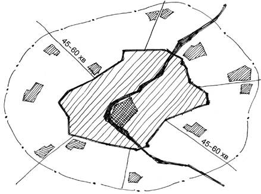

## 4.1

Головним об’єктом містобудівного проектування є території адміністративно-тери торіа ль них одиниць та їх частин відповідно до \[13\].

## 4.2

Галузева спрямованість та масштаби соціально-економічного розвитку територій адмінi стративно-територіальних одиниць, функціональна структура та планувальна організація їх тери торій на перший етап (5 років), розрахунковий період (15-20 років) та стратегічна перспектива визначаються на основі комплексної оцінки території з урахуванням пріоритетності соціальних та екологічних критеріїв, потенціальних ресурсних можливостей і потреб населення. Для збалан су вання загальнодержавних, регіональних інтересів та інтересів територіальних громад урахо ву ються рішення Генеральної схеми планування території України, іншої містобудівної документації, програм соціально-економічного розвитку відповідних адміністративно-територіальних одиниць, планів об’єднаних територіальних громад, прогнозів і програм розвитку регіону за їх адмінi стра тивно-територіальним статусом, профілем та розгалуженістю економічної бази, місцем в системах розселення та економічного районування, рівнем надання послуг населенню. Відповідно до цього слід враховувати класифікацію населених пунктів – об’єктів містобудівного проектування (таблиця 4.1).

## 4.3

На етапі "стратегічна перспектива" на основі попередньої комплексної оцінки території обґрунтовується місія об’єкта містобудівного проектування (довгострокове бачення його майбут нього), головні напрями та основні параметри його соціально-економічного і територіального розвитку, які забезпечують реалізацію місії, концептуальна модель функціонально-планувальної організації території.

Рішення, що приймаються в межах розрахункового періоду та першого етапу, мають бути спрямовані на поступову реалізацію стратегічної перспективи.

## 4.4

При переході від стратегічної перспективи до розрахункового періоду та першого етапу має зростати деталізація рішень та, відповідно, масштаб графічних матеріалів, визначаються існуючі та прогнозовані проблеми використання територій, ступінь невідкладності їх вирішень.

## 4.5

На етапі "розрахунковий період" на основі комплексної оцінки території об’єкта місто будівного проектування деталізуються рішення попереднього етапу.

На цьому етапі (15-20 років), зокрема:

– здійснюється поділ території держави, її адміністративно-територіальних одиниць на окремічастини зі спільними проблемами розвитку (макрорегіони, мікрорегіони, територіальні зони), які мають бути об’єктами містобудівного проектування територій відповідного рівня, розроблення стратегій, прогнозів і програм розвитку на найближчі 5-7 років;

– визначаються найбільш інвестиційно привабливі та проблемні території в межах відповідноїадміністративно-територіальної одиниці.

## 4.6

Рішення щодо планування і забудови територій на першому етапі приймаються з ураху ванням результатів реалізації містобудівних рішень, передбачених на попередні 5-7 років.

Розробляються:

– перелік земельних ділянок, вільних від забудови, непрацюючих виробничих та інших об’єктів з визначенням їх місцерозташування, розміру території, умов освоєння для містобудівних потреб;

– перелік невідкладних заходів щодо соціально-економічного та територіального розвитку,покращення екологічного стану та природно-техногенної безпеки, розбудови інфраструктури, спів робітництва з суміжними адміністративно-територіальними одиницями.

## 4.7

Межі об’єктів містобудівного проектування визначаються з урахуванням документації від повідного вищого територіального рівня.

## 4.8

Інформаційною базою для планування і забудови населених пунктів та територій є:

– державні та громадські інтереси (за результатами громадських обговорень) на зазначенійтериторії відповідно до \[13\];

– містобудівна документація вищого територіального рівня;

– оцінка конкурентних переваг, обмежень розвитку, природно-ресурсного, економічного,науково- технічного, туристичного потенціалу, територіальних ресурсів, соціальної, інженерної та комунальної інфраструктури, екологічного стану території;

– історико-архітектурні опорні плани, режими використання пам’яток культурної спадщини,межі та режими використання зон охорони (буферних зон) пам’яток культурної спадщини, правовий режим охоронюваної археологічної території, план організації території історико-культурного запо відника, план організації історико-культурної заповідної території та план управління (менед ж мент- план) пам’яток, внесених до Списку всесвітньої спадщини ЮНЕСКО;

– інформація про об’єкти природно-заповідного фонду, СЗЗ від об’єктів, охоронні зони, при бережні захисні смуги;

– прогноз демографічного розвитку об’єкта проектування, стратегії та програми соціаль но- економічного розвитку регіонів та населених пунктів;

– дані державних кадастрів, реєстрів та інформаційних систем.

## 4.9

Встановлюється така містобудівна класифікація організацій, установ за категоріями – містоутворюючі і обслуговуючі. Критерієм віднесення до тієї чи іншої категорії слугує об’єкт, на який спрямована діяльність, – держава, регіон, населений пункт, людина.

Організації, установи та підприємства, результати діяльності яких частково чи повністю реалi зую ться за межами населених пунктів, відносяться до містоутворюючих.

Обслуговуюча група організацій, установ та підприємств поділяється на дві підгрупи: перша – що забезпечує життєдіяльність населеного пункту в цілому – містозабезпечуюча, та друга, що спеціалізується на обслуговуванні мешканців населеного пункту, в якому вони розташовані, – обслуговуюча населення з надання соціально-культурних послуг.

Містозабезпечуючі та обслуговуючі категорії взаємопов’язані із галузевою структурою госпо дарського комплексу населеного пункту.

Містобудівна класифікація організацій, установ та підприємств визначається відповідно до Державного класифікатора продукції та послуг, а також з урахуванням Класифікації видів цільового призначення земель, затвердженої наказом Державного комітету України з земельних ресурсів від 23.07.2010 р. № 548, який зареєстровано в Міністерстві юстиції України 1 листопада 2010 р. за № 1011/18306, санітарної класифікації виробництв, інших класифікаторів Державної системи класи фікації та кодування техніко-економічної та соціальної інформації.

## 4.10

Створення нових населених пунктів може передбачатися у зв’язку з потребою розміщення нових великих промислових підприємств, розробки корисних копалин, а також у зв’язку з відсе ленням населення із існуючих і потенційних зон катастроф та екологічного лиха, історико- куль турних чинників.

## 4.11

Адміністративно-територіальні одиниці, об’єднані територіальні громади та населені пункти слід проектувати як елементи єдиної системи розселення України з урахуванням адмінi стра тивно-територіального устрою, стану соціально-економічного розвитку, фізико-географічного та архітектурно-будівельного, кліматичного районування.

Фізико-географічне районування території України наведене у додатку А.

Архітектурно-будівельне кліматичне районування території України наведено у додатку Б.

## 4.12

Класифікація населених пунктів в залежності від соціально-кульнурного, промислового потенціалу та місця в системі розселення наведена в таблиці 4.1.

#### Таблиця 4.1 – Класифікація населених пунктів

<table>
  <tr>
    <td>
Групи населених пунктів
</td>
  </tr>
  <tr>
    <td>
      

        Найкрупніші та крупні багатофункціональні міста, які частково дублюють
        функції наявних об’єктів громадського унікального та епізодичного
        обслуговування населення столиці країни, центри макрорегіонів –
        міжобласних систем розселення з надання послуг унікального попиту
        об’єктів обслуговування, адміністративних та соціальних послуг
      

    </td>
  </tr>
  <tr>
    <td>
      

        Переважно великі багатофункціональні міста обласного значення, центри
        регіонів – обласних систем розселення з наданням послуг епізодичного
        попиту
      

    </td>
  </tr>
  <tr>
    <td>
      

        Переважно середні міста обласного значення, значні промислові,
        промислово-транспортні центри мікрорегіонів – міжрайонних систем
        розселення з наданням послуг епізодичного та періодичного попиту
      

    </td>
  </tr>
  <tr>
    <td>
      

        Малі міста обласного чи районного значення, місцеві центри економічної
        активності: промислові, промислово-аграрні, промислово-транспортні,
        переважно центри районних та внутрішньорайон- них систем розселення
        (об’єднаних територіальних громад) з наданням послуг міжселенного
        періодичного та повсякденного попиту
      

    </td>
  </tr>
  <tr>
    <td>
      

        Малі міста районного значення, селища, села, переважно аграрні, центри
        об’єднаних терито- ріальних громад з наданням послуг повсякденного
        попиту та розвитку зеленого туризму
      

    </td>
  </tr>
</table>

## 4.13

Населені пункти в залежності від чисельності населення поділяються на групи (таб лиця 4.2).

#### Таблиця 4.2 – Групування населених пунктів за чисельністю населення

<table>
  <tr>
    <td rowspan="2">
      
 

      
Групи населених пунктів

    </td>
    <td colspan="2">
Населення, тис. осіб
</td>
  </tr>
  <tr>
    <td>
Міста
</td>
    <td>
Сільські населені пункти
</td>
  </tr>
  <tr>
    <td>
Найкрупніші (найзначніші)
</td>
    <td>
Понад 800
</td>
    <td>
Понад 5
</td>
  </tr>
  <tr>
    <td>
Крупні (значні)
</td>
    <td>
Понад 500 до 800
</td>
    <td>
Понад 3 до 5
</td>
  </tr>
  <tr>
    <td>
Великі
</td>
    <td>
Понад 250 до 500
</td>
    <td>
Понад 0,5 до 3
</td>
  </tr>
  <tr>
    <td>
Середні
</td>
    <td>
Понад 50 до 250
</td>
    <td>
Понад 0,2 до 0,5
</td>
  </tr>
  <tr>
    <td>
Малі*
</td>
    <td>
До 50
</td>
    <td>
Менше 0,2
</td>
  </tr>
  <tr>
    <td colspan="3">
* Включаючи селища.
</td>
  </tr>
</table>

## 4.14

З урахуванням вимог відповідних нормативно-правових актів щодо режиму використання територій визначаються:

– монофункціональні території, які можуть використовуватись переважно для виконання однієїоднорідної функції у межах визначеного законодавством особливого правового режиму їх вико ристання;

– території лімітованого використання, які розташовані в межах територій охоронних зоноб’єктів, що відповідно до вимог вказаних актів вимагає обмеженого режиму використання (зони санітарної охорони, санітарно-захисні зони, зони особливого режиму використання земель, інші зони, де законодавством встановлюються планувальні обмеження використання території);

– території багатофункціонального використання, які можуть використовуватись для виконання багатьох різнорідних функцій в межах адміністративно-територіальної одиниці.

## 4.15

Приміські зони визначаються для міст з чисельністю населення понад 100 тис. осіб. Для інших населених пунктів приміські зони визначаються в залежності від конкретних містобудівних умов та вимог соціально-економічного розвитку.

Місто-центр і його приміська зона є взаємнопов’язаними об’єктами містобудівного проекту вання на стадіях розроблення схем планування території, генеральних планів населених пунктів.

Генеральний план відповідного міста та проект його приміської зони, визначення меж, архi тектурно-планувальної структури, функціонального зонування, соціально-планувальної структури, формування зелених зон розробляються на основі містобудівної документації регіонального рівня.

При плануванні та забудові території приміської зони необхідно забезпечити створення сприят ливих умов для проживання населення, раціональне використання природних ресурсів, а також визначення територій для розміщення місць масового відпочинку населення.

:::note Примітка.
Як правило, зовнішньою межею приміської зони найкрупніших і крупних міст є ізохрона 45-60-хвилинної доступності транспортом загального користування до межі міста. Залежно від групи насе леного пункту в межах приміської зони можуть виділятися кілька підзон (рисунок 1).
:::

**Рисунок 1** – Приміська зона

## 4.16

Доцільно передбачати поступове формування багатофункціональних архітектурно- пла нувальних структур, в основному збалансованих за кількістю жителів та місць прикладання праці, переважно на основі пішохідних зв’язків.

## 4.17

Планування і забудова територій населених пунктів, інших територій на регіональному та місцевому рівні повинна здійснюватися за вимогами інженерно-технічних заходів цивільного захисту відповідно до ДБН В.1.2-4.
