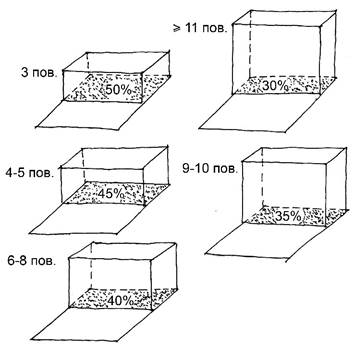
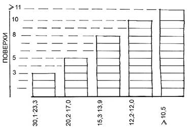

Сельбищні території призначені для створення сприятливого життєвого середовища, яке має відповідати соціальним, екологічним та містобудівним умовам, що забезпечують процеси життєдіяльності населення, пов’язані з його демографічним і соціальним відтворенням.

Сельбищні території формуються переважно у вигляді зон житлової, громадської забудови, озеленених територій загального користування, а також інших функціональних елементів, наве дених у примітці до таблиці 6.1. Для попереднього визначення загальної потреби у сельбищних територіях слід приймати укрупнені показники, наведені в таблиці 6.1.

#### Таблиця 6.1 – Потреби в сельбищних територіях

<table id="6.1">
  <tr>
    <td>
      
 

      
Тип забудови

    </td>
    <td>
      
 

      
Середня поверховість забудови (поверхів)

    </td>
    <td>
Територія на 1000 осіб, га
</td>
  </tr>
  <tr>
    <td rowspan="3">
      
 

      
Багатоквартирна

    </td>
    <td>
9 і більше
</td>
    <td>
7
</td>
  </tr>
  <tr>
    <td>
4-8
</td>
    <td>
8
</td>
  </tr>
  <tr>
    <td>
До 3 без урахування мансарди
</td>
    <td>
10
</td>
  </tr>
  <tr>
    <td rowspan="2">
      
 

      
Садибна

    </td>
    <td>
До 3 без урахування мансарди (з земельними ділянками)
</td>
    <td>
50
</td>
  </tr>
  <tr>
    <td>
1-3 (у сільських населених пунктах)
</td>
    <td>
90
</td>
  </tr>
</table>

:::note Примітка.
Показники потреби у сельбищних територіях визначені з урахуванням усіх необхідних функціо нальних елементів територій (прибудинкові території житлових будинків, об’єкти повсякденного та періодичного обслуговування, громадські центри, озеленені території загального та обме женого користування, спеціального призначення, магістральна і вулично-дорожня мережа, ділянки для розміщення об’єктів комунального господарства, інженерного забезпечення жит лових районів, пожежних депо, гаражі та автостоянки, велостоянки тощо).
:::

## 6.1 Зона житлової забудови

### 6.1.1

Зона житлової забудови складається із земельних ділянок та територій: багатоквартирної, садибної (в тому числі блокованої) житлової забудови, житлово-громадської, а саме житлових будинків, будинків з приміщеннями громадського призначення у вбудовано-прибудованих та стило батних частинах, запроектованих або існуючих будiвель, які використовуються для різних видів призначення (житлового, адміністративного, громадського, установ та організацій сфери повсяк денного громадського обслуговування населення).

### 6.1.2

Планування зон житлової забудови має ґрунтуватися на принципах формування мікро району відповідно до 5.8.

### 6.1.3

Соціально-планувальна організація зон житлової забудови забезпечується комплексом установ і організацій сфери громадського обслуговування, що мають бути наближені до місць проживання на відстані, що не перевищує 500 м (повсякденний попит), та тих, що забезпечують періодичний попит за таблицею 5.1.

Максимально допустима висота\* (поверховість) житлової забудови визначається від чисель ності населення та класифікації населеного пункту, з врахуванням встановлених обмежень щодо охорони культурної спадщини, а саме:

– сільські населені пункти чисельністю до 1 тис. осіб – виключно садибна забудова;

– сільські населені пункти чисельністю понад 1 тис. осіб – садибна забудова та багатоквартирніжитлові будинки висотою до 12 м (до 4-х поверхів включно);

– селища (селища міського типу) – садибна забудова та багатоквартирні житлові будинкивисотою до 15 м (до 5 поверхів включно);

– міста чисельністю до 50 тис. осіб включно – садибна забудова та багатоквартирні житловібудинки висотою до 27 м (до 9 поверхів включно);

\* Висота визначається без врахування шатрової покрівлі у разі її влаштування.

– міста чисельністю понад 50 до 100 тис. осіб включно – садибна забудова та багатоквартирніжитлові будинки висотою до 48 м (до 16 поверхів включно);

– міста чисельністю понад 100 тис. осіб – висотність багатоквартирної житлової забудовивстановлюється містобудівною документацією;

:::note Примітка.
У разі будівництва об’єкта на складному рельєфі висота визначається з врахуванням цоколь ного поверху.
:::

## Багатоквартирна забудова

### 6.1.4

У межах зони багатоквартирної житлової забудови розташовуються ділянки, на яких розміщуються житлові будинки з прибудинковими територіями з необхідним переліком майдан чи ків, проїздів, зелених насаджень, а також земельні ділянки, на яких розташовані заклади дошкіль ної освіти, заклади загальної середньої освіти, торговельні підприємства з асортиментом товарів повсякденного попиту, з підприємствами харчування та приймальними пунктами підприємств побутового обслуговування, які у сукупності утворюють повноцінне безбар’єрне середовище повсяк денної життєдіяльності населення – житловий мікрорайон, що відноситься до житлово громадської забудови.

:::note Примітка.
Будівлі гуртожитків рекомендується розміщувати на спеціально відведених ділянках житлової території, а гуртожитків для студентів і учнів – на території закладів освіти.
:::

### 6.1.5

Допускається розміщення в житлових будинках закладів дошкільної освіти.

При розміщенні закладів дошкільної освіти необхідно враховувати вимоги ДБН В.2.2-4.

:::note Примітка.
Земельна ділянка, на якій розташований заклад дошкільної освіти (вбудований, вбудовано прибудований або прибудований до житлового будинку), повинна бути відокремлена огорожею і зеленими насадженнями від прибудинкової території житлового будинку. Організація та озеленення групових майдан чиків, інсоляція та освітленість приміщень вбудованих, вбудовано-прибудованого і прибудованого закладу дошкільної освіти має відповідати вимогам ДБН В.1.1-31 та \[44\].
:::

### 6.1.6

Мікрорайони формуються у міжмагістральному просторі і обмежуються магістральними вулицями загальноміського та районного значення. Площа мікрорайону та його конфігурація залежить від архітектурно-планувальної структури населеного пункту, чисельності населення, поверховості житлової забудови.

В умовах реконструкції наявні квартали чинної багатоквартирної житлової забудови можуть формуватися у мікрорайони у вигляді груп житлових кварталів, пов’язаних загальною мережею установ повсякденного обслуговування (закладів дошкільної освіти, загальної середньої освіти, закладів торгівлі, громадського харчування, побутового обслуговування, амбулаторій, фізкуль турних споруд, садів або скверів) в межах пішохідної досяжності із забезпеченням у житловому кварталі озеленених територій не менше 6 м2 на одну особу.

:::note Примітка.
Житлові вулиці і проїзди, які опинились в середині такого мікрорайону, можуть трансфор муватися у внутрішньомікрорайонні пішохідні шляхи і під’їзди до житлових і громадських будівель та повинні враховувати потреби маломобільних груп населення.
:::

### 6.1.7

При плануванні територій мікрорайонів кварталами, що формуються житловими групами з периметральною забудовою площею до 3 га, згідно з загальними принципами мікрорайонування слід передбачати:

– житлові групи з розміщенням в їх межах житлових будинків з прибудинковими озелененимитериторіями;

– території громадської забудови (ділянки закладів дошкільної освіти та загальної середньоїосвіти);

– житлові групи з об’єктами різного функціонального призначення (крім виробничих об’єктів) зокремо розміщеними або прибудованими до перших поверхів житлових будинків;

– зелені насадження обмеженого користування з дитячими ігровими та фізкультурно- спор тивними майданчиками, що формують рекреаційні ділянки для мешканців житлової забудови.

:::note Примітка 1.
Для житлових груп з периметральною забудовою, що проектуються, організація місць постійного та тимчасового (гостьових) зберігання засобів автотранспорту на відкритих автостоянках в сере дині житлової групи не допускається. Забезпечення мешканців житлових будинків необхідною кількістю паркомісць на автостоянках, які слід розташовувати з боку вулиць чи проїздів, у вбудованих у перші, цокольні і підвальні поверхи багатоповерхових житлових будинків або у підземних чи багатоповерхових окремо розташованих автостоянках.

В’їзд до внутрішнього простору житлової групи дозволяється автомобілям швидкої допомоги, пожежним автомобілям та іншій спецтехніці.

:::

:::note Примітка 2.
Місця зберігання велосипедів рекомендується розташовувати у добре освітленому та видимому місці, бажано під навісом для захисту від опадів або у приміщеннях на першому поверсі житлових будинків.
:::

### 6.1.8

У житлових мікрорайонах (кварталах) відповідно до завдання на проектування слід передбачати спеціалізовані житлові будинки або перші поверхи житлових будинків для розселення маломобільних груп населення.

### 6.1.9

Відстань від спеціалізованих житлових будинків до зупинок громадського транспорту, підприємств торгівлі повсякденного попиту, закладів охорони здоров’я (поліклінік, амбулаторій, диспансерів без стаціонарів) слід приймати не більше ніж 150 м, а в умовах існуючої забудови не більше 300 м;

### 6.1.10

До спеціалізованих житлових будинків, а також будинків з квартирами в перших поверхах для маломобільних груп населення слід передбачати проїзди, суміщені з тротуарами, при їх довжині не більше 150 м і загальній ширині не менше 4,2 м. Доріжки для проїзду крісел колісних необхідно прокладати за основними напрямками руху людей з інвалідністю у межах населених пунктів або їх районів до відповідних установ охорони здоров’я, соціального забезпечення, торгівлі, фізкультури тощо, при цьому необхідно передбачати обладнання перехресть (пандуси – з’їзди, світлофори), а також застосування тактильних поверхонь для орієнтації людей з вадами зору.

### 6.1.11

У житлових кварталах слід передбачати в’їзди на їх територію спеціалізованої техніки, а також при потребі наскрізні проїзди в будинках на відстані не більше 300 м один від одного, а при периметральній забудові – не більше 180 м (на відстані не менше 50 м до перехрестя вулиць).

### 6.1.12

Житлові райони як елементи соціально-планувальної структури зони житлової забуд ови складаються з декількох мікрорайонів, кварталів, комплексу закладів періодичного обслуго вування та громадських просторів, озеленених територій загального користування з радіусом пішохідної доступності до 1500 м.

### 6.1.13

Площі квартир державного і комунального житлового фонду для соціальних потреб розраховуються за нормативними показниками відповідно до норм ДБН В.2.2-15.

### 6.1.14

При розміщенні на земельній ділянці окремого житлового будинку або групи житлових будинків (без урахування розміщення гаражів, автостоянок, закладів дошкільної освіти, закладів загальної середньої освіти, закладів короткотривалого перебування дітей та інших об’єктів мікро районного обслуговування) слід дотримуватися розрахункових показників граничних параметрів забудови, як відношення площі під забудовою першого поверху житлового будинку по зовнішньому контуру, включаючи нормативну ширину вимощення, лоджій,вхідних груп, а також горизонтальних проекцій виступаючих конструкцій до площі земельної ділянки, наведених у таблиці 6.2 (рисунок 4).

#### Таблиця 6.2 – Показники граничних параметрів забудови земельної ділянки
<table id=6.2>
  <tr>
    <td>
      
 
      

      
Поверховість житлових будинків

    </td>
    <td>
      
Максимально допустимий відсоток забудови земельної ділянки при розміщенні житлового будинку*

    </td>
  </tr>
  <tr>
    <td>
      
3 поверхи без урахування мансарди

    </td>
    <td>
      
50

    </td>
  </tr>
  <tr>
    <td>
      
4-5 поверхів

    </td>
    <td>
      
45

    </td>
  </tr>
  <tr>
    <td>
      
6-8 поверхів

    </td>
    <td>
      
40

    </td>
  </tr>
  <tr>
    <td>
      
9-10 поверхів

    </td>
    <td>
      
35

    </td>
  </tr>
  <tr>
    <td>
      
11 поверхів і вище

    </td>
    <td>
      
30

    </td>
  </tr>
</table>

\* При реконструкції кварталів історичної забудови та формування нової квартальної забудови або при новому будівництві в історичних ареалах міста (визначених генеральним планом) у випадках щільної забудови,в тому числі при зміні функціонального призначення земельної ділянки, показники, наведені у таблиці, не застосовуються.

:::note Примітка 1.
У разі розміщення на земельній ділянці житлових будинків або секцій різної поверховості при розрахунках слід визначати середню поверховість.
:::

:::note Примітка 2.
Вільна від забудови прибудинкова територія має використовуватися для благоустрою і озеле нення відповідно до показників таблиці 6.4.
:::

:::note Примітка 3.
Сумарна площа під забудовою житлового будинку, включаючи експлуатовані покрівлі стило батних частин, підземних та напівпідземних споруд, що використовуються під благоустрій та озеленення для мешканців житлових будинків, не повинна перевищувати 70 % земельної ділянки за умов забезпечення під\`їздів до вхідних груп житлового будинку, проїзду пожежної техніки, автомобілів швидкої допомоги та інженерного захисту території щодо відведення поверхневого стоку.
:::

**Рисунок 4** – Відсоток забудови земельної ділянки

### 6.1.15

Розрахункові показники обсягів і типів житлової забудови визначаються з урахуванням сформованої і прогнозованої соціально-демографічної ситуації.

:::note Примітка.
Рекомендується передбачати різноманітні групи житлових будинків (комерційне житло та житло для соціальних потреб). При цьому орієнтовна загальна площа на одну особу у масовій житловій забудові визначається відповідно до вимог ДБН В.2.2-15, ДБН В.2.2-40. Обсяги житла для соціальних потреб визначаються у містобудівній документації згідно із завданням на проектування.
:::

### 6.1.16

Граничні показники щільності населення мікрорайону слід приймати 150 – 450 осіб/га.

Показники щільності населення мікрорайону в крупних та найкрупніших містах допускається підвищувати, але не більше ніж на 20 % за умови:

– розміщення на території мікрорайону підземних та/або багатоповерхових гаражів з авто стоянками та велосипедними стоянками;

– вбудовано-прибудованих до житлових будинків закладів дошкільної освіти, створенні озеле нених відкритих терас у житлових та громадських будинках.

Величина збільшення показника визначається містобудівним розрахунком потреб у площі території мікрорайону.

У разі розміщення нових житлових будинків на земельних ділянках в межах існуючих мікро районів при проведенні розрахунків граничної щільності населення слід враховувати: населення, що мешкає в існуючих житлових будинках та новобудовах; рівень їх забезпечення об’єктами благоустрою відповідно до таблиці 6.4 цих норм; наявність об’єктів повсякденного обслуговування в межах відповідного мікрорайону; розмір земельних ділянок, визначених під нове будівництво. При цьому слід забезпечувати дотримання містобудівних, санітарних норм та протипожежних вимог.

:::note Примітка.
При розміщенні в межах мікрорайону об’єктів періодичного та епізодичного обслуговування, виробничих та інших закладів немікрорайонного значення площа земельних ділянок, на яких вони розта шовані, не враховується у балансі території мікрорайону.
:::

### 6.1.17

Розрахункові показники щільності багатоквартирного житлового фонду (сумарної загаль ної площі квартир житлових будинків) на території житлового мікрорайону наведено у додатку В.1.

### 6.1.18

Для міст, розташованих в районах сейсмічністю 7-8 балів, будівництво житлових будин ків вище 4-х поверхів може здійснюватись згідно з вимогами ДБН В.1.1-12. Будівництво житлових будинків на територіях сейсмічністю 9 балів і більше не допускається. Проектування будинків в сейсмічних районах повинне вестись на підставі карт сейсмомікрорайонування.

### 6.1.19

При визначенні потреб у території для розміщення житлової забудови слід виходити з умови розселення одного домогосподарства в окремій житловій одиниці (квартирі або будинку). Розрахункову житлову забезпеченість (на розрахунковий термін містобудівної документації) необ хідно визначати диференційовано для населених пунктів з урахуванням демографічних показників, типів житлових будинків, що передбачаються застосовувати, у тому числі обсяги соціального житла.

### 6.1.20

Відповідно до природно-кліматичних особливостей України (додаток Б) слід перед ба чати захист прибудинкової території житлових будинків, житлових груп від несприятливих зимов их вітрів, пилових бур, а також підвищеної аерації влітку, захист від перегріву, особливо для південних районів (розділ 14).

Відстань між житловими будинками, житловими і громадськими, а також між виробничими будівлями слід приймати на основі розрахунків інсоляції та освітленості, а також у відповідності з нормами протипожежних вимог (розділ 15).

### 6.1.21

Між фасадами з вікнами багатосекційних житлових будинків заввишки 2-3 поверхи (без урахування мансарди, в якій вікна розташовані в похилих конструкціях даху) слід приймати відстані (побутові розриви) не менше 15 м, заввишки в 4 поверхи і більше – 20 м.

В умовах, коли будівництво (нове будівництво, реконструкція) ведеться в зоні історичної забудови, яка має відповідний статус згідно з генеральним планои населеного пункту (зони охо рони пам’яток культурної спадщини, значні історичні будівлі, історичний ареал), побутові розриви між житловими будинками можуть прирівнюватися до існуючих для збереження характеру істо ричного розпланування вулиці, кварталу, площі тощо. Будівництво в таких зонах може вестися по істо рично сформованій лінії забудови.

### 6.1.22

При плануванні територій нових кварталів з периметральною забудовою допускається зменшувати розриви між будинками до однієї висоти вищого будинку за умов розміщення в перших поверхах приміщень громадського призначення, з дотриманням вимог пожежної безпеки, норм інсоляції та освітленості житлових приміщень.

:::note Примітка 1.
У великих містах, при розміщенні 9-16 та більше поверхових житлових будинків суміжно з кварталами садибної забудови, що зберігається, відстань від фасадів багатоповерхового будинку, що зво диться, до меж земельних ділянок садибних будинків приймається не менше 20 м, а до стіни найближчого садибного будинку – не менше висоти будинку, що зводиться.

При розміщенні багатоквартирних житлових будинків поверховістю від 4 поверхів до 8 поверхів суміжно з кварталами садибної забудови, що зберігається, відстань від фасадів багатоквартирного будинку, що зводиться, до меж земельних ділянок садибних будинків слід приймати не менше 15 м, а до стіни найближчого садибного будинку – не менше висоти будинку, що зводиться, для багатоквартирних будинків до 3 поверхів відстань від фасадів до меж земельних ділянок – не менше 10 м для забезпечення проїзду пожежних машин.

:::

:::note Примітка 2.
При різних вимогах (протипожежних, санітарно-гігієнічних тощо) до мінімально допустимих відстаней між будинками і спорудами при проектуванні треба приймати величини, найбільші з них.
:::

### 6.1.23

Багатоквартирні житлові будинки слід розміщувати з відступом від червоних ліній магiстральних вулиць – 6 м, житлових вулиць – 3 м. Вбудовано-прибудовані або прибудовані (стилобатні) частини з приміщеннями громадського призначення до житлових будинків, а також окремо розташовані будівлі громадського призначення допускається розміщувати по червоній лініїї вулиць згідно з містобудівною документацією, окрім будівель дитячих навчальних закладів.

### 6.1.24

Мінімальні розміри житлових кварталів та внутрішньоквартальних просторів у групах житлових будинків, кварталів визначаються вимогами: інсоляції та освітленості житлових прим i щень, забезпечення відстані між фасадами (довгими сторонами) з вікнами протилежно розта шованих будинків не менше 15 м при забудові до 4 поверхів, 20 м – при забудові більшої поверховості (побутовий розрив) та протипожежними вимогами.

### 6.1.25

Площу озеленених територій обмеженого користування у мікрорайоні, включаючи майданчики для відпочинку, для ігор, занять фізичною культурою, пішохідні доріжки, якщо вони займають не більше 30 % її загальної площі, слід приймати не менше 6 м2 на одну особу (без урахування території закладів дошкільної, загальної середньої освіти) або 12-15 м2 на одну житлову одиницю (квартиру) при розрахунковому середньому розмірі домогосподарства 2,5 особи, або приймається згідно з демографічними розрахунками розміру (величини) домогосподарства.

### 6.1.26

Мінімальну розрахункову площу ділянки для окремо розташованого житлового будинку, включаючи площу під забудовою (без урахування розміщення на ділянці закладів дошкільної освіти та загальної середньої освіти, підприємств обслуговування населення, гаражів та автостоянок, фізкультурних і спортивних споруд) слід приймати відповідно до кількості його мешканців, але не менше ніж у таблиці 6.3 (рисунок 5).

При цьому необхідно проводити розрахунки щодо дотримання норм інсоляції та освітленості житлових приміщень.

#### Таблиця 6.3 – Питомі розміри ділянки для розміщення окремого житлового будинку
<table id=6.3>
  <tr>
    <td>
      
Житлові будинки

    </td>
    <td>
      
Площа ділянки, м2/особу

    </td>
  </tr>
  <tr>
    <td>
      
3 поверхи без урахування мансарди

    </td>
    <td>
      
30,1-23,3

    </td>
  </tr>
  <tr>
    <td>
      
4-5 поверхів

    </td>
    <td>
      
20,2-17,0

    </td>
  </tr>
  <tr>
    <td>
      
6-8 поверхів

    </td>
    <td>
      
15,3-13,9

    </td>
  </tr>
  <tr>
    <td>
      
9-10 поверхів

    </td>
    <td>
      
12,2-12,0

    </td>
  </tr>
  <tr>
    <td>
      
11 поверхів і вище

    </td>
    <td>
      
Приймати за інтерполяцією, але не менше 10,5

    </td>
  </tr>
</table>

:::note Примітка 1.
У разі розміщення на земельній ділянці житлових будинків та секцій різної поверховості при розрахунках слід визначати середню поверховість.
:::

:::note Примітка 2.
Кількість мешканців житлового будинку комерційного житла рекоментується визначати згідно з кількістю житлових одиниць (квартир) або приймається згідно з демографічними розрахунками розміру (величини) домогосподарства та статистичних даних згідно із завданням на проек тування.
:::

### 6.1.27

Для під’їзду до будинків житлових груп, установ і підприємств обслуговування, торгових центрів слід передбачати двосмугові проїзди завширшки не менше 5,5 м, а до окремо розта шо ваних будинків – односмугові проїзди завширшки не менше 3,5 м.

На односмугових проїздах треба передбачати роз’їзні майданчики завширшки 6 м і завдовжки 15 м на відстані не більше ніж 75 м один від одного, при цьому тупикові проїзди повинні мати довжину не більше 150 м. Проїзди повинні закінчуватися розворотними майданчиками не менше 12 м ґ 12 м, які забезпечують можливість розвороту сміттєвозів, прибиральних і пожежних машин з урахуванням їх технічних характеристик. В стислих умовах дозволяється організація Т-подібних розворотних майданчиків з розмірами 12 м ґ 4 м.

**Рисунок 5** – Площа земельної ділянки житлового будинку (м2 на одну особу)

### 6.1.28

Розрахункові показники граничних розмірів майданчиків, що мають бути розташовані на прибудинкових територіях, наведені у таблиці 6.4.

#### Таблиця 6.4 – Розміри майданчиків у складі прибудинкових територій
<table id=6.4>
  <tr>
    <td rowspan='2'>
      
 
      

      
Майданчики

    </td>
    <td colspan='2'>
      
Питомі розміри майданчиків

    </td>
  </tr>
  <tr>
    <td>
      
м2 на одну особу

    </td>
    <td>
      
одну житлову одиницю (квартиру)

    </td>
  </tr>
  <tr>
    <td>
      
Для ігор дітей дошкільного і молодшого шкільного віку

    </td>
    <td>
      
 
      

      
0,7

    </td>
    <td>
      
 
      

      
1,75

    </td>
  </tr>
  <tr>
    <td>
      
Для відпочинку дорослого населення

    </td>
    <td>
      
0,2

    </td>
    <td>
      
0,5

    </td>
  </tr>
  <tr>
    <td>
      
Для тимчасової стоянки автомобілів

    </td>
    <td>
      
Згідно з розділом 10

    </td>
    <td>
      
 
      

    </td>
  </tr>
  <tr>
    <td>
      
Для тимчасової стоянки велосипедів

    </td>
    <td>
      
0,1

    </td>
    <td>
      
0,25

    </td>
  </tr>
  <tr>
    <td>
      
Для занять фізкультурою**

    </td>
    <td>
      
2,0/0,2

    </td>
    <td>
      
5,0/0,5

    </td>
  </tr>
  <tr>
    <td>
      
Для збирання побутових відходів*

    </td>
    <td>
      
0,07 – наземний спосіб 0,03 – підземний спосіб

    </td>
    <td>
      
0,18

      
0,08

    </td>
  </tr>
  <tr>
    <td>
      
Для вигулу домашніх тварин***

    </td>
    <td>
      
0,3

    </td>
    <td>
      
0,3

    </td>
  </tr>
</table>

\* За розрахунком згідно з таблицею 6.5

\*\* Майданчики для занять фізкультурою рекомендується розміщувати як окрему озеленену зону, що обслуговує мікрорайон або групу житлових кварталів, які формують цілісний мікрорайон. За наявності озелененої зони з майданчиками для занять фізкультурою їх площу в межах прибудинкових територій слід передбачати за нормою 0,2м2 на одну особу при дотриманні нормативу зелених насаджень обме женого користування 6 м2 на одну особу.

\*\*\* Майданчики для вигулу домашніх тварин слід влаштовувати поза межами прибудинкових територій на спеціально визначених ділянках на відстані не менше ніж 40 м від вікон житлового будинку та май данчиків для ігор і відпочинку та занять фізкультурою.

:::note Примітка 1.
Відстані від майданчиків для занять фізкультурою встановлюються залежно від їхніх шумових характеристик.
:::

:::note Примітка 2.
За рішенням органів місцевого самоврядування на прибудинкових територіях можуть облашто вуватися майданчики для господарських цілей (для сушіння білизни та чищення килимів) з розрахунку 0,1 м2 на одну особу або 0,25 м2 на одну житлову одиницю (квартиру). Відстані від майданчиків для господарських цілей до найбільш віддаленого входу у житловий будинок слід приймати не більше 100 м.
:::

:::note Примітка 3.
Майданчики для ігор дітей та території озеленення мають розміщуватися усередині житлової групи з можливим їх улаштуванням на відкритих озеленених терасах житлових та громадських будинків, експлуатованих покрівлях споруд, стилобатних частинах (у т.ч. покрівлях), терасах та інших рівнях будинків, що використовуються під благоустрій та озеленення для мешканців житлових будинків відповідно до ДБН Б.2.2-5.
:::

### 6.1.29

У межах багатоквартирної забудови слід передбачати збирання побутових відходів (наземний, підземний або вакуумний спосіб). Збирання побутових відходів на житловій території передбачається майданчиками, на яких розміщують контейнери для роздільного зберігання побу тових відходів із зручними під’їздами для сміттєвозів згідно з ДБН Б.2.2-5 та ДСТУ-Н Б Б.2.2-7. Норми утворення побутових відходів для новоутворюваних населених пунктів приймають на одну розрахункову одиницю (особу, робоче місце) згідно з вимогами \[40\] або за таблицею 11.2. Площа контейнерних майданчиків для збирання побутових відходів та відстань їх розміщення від вікон житлових та громадських будинків наведено в таблиці 6.5.

#### Таблиця 6.5 – Площа та розміщення майданчика роздільного збирання побутових відходів на житловій території
<table id=6.5>
  <tr>
    <td rowspan='3'>
      
 
      

      
Спосіб збирання

    </td>
    <td colspan='4'>
      
Площа планувального модуля, м2

    </td>
    <td rowspan='3'>
      
 
      

      
Відстань від вікон житлових, громадських будівель, м

    </td>
  </tr>
  <tr>
    <td colspan='2'>
      
Планувальний модуль (1 контейнер)

    </td>
    <td colspan='2'>
      
Планувальний модуль (2 контейнери)

    </td>
  </tr>
  <tr>
    <td>
      
0,4 м3

    </td>
    <td>
      
1,1 м3

    </td>
    <td>
      
0,8 м3

    </td>
    <td>
      
2,2 м3

    </td>
  </tr>
  <tr>
    <td>
      
Наземний

    </td>
    <td>
      
7,5

    </td>
    <td>
      
10,0

    </td>
    <td>
      
11,00

    </td>
    <td>
      
16,00

    </td>
    <td>
      
20

    </td>
  </tr>
  <tr>
    <td>
      
Підземний

    </td>
    <td colspan='2'>
      
3,5

    </td>
    <td colspan='2'>
      
5,5

    </td>
    <td>
      
Визначаються технічними умовами

    </td>
  </tr>
  <tr>
    <td>
      
Вакуумний

    </td>
    <td colspan='2'>
      
3,5

    </td>
    <td colspan='2'>
      
5,5

    </td>
    <td>
      
Визначаються технічними умовами

    </td>
  </tr>
</table>

:::note Примітка 1.
На місце розташування та площу майданчика для збирання побутових відходів впливає їх спосіб видалення: наземний та підземний або вакуумний (пневматичний).
:::

:::note Примітка 2.
Планувальний модуль підземного та вакуумного способу може збільшувати об’єм накопичення побутових відходів до 5-10 м3 відповідно, якщо це не суперечить технічним умовам.
:::

:::note Примітка 3.
Відстань від наземних майданчиків для збирання побутових відходів до фізкультурних май данчиків, майданчиків для ігор дітей і відпочинку дорослих слід приймати не менше 20 м.

Пішохідну доступність майданчика збирання побутових відходів слід приймати не більше 100 м. Площа наземних майданчиків вказана з урахуванням благоустрою.

:::

:::note Примітка 4.
Майданчики збирання побутових відходів для наземного способу проектуються відповідно до вимог ДСТУ-Н Б Б.2.2-7. Майданчики підземного та вакуумного способу збирання проектуються відповідно до містобудівних та технічних умов.
:::

:::note Примітка 5.
При блокуванні планувальних модулів на більшу кількість обладнання з додаванням кожного наступного планувального модуля площа суми блоків зменшується від 2 м2 до 5 м2 у залежності від типу модуля та способу їх блокування.
:::

:::note Примітка 6.
Майданчик збирання побутових відходів повинен бути обладнаний для прийому небезпечних відходів (хімічні джерела струму, побутові акумулятори тощо).
:::

:::note Примітка 7.
Місця збирання побутових відходів на житлових територіях слід розташовувати не з підвітряного
боку, не на протягах, а з забезпеченням норм аерації території. Майданчик для збирання побутових відходів для установ громадського обслуговування допускається розміщувати за спеціальним завданням, погодженим з місцевими органами влади.
:::

:::note Примітка 8.
Місця збору великогабаритних побутових відходів (меблі, побутова техніка, будівельні відходи тощо) слід розміщувати на сельбищній території в комунальних кварталах або комунально складських зонах.
:::

#### Садибна забудова

### 6.1.30

Садибну забудову слід передбачати:

– у межах населеного пункту переважно на вільних територіях, на ділянках, потенційно при датних для будівництва;

– у приміських зонах – на резервних територіях, що плануються до включення у межу міста,за винятком зелених зон;

– у нових селищах і тих, що розвиваються, розміщених у межах 30-40-хвилинної транспортноїдоступності.

З метою збереження масштабу планування і забудови історичного населеного пункту у зонах існуючої індивідуальної садибної забудови слід забезпечувати збереження історичного характеру середовища.

У найкрупніших містах нову садибну або блоковану забудову слід розміщувати в існуючих районах садибної забудови лише за наявності територіальних ресурсів відповідно до містобудівної документації, окрім територій історичних ареалів, де будівництво вистотних будівель і споруд не допускається.

:::note Примітка.
Розміщення садибної забудови на приаеродромній території допускається за умови дотри мання вимог СНиП 2.05.08-85 та відсутності потенційного ризику авіаційної події.
:::

### 6.1.31

Зони садибної забудови мають формуватися за принципами мікрорайонування окре мими чи зблокованими житловими будинками з присадибними ділянками. Поверховість будинків в межах територій садибної забудови не може перевищувати 3-х поверхів без урахування мансарди.

Розміщення багатоквартирних (секційних) будинків в кварталах садибної забудови не допус кається.

### 6.1.32

Граничний розмір площі земельних ділянок, які надаються громадянам для нового житлового будівництва, має становити не менше 150 м2 для блокованої забудови і не менше 500 м2 для індивідуальної житлової забудови.

:::note Примітка 1.
До площі присадибної земельної ділянки включається площа під забудовою житлових будинків та господарських будівель.
:::

:::note Примітка 2.
При розміщенні земельної ділянки для будівництва індивідуального житлового будинку в межах сформованої забудови площа її може бути зменшена, але не більше ніж на 20 % за умов забезпе чення санітарних та протипожежних вимог.
:::

### 6.1.33

Житлові будинки на присадибних ділянках слід розміщувати з відступом від червоних ліній магістральних вулиць – 6 м, житлових – 3 м.

Частина присадибної ділянки між червоними лініями і лінією забудови одно-, двоквартирних і блокованих будинків входить до загальної площі ділянки.

В умовах реконструкції допускається зменшувати відступи від червоних ліній до будинків і споруд з урахуванням сформованої забудови.

### 6.1.34

Присадибні ділянки з боку вулиць та сусідніх ділянок допускається огороджувати. Висоту огорожі слід встановлювати згідно з вимогами ДБН Б.2.2-5 та правилами благоустрою населеного пункту. Встановлення огорожі не може погіршувати інсоляцію житлових будинків на суміжних територіях. Огорожа присадибних ділянок не може виступати за червону лінію та межі ділянки.

### 6.1.35

Показники площі території та розрахункової щільності населення для розміщення садиб ної забудови слід приймати за таблицями 6.1 та 6.6.

#### Таблиця 6.6 – Показники розрахункової щільності населення (брутто) для районів садибної забудови (рекомендовані)
<table id=6.6>
  <tr>
    <td rowspan='2'>
      
 
      

      
Тип забудови

    </td>
    <td rowspan='2'>
      
Розмір присадибної ділянки, м2

    </td>
    <td rowspan='2'>
      
Кількість ділянок на 1 га

    </td>
    <td colspan='5'>
      
Щільність населення (брутто), осіб./га, при середньому складі сім’ї, осіб

    </td>
  </tr>
  <tr>
    <td>
      
2

    </td>
    <td>
      
3

    </td>
    <td>
      
4

    </td>
    <td>
      
5

    </td>
    <td>
      
6

    </td>
  </tr>
  <tr>
    <td>
      
Садибна

    </td>
    <td>
      
2500

    </td>
    <td>
      
3-4

    </td>
    <td>
      
6-8

    </td>
    <td>
      
9-12

    </td>
    <td>
      
12-16

    </td>
    <td>
      
15-20

    </td>
    <td>
      
18-24

    </td>
  </tr>
  <tr>
    <td>
      
Садибна

    </td>
    <td>
      
1500

    </td>
    <td>
      
5-6

    </td>
    <td>
      
10-12

    </td>
    <td>
      
15-18

    </td>
    <td>
      
20-24

    </td>
    <td>
      
25-30

    </td>
    <td>
      
30-36

    </td>
  </tr>
  <tr>
    <td>
      
Садибна

    </td>
    <td>
      
1200

    </td>
    <td>
      
6-7

    </td>
    <td>
      
12-14

    </td>
    <td>
      
18-21

    </td>
    <td>
      
24-28

    </td>
    <td>
      
30-35

    </td>
    <td>
      
36-42

    </td>
  </tr>
  <tr>
    <td>
      
Садибна

    </td>
    <td>
      
1000

    </td>
    <td>
      
8-9

    </td>
    <td>
      
17-18

    </td>
    <td>
      
26-27

    </td>
    <td>
      
34-35

    </td>
    <td>
      
43-44

    </td>
    <td>
      
51-52

    </td>
  </tr>
  <tr>
    <td>
      
Садибна

    </td>
    <td>
      
600

    </td>
    <td>
      
13-15

    </td>
    <td>
      
28-29

    </td>
    <td>
      
42-43

    </td>
    <td>
      
55-57

    </td>
    <td>
      
68-71

    </td>
    <td>
      
81-84

    </td>
  </tr>
  <tr>
    <td>
      
Садибна

    </td>
    <td>
      
500

    </td>
    <td>
      
16-17

    </td>
    <td>
      
34-35

    </td>
    <td>
      
50-52

    </td>
    <td>
      
66-68

    </td>
    <td>
      
82-84

    </td>
    <td>
      
97-99

    </td>
  </tr>
  <tr>
    <td>
      
Блокована

    </td>
    <td>
      
400

    </td>
    <td>
      
19-21

    </td>
    <td>
      
41-42

    </td>
    <td>
      
61-62

    </td>
    <td>
      
80-82

    </td>
    <td>
      
98-100

    </td>
    <td>
      
115-118

    </td>
  </tr>
</table>

### 6.1.36

У зонах садибної забудови слід передбачати розміщення об’єктів обслуговування на територіях загального користування, на спеціально відведених ділянках, у складі громадських центрів населеного пункту або у вигляді окремих споруд на територіях громадського призначення, а також розміщення майданчиків для ігор дітей дошкільного і молодшого шкільного віку, занять фізкультурою, стоянок для тимчасового зберігання автомобілів, майданчиків для господарських цілей загального користування. Питомі розміри майданчиків для ігор дітей та автостоянок допус кається зменшувати відносно показників, наведених у таблиці 6.4, але не більше ніж на 30 %.

### 6.1.37

Озеленення вулиць, розмір яких в межах червоних ліній складає 12 м і менше, доцільно формувати за рахунок палісадників.

### 6.1.38

Допускається розміщення об’єктів обслуговування на присадибній ділянці згідно з нормами законодавства України. Прибудовані або окремо розміщені приміщення та тимчасові споруди для індивідуальної трудової та підприємницької діяльності допускається розташовувати на земельних ділянках по червоних лініях.

### 6.1.39

Гаражі слід передбачати вбудованими, прибудованими до житлових будинків або окремо розташованими по лінії забудови, а також в глибині ділянки. Відстані від в’їздів та інших технологічних прорізів гаражів до сусідніх житлових будинків, закладів загальної середньої освіти та закладів дошкільної освіти, інших споруд слід приймати за таблицею 10.6.

:::note Примітка.
Протипожежні відстані між будинками або господарськими будівлями, що розташовані окремо, відповідно до ступеня їх вогнестійкості, а також віддаленість ємностей горючої рідини на присадибній ділянці (при опаленні будинків рідким паливом) слід приймати відповідно до протипожежних вимог, наведених у таблиці 15.2.
:::

### 6.1.40

При розташуванні житлових будинків та громадських будівель на земельних ділянках необхідно забезпечувати вимоги санітарних норм та пожежних вимог ДСП 173-96, ДБН В.1.1-7, у тому числі для житлових та громадських будинків на суміжних земельних ділянках.

### 6.1.41

При розміщенні будинків в кварталах із сформованою забудовою для догляду за будин ками і здійснення поточного ремонту відстань до межі суміжної земельної ділянки від найбільш виступаючої конструкції стіни будинку слід приймати не менше ніж 1,0 м. При цьому, має бути забезпечене виконання необхідних інженерно-технічних заходів, що запобігатимуть попаданню атмосферних опадів з покрівель та карнизів будівель на територію суміжних ділянок або взаємо узгоджене водовідведення згідно з вимогами ДБН В.1.1-25.

Для новї садибної та дачної забудови відстань від межі слід встановлювати не менше 3 м.

Відстань від межі суміжної земельної ділянки до стовбурів дерев, які висаджуються, має бути від 4 м до 6 м в залежності від величини крони (але не менше 1/2 діаметра крони дерева), а до кущів – 1,0 м.

Допустимі відстані від житлових будинків до господарських будівель і споруд наведені в таблиці 6.7.

#### Таблиця 6.7 – Допустимі відстані від житлових будинків до господарських будівель і споруд
<table id=6.7>
  <tr>
    <td rowspan='3'>
      
 
      

      
Будівлі та споруди

    </td>
    <td colspan='6'>
      
Відстань, м

    </td>
  </tr>
  <tr>
    <td rowspan='2'>
      
Господарські будівлі / сараї / для худоби, інших тварин та птахів площею до 50 м2

    </td>
    <td rowspan='2'>
      
Майданчики для компосту, дворові вбиральні, сміттє- збірник, сховища для добрив та ядохімікатів

    </td>
    <td colspan='2'>
      
Фільтруючий колодязь продуктивністю, м3/добу

    </td>
    <td colspan='2'>
      
Септик продуктивністю, м3/добу

    </td>
  </tr>
  <tr>
    <td>
      
до 1

    </td>
    <td>
      
1-3

    </td>
    <td>
      
до 1

    </td>
    <td>
      
1-3

    </td>
  </tr>
  <tr>
    <td>
      
Житлові будинки та літня кухня

    </td>
    <td>
      
 
      

      
15

    </td>
    <td>
      
 
      

      
20

    </td>
    <td>
      
 
      

      
8

    </td>
    <td>
      
 
      

      
10

    </td>
    <td>
      
 
      

      
5

    </td>
    <td>
      
 
      

      
8

    </td>
  </tr>
  <tr>
    <td>
      
Артсвердловина водопостачання (питний колодязь)

    </td>
    <td>
      
 
      

      
20

    </td>
    <td>
      
 
      

      
20

    </td>
    <td>
      
 
      

    </td>
    <td>
      
 
      

    </td>
    <td>
      
 
      

    </td>
    <td>
      
 
      

    </td>
  </tr>
</table>

:::note Примітка 1.
Господарські будівлі і гаражі сусідніх ділянок допускається блокувати.
:::

:::note Примітка 2.
Господарські приміщення для утримання худоби та птиці площею до 50 м2 допускається прибудовувати до одно- та двоквартирних житлових будинків (крім будинків, що знаходяться в ІV кліматичному районі) за умов ізоляції від житлових кімнат та кухонь не менше ніж трьома підсобними приміщеннями та за умови забезпечення санітарних відстаней до житлових будин ків на суміжних земельних ділянках.
:::

:::note Примітка 3.
При продуктивності локальних каналізаційних очисних споруд до 3 м3 на добу водозабірні споруди місцевого господарсько-питного водопостачання допускається розміщувати на від стані 40-50 м вниз по течії ґрунтових вод, 20-25 м вверх по течії і 25-30 м по перпендикуляру до осі течії потоку ґрунтових вод. Відстані від артсвердловин та колодязів до окремих будівель і споруд та інших джерел забруднення слід приймати 20 м, місце розташування водозабірних споруд повинно бути вверх по течії ґрунтових вод і вище по відношенню до розташування каналізаційних споруд. За неможливості забезпечення цієї відстані в межах ділянки слід влаштовувати свердловини, колодязі або каптажі для групи будинків, які розміщуються вздовж житлових вулиць із відступом від червоної лінії на 2,5-3 м, на майданчиках розміром 2,5 м ґ 3 м із твердим покриттям та ухилом не більше 40-50 ‰.
:::

:::note Примітка 4.
Вигрібні ями дворових вбиралень повинні бути виконані з конструкцій, що запобігають фільтра ції фекальних стоків у ґрунт.
:::

### 6.1.42

За відсутності мереж міської (селищної) каналізації необхідно передбачити кана лізу вання садиб з використанням локальних очисних споруд згідно з вимогами ДБН В.2.5-64, ДБН В.2.5-75.

При введенні водопроводу у будинок та обладнання внутрішньобудинкової каналізації з відве денням побутових стоків у вигріб не допускається.

#### Дачна та садова забудова

### 6.1.43

Території дачної та садової забудови призначаються для організації відпочинку громадян, ведення садівництва та городництва з будівництвом дачних, садових будинків для тимчасового або постійного проживання.

### 6.1.44

Розміщення нової дачної та садової забудови в межах населених пунктів, а також на територіях, де діють планувальні обмеження, у т.ч. на територіях лісів та лісопарків, об’єктів природно-заповідного фонду та їх охоронних зон, у санітарно-охоронних зонах курортів, водо охоронних зонах, на резервних позаміських територіях, які передбачені містобудівною докумен тацією для подальшого розвитку населених пунктів, на територіях інженерно-транспортної та природоохоронної інфраструктури не допускається.

### 6.1.45

Нову дачну або садову забудову рекомендується розміщувати за межами населених пунктів на земельних ділянках з цільовим призначенням для дачного будівництва чи інди вi дуального садівництва.

Існуючі території дачної забудови, які розташовані в межах населених пунктів чи приміських зонах, відносяться до рекреаційних зон з озелененими територіями обмеженого використання.

### 6.1.46

Територію дачної та садової забудови слід розподіляти на зони індивідуального (сади, дачні ділянки) та загального користування. Зона індивідуального користування з вулично-дорож ньою мережею має складати до 90 % від загальної території такої забудови.

### 6.1.47

У межах зони загального користування розміщуються об’єкти і споруди, перелік яких та необхідна площа території наведені у таблиці 6.8.

#### Таблиця 6.8 – Об’єкти і споруди загального користування в межах територій дачної і садової забудови
<table id=6.8>
  <tr>
    <td rowspan='2'>
      
 
      

      
Перелік будівель

    </td>
    <td colspan='3'>
      
Площа ділянок об’єктів і споруд загального користування в межах територій дачної і садової забудови, із
        розрахунку м2 на одну дачну (садівницьку) ділянку

    </td>
  </tr>
  <tr>
    <td>
      
малі

    </td>
    <td>
      
середні

    </td>
    <td>
      
крупні

    </td>
  </tr>
  <tr>
    <td>
      
Обов’язкові:

      
Споруди для зберігання засобів пожежогасіння

    </td>
    <td>
      
 
      

      
0,5

    </td>
    <td>
      
 
      

      
0,4

    </td>
    <td>
      
 
      

      
0,25

    </td>
  </tr>
  <tr>
    <td>
      
Майданчики для контейнерів ТПВ

    </td>
    <td>
      
0,1

    </td>
    <td>
      
0,1

    </td>
    <td>
      
0,1

    </td>
  </tr>
  <tr>
    <td>
      
Майданчики для стоянки автомобілів

    </td>
    <td>
      
1,1

    </td>
    <td>
      
1,1

    </td>
    <td>
      
1,1

    </td>
  </tr>
  <tr>
    <td>
      
Майданчики для стоянок велосипедів

    </td>
    <td>
      
0,65

    </td>
    <td>
      
0,65

    </td>
    <td>
      
0,65

    </td>
  </tr>
  <tr>
    <td>
      
Магазини змішаної торгівлі

    </td>
    <td>
      
2,5

    </td>
    <td>
      
2,0

    </td>
    <td>
      
1,5

    </td>
  </tr>
  <tr>
    <td>
      
Правління товариства, медпункт

    </td>
    <td>
      
1,0

    </td>
    <td>
      
1,0

    </td>
    <td>
      
1,0

    </td>
  </tr>
  <tr>
    <td>
      
Дитячі ігрові майданчики

    </td>
    <td>
      
1,0

    </td>
    <td>
      
1,0

    </td>
    <td>
      
1,0

    </td>
  </tr>
  <tr>
    <td>
      
Рекомендовані:

      
Універсальні фізкультурні майданчики

    </td>
    <td>
      
 
      

      
4,0

    </td>
    <td>
      
 
      

      
3,4

    </td>
    <td>
      
 
      

      
2,8

    </td>
  </tr>
  <tr>
    <td>
      
Пасіки

    </td>
    <td colspan='3' rowspan='2'>
      
 
      

      
За завданням на проектування*

    </td>
  </tr>
  <tr>
    <td>
      
Споруда для охоронника

    </td>
  </tr>
</table>

\* Площа ділянки на одну споруду приймається незалежно від кількості садових ділянок – 100 м2.

:::note Примітка.
Об’єкти загального користування доцільно поєднувати у адміністративно-господарський центр. Пасіки слід розміщувати на окремих ділянках у місцях, найбільш віддалених від руху людей і транспорту.
:::

### 6.1.48

На територіях дачної і садової забудови трасування доріг та проїздів, розміщення вбудовано-прибудованих або окремо розташованих гаражів, дачних та садових будинків, інших споруд та відстані між ними слід приймати у відповідності з вимогами підрозділу "Садибна забу дова" та розділу 15 "Протипожежні вимоги"

### 6.1.49

При переведенні існуючої дачної і садової забудови у райони садибної забудови має бути забезпечена відповідність показників соціальної, транспортної та інженерної інфраструктури нормативам садибної забудови в межах населених пунктів.

### 6.1.50

На території існуючої дачної і садової забудови використання садових або дачних ділянок для створення об’єктів торгівлі, побуту допускається за умови: відповідності площі земель ної ділянки показникам відповідно до таблиці 6.8, забезпечення проїзду до ділянки та влаштування інженерного обладнання – відповідно до вимог ДСП 173-96, ДБН В.2.5-39 та ДБН В.2.5-64.

## 6.2 Зона громадської забудови

### 6.2.1

Зона громадської забудови призначена для концентрованого розташування закладів і підприємств обслуговування населення населеного пункту та населення, що мешкає за його межами.

### 6.2.2

Зону громадської забудови слід формувати як функціонально-просторову систему центрів – багатофункціональних та спеціалізованих, які є органічно пов’язаними з соціально планувальною структурою населеного пункту.

### 6.2.3

Громадську забудову слід формувати у місцях найбільшої концентрації населення, що перебуває у денний час, – у межах центру міста та інших населених пунктів уздовж головних вулиць і площ.

### 6.2.4

Території багатофункціональних громадських центрів у населених пунктах залежить, окрім їх величини і місця в структурі адміністративно-територіального устрою та системи розсе лення, від особливостей функціонально-планувальної структури населених пунктів, історичних та природно-ландшафтних чинників.

У малих містах слід створювати єдиний громадський центр міста і житлового району.

У середніх і великих містах, сельбищна територія яких поділяється на житлові або планувальні райони, функції громадського центру можуть поєднуватись з функціями громадського центру одного із житлових або планувальних районів.

У найкрупніших та крупних містах зони громадської забудови слід формувати у вигляді системи загальноміського центру, яка крім центрального ядра складається також з громадських центрів планувальних зон та центрів житлових (виробничих, рекреаційних) районів і мікрорайонів.

Склад функціональних елементів, їх кількісні показники встановлюються у містобудівній доку ментації регіонального та місцевого рівнів.

:::note Примітка.
Міський центр, в залежності від величини міста, доцільно формувати або як площу, або як групу площ, поєднаних головною вулицею, серед яких визначається головна площа.
:::

### 6.2.5

Спеціалізовані громадські центри слід формувати переважно в найкрупніших, крупних та великих містах за рахунок групування об’єктів в єдиний комплекс.

:::note Примітка.
Спеціалізовані центри слід розміщувати відокремлено або у складі загальноміських громад ських центрів, центрів планувальних зон і планувальних районів, а також як окремі планувальні складові.
:::

### 6.2.6

До складу громадських центрів планувальних зон, крім установ і організацій обслуго ву вання, слід включати адміністративні, бізнес-центри, об’єкти транспортної інфраструктури (транс портно-пересадочні вузли, пішохідні зони, території зберігання транспортних засобів тощо), а також земельні ділянки, призначені для розташування житлових будинків.

Питомий розмір територій, зайнятих власне під громадські функції, визначається залежно від значення громадського центру, класифікації населеного пункту. Ця величина відносно території центру може коливатися від 60 % до 70 % для ядра загальноміського центру, або від 15 % до 20 % для центрів повсякденного та періодичного обслуговування.

В міських та крупних сільських населених пунктах громадські центри виконують функції між селенного обслуговування.

При розробленні містобудівної документації площу багатофункціонального загальноміського центру слід визначати відповідно до укрупнених показників:

– для найкрупніших, крупних і великих міст – від 3,5 м2/особу до 5 м2/особу;

– для середніх міст – від 5 м2/особу до 10 м2/особу;

– для малих міських та сільських населених пунктів – від 10 м2/особу до 20 м2/особу.

### 6.2.7

Розвиток загальноміських центрів може здійснюватися шляхом реконструкції і технічного переоснащення громадських будинків, перепрофілювання існуючих об’єктів, будівництва нових об’єктів; суміщення об’єктів різного типу, розміщення об’єктів повсякденного та періодичного обслуго вування у вбудовано-прибудованих приміщеннях, в тому числі у перших поверхах житлових будинків.

### 6.2.8

Загальну площу території громадських центрів у планувальних зонах найкрупніших, крупних міст слід приймати:

– за чисельності населення планувальної зони до 200 тис. осіб – від 15 га до 20 га;– за чисельності населення від 200 до 500 тис. осіб – від 20 га до 30 га; – за чисельності населення понад 500 тис. осіб – від 30 га до 60 га.

### 6.2.9

При розміщенні громадських об’єктів (при формуванні громадських центрів) слід врахо вувати показники граничної щільності громадської забудови відповідно до таблиці 6.9.

#### Таблиця 6.9 – Показники щільності забудови громадських центрів
<table id=6.9>
  <tr>
    <td>
      
 
      

      
Категорія населених пунктів

    </td>
    <td>
      
Щільність сумарної загальної площі, тис. м2 роб. пл./га

    </td>
  </tr>
  <tr>
    <td>
      
Найкрупніші й крупні міста

    </td>
    <td>
      
6,0 – 10,0

    </td>
  </tr>
  <tr>
    <td>
      
Великі міста

    </td>
    <td>
      
4,0 – 6,0

    </td>
  </tr>
  <tr>
    <td>
      
Середні міста

    </td>
    <td>
      
2,0 – 4,0

    </td>
  </tr>
  <tr>
    <td>
      
Малі міські і сільські населені пункти

    </td>
    <td>
      
0,8 – 2,0

    </td>
  </tr>
</table>

:::note Примітка.
Для найкрупніших та крупних міст щільність громадських функцій визначається для ядра центру, а в середніх і малих міських і сільських населених пунктах – для громадського центру в цілому.
:::

### 6.2.10

При планувальній організації території громадських центрів, для реалізації комуніка тивної функції, необхідно передбачати формування розвинутих пішохідних зон (відкритих площ, пішохідних вулиць), які мають:

– забезпечувати можливість організації та проведення масових громадських заходів (полi тичних, святкових, спортивно-розважальних тощо);

– формувати зручні пішохідні зв’язки між об’єктами та комплексами обслуговування, зупинкамигромадського транспорту та транспортними вузлами, що забезпечують зв’язок населеного пункту з приміською зоною;

– забезпечувати організацію різноманітних функцій, що містять розвинений набір об’єктівобслу говування, а також місць для короткотривалого відпочинку;

– створювати індивідуальний архітектурний образ;

– забезпечувати збереження традиційного характеру історичного середовища та об’єктів куль турної спадщини.

### 6.2.11

Громадський простір багатофункціонального центру з розчленованою структурою формується на основі єдиної пішохідної зони, що забезпечує взаємозв’язок об’єктів центру, безпе рервність пішохідних комунікацій в межах всіх складових комплексу, зручність підходів до зупинок транспорту та озеленення рекреаційних майданчиків.

Для людей, що одночасно перебувають у пішохідній зоні, норма площі території має складати не менше ніж 20 м2 на одну особу.

### 6.2.12

Співвідношення між висотою будинків, що оточують майдан та його шириною доцільно приймати у межах 1:6 – 1:8. Відкритий простір слід передбачати не більше ніж 0,15 га в малих населених пунктах та 0,5-0,6 га – у великих.

При формуванні громадських центрів слід передбачати створення підземних просторів для розміщення об’єктів торгівлі, харчування, побутового обслуговування, а також для зберігання легкового автотранспорту, громадських вбиралень. Розміщені у підземному просторі об’єкти повинні бути обладнані спеціальними підйомними пристроями для забезпечення доступності до них маломобільних груп населення.

### 6.2.13

Доцільно передбачати безпосередній взаємозв’язок громадських центрів з озелененими територіями, розміри яких мають складати в межах громадських центрів не менше ніж 25 % від усієї території громадського центру. В історичних частинах громадських центрів цей показник має бути не менший ніж існуючий.

Парки загальноміського та районного значення рекомендується розміщувати на суміжних з громадськими центрами територіях і включати до системи планувальної організації центру.
