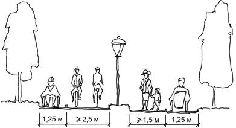

## 10.1 Зовнішній транспорт

### 10.1.1

При плануванні територій населених пунктів та інших територій необхідно передбачати формування системи транспортних комунікацій та споруд усіх видів зовнішнього (дальнього і приміського) та внутрішнього (міського та сільського) транспорту, здатних забезпечувати функціо нальну цілістність і соціально – економічні взаємозв’язки з основними спорудами та комунікаціями внутрішнього транспорту населеного пункту між собою, іншими населеними пунктами та об’єктами відповідної системи розселення.

### 10.1.2

Для організації пасажирських і вантажних перевезень між населеними пунктами, а також обслуговування рухомого складу у межах населених пунктів та прилеглих до них територій слід передбачати комунікації і споруди зовнішнього транспорту. Їх призначення, потужність і розмi щен ня визначаються із урахуванням значення кожного з видів зовнішнього транспорту в державній, регіональній та обласній транспортній системі. Комунікації та споруди зовнішнього транспорту, в тому числі сортувальні та вантажні залізничні станції, транспортно-складські комплекси, транзитні автомобільні дороги необхідно розміщувати за межами населених пунктів.

Розміщення місць відстою великовантажного автомобільного транспорту слід передбачати в периферійній зоні міст та на підходах до них з розрахунку площі 120 м2 на одиницю транспорту.

### 10.1.3

Формування зовішнього транспортного вузла населеного пункту та прилеглих до нього територій має базуватися на матеріалах проекту національної транспортної стратегії України, що спрямована на будівництво залізниць і автомобільних доріг, спорудження нових, перш за все, швидкісних магістралей, та створення на їх основі національної мережі транспортних коридорів.

Такі коридори повинні проходити поза перспективними межами територій населених пунктів і з’єднуватися дорогами з розв’язками в різних рівнях з магістралями загальноміського значення.

### 10.1.4

При плануванні трас нових залізничних і автомобільних обходів населених пунктів для автомобільніх доріг державного значення слід передбачати:

– посилення шляхом дублювання та підвищення пропускної здатності головних в’їздів/виїздівдо міст-центрів;

– переведення існуючих автодоріг у вищі категорії;

– створення нової та модернізація існуючої мережі місцевих автодоріг, по яких проходятьмаршрути з підвезення сільського населення до центрів об’єднаних територіальних громад або до зупинок і станцій приміських залізниць.

### 10.1.5

Нові ділянки залізничних магістралей та автомобільних доріг І-ІІІ категорій слід перед бачати за межами територій, що призначені для перспективного розвитку населених пунктів. У разі неможливості такого прокладання допускається їх проходження через територію населеного пункту в наземному чи естакадному коридорах, обладнаних шумозахисними пристроями та розв’язками руху, з відповідним забезпеченням транспортних і пішохідних зв’язків між окремими частинами населених пунктів, роз’єднаних цими коридорами.

### 10.1.6

Відстані від бровки земляного полотна магістральних автомобільних доріг до житлової, дачної та садової забудови слід приймати згідно з вимогами ДСП 173-96.

Між залізницею і житловою забудовою слід передбачати санітарно-захисну зону, ширина якої, рахуючи від осі крайньої залізничної колії до будівель (за умови забезпечення на прилеглій тери торії житлової та громадської забудови нормативних рівнів шуму) має бути не менше 100 м, а при розташуванні залізниці в виїмці та при здійсненні спеціальних шумозахисних заходів – на відстані не менше 50 м. При цьому, понад 50 % площі санітарно-захисної зони має бути озеленено. Її ширину до меж ділянок садової і дачної забудови необхідно приймати не менш ніж 50 м при обов’язковому використанні шумозахисного озеленення або інших шумозахисних та природо охоронних заходів.

:::note Примітка.
При проведенні реконструкції або розміщенні об’єктів будівництва на територіях сформованої забудови відстань від бровки земляного полотна магістральних доріг І, ІІ та ІІІ категорій до лінії регулювання житлової, дачної та садової забудови можливо зменшувати до 50 м; для доріг ІV категорії – до 25 м за умови дотримання нормативних акустичних показників та при облаштуванні шумозахисних екранів та смуг озеле нення завширшки не менше 10-15 м.
:::

### 10.1.7

Існуючі під’їзні залізничні колії, що проходять по території населеного пункту до про мислових підприємств та складських об’єктів, доцільно передбачати до ліквідації з передачею їх вантажообігу на автомобільний транспорт. Якщо за певних умов закриття під’їзних колій немож ливе, їх перетин з магістральними вулицями має вирішуватись в різних рівнях.

### 10.1.8

Транспортно-складські комплекси, в яких здійснюється накопичення та формування за відповідними маршрутами контейнерних та інших вантажів, слід розташовувати або передбачати до виносу за межі житлових, ланшафтних та рекреаційних територій, наближаючи до транспортних коридорів переважно в вузлах, де перетинаються декілька видів зовнішнього транспортуґ, мор сь ких і річкових портах, прикордонних пунктах пропуску і з’єднуватися під’їздами з найближчими населеними пунктами.

Вантажні залізничні та автомобільні станції, двори, сортувальні та промислові станції слід розміщувати за межами сельбищних територій поблизу промислово-складських районів на внут ріш ньовузлових, з’єднувальних чи спеціальних ходах або обхідних дорогах.

:::note Примітка.
Не допускається будівництво нових та розвиток існуючих залізничних сортувальних, вантаж них і технічних станцій, вантажних майданчиків, контейнерних площадок, складських комплексів і під’їздів до них в межах сельбищних, ландшафтних та рекреаційних територій.
:::

### 10.1.9

Перевалочні зони морських та річкових портів доцільно розміщувати поза межею населеного пункту або в периферійній зоні населеного пункту, поблизу сортувальних і великих вантажних залізничних станцій.

Відстань від житлових будинків до спеціалізованих районів нових морських і річкових портів слід приймати не менше 300 м, від меж районів перевантаження курних матеріалів, від резервуарів і зливо-наливних пристроїв легкозаймистих і горючих рідин на складах І категорії – не менше 200 м та не менше 100 м – на складах ІІ-ІІІ категорій.

### 10.1.10

Залізничні вокзали в межах населених пунктів слід розміщувати на межі серединної та периферійної зон поблизу житлової та громадської забудови із забезпеченням зручних транс портних зв’язків з центром населеного пункту, його основними житловими та промисловими районами, вокзалами інших видів транспорту.

### 10.1.11

Станції швидкісного рейкового транспорту необхідно розміщувати в населених пуктах поблизу житлових і промислових районів, місць масового відпочинку, а також у зонах масової пересадки на інші види приміського та міського пасажирського транспорту і кінцевих зупинках, при цьому доцільно формувати транспортно-пересадочні вузли. Зупинки міських видів транспорту слід розміщувати на відстані не більше ніж 100 м від зупинок приміського транспорту. У межах транс портно-пересадочних вузлів слід розміщувати перехоплюючі велопарковки з розрахунку 1 % їх добового пасажиропотоку.

### 10.1.12

У містах з населенням понад 250 тис. осіб слід передбачати розміщення одного центрального автовокзалу (автостанція першої категорії) для дальнього міжміського (кінцевого та транзитного) сполучення та декілька приміських автостанцій, які мають розміщуватися на найбільш завантажених автобусним сполученням виїздах з міста, біля станцій внутрішньоміського транс порту на напрямках найбільшого попиту.

У великих містах автовокзал або автостанції доцільно розміщувати в серединній зоні, а в середніх і малих містах та сільських населених пунктах – у центральній зоні, поблизу громадських і торгових центрів, ринків, залізничних і річкових вокзалів (з останніми допускається кооперування в одній споруді). Відстань від автовокзалів до житлової забудови повинна бути не менше 100 м, а від автостанцій – 50 м відповідно та відокремлюватись від цієї забудови зеленими захисними зонами завширшки не менше 20 м.

При цьому зупинки громадського транспорту слід розміщувати мультимодально: якомога ближче одна до одної за якомога меншої наявності перешкод при пересадці.

У разі відсутності можливості забезпечити мультимодальну пересадку допускається зміщу вати зупинки окремих видів транспорту на відстань не більше ніж 100 м по пішохідній мережі від автовокзалів.

У межах території автовокзалів доцільно розміщувати перехоплюючі велостоянки. Кількість місць визначається розрахунком: 1 % від користувачів автовокзалу + 2% від отриманого числа. Відстань від перехоплюючої велостоянки до автовокзалу не повинна перевищувати 30 м.

Місткість автовокзалів має бути в межах 7-12 %, а автостанції – 12-17 % від кількості паса жирів, які відправляються за добу, площа території залежно від класу автовокзалу або автостанції визначається відповідно до розрахунку в межах 0,4 – 2,0 га.

Для орієнтовного визначення земельної ділянки автовокзалу (автостанції) приймаються показники питомої площі на один пост посадки-висадки пасажирів:

для пасажирських автостанцій з кількістю постів:

– від 3 до 7 – 300-1900 м2; для автовокзалів з кількістю постів:

– від 6 до 12 – 1301-2200 м2; – від 12 до 15 – 1001-1300 м2; – більше 15 – 700-100 м2.

### 10.1.13

Розміщення автотранспортних споруд (пасажирських автостанцій, автобусних зупинок з павільйонами) та об’єктів автосервісу (АЗС, СТО, пункти мийки, готелі, кемпінги, тимчасові автостоянки тощо) на автодорогах загального користування на під’їздах до найкрупніших, крупних і великих міст має здійснюватися згідно з вимогами ДБН В.2.3-4. У межах населених пунктів АЗК, АЗС, АГЗП, АГЗС, АГНКС мають розміщуватися у місцях, визначених у відповідних схемах, що розробляються з урахуванням інтенсивності руху транспортних засобів, протипожежних вимог та вимог безпеки дорожнього руху.

Відстані від СТО до житлових і громадських будинків приймаються згідно з таблицею 10.1.

#### Таблиця 10.1 – Відстані від СТО до житлових і громадських будинків

<table id=10.1>
  <tr>
    <td rowspan='2'>
      
 
      

      
Об’єкти, до стін яких визначається відстань

    </td>
    <td colspan='3'>
      
Відстань від станцій технічного обслуговування при кількості постів, не менше, м

    </td>
  </tr>
  <tr>
    <td>
      
10 та менше

    </td>
    <td>
      
11-30

    </td>
    <td>
      
більше 30

    </td>
  </tr>
  <tr>
    <td>
      
Житлові будинки

    </td>
    <td>
      
15

    </td>
    <td>
      
25

    </td>
    <td>
      
50

    </td>
  </tr>
  <tr>
    <td>
      
Торці житлових будинків без вікон

    </td>
    <td>
      
15

    </td>
    <td>
      
25

    </td>
    <td>
      
50

    </td>
  </tr>
  <tr>
    <td>
      
Громадські будинки (крім закладів загальної середньої освіти і закладів дошкільної освіти, лікувальних закладів
        із стаціонаром)

    </td>
    <td>
      
 
      

      
15

    </td>
    <td>
      
 
      

      
20

    </td>
    <td>
      
 
      

      
20

    </td>
  </tr>
  <tr>
    <td>
      
Заклади загальної середньої освіти і заклади дошкільної освіти

    </td>
    <td>
      
 
      

      
50

    </td>
    <td>
      
 
      

      
–

    </td>
    <td>
      
 
      

      
–

    </td>
  </tr>
  <tr>
    <td>
      
Лікувальні заклади із стаціонаром

    </td>
    <td>
      
50

    </td>
    <td>
      
–

    </td>
    <td>
      
–

    </td>
  </tr>
</table>

:::note Примітка 1.
Кількість постів визначається кількістю автомобілів, що одночасно обслуговуються станцією.
:::

:::note Примітка 2.
Відстань від СТО визначається від будівлі, де проходить технологічний процес, до житлових та громадських будинків.
:::

### 10.1.14

Нові аеропорти, аеродроми, злітно-посадкові майданчики, вертодроми, вертолітні май данчики (крім вертолітних майданчиків на будівлях, при лікарнях) слід розташовувати за межами населених пунктів. Відстань від межі льотного поля нового аеродрому (вертолітного майданчика, крім майданчиків на будівлях та при лікарнях), трас прольоту літаків (вертольотів на кінцевому етапі заходу на посадку та початковому етапі зльоту до межі існуючої або перспективної забудови та зон масового відпочинку) слід визначати такою, яка забезпечує на цих територіях нормативні показники рівня акустичного забруднення.

Аеропорти повинні бути зв’язані швидкісними видами пасажирського транспорту із станціями міського позавуличного та позаміського транспорту, з загальноміським центром, іншими аеро портами та населеними пунктами. При цьому довжина пішохідного підходу на станціях пересадки не повинна перевищувати 100 м.

### 10.1.15

Річкові порти, споруди для технічного обслуговування, ремонту і зимового відстою флоту необхідно розміщувати за межами територій житлової та громадської забудови, нижче за течією річки, на відстані від водозаборів та місць відпочинку населення не менше 100 м. Відстань до житлової забудови від меж території порту до місця перевантаження і зберігання курних матеріалів слід приймати не менше ніж 300 м.

Відстань від морських та річкових вокзалів до зупинок міського пасажирського транспорту має становити не більше ніж 100 м.

### 10.1.16

Яхтклуби та бази маломірного флоту (малі – до 500, середні – 1000-2000 і великі понад 2000 місць зберігання) слід розміщувати у приміській зоні або в населеному пункті поза територією житлової та громадської забудови, за межами зон масового відпочинку населення із забезпе чен ням зручних транспортних зв’язків з житловими районами.

При будівництві одного типового елінгу з двоярусним зберіганням човнів площа ділянки бази на 500 суден має становити не менше ніж 1,7 га, при будівництві двох елінгів по 250 суден кожний з двоярусним зберіганням – близько 2,0 га. Розмір ділянки при одноярусному стелажному зберіганні суден приймається:

– на (одне місце) для прогулянкового флоту – 27 м2; – для спортивного – 75 м2.

## 10.2 Комплексна схема транспорту

### 10.2.1

Комплексну схему транспорту (КСТ) слід розробляти як окремий документ на основі затвердженого генерального плану міста з кількістю населення понад 100 тис. осіб на розрахун ко вий період.

### 10.2.2

Завданням КСТ є визначення принципових напрямів й термінів реалізації заходів з розвитку магістральної вулично-дорожньої мережі, а також усіх видів міського, приміського та зовнішнього транспорьу, що забеспечують потреби населення і народного господарства систем поселень у пасажирських (до місць праці, масового відпочинку і об’єктів культурно-побутового призначення) і вантажних перевезеннях з дотриманням нормативних витрат часу на пересування, вимог до безпеки дорожнього руху), охорони навколишнього середовища, комфортності поїздок, економії енергетичних, територіальних і трудових ресурсів. Приоритетні напрями вирішення транс портних проблем (міський, приміський або зовнішній транспорт, магістральна вулично-дорожня мережа, її вузли або ж організація руху на існуючій вулично-дорожній мережі) слід визначати із врахуванням соціально-економічних і планувальних особливостей міста і відносно цього визна чається значення і деталізація проробок відповідних розділів КСТ.

### 10.2.3

У складі КСТ відображаються: існуючий стан міського, приміського і зовнішнього (з врахуванням легкового і вантажного) транспорту з обслуговуючими процес перевезення і рухомий склад комплексами (пасажирські вокзали і станції, зупинки, вантажні станції і двори, порти, при стані, аеропорти, депо, парки, гаражі, станції технічного обслуговування, автозаправні станції, мотелі, кемпінги тощо), магістральна вулично-дорожня мережа та її інженерні споруди (мостові переходи, естакади, шляхопроводи, транспортні розв’язки, позавуличні пішохідні переходи тощо). Розроб ляються також техніко-економічні обгрунтування проектних рішень, що включають розвиток усіх видів транспорту, дорожньої мережі та їх споруд і обладнань, раціональні методи організації дорожнього руху.

Аналіз існуючого стану і етапів реалізації пропозицій, передбачених у складі генерального плану міста з розвитку дорожньо-транспортної мережі, слід виконувати з метою визначення реаль них можливостей поетапного будівництва і реконструкції міської-приміської транспортної системи, вдосконалення організації дорожнього руху, тенденцій використання капіталовкладень в їх роз виток.

При визначенні перспективи розвитку транспортонї системи міста слід враховувати зростання населення і території міста, розміщення населення і його демографічну структуру, а також перс пективні зміни у розміщенні підприємств промисловості, будівництва, транспорту, великих торгових та інших об’єктів містоутворюючого значення і кількість зайнятих у них працівників, дислокація місць масового відпочинку.

Розподіл території міста на транспортно-розрахункові райони слід виконувати з урахуванням очікуваної кількості в них населення і місць прикладання праці, показників транспортної рухомості населення, в тому числі за метою пересування і з врахуванням населення, що прибуває у місто.

### 10.2.4

Конструювання мережі міського пасажирського транспорту необхідно здійснювати за варіантами транспортної системи на основі прогнозованого розвитку міста (з врахуванням мате ріалів генерального плану) із забезпеченням очікуваних перевезень масовим пасажирським транс пор том.

Визначення кількості пересувань населення до місць прикладання праці і з культурно- побу товими цілями та дальності їх сполучення слід виконувати методом взаємних кореспонденцій між транспортно-планувальними районами з обгрунтуванням вибору розрахункової моделі.

Розрахунки очікуваного обсягу перевезень (річних, середньодобових) і роботи пасажирського транспорту слід розраховувати як сумарні витрати часу.

Виявлення напрямів пасажиропотоків, визначення їх розмірів (у максимальну добу і години "пік") за напрямами та відрізками мережі, порівняння і аналіз одержаних розмірів пасажиропотоків з існуючими, визначення добового пасажирообігу здійснюється з урахуванням змін у розселенні жителів і розміщенні місць праці.

### 10.2.5

При обгрунтуванні видів пасажирського транспорту слід здійснювати виявлення потреб в організації ліній швидкісного транспорту (метрополітен, швидкісний трамвай, залізниця або монорейкова дорога, експрес-автобус), що функціонують у тісному зв’язку із звичайними видами наземного транспорту, а також:

– пасажирообіг на зупинних пунктах запроектованих ліній позавуличного швидкісного транс порту;

– розподіл перспективного (на перший етап і розрахунковий період) обсягу пасажироп ере везень між різними видами транспорту;

– розроблення раціональної схеми маршрутів наземних видів міського пасажирського транс порту на перший етап та установлення послідовності її реалізації;

– визначення кількості рухомого складу з окремих видів транспорту (з урахуванням підвищенняякості перевезень пасажирів) і потреб у ремонтно-експлуатаційній базі та її виробничій потужності, у спеціальних транспортних обладнаннях та спорудах, диспетчерському зв’язку і його лінійному облаштуванню.

Слід визначити загальну чисельність і склад парку легкового автомобільного транспорту – таксомотори, службовий та індивідуальний, у тому числі мото-велотранспорт; характер і розміри очікуваних пасажирських перевезень, пробіг транспортних засобів (за рік і за добу); розподіл парку легкових автомобілів по транспортно-планувальних районах міста, необхідну для їх збереження територію, а також обсяги перевезень та вантажні кореспонденції вантажного автомобільного транспорту між транспортно-планувальними районами міста, розподіл вантажопотоків по магi стральній вулично-дорожній мережі, інтенсивність і організацію вантажного руху, розвиток авто транспортних підприємств і їх розміщення.

:::note Примітка.
Для отримання інформації про вантажообіг вантажоутворюючих і вантажозбираючих пунктів і очікуваний середньод обовий пробіг автотранспорту, вантажопотоки і розподіл потоків автомобілів по вулично- дорожній мережі міста, а також про структуру парку рухомого складу, розміщення споруд і облад нання вантажного автотранспорту слід використовувати матеріали генерального плану міста.
:::

### 10.2.6

Особливості планування, характеристики та показники розвитку магістральної мережі вулиць і доріг необхідно визначати на основі генерального плану міста, при цьому визначається класифікація магістралей, принципи вирішення основних перехресть в одному і різних рівнях, узгодження мережі міських магістралей з зовнішньою автодорожною мережею. Виконується роз рахунок середньодобової і в годину "пік" інтенсивності та швидкості руху транспортних засобів по магістральних вулицях і на транспортних вузлах. Необхідно обгрунтовувати пропозиції з розвитку вулично-дорожньої мережі (із забезпеченням необхідної пропускної спроможності), у тому числі створення обхідних транспортних магістралей для розвантаження центральної частини міста від вантажного автотранспорту, винесення транзитного руху за його межі, забезпечення переважно руху громадського транспорту, щільності вулично-дорожньої мережі, що має транспортне зна чення, у тому числі магістральної, поперечні профілі основних магістралей. Техніко-економічна оцінка спорудження нових та реконструкції існуючих ділянок вулично-дорожньої мережі і вузлів на розрахунковий строк і першу чергу будівництва.

### 10.2.7

Розраховуються обсяги транспортного сполучення між містом і приміською зоною, максимальних пасажиропотоків по основних напрямках, їх нерівномірність у різні пори року, дні тижня, години доби і по ділянках ліній, швидкість та дальність сполучень. Слід визначати розподіл пасажироперевезень між різними видами транспорту і показники їх роботи, а також пропозиції щодо будівництва нових і реконструкції існуючих шляхів сполучення, які зв’язують прилеглі райони з містом, принципи організації приміського-міського сполучення, у тому числі безпересадочні за типом "місто-приміська зона", а також транспортно-пересадочних вузлів з урахуванням паса жиро обігу на основних зупинках (станціях) на приміських-міських лініях.

У складі КСТ також визначаються основні проектні рішення і пропозиції щодо розвитку зов нішніх видів транспорту (залізничного, автомобільного, повітряного і водного) і взаємодія їх з внутрішньоміськими і приміськими видами транспорту (за розробками спеціалізованих за видами транспорту проектних організацій).

### 10.2.8

Для вирішення питань охорони навколишнього природного середовища необхідно роз робляти за основними показниками роботи і інтенсивності руху транспорту розрахункові карти забруднення повітряного простору і акустичного дискомфорту (перший етап і розрахунковий термін), оцінку кількісних і якісних змін парку рухомого складу у разі прийнятих транспортно планувальних рішень, а також передбачати пропозиції щодо організації дорожнього руху (порівняно з існуючим станом) та захисту навколишнього природного середовища. Слід визначати території, де рівень загазованості і шуму залишився вищим від гранично допустимих норм, здійснювати аналіз причин, що викликали ці перевищення, перелік можливих інженерно-технічних заходів з нейтралізації цього понаднормативного впливу.

### 10.2.9

Вибір раціонального варіанта розвитку транспортної системи міста слід здійснювати на основі всебічного техніко-економічного порівняння декількох варіантів з урахуванням натуральних і якісних показників (витрати часу, зручність поїздки тощо), рівня впровадження нової техніки, можливості забезпечення ефективного захисту навколишнього природного середовища від заб рудн ення. Для розрахунку порівняльної економічної ефективності слід визначати експлуатаційні збитки, капітальні вкладення і транспортні витрати, включаючи енерговитрати і економічні збитки навколишньому природному середовищу, у тому числі нанесені здоров’ю населення через зни ження продуктивності праці.

У містах, де розробляється система з швидкісним позавуличним видом транспорту (метро політен, швидкісний трамвай, залізниця), необхідно здійснювати обгрунтування строків його введення в експлуатацію. При цьому складається комплекс заходів із вдосконалення і розвитку існуючих видів транспорту, які повинні забезпечувати відповідну якість перевезень до введення першого етапу будівництва швидкісних видів транспорту.

## 10.3 Внутрішній транспорт

### 10.3.1

При плануванні територій населених пунктів слід передбачати формування єдиної системи транспортних комунікацій та споруд усіх видів внутрішнього транспорту, здатних забез печувати функціональну цілісність і соціально-економічні взаємозв’язки з усіма основними функ ціо нальними зонами населеного пункту між собою та спорудами зовнішнього транспорту.

### 10.3.2

Витрати часу у містах на пересування мешканців (незалежно від їх фізичних особли востей) громадським транспортом від місць проживання до місць прикладання праці для 90 % осіб (в один кінець), як правило, не повинні перевищувати:

– у містах з населенням понад 800 тис. осіб – 45 хв;

– від 500 тис. до 800 тис. осіб – 40 хв;

– від 250 тис. до 500 тис. осіб – 35 хв;

– від 50 тис. до 250 тис. осіб – 30 хв;

– у малих містах до 50 тис. осіб та в межах об’єднаних територіальних громад (пішохіднімаршрути або з використанням транспорту) – 20 хв.

### 10.3.3

Кількість автомобілів на 1000 осіб в населеному пункті визначається як сума показників існуючого рівня автомобілізації та додаткового щорічного середнього статистичного приросту легкових автомобілів, включаючи 4-5 таксі, 2-3 прокатних і 3-4 відомчих автомобілів та 25-40 вантажних автомобілів залежно від складу парку.

:::note Примітка.
Кількість автомобілів, які прибувають у місто-центр з інших населених пунктів відповідної системи розселення і транзитних, визначається на основі обстежень.
:::

Мототранспортні засоби повинні враховуватися шляхом приведення їх до одного розрахун кового типу (легкового автомобіля) у відповідності з вимогами ДБН В.2.3-5.

Для оцінки ступеня впливу того чи іншого об’єкта транспортної системи на вулично-дорожню мережу населених пунктів, ефективність прийнятих планувальних рішень, визначення проектної інтенсивності руху, експлуатаційних показників об’єктів, що входять до транспортної системи населеного пункту, доцільно використовувати транспортне моделювання транспортного вузла.

При розробленні містобудівної документації слід надавати перевагу розвитку громадського транспорту і велосипедного руху як альтернативи автомобільним поїздкам.

### 10.3.4

Щільність магістральної вуличної мережі по населених пунктах в цілому та окремих їх зонах слід приймати згідно з таблицею 10.2.

#### Таблиця 10.2 – Щільність магістральної вуличної мережі

<table id=10.2>
  <tr>
    <td rowspan='3'>
      
 
      

      
Групи населених пунктів

    </td>
    <td colspan='4'>
      
Щільність магістральної вуличної мережі, км/км2

    </td>
  </tr>
  <tr>
    <td rowspan='2'>
      
 
      

      
середня

    </td>
    <td colspan='3'>
      
у тому числі по зонах:

    </td>
  </tr>
  <tr>
    <td>
      
центральна

    </td>
    <td>
      
серединна

    </td>
    <td>
      
периферійна

    </td>
  </tr>
  <tr>
    <td>
      
Найкрупніші

    </td>
    <td>
      
2,0 – 2,5

    </td>
    <td>
      
4,0

    </td>
    <td>
      
2,2

    </td>
    <td>
      
1,4

    </td>
  </tr>
  <tr>
    <td>
      
Крупні

    </td>
    <td>
      
1,8 – 2,1

    </td>
    <td>
      
3,4

    </td>
    <td>
      
1,6

    </td>
    <td>
      
1,2

    </td>
  </tr>
  <tr>
    <td>
      
Великі

    </td>
    <td>
      
1,6 – 1,8

    </td>
    <td>
      
2,2

    </td>
    <td>
      
1,4

    </td>
    <td>
      
1,1

    </td>
  </tr>
  <tr>
    <td>
      
Середні

    </td>
    <td>
      
1,4 – 1,6

    </td>
    <td>
      
1,6

    </td>
    <td>
      
1,2

    </td>
    <td>
      
1,0

    </td>
  </tr>
  <tr>
    <td>
      
Малі

    </td>
    <td>
      
1,0 – 1,2

    </td>
    <td>
      
1,2

    </td>
    <td>
      
1,0

    </td>
    <td>
      
0,7

    </td>
  </tr>
</table>

:::note Примітка 1.
У населених пунктах з компактним планом щільність магістральної мережі приймається за більшими показниками, у населених пунктах з розрідженим планом – меншими.
:::

:::note Примітка 2.
При складному пересіченому рельєфі щільність магістральної вуличної мережі може бути збіль шена для усіх зон до 30 %.
:::

:::note Примітка 3.
Розвиток магістральної вуличної мережі не повинен супроводжуватися прокладанням нових магістралей чи їхніх окремих ділянок через територію парків, лісопарків, лісів рекреаційного призначення, природно-заповідні території, території об’єктів культурної спадщини.
:::

## 10.4 Мережа громадського транспорту, велосипедного та пішохідного руху

### 10.4.1

Вибір видів маршрутного пасажирського транспорту слід здійснювати з урахуванням забезпечення зручних та безпечних пересувань населення та щоденних маятникових мігрантів із прилеглих до населеного пункту територій, залежно від кількості населення та розміру території населеного пункту, на підставі розрахункових пасажиропотоків, дальності поїздок, основних тех ніко- експлуатаційних показників окремих видів транспорту з дотриманням нормативних витрат часу на пересування, наведених у 10.3.2. При цьому слід враховувати можливі варіанти розвитку транспортної мережі, вимоги комфортності поїздок, безпеку дорожнього руху, охорону навко лишнього природного середовища, ефективність використання територіальних, енергет ич них та трудових ресурсів.

### 10.4.2

Орієнтовна провізна спроможність та швидкість сполучення різних видів громадського транспорту наведені у таблиці 10.3 (уточнюються розрахунком). Параметри споруд і обладнань (платформи, посадочні площадки) визначаються при нормі наповнення рухомого складу на розра хунковий строк – 4 особи/м2 вільної площі підлоги пасажирського салону (при повністю зайнятих місцях для сидіння) для звичайних видів наземного транспорту і 3 особи/м2 – для швидкісного транспорту.

#### Таблиця 10.3 – Орієнтовна провізна спроможність

<table id=10.3>
  <tr>
    <td>
      
 
      

      
Вид транспорту

    </td>
    <td>
      
Максимальна частота руху, пар поїздів в годину "пік" або одиниць рухомого складу

    </td>
    <td>
      
 
      

      
Кількість вагонів у потязі

    </td>
    <td>
      
Орієнтовна провізна спро- можність, тис. пас. в годину "пік"

    </td>
    <td>
      
 
      

      
Середня швидкість сполучення, км/год

    </td>
  </tr>
  <tr>
    <td>
      
Автобус звичайний

    </td>
    <td rowspan='2'>
      
Визначається умовами орг. дор. руху

    </td>
    <td>
      
1

    </td>
    <td>
      
3-5

    </td>
    <td>
      
18-20

    </td>
  </tr>
  <tr>
    <td>
      
Автобус-експрес

    </td>
    <td>
      
1

    </td>
    <td>
      
До 10

    </td>
    <td>
      
25-30

    </td>
  </tr>
  <tr>
    <td>
      
Тролейбус

    </td>
    <td>
      
40

    </td>
    <td>
      
1

    </td>
    <td>
      
3,5-4,7

    </td>
    <td>
      
18-20

    </td>
  </tr>
</table>

### 10.4.3

У середніх і малих містах, селищах та селах основним видом громадського транспорту слід визначати автобус; у великих містах два види транспорту – автобус та тролейбус чи трам вай (залежно від розрахункових пасажиропотоків, особливостей планувальної структури міста, рельєфу його місцевості та екологічного стану); у найкрупних та крупних містах – поряд з автобусом і тролейбусом слід передбачати використання трамвая, а на напрямках зі стійким пасажиропотоком не менше 7 тис. пас. в годину пік – і швидкісного трамвая у найкрупніших містах з населенням понад 800 тис. осіб разом з вуличними слід передбачати позавуличні види транспорту (метрополітен, внутрішньоміська залізниця), мініметро, або монорейковий транспорт.

В усіх населених пунктах незалежно від кількості їх населення слід передбачати використання у внутрішньоміських і приміських сполученнях:

– маршрутного та традиційного таксі;

– індивідуальних транспортних засобів (легкові автомобілі, мотоцикли, мопеди, велосипеди),водних (морського, річкового);

– вертикальних (фунікулер, канатна дорога) видів транспорту;

– пішохідне сполучення, яке також враховує потреби маломобільних груп населення.

### 10.4.4

Основою пасажирської транспортної системи найкрупніших міст слід передбачати усі види рейкового транспорту, які доповнюються мережею звичайних вуличних видів транспорту та системою велосипедного руху.

### 10.4.5

Лінії метрополітену мають об’єднувати території високої концентрації населення, основні функціональні зони міста між собою з урахуванням напрямків формування і розмірів основних пасажиропотоків.

При будівництві наземних і мілкого закладення ліній і станцій, вестибюлів, входів та інших об’єктів метрополітену вздовж лінії слід передбачати технічну зону завширшки не менш ніж 40 м, в якій до завершення будівництва метрополітену не допускається будівництво будь-яких будинків і споруд, посадка дерев, прокладання поздовжніх підземних інженерних мереж.

### 10.4.6

Станції метрополітену слід розміщувати в центрах пасажироформуючих житлових, промислових і громадських територій, біля крупних багатофункціональних комплексів і об’єктів системи загальноміського центру, для можливості влаштування зручних пересадочних вузлів поблизу існуючих та проектованих залізничних, річкових і автобусних вокзалів, станцій міських видів швидкісного транспорту (в місцях їх перетинів) та об’єктів масового відвідування, забез пе чуючи зручний до них під’їзд і підхід.

Пішохідну доступність усіх станцій метрополітену в центральній частині міста слід передбачати не більше 500 м, в інших зонах – не більше 700 м.

Поблизу станцій метрополітену доцільно розміщувати перехоплюючі велостоянки. Кількість місць визначається розрахунком: 0,1 % від користувачів станції, але не менше ніж 10 паркомісць. Відстань від перехоплюючої велостоянки до входу на станцію не повинна перевищувати 30 м, в стиснених умовах дозволяється розташовувати велосипедну стоянку на відстані до 100 м від входу на станцію.

### 10.4.7

Наземні лінії трамвая і швидкісного трамвая в межах міських територій слід розміщувати на магістральних вулицях і дорогах на суміщеному або відокремленому полотні, відділеному від проїзної частини чи тротуару розділювальною смугою або огорожею. Поза межами населених пунктів – переважно на відокремленому полотні. У центральних районах міст з історично сформ о ваною забудовою та обмеженою пропускною здатністю вуличної мережі допускається передбачати позавуличні ділянки трамвайних ліній в тонелях мілкого закладення або на естакадах.

На перегонах швидкісних ліній трамвая, які прокладають на забудованих територіях, слід передбачати відповідні транспортні розв’язки, надземні або підземні пішохідні переходи.

### 10.4.8

Міські автобусні та тролейбусні лінії слід передбачати на магістральних вулицях загально міського та районного значення з організацією руху транспортних засобів у загальному потоці або по смузі, що спеціально виділена на проїзній частині.

Якщо кількість смуг руху в одному напрямку не менше трьох, слід передбачати спеціальні смуги

для руху та організації зупинок маршрутних автобусів і тролейбусів, у тому числі конструктивно виділені.

:::note Примітка.
У найкрупніших, крупних та великих історичних містах дозволяється передбачати лінії руху громадського транспорту (автобуси, тролейбуси) по житлових вулицях за відповідного обґрунтування у складі комплексної схеми транспорту.
:::

### 10.4.9

Щільність ліній маршрутного пасажирського транспорту на забудованих територіях слід визначати з урахуванням їх функціонального використання та інтенсивності пасажиропотоків у межах 1,5-2,5 км/км2. У центральних районах найкрупніших і крупних міст щільність мережі допускається збільшувати до 3,5 км/км2.

У зонах житлової забудови до зупинок маршрутного пасажирського транспорту необхідно забезпечувати нормативні відстані підходу пасажирів: у багатоповерховій житловій забудові не більше 500 (350 – "на вимогу") м; у середньо-, малоповерховій та садибній забудові – 600 м; у промислових і комунально-складських зонах – 400 (300) м від прохідних підприємств; у зонах масового відпочинку і спорту – 800 м від головного входу; від громадських об’єктів масового відвідування загальноміського центру – 250 м. Відстань до зупинок швидкісного трамвая повинна прийматися у межах 800 м.

:::note Примітка.
В умовах складного рельєфу за відсутності спеціального підйомного громадського трансп орту зазначені відстані треба зменшувати у відповідності з розділом 9.
:::

### 10.4.10

Відстань між зупинками на лініях маршрутного пасажирського транспорту у межах територій населених пунктів встановлюється з урахуванням забезпечення радіуса пішохідної досяжності, а також швидкості сполучення на маршрутах.

У межах забудови відстань між зупинками на маршрутах автобусів, тролейбусів і трамваїв, транспортні засоби яких працюють у звичайному режимі, слід приймати відповідно до таблиці 10.4.

Для експрес-автобусів, швидкісних трамваїв відстані між зупинками слід приймати у 1,5-2,0 раза більше ніж зазначені у таблиці 10.4.

Для ліній метрополітену та електрифікованих залізниць відстань між станціями залежить від величини пасажиропотоку, який вони обслуговують, розміщення в їх зоні пересадочних вузлів обґрунтовується техніко-економічними розрахунками.

Під час проектування зупинок громадського транспорту слід передбачати заходи щодо забез печення їх доступності та інформованості для маломобільних груп населення.

Якщо зупинки розташовані між перехрестями з протилежних боків вулиці, між ними необхідно влаштувати пішохідний перехід, який може бути в одному або різних рівнях з проїзною частиною.

#### Таблиця 10.4 – Відстань між зупинками маршрутного пасажирського транспорту, м

<table id=10.4>
  <tr>
    <td rowspan='2'>
      
 
      

      
Групи населених пунктів

    </td>
    <td colspan='3'>
      
Зони містобудівної цінності

    </td>
  </tr>
  <tr>
    <td>
      
Центральна

    </td>
    <td>
      
Середня

    </td>
    <td>
      
Периферійна

    </td>
  </tr>
  <tr>
    <td>
      
Найкрупніші та крупні міста

    </td>
    <td>
      
250-350

    </td>
    <td>
      
300*, 400-500

    </td>
    <td>
      
300*, 500-600

    </td>
  </tr>
  <tr>
    <td>
      
Великі та середні міста

    </td>
    <td>
      
250-350

    </td>
    <td>
      
300*, 500-600

    </td>
    <td>
      
300*, 600-700

    </td>
  </tr>
  <tr>
    <td>
      
Малі міста

    </td>
    <td>
      
500-600

    </td>
    <td>
      
–

    </td>
    <td>
      
400*, 700-800

    </td>
  </tr>
  <tr>
    <td colspan='4'>
      
* Зупинки транспорту "за вимогою".

      
Примітка. При визначенні відстані між зупинками враховуються містобудівні умови на відповідній території.

    </td>
  </tr>
</table>

### 10.4.11

Для населених пунктів із складним рельєфом, поряд з наявними видами транспорту, додатково слід передбачати лінії вертикального транспорту, канатні дороги, фунікулери. Для покращення пішохідних зв’язків, а також для забезпечення потреб маломобільних груп населення необхідно передбачати розміщення ескалаторів, ліфтів, бугельних велосипедних підйомників.

### 10.4.12

Велосипед як індивідуальний транспортний засіб пересування доцільно використо вувати в населених пунктах та на прилеглих до них територіях для регулярних транспортних поїздок від місць проживання (житлові райони, мікрорайони, квартали, малі міста та сільські населені пункти приміської зони) до місць призначення (райони масового скупчення, місць при кладання праці, торгові центри, учбові, спортивні та розважальні заклади, вокзали, станції, зупинні пункти різних видів громадського транспорту), а також поїздок з рекреаційними, туристичними та прогулянковими цілями у місця, що розміщені у межах та за межами населених пунктів.

### 10.4.13

Схема трасування велосипедних маршрутів може розроблятися як окрема робота або у складі комплексної схеми транспорту чи організації дорожнього руху міста.

### 10.4.14

Уздовж магістральних вулиць загальноміського та районного значення, житлових ву лиць, а також за межами населених пунктів слід передбачати велодоріжки або велосипедні смуги. На міських вулицях та дорогах місцевого значення, селищних та сільських вулицях і дорогах допускається змішаний пішохідно-велосипедний або автомобільно-велосипедний рух (рисунок 8).

**Рисунок 8** – Організація пішохідного та велосипедного руху

### 10.4.15

Параметри велосипедних доріжок, велостоянок визначаються з урахуванням інтен сивності руху велосипедистів, автомобілів, вантажного транспорту, пішоходів, а також ширини проїзної частини та ширини бокового простору (газонів, тротуарів, технічних тротуарів, зелених зон). Радіуси і гальмівні шляхи велотранспорту, а також максимальна довжина ділянок на підйомах при влаштуванні пандусів визначаються відповідно до вимог ДБН В.2.3-5.

### 10.4.16

Житлові, громадські, ландшафтні та рекреаційні території населених пунктів повинні бути забезпечені мережею упорядкованих пішохідних маршрутів (тротуари вулиць різного функ ціонального призначення, пішохідні доріжки на міжвуличних і внутрішньооб’єктних територіях, алеї, бульвари, пішохідні зони, площі, вулиці та стежки, наземні, надземні та підземні пішохідні переходи через транспортні мережі, інші перепони річки, яри тощо), які зв’язують по найбільш коротких напрямках основні функціональні зони (житлові, промислові райони, загальноміські та районні центри, місця відпочинку) між собою, об’єкти та вузли масового тяжіння населення в межах планувальних та житлових районів, мікрорайонів, громадських центрів і забезпечують вільний та безпечний рух пішоходів до місць прикладання праці, відпочинку, зупинок маршрутного пасажир ського транспорту, які повинні також враховувати потреби маломобільних груп населення.

Пішохідна зона – ділянка тротуару, яка призначена для безперешкодного пересування пішо ходів. На пішохідній зоні не допускається встановлення турнікетної огорожі, опор контактної мережі та освітлення, рекламних конструкцій, приямків від люків дощоприймачів, сходів та ганків будинків.

### 10.4.17

Системи пішохідних маршрутів слід формувати з врахуванням особливостей руху осіб з обмеженими фізичними можливостям відповідно до вимог ДБН Б.2.2-5. Маломобільним групам населення необхідно забезпечити досяжність об’єктів громадського обслуговування шляхом ство рення для них умов пересування в структурі загальної мережі пішохідних зв’язків у відповідності з вимогами ДБН В.2.2-40.

### 10.4.18

Сходи на пішохідних доріжках слід дублювати пандусами або влаштовувати дублюючі пішохідні маршрути. При цьому збільшення довжини руху у порівнянні з найкоротшим шляхом має бути не більш ніж в 1,3 раза. В особливо складних умовах за висоти підйому більше 3,0 м замість пандуса слід влаштовувати дублюючий маршрут.

### 10.4.19

Тротуари, пішохідні вулиці, доріжки, сходи та пішохідні переходи через проїзну частину вулиць і в межах транспортно-пересадочних вузлів населених пунктів мають формуватися від повідно до вимог ДБН В.2.3-5.

## 10.5 Транспортно-пересадочні вузли

### 10.5.1

Транспортно-пересадочний вузол (ТПВ) – це елемент планувальної структури найкруп нішого, крупного або великого міста, що виконує функцію розподілу пасажиропотоків при здійсненні пересадки між різними видами зовнішнього та внутрішнього транспорту або між маршрутами одного або різних видів внутрішнього пасажирського транспорту.

ТПВ повинен забезпечувати максимально комфортну та швидку пересадку пасажирів з одного виду транспорту на інший з дотриманням вимог щодо нормативної пішохідної доступності до зупинних пунктів та інших елементів пересадочних вузлів.

### 10.5.2

У залежності від класу відповідного вузла ТПВ слід розміщувати переважно в його периферійній зоні або на підходах до центру міста в серединній зоні з метою обмеження в’їзду до центральної зони легкового індивідуального автотранспорту. Створювати такі ТПВ доцільно при в’їзді у місто, біля станцій метрополітену і зупинок громадського транспорту, в місцях перетину основних радіальних та кільцевих або хордових магістралей з організацією перехоплюючих авто та велостоянок.

За класифікацією ТПВ поділяються на:

– міжнародні;

– регіональні (приміські);– міські та районні.

Міжнародні ТПВ слід розміщувати біля аеропортів, залізничних вокзалів та автовокзалів, морських або річкових портів як для організації пересадки пасажирів з одного міжнародного чи міжміського напрямку на інший, так і для пересадки на швидкісні види громадського транспорту.

Регіональні (приміські) ТПВ слід розміщувати біля автостанцій, приміських залізничних станцій та зупинних пунктів, річкових та морських причалів для організації пересадки пасажирів приміського сполучення на міський пасажирський транспорт, а також для пересадки пасажирів з легкового автотранспорту на громадський транспорт.

Міські та районні ТПВ слід розміщувати в структурі відповідних громадських центрів населених пунктів біля станцій швидкісних видів транспорту (метрополітену, швидкісного трамвая, міської залізниці), в місцях перетину двох або більше видів міського пасажирського транспорту, в районі громадських центрів загальноміського значення або потужних громадських та торговельних об’єк тів при сумарному пасажирообороті зупинних пунктів більше 50 тис. пас. на добу.

Дальність пішохідних підходів до зупинних пунктів у складі ТПВ не повинна перевищувати:

– для міжнародних – 200 м;

– для регіональних (приміських) – 100-200 м; – для міських та районних – 100-150 м.

Витрати часу на здійснення пересадок у ТПВ не повинні перевищувати 10 хв з урахув анням часу на очікування. Якщо дальність пішохідних підходів перевищує нормативну, для скор очення витрат часу на пересадку слід передбачати використання локальних транспортних систем (еска латорів, травелаторів).

До складу транспортно-пересадочних вузлів слід включати посадочні термінали, місця для очікування пасажирів, майданчики міжрейсового відстою маршрутного пасажирського транспорту, стоянки таксі, перехоплюючі стоянки транспортних засобів, в тому числі велостоянки.

### 10.5.3

Пішохідні переходи в ТПВ, складовою яких є підходи до станцій метрополітену чи залізничних станцій, слід проектувати в різних рівнях з урахуванням потреб маломобільних груп населення.

### 10.5.4

Місткість та відповідні параметри посадкових платформ, майданчиків відстою паса жирського транспорту, зон відпочинку, місць тимчасового зберігання автомобілів слід передбачати на підставі розрахунків перспективних пересадочних пасажиропотоків та пасажирооборотів зупин них пунктів y ТПВ з урахуванням змін у парку автотранспорту та збільшення рухомості населення міста, що встановлені генеральним планом або комплексною схемою транспорту.

На стадіях розроблення генерального плану та комплексної схеми розвитку маршрутного пасажирського транспорту слід передбачати принципові рішення щодо їх розміщення та фор мування взаємозв’язків між основними видами громадського міського та позаміського транспорту, маршрутними мережами різних видів пасажирського транспорту.

При розробленні детального плану відповідної території слід складати планувальну схему організації руху транспорту, велосипедистів (за наявності у населеному пункті розробленої схеми велосипедного руху) та пішоходів при формуванні пересадок у крупних транспортних вузлах, зонах загальноміських або районних громадських центрів тощо.

## 10.6 Комплексна схема організації дорожнього руху (КСОДР)

### 10.6.1

Комплексна схема організації дорожнього руху є сукупністю інженерно-планувальних і організаційно-регулювальних заходів, що повинні забезпечити можливість розподіляти транспортні потоки по магістралях міста.

КСОДР охоплює комплекс заходів щодо вдосконалення і забезпечення безпеки дорожнього руху на вулично-дорожній мережі, у тому числі:

– розроблення програмних засобів створення транспортних моделей міст;

– визначення заходів щодо розвитку вулично-дорожньої мережі (ВДМ) і оптимального розпо ділу транспорту по ВДМ на базі транспортних моделей міста і на основі аналізу завантаження ВДМ, а також причин виникнення ділянок концентрації ДТП;

– обґрунтування доцільності введення світлофорного регулювання на основних транспортнихрозв’язках і необхідності модернізації існуючих світлофорних об’єктів;

– обґрунтування необхідності модернізації і розвитку автоматизованої системи управліннядорожнім рухом;

– обґрунтування розроблення системи інформаційного забезпечення водіїв про умови руху(дис локація дорожніх знаків, розмітки і огородження, організація і облаштування стоянок, зупинних пунктів, під’їздів та інших об’єктів, схема маршрутного орієнтування), у тому числі інформаційного забезпечення для маломобільних груп населення;

– розроблення заходів із зниження рівня аварійності;

– розроблення пропозицій з поліпшення роботи міського пасажирського транспорту, визна чення оптимальної чисельності маршрутних таксі;

– розроблення заходів з оптимізації швидкісних режимів руху і зменшення негативної діїтранспорту на довкілля тощо.

### 10.6.2

Розроблення КСОДР здійснюється на основі комплексного обстеження дорожньо- транс портної ситуації, транспортних і пішохідних потоків, а також аналізу існуючої системи організації дорожнього руху (ОДР) і умов проїзду по вулицях і дорогах, у тому числі "вузьких місць" на ВДМ міста, характерними ознаками яких є :

– великі транспортні затримки;

– високі показники атмосферного та акустичного забруднення;

– аналізу ДТП;

– нехтування правилами дорожнього руху.

### 10.6.3

В якості основних критеріїв оптимізації дорожнього руху при розробленні КСОДР приймаються наступні – транспортна робота, час знаходження на ВДМ, швидкість руху, викиди забрудн юючих речовин з вихлопними газами в атмосферу.

## 10.7 Мережа вулиць і доріг населених пунктів

### 10.7.1

Мережу вулиць і доріг населених пунктів слід формувати як єдину нерозривно взаємо пов’зану з зовнішніми автомобільними дорогами систему, з урахуванням їх функціонального призна чення, інтенсивності транспортного, пішохідного та велосипедного руху, функціонально планувальної організації прилеглої території та її забудови, вимог безпеки руху та охорони навко лишнього природного середовища. У складі вулиць і доріг населеного пункту необхідно виділяти магістральні дороги, магістральні вулиці загальноміського та районного значення, місцеві вулиці та дороги.

Класифікація (категорії) вулиць та доріг за функціонально-планувальним призначенням окремо для міських та сільських населених пунктів наводиться у додатку Ж.1, а їх основні розрахункові параметри по групах населених пунктів у ДБН В.2.3-5.

### 10.7.2

При формуванні мережі вулиць і доріг слід виходити із вимог раціональної організації системи міського пасажирського транспорту, нормативної доступності його зупинок, концентрації транспортних потоків по території населеного пункту, необхідності диференціювання трас руху цих потоків з урахуванням стану забруднення атмосферного повітря та акустичного забруднення.

Відстань між магістральними вулицями повинна визначатися в межах 800 м – 1000 м, тобто їх пішохідна доступність для мешканців найбільш віддаленої забудови не повинна перевищувати 500 м. У районах зі складним рельєфом за великих ухилів цей показник має бути зменшений: за поздовжніх ухилів 8(6)-9 ‰ – на 10%, 9(10)-10(15) ‰ – на 20 %, більше 10(15) ‰ – на 30 %.

### 10.7.3

Розрахунки машинопотоків на магістральній мережі міста в цілому здійснюють:

– для міст з населенням більше ніж 100 тис. осіб – в комплексних схемах транспорту, а у разі їївідсутності – окремим розрахунком з урахуванням відповідних кореспонденцій, визначених у генеральному плані;

– для міст з населенням менше ніж 100 тис. осіб – окремим розрахунком з урахуваннямрозвитку магістральних мереж згідно з генеральним планом, існуючих показників та тенденцій у змінах міських і зовнішніх потоків різних видів транспорту.

Машинопотоки по вуличній мережі населеного пункту слід визначати за методом "взаємних кореспонденцій" з використанням прогнозних транспортних моделей. Розрахунки необхідно вико нувати окремо для пасажирських пересувань і вантажних перевезень з визначенням існуючих і проектних міжрайонних кореспонденцій, у т.ч. – пасажирів з розділенням на громадський та індивідуальний транспорт та вантажів окремо по різних групах в залежності від характеру їх вантажоутворення та вантажопоглинання.

### 10.7.4

Розрахунки машино-, пасажиро- та пішохідних та велосипедних потоків для проек ту вання окремих ділянок і вузлів вулично-дорожньої мережі та громадського транспорту, оцінки їх пропускної спроможності слід проводити в імітаційних транспортних моделях шляхом встанов лення матриці кореспонденцій для виявлення завантаження окремих елементів, за необхідності на мережі прилеглого району, з визначенням "пікових" навантажень, часової нерівномірності, нерів но мірності руху за напрямками.

Такі розрахунки рекомендується здійснювати в комплексі з уточнюючим розрахунком по місту в цілому на базі макромоделей, задіяних в генеральному плані, або комплексній схемі транспорту. Графічні блоки моделей мають доповнюватись блоками візуалізації.

### 10.7.5

При розміщенні об’єктів загальноміського значення на територіях, прилеглих до магi стральних вулиць, доріг, необхідно враховувати їх очікуваний вплив на транспортне навантаження цих магістралей (вузлів).

### 10.7.6

Ширину вулиць і доріг (у червоних лініях) слід визначати з урахуванням їх категорій та в залежності від розрахункової інтенсивності руху транспорту та пішоходів, виду забудови на прилеглій території, рельєфу місцевості, вимог охорони навколишнього природного середовища, розміщення підземних інженерних мереж, зелених насаджень.

Ширину вулиць в межах червоних ліній слід визначати, м:

Магістральні дороги – 50-90;

Магістральні вулиці:

– загальноміського значення – 50-80; – районного значення – 40-50;

– вулиці місцевого значення (житлові) – 15-35; – селищні та сільські вулиці (дороги) – 15-25.

:::note Примітка 1.
В умовах існуючої забудови ширину вулиць і доріг у межах червоних ліній допускається зменшувати з мінімально можливим звуженням елементів проїзної частини, їх поперечного перерізу.
:::

:::note Примітка 2.
У межах червоних ліній транспортних розв’язок в одному чи різних рівнях забороняеться розміщення будь-яких будівель та споруд, крім відповідних елементів поперечного перерізу та інженерних комунікацій.
:::

:::note Примітка 3.
Поперечний переріз бульвару в межах червоних ліній включає проїзну частину, пішохідні тротуари, озеленену територію, велосипедні доріжки та територію розміщення інженерних мереж.
:::

### 10.7.7

Тип розв’язок, відстані між ними, штучні споруди (мости, шляхопроводи, естакади, тунелі), що передбачаються для розміщення на вулицях і дорогах населених пунктів, та їх пара метри визначаються згідно з вимогами ДБН В.2.3-5.

### 10.7.8

На житлових вулицях, проїздах, паркових дорогах, а також у пішохідних зонах слід передбачати заходи щодо обмеження швидкості руху транспорту, а також у необхідних випадках спеціальні перешкоди.

## 10.8 Споруди та підприємства для зберігання та обслуговування транспортних засобів

### 10.8.1

Зберігання легкових автомобілів та велосипедів слід передбачати відповідно до функ ціонального зонування територій населених пунктів. У житлових районах, мікрорайонах повинне бути забезпечене постійне зберігання усіх легкових автомобілів мешканців та тимчасове зберігання автомобілів (так звані "гостьові стоянки") відвідувачів з урахуванням прогнозованого рівня авто мобілізації на розрахунковий період генерального плану.

Місця тимчасового зберігання автомобілів визначаються виходячи з умов забезпечення цими місцями не менше ніж 15 % розрахункового парку автомобілів, які належать жителям даного району, мікрорайону.

При розміщенні об’єктів в центральній частині міста та історично сформованих районах най крупніших (найзначніших), крупних (значних) та великих міст та в умовах реконструкції, розр ахунки машино-місць на території житлової забудови можуть бути зменшені згідно з відповідним деталь ним планом, але не більше ніж на 20 %.

Нормативні показники кількості машино-місць наведені у таблиці 10.5.

#### Таблиця 10.5 – Нормативні показники кількості машино-місць для різних типів житлової забудови

<table id=10.5>
  <tr>
    <td rowspan='2'>
      
 
      

      
№ з/п

    </td>
    <td rowspan='2'>
      
 
      

      
Тип житлового будинку і квартир за рівнем комфорту та соціальної спрямованості

    </td>
    <td colspan='2'>
      
Кількість машино-місць на дво- або більше-кімнатну квартиру

    </td>
  </tr>
  <tr>
    <td>
      
для постійного зберігання автомобілів

    </td>
    <td>
      
для тимчасового зберігання автомобілів (гостьові стоянки)

    </td>
  </tr>
  <tr>
    <td rowspan='3'>
      
1

    </td>
    <td>
      
Житлові будинки, що розміщуються у зонах міста:

      
центральній

    </td>
    <td>
      
 
      

      
1,00

    </td>
    <td>
      
 
      

      
0,15

    </td>
  </tr>
  <tr>
    <td>
      
серединній

    </td>
    <td>
      
0,80

    </td>
    <td>
      
0,15

    </td>
  </tr>
  <tr>
    <td>
      
периферійній

    </td>
    <td>
      
0,50

    </td>
    <td>
      
0,15

    </td>
  </tr>
  <tr>
    <td>
      
2

    </td>
    <td>
      
Доступне житло, що будується за державної підтримки

    </td>
    <td>
      
 
      

      
0,40

    </td>
    <td>
      
 
      

      
0,15

    </td>
  </tr>
  <tr>
    <td>
      
3

    </td>
    <td>
      
Житловий фонд соціального призначення (соціальне житло)

    </td>
    <td>
      
 
      

      
0,15

    </td>
    <td>
      
 
      

      
0,15

    </td>
  </tr>
</table>

:::note Примітка 1.
Кількість машино-місць для однокімнатних квартир визначається з використанням коефіцієнта 0,5.
:::

:::note Примітка 2.
Зони міста визначаються відповідно до генерального плану.
:::

### 10.8.2

Гаражі та автостоянки індивідуальних автомобілів рекомендується розміщувати на периферії житлових районів і міжмагістральних територіях або у їх межах на ділянках, віддалених від місць, призначених для ігор дітей і відпочинку населення.

### 10.8.3

У житлових районах із новою багатоповерховою забудовою пріоритетним типом гаражів для постійного зберігання індивідуальних легкових авомобілів слід передбачати окремо розта шовані багатоповерхові надземні, підземні та комбіновані надземно-підземні, вбудовано- прибу довані, в тому числі і механізовані (автоматизовані), гаражі. Допускається влаштування гаражів, вбудованих в перші, цокольні й підвальні поверхи багатоповерхових житлових будинків, а також відкритих автостоянок із наступним їх перевлаштуванням у гаражі.

В умовах житлової забудови до п’яти поверхів постійне зберігання легкових автомобілів доцільно передбачати у малоповерхових окремо розташованих наземних, підземних та наземно підземних, у тому числі й механізованих (автоматизованих) гаражах найпростіших типів, а також на відкритих автостоянках.

При розміщенні об’єктів в межах історичних ареалів найкрупніших, крупних та великих міст, у тому числі при будівництві багатоквартирних житлових будинків, у їх складі рекомендується передбачати влаштування підземних гаражів.

Розміщення боксових гаражів на території житлових кварталів, мікрорайонів багатоквартирної житлової забудови не допускається.

:::note Примітка 1.
Під житловими будинками підземні гаражі допускається розміщувати тільки для легкових автомобілів, які належать мешканцям цих житлових будинків.
:::

:::note Примітка 2.
Допускається розміщення гаражів та автостоянок для постійного та тимчасового зберігання автомобілів, мотоциклів, велосипедів у підземному просторі під вулицями та площами із дотриманням державних будівельних норм, державних санітарних правил та протипожежних вимог.
:::

### 10.8.4

Відстань від місця проживання власника транспортного засобу до гаражів і автостоянок постійного зберігання легкових автомобілів не повинна перевищувати 700 м, а в умовах реконст рукції території – 1000 м.

Віддаленість автостоянок, призначених для тимчасового зберігання (гостьові), від входів у житлові будинки не повинна перевищувати 150 м.

:::note Примітка.
Відстань від гаражів і автостоянок для людей з інвалідністю до житлових будинків, а також розміщення автостоянок для людей з інвалідністю біля громадських будинків і споруд, біля входів на території підприємств, на яких використовується їх праця, не повинна перевищувати 50 м.
:::

### 10.8.5

При розміщенні багатоквартирної забудови кількість машиномісць для постійного збе рігання автомобілів має забезпечуватися на території мікрорайону в підземних, наземно-підземних або наземних багаторівневих гаражах відповідно до показників таблиці 10.5.

При реконструкції території допускається постійне зберігання частини парку легкових авто мобілів, які належать громадянам даного житлового району, за його межами – на "незручних" для інших видів будівництва територіях, у санітарно-захисних зонах від промислових підприємств, у смугах відведення залізниць і в межах червоних ліній магістральних доріг безперервного руху.

При цьому повинна бути забезпечена пішохідна доступність місць постійного зберігання легко вих автомобілів не більше 15 хв.

### 10.8.6

Необхідну для влаштування гаражів і відкритих автостоянок площу земельних ділянок слід приймати згідно з вимогами ДБН В.2.3-15.

### 10.8.7

Кількість в’їздів та виїздів і найменшу відстань до в’їздів на ділянки гаражів і відкритих автостоянок та виїздів із них слід приймати згідно з вимогами ДБН В.2.3-15, а проїзди до них – згідно з вимогами ДСП 173-96.

### 10.8.8

Відстані від наземних і комбінованих (наземно-підземних) гаражів і відкритих авто стоянок легкових автомобілів до житлових і громадських будинків слід приймати не менше тих, що встановлені у таблиці 10.6.

#### Таблиця 10.6 – Відстані від гаражів і відкритих автостоянок до житлових і громадських будинків

<table id=10.6>
  <tr>
    <td rowspan='2'>
      
 
      

      
Будинки, до яких визначаються відстані

    </td>
    <td colspan='5'>
      
Відстані від гаражів і відкритих автостоянок, м, при кількості легкових автомобілів

    </td>
  </tr>
  <tr>
    <td>
      
до10 включно

    </td>
    <td>
      
 
      

      
11-50

    </td>
    <td>
      
 
      

      
51-100

    </td>
    <td>
      
 
      

      
101-300

    </td>
    <td>
      
 
      

      
понад 300

    </td>
  </tr>
  <tr>
    <td>
      
Житлові будинки

    </td>
    <td>
      
10*

    </td>
    <td>
      
15

    </td>
    <td>
      
25

    </td>
    <td>
      
35

    </td>
    <td>
      
50

    </td>
  </tr>
  <tr>
    <td>
      
Торці житлових будинків без вікон

    </td>
    <td>
      
10*

    </td>
    <td>
      
10*

    </td>
    <td>
      
15

    </td>
    <td>
      
25

    </td>
    <td>
      
35

    </td>
  </tr>
  <tr>
    <td>
      
Громадські будинки (крім закладів загальної середньої освіти і закладів дошкільної освіти, лікувальних закладів
        із стаціонаром)

    </td>
    <td>
      
 
      

      
10*

    </td>
    <td>
      
 
      

      
10

    </td>
    <td>
      
 
      

      
15

    </td>
    <td>
      
 
      

      
25

    </td>
    <td>
      
 
      

      
25

    </td>
  </tr>
  <tr>
    <td>
      
Заклади загальної середньої освіти і заклади дошкільної освіти

    </td>
    <td>
      
 
      

      
15

    </td>
    <td>
      
 
      

      
25

    </td>
    <td>
      
 
      

      
25

    </td>
    <td>
      
 
      

      
50

    </td>
    <td>
      
 
      

    </td>
  </tr>
  <tr>
    <td>
      
Лікувальні заклади із стаціонаром

    </td>
    <td>
      
25

    </td>
    <td>
      
50

    </td>
    <td>
      
 
      

    </td>
    <td>
      
 
      

    </td>
    <td>
      
 
      

    </td>
  </tr>
</table>

\* Для будівель гаражів III, ІІІа, ІІІб, IV, IVа ступенів вогнестійкості відстані треба приймати не менше 12 м.

:::note Примітка 1.
Відстані слід визначати від вікон житлових і громадських будинків і від меж земельних ділянок закладів загальної середньої освіти і закладів дошкільної освіти, лікувальних закладів із стаціо наром до стін гаража або меж відкритої стоянки.
:::

:::note Примітка 2.
Відстань від секційних житлових будинків до відкритих майданчиків місткістю 101-300 машин, які розміщуються уздовж поздовжніх фасадів, слід приймати не менше 50 м.
:::

:::note Примітка 3.
У разі розташування декількох гаражів (автостоянок) на відстані менше 6 м між їх територіями, загальна кількість автомобілів для визначення відстані до будинків і споруд вираховується шляхом додавання.
:::

### 10.8.9

Основним типом споруд (за винятком будинків закладів охорони здоров’я, фізичної культури, дошкільної та загальної середньої освіти, дитячих будинків) для тимчасового зберігання легкових автомобілів працівників і відвідувачів загальноміського центру, громадських комплексів та окремих будинків і споруд, що розміщуються у різних функціональних зонах міст, включаючи і перехоплюючі стоянки, в периферійній та серединній зонах міст у вузлах пересадки на швидкісні види пасажирського транспорту (метро, трамвай, залізниця) повинні бути окремо розташовані наземні, а також вбудовані в цокольні та підземні поверхи гаражі відповідно до ДБН В.2.3-15, а також тимчасові відкриті автостоянки. У межах територій з наявними пам’ятками культурної спад щини та в районах історичної забудови міст необхідно передбачати розміщення лише підземних гаражів.

### 10.8.10

Розрахункову кількість машино-місць на автостоянках і в гаражах біля громадських комплексів, закладів, окремих будинків і споруд масового відвідування слід приймати за даними таблиці 10.7.

#### Таблиця 10.7 – Розрахункова кількість машино-місць на автостоянках і в гаражах біля об’єктів громадського призначення

<table id=10.7>
  <tr>
    <td>
      
 
      

      
№ з/п

    </td>
    <td>
      
 
      

      
Громадські будинки і споруди масового відвідування

    </td>
    <td>
      
 
      

      
Розрахункова одиниця

    </td>
    <td>
      
Кількість машино-місць, не менше

    </td>
  </tr>
  <tr>
    <td rowspan='2'>
      
1

    </td>
    <td>
      
Установи управління, громадські, наукові, проектні, фінансові та юридичні організації:

      
державного та заганоміського значення;

    </td>
    <td rowspan='2'>
      
На 100 працюючих

    </td>
    <td>
      
 
      

      
15-20

    </td>
  </tr>
  <tr>
    <td>
      
районні

    </td>
    <td>
      
10-15

    </td>
  </tr>
  <tr>
    <td>
      
2

    </td>
    <td>
      
Одно- та багатофункціональні окремі будинки, комплекси (центри) комерційно-ділової діяльності
        (адміністративно-ділові та бізнес-центри, офісні комплекси) площею більше 100 м2, а також будинки
        соцзабезпечення

    </td>
    <td>
      
На 100 працюючих та одночасних відвідувачів

    </td>
    <td>
      
5-10

    </td>
  </tr>
  <tr>
    <td rowspan='3'>
      
3

    </td>
    <td rowspan='2'>
      
Заклади вищої освіти, професійної (професійно-технічної) освіти

    </td>
    <td>
      
На 100 викладачів та співробітників

    </td>
    <td>
      
10-15

    </td>
  </tr>
  <tr>
    <td>
      
На 100 студентів

    </td>
    <td>
      
3-5

    </td>
  </tr>
  <tr>
    <td>
      
Заклади дошкільної та загальної середньої освіти

    </td>
    <td>
      
На 100 викладачів та співробітників

    </td>
    <td>
      
5-10

    </td>
  </tr>
  <tr>
    <td rowspan='7'>
      
4

    </td>
    <td>
      
Торгові центри, універмаги, універсами (супер- маркети), магазини з площею торгових залів, м2:

      
100-500

    </td>
    <td rowspan='4'>
      
На 100 м2 торгової площі

    </td>
    <td>
      
 
      

      
1-2

    </td>
  </tr>
  <tr>
    <td>
      
500-2000

    </td>
    <td>
      
2-3

    </td>
  </tr>
  <tr>
    <td>
      
2000-5000

    </td>
    <td>
      
3-5

    </td>
  </tr>
  <tr>
    <td>
      
понад 5000

    </td>
    <td>
      
5-8

    </td>
  </tr>
  <tr>
    <td>
      
Спеціалізовані магазини з виставковими залами

    </td>
    <td rowspan='3'>
      
На 100 місць у залі

    </td>
    <td>
      
1-2

    </td>
  </tr>
  <tr>
    <td>
      
Ринки

    </td>
    <td>
      
20-25

    </td>
  </tr>
  <tr>
    <td>
      
Ресторани і кафе

    </td>
    <td>
      
8-10

    </td>
  </tr>
  <tr>
    <td rowspan='3'>
      
5

    </td>
    <td>
      
Театри, цирки, кінотеатри, концертні зали, будинки творчості, бібліотеки, музеї

    </td>
    <td>
      
На 100 місць у залах та одночасних відвідувачів

    </td>
    <td>
      
15-20

    </td>
  </tr>
  <tr>
    <td>
      
Розважальні та виставкові центри і приміщення

    </td>
    <td>
      
На 100 відвідувачів

    </td>
    <td>
      
15-20

    </td>
  </tr>
  <tr>
    <td>
      
Культові споруди, парки культури та відпочинку

    </td>
    <td>
      
На 100 відвідувачів

    </td>
    <td>
      
6-10

    </td>
  </tr>
</table>

:::note Примітка 1.
Мінімальні показники в таблиці наведені для населених пунктів з відносно низьким рівнем

автомобілізації на розрахунковий строк (до 280 автомобілів на 1000 жителів), максимальні – для населених пунктів з відносно високим рівнем автомобілізації (280-350 автомобілів на 1000 жителів).

:::

:::note Примітка 2.
На відкритих автостоянках біля закладів культурно-побутового обслуговування, підприємств торгівлі і відпочинку, окремих будинків і споруд масового відвідування, а також на авто стоянках і в гаражах для постійного зберігання автомобілів слід виділяти місця для особистих автот ранспортних засобів людей з інвалідністю, визначаючи їх спеціальною розміткою і спе ціаль ними знаками. Місткість їх визначається залежно від загальної місткості автостоянки чи гаража і складає: до 100 автомобілів – 4 місця-стоянки для людей з інвалідністю; від 100 до 200 – 5-7 місць-стоянок, більше 200 – за розрахунком. Для лікувально-профілактичних закл а дів, які відвідують люди з інвалідністю при їх амбулаторному лікуванні, кількісь машино-місць для людей з інвалідністю приймати з розрахунку 10-15 % від загальної місткості автостоянки, які повинні бути позначені спеціалізованою розміткою та дорожніми знаками.
:::

:::note Примітка 3.
Розрахункова кількість машино-місць враховує зберігання усіх категорій легкових автомобілів, включаючи й мототранспортні засоби.
:::

:::note Примітка 4.
Залежно від місцевих умов і за відповідного обгрунтування розрахункову кількість машино місць допускається збільшувати або зменшувати, але не більше ніж на 20 %.
:::

:::note Примітка 5.
У разі розміщення в громадських будинках і спорудах різних за функціональним призначенням об’єктів масового відвідування розрахунок загальної потреби в машино-місцях біля них здій снюється як сума для кожного з цих об’єктів.
:::

:::note Примітка 6.
Стоянки для установ та організацій з малою кількістю машино-місць рекомендується групувати у стоянки загального користування місткістю не менше 20 машино-місць.
:::

:::note Примітка 7.
У найкрупніших, крупних та великих містах кількість та впорядкування машино-місць для тимчасового зберігання автомобілів повинна зменшуватися у напрямку від периферії до загальн оміського центру.
:::

:::note Примітка 8.
Кількість машино-місць визначено з урахуванням кількості обслуговуючого персоналу та відвідувачів. Місця для тимчасового зберігання автомобілів на автостоянках можуть перед бачатися на території об’єктів громадського призначення на відстані від будівель відповідно до ДСП 173-96.
:::

:::note Примітка 9.
Розрахункова кількість машино-місць на автостоянках і в гаражах біля парків культури та відпочинку (на 100 відвідувачів), що розташовані біля станцій метрополітену чи швидкісного трамвая, може бути зменшена на 50-70 % відповідно до дальності пішохідних підходів.
:::

:::note Примітка 10.
Розрахункова кількість велосипедних стоянок біля громадських комплексів, закладів, окремих будинків і споруд масового відвідування слід приймати за розрахунком – слід улаштовувати велопарковки на 10 паркомісць з передбаченням територіїї під розширення в разі фіксації підвищеного попиту.
:::

### 10.8.11

Використання доріжок, тротуарів та пішохідних і зелених зон для стоянки авто транс порту не допускається.

### 10.8.12

У промислових, комунальних та складських зонах треба передбачати тимчасове збе рi гання автомобілів працівників відповідних підприємств, а також постійне зберігання усіх транс портних засобів, що належать відповідному підприємству.

Розрахункову кількість машино-місць на автостоянках для тимчасового зберігання цих авто мобілів у промисловій, комунальній і складській зонах треба визначати залежно від кількості зайнятих на них працівників, а також відвідувачів відповідно до таблиці 10.8.

#### Таблиця 10.8 – Розрахункова кількість машино-місць на автостоянках для тимчасового зберігання автомобілів

<table id=10.8>
  <tr>
    <td>
      
 
      

      
Підприємства та комплекси

    </td>
    <td>
      
 
      

      
Розрахункова одиниця

    </td>
    <td>
      
Кількість машино-місць

    </td>
  </tr>
  <tr>
    <td>
      
Промислові підприємства

    </td>
    <td>
      
На 100 працюючих

      
у двох суміжних змінах

    </td>
    <td>
      
7-10

    </td>
  </tr>
  <tr>
    <td>
      
Підприємства та установи комунального господарства

    </td>
    <td>
      
На 100 працюючих

    </td>
    <td>
      
7-10

    </td>
  </tr>
  <tr>
    <td>
      
Склади та складські комплекси

    </td>
    <td>
      
На 100 працюючих

    </td>
    <td>
      
5-8

    </td>
  </tr>
</table>

Розрахункова кількість велосипедних стоянок біля підпиємств приймається 10 паркомісць з передбаченням територіїї під розширення в разі наявності підвищеного попиту.

### 10.8.13

Відстань до автостоянок для тимчасового зберігання цих автомобілів у промисловій, комунальній і складській зонах (від входів або прохідних в установах і підприємствах) слід приймати не більше 400 м, а відстань до велосипедних стоянок – не більше 30 м (в стиснених умовах до 100 м).

### 10.8.14

Класифікація АЗС за категоріями наведена у таблиці 10.9.

#### Таблиця 10.9 – Класифікація АЗС за їх категорією

<table id=10.9>
  <tr>
    <td colspan='3'>
      
Типи АЗС за їх технологічним рішенням

    </td>
    <td colspan='6'>
      
Категорії АЗС за їх потужністю (за місткістю резервуарів і кількістю автозаправок в годину)

    </td>
  </tr>
  <tr>
    <td rowspan='2'>
      
 
      

      
Тип

    </td>
    <td colspan='2'>
      
Розміщення резервуара

    </td>
    <td colspan='2'>
      
І – мала

    </td>
    <td colspan='2'>
      
II – середня

    </td>
    <td colspan='2'>
      
Ill – велика

    </td>
  </tr>
  <tr>
    <td>
      
 
      

      
відносно ПРК

    </td>
    <td>
      
 
      

      
відносно поверхні ділянки

    </td>
    <td>
      
сумарна місткість резервуа- рів, м3

    </td>
    <td>
      
Найбільша кількість заправок на годину, одиниць

    </td>
    <td>
      
сумарна місткість резервуа- рів, м3

    </td>
    <td>
      
Найбільша кількість заправок на годину, одиниць

    </td>
    <td>
      
сумарна місткість резервуа- рів, м3

    </td>
    <td>
      
Найбільша кількість заправок на годину, одиниць

    </td>
  </tr>
  <tr>
    <td>
      
А

    </td>
    <td>
      
Роздільне (традиційне)

    </td>
    <td>
      
підземне

    </td>
    <td>
      
від 10 до

      
40 включ.

    </td>
    <td>
      
до 80 включ.

    </td>
    <td>
      
більше 40

      
до 100 включ.

    </td>
    <td>
      
більше 80

      
до 150 включ.

    </td>
    <td>
      
більше 100 до 200

      
включ.

    </td>
    <td>
      
більше 150

    </td>
  </tr>
  <tr>
    <td>
      
Б

    </td>
    <td>
      
Зблоковане (блочне)

    </td>
    <td>
      
підземне

    </td>
    <td>
      
від 10 до

      
40 включ.

    </td>
    <td>
      
до 80 включ.

    </td>
    <td>
      
більше 40

      
до 100 включ.

    </td>
    <td>
      
більше 80

      
до 150 включ.

    </td>
    <td>
      
більше 100 до 200

      
включ.

    </td>
    <td>
      
більше 150

    </td>
  </tr>
  <tr>
    <td>
      
В

    </td>
    <td>
      
Роздільне (модульне)

    </td>
    <td>
      
наземне

    </td>
    <td>
      
до 20 включ.

    </td>
    <td>
      
до 40 включ.

    </td>
    <td>
      
більше 20

      
до 80 включ. (до 20 включ.)

    </td>
    <td>
      
більше 40

      
до 100 включ.

    </td>
    <td>
      
–

    </td>
    <td>
      
–

    </td>
  </tr>
  <tr>
    <td>
      
Г

    </td>
    <td>
      
Зблоковане (контейнери)

    </td>
    <td>
      
наземне

    </td>
    <td>
      
до 20 включ.

    </td>
    <td>
      
до 40 включ.

    </td>
    <td>
      
більше 20

      
до 40 включ. (до 20 включ.)

    </td>
    <td>
      
більше 40

      
до 80 включ.

    </td>
    <td>
      
–

    </td>
    <td>
      
–

    </td>
  </tr>
</table>

:::note Примітка 1.
Резервуар вважається підземним, якщо найвищий рівень пального в ньому знаходиться не менше як на 0,2 м нижче рівня планувальної відмітки прилеглої з усіх сторін території на відстані не менше 3,0 м від стінки резервуара.
:::

:::note Примітка 2.
Одна роздавальна колонка може мати від 1 до 10 роздавальних пістолетів в залежності від кількості видів пального та відсіків у резервуарі. При цьому в розрахунках потужності АЗС приймається заправлення не більше двох автомобілів на одну ПРК одночасно,незалежно від кількості пістолетів у ній.
:::

:::note Примітка 3.
Малі АЗС при їх розміщенні на сельбищних територіях населених пунктів призначаються для заправлення паливом тільки легкових автомобілів та мікроавтобусів, а середні та великі для автомобілів всіх типів за умови розміщення за межами житлових кварталів (мікрорайонів).
:::

:::note Примітка 4.
При визначенні орієнтовної потужності АЗС за показником кількості автозаправок на добу слід керуватися таким співвідношенням при пропускній здатності до: 40 од./год. відповідає 100 од./добу; 80 од./год. відповідає 200 од./добу; 100 од./год. відповідає 250 од./добу; 135 од./год. відповідає 500 од./добу; 150 од./год відповідає 750 од./добу; більше 150 од./год відповідає більше 1000 од./добу 100 од./добу; 80 од./год відповідає 200 од./добу; 100 од./год відповідає 250 од./добу; 135 од./год відповідає 500 од./добу; 150 од./год відповідає 750 од./добу; більше 150 од./год відповідає більше 1000 од./добу.
:::

Відстані від АЗС до житлових і громадських будинків слід визначати відповідно до показників, що встановлені у розділі 15 цих норм.

### 10.8.15

АЗК з пунктами обслуговування транспортних засобів (технічне обслуговування, миття, змащування автомобілів) слід розміщувати тільки уздовж вулиць і доріг промислових і комунально складських зон, на їх територіях та на виїздах із населених пунктів. Забороняється розміщувати такі АЗК у межах сельбищних територій і зон відпочинку. Вимоги до розміщення АЗК без пунктів технічного обслуговування транспортних засобів слід приймати такими, як при розміщенні АЗС.

### 10.8.16

АЗС слід розміщувати в найкрупніших, крупних та великих містах уздовж магістральних вулиць загальноміського та районного значення, в середніх та малих містах – уздовж магістральних вулиць і доріг промислових і комунально-складських зон на їх територіях.

Розміщувати АЗС на житлових та пішохідних вулицях, внутрішньоквартальних проїздах не допускається.

### 10.8.17

АЗС, розміщують поза межами червоних ліній вулиць або частково в їх межах, якщо містобудівною документацією ця територія не передбачена до розширення проїзної частини вулиці на перспективу.

### 10.8.18

Під час проектування АЗС слід дотримуватися відстаней до шляхопроводів, мостів та залізничних переїздів, установлених ДБН В.2.3-4, та відстаней до повітрозабірних (повітров ипуск них) кіосків вентиляції метрополітену, установлених ДБН В.2.3-7.

### 10.8.19

Під час розміщення АЗС поблизу лісових ділянок (у тому числі парків, скверів), насад жень і посівів сільськогосподарських культур, де можливе поширення вогню, по периметру меж території АЗС необхідно передбачати наземне покриття, що не поширює полум’я по своїй поверхні, або зорану земельну смугу завширшки не менше як 5 м.

Відстань від АЗС до посівів сільськогосподарських культур слід визначати не менше 30 м.

### 10.8.20

АЗС можуть бути з підземним або наземним розміщенням резервуарів.

У центральних щільно забудованих районах міст з населенням 250 тис.осіб. і більше допус кається розміщення нових АЗС лише малої потужності з підземним розташуванням резервуарів типів "А" і "Б" без пунктів технічного обслуговування.

При розміщенні в межах населених пунктів АЗС типу "В" максимальна сумарна місткість наземних резервуарів для зберігання рідкого палива не повинна перевищувати 80 м3.

АЗС типів "А" і "Б" ІІІ категорії слід розміщувати у промислових та комунальних зонах, санi тарно- захисних зонах об’єктів.

Застосування контейнерних АЗС малої та середньої потужності типу "Г" допускається в межах населених пунктів на земельних ділянках автогосподарств, промислових підприємств, гаражних кооперативів, стоянок автомобілів, моторних човнів і катерів, на пристанях з дотриманням санітар них розривів та протипожежних відстаней (враховуючи обмежену кількість транспортних засобів, які обслуговуються АЗС).

Улаштування АЗС з підземними одностінними резервуарами в межах населених пунктів не допускається.

### 10.8.21

Розміщення модульних АЗС з одностінними наземними резервуарами палива повинно відповідати таким вимогам:

– модульні АЗС з наземними резервуарами слід розміщувати за межами населених пунктів іпідприємств.

У разі розміщення АЗС поруч з лісовими ділянками відстані до ділянок хвойних та змішаних порід дозволяється зменшувати в два рази, якщо вздовж межі лісової ділянки та прилеглої території АЗС виконано наземне покриття з матеріалів, які не розповсюджують горіння по поверхні, або зорана смуга землі завширшки не менше ніж 5 м.

### 10.8.22

Розміщення нових та реконструкцію існуючих АЗС необхідно здійснювати з дотри манням санітарних розривів та протипожежних відстаней від найближчих споруд АЗС до най ближчих будинків, споруд та інженерних мереж відповідно до показників, що встановлені у роз ділах 11 та 15 цих норм.

### 10.8.23

Мінімальні відстані від АЗС до об’єктів, розташованих поза територією АЗС, вимi рюються від найближчого з вибухопожежонебезпечних пристроїв та джерел забруднення споруд АЗС до:

– зовнішніх стін житлових, громадських, виробничих і складських будинків;

– меж земельних ділянок садибної забудови, дачних та садових будинків, закладів дошкільноїосвіти, закладів загальної середньої освіти, лікувально-профілактичних установ із стаціонаром, санаторіїв, санаторіїв-профілакторіїв, будинків-інтернатів загального та спеціального типів, закладів відпочинку, фізкультурно-спортивних та фізкультурно-оздоровчих комплексів, а також майдан чиків для ігор, занять фізкультурою та спортом, відпочинку населення, місць масового пере бування людей.

### 10.8.24

Відстані від споруд АЗС, які розміщують на земельних ділянках промислових, кому нально-складських, науково-виробничих, автотранспортних підприємств, установ, організацій та підприємств з обслуговування автотранспорту для їх власних потреб, до зовнішніх стін виробничих, адмінітративних, побутових будинків і складських будівель цих підприємств визначають відпов ідно до показників, що встановлені у розділі 15, крім підприємств з виробництва харчових продуктів та медичних препаратів, для яких відстані визначають як для житлових та громадських будинків.

### 10.8.25

Територія АЗС повинна бути спланована так, щоб унеможливити розтікання пролитого палива як на території АЗС, так і за її межами за допомогою влаштування твердого водо непро никного покриття проїзної частини і майданчиків на території АЗС.

На в’їздах і виїздах з території АЗС з наявністю рідкого моторного палива та БП АЗС з наявністю рідкого моторного палива слід влаштовувати похилі підвищення заввишки не менше ніж 0,2 м або дренажні лотки для відведення забруднених нафтопродуктами атмосферних опадів в очисні споруди. Дренажні лотки повинні бути приєднані до приймальної воронки. Лотки та воронки слід закривати металевими ґратами.

### 10.8.26

Огорожа території АЗС (за її наявності) повинна бути провітрюваною та виконуватися з негорючих матеріалів. В огорожі території АЗС слід передбачати не менше двох розосереджених розтульних воріт для в’їзду та виїзду автотранспорту.

### 10.8.27

Розмір СЗЗ від джерел забруднення АЗС усіх типів та АЗК до житлових та громадських будівель, до меж земельних ділянок закладів дошкільної освіти встановлюються за розрахунками хімічного забруднення атмосферного повітря викидами від технологічного обладнання, сервісних об’єктів і транспортних засобів, що обслуговуються АЗС, з урахуванням фонового забруднення та розрахунків еквівалентних та максимальних рівнів звуку для денного та нічного часу доби, але не менше 50 м відповідно до ДСП 173-96.

### 10.8.28

Розміщувати АЗС усіх типів не допускається:

– у прибережних захисних смугах водних об’єктів відповідно до вимог ДСП 173-96;

– у І та ІІ поясах зони санітарної охорони поверхневих та підземних джерел водопостачаннявідповідно до вимог \[43\];

– у санітарно-захисних смугах магістральних водоводів;

– у СЗЗ повітряних ліній електропередач, що встановлюються відповідно до вимог ДСН 239-96.

Не допускається розміщення АЗС на ділянках вулиць і доріг з повздовжнім ухилом більше 40 ‰ та з радіусами заокруглення у плані 250 м і менше.

Не допускається розміщення і функціонування АЗС усіх типів у межах озеленених територій загального користування, лісів, лісопарків, об’єктів і територій природно-заповідного фонду та їхніх охоронних зон, об’єктів і територій культурної спадщини та їхніх охоронних (буферних) зон, зон охоронюваного ландшафту.

Наземні споруди АЗС слід розміщувати на відстані не менше 10 м від краю проїзної частини. На дорогах з 1-2 смугами руху в кожному напрямку, на під’їздах до АЗС слід улаштовувати додаткову смугу руху накопичення транспортних засобів шириною, що дорівнює основній смузі руху, але не менше 3,0 м, впродовж 50 м до в’їзду на АЗС та 15 м від виїзду з неї. Довжину переходу від основної проїзної частини до додаткової смуги накопичення слід приймати не менше 15 м. Допускається зменшення довжини смуги накопичення до 30 м для малих та 40 м для середніх АЗС за умови їх розташування на вулицях з інтенсивністю руху не більше 300 авт/год на одну смугу руху.

### 10.8.29

Територія АЗС відокремлюється від проїзної частини острівцем безпеки, ширина якого встановлюється з урахуванням розміщення транспортної огорожі, тротуару. В’їзд та виїзд з тери торії АЗС влаштовують окремо один від одного завширшки не менше 4,2 м кожний з радіусом заокруглення не менше 10 м. Якщо в’їзд та виїзд влаштовуються суміщеними, між ними необхідно передбачити розділювальний острівець безпеки завширшки не менше 1 м, піднятий над проїзною частиною на 0,1 м.

### 10.8.30

Найменшу відстань від в’їзду та виїзду з території АЗС слід приймати:

а) до перехрестя з магістральною вулицею (найближча межа її проїзної частини) – 100 м;

б) до перехрестя з вулицею або проїздом місцевого значення (найближча межа її проїзної

частини) – 35 м;

в) до вікон робочих та житлових приміщень, ділянок закладів дошкільної та загальної середньої

освіти та лікувальних закладів, майданчиків відпочинку – 15 м.

### 10.8.31

Навколо території АГНКС та БП АЗС слід передбачати вільну від забудови смугу завширщки не менше 10 м.

### 10.8.32

Розміщення АГНКС та БП АЗС на території підприємств не дозволяється, за винятком автотранспортних підприємств, де такі АЗС використовуються як паливозаправні пункти.

### 10.8.33

Електрозаправні станції (ЕЗС) слід розміщувати на магістральній мережі населених пунктів, а також на автомобільних дорогах державного значення. Кількість ЕЗС для населених пунктів визначається від кількості парку електротранспорту, який працює від акумуляторних елек тро батарей з урахуванням розподілу парку за типом зарядки.

На автомобільних дорогах державного значення кількість ЕЗС визначається від існуючої кіль кості електромобілів в загальному потоці та з розрахунком зростання парку електротранспорту на перспективу, але не менше однієї ЕЗС на 100 км.

Кількість автомобілів для заряду акумуляторів на одне місце заправки визначається:

– для акамуляторів звичайного заряду – 5 автомобілів на добу на одне місце.– для акумуляторів швидкого заряду – 50 автомобілів за добу на одне місце.

ЕЗС можуть бути як комбіновані (суміщені с АЗС, СТО,гаражами, стоянками), або окремо розташовані в місцях громадського відвідування та значного навантаження автотранспорту. За своїм типом (ЕЗС) поділяються на: звичайного заряду батарей:

– 220-240 В, 16 А, 3,5 КВат (час зарядки 4-5 год);– 220-240 В, 32 А, 7,0 КВат (час зарядки 2-3 год). швидкого заряду батарей:

– 690 В, 63 А, 43 КВат (час зарядки 30 хв);

– 400 В, 400 А, 240 КВат (час зарядки 20-30 хв для акумуляторних батарей збіль шеної ємості).

Розміщення ЕЗС першого та другого типів слід передбачати на земельних ділянках, які мають побутову електромережу 220 В.

Розміщення ЕЗС третього та четвертого типів слід передбачати як комбіновані (суміщені с АЗС, АЗК), або як окремий комплекс, обладнаний необхідною інфраструктурою (обладнання для роботи з високим струмом) та обладнаний електропідстанцією відповідного типу.

Розміри земельних ділянок ЕЗС приймаються як для відкритих стоянок легкового автомо більного транспорту 25 м2 на одне машиномісце.

### 10.8.34

СТО слід розміщувати відповідно до вимог, які встановлені для розміщення АЗС. Розміщення СТО в межах червоних ліній вулиць, а також на інженерних мережах не допус кається. У межах червоних ліній без спорудження фундаменту допускається розміщення тимча сових спо руд СТО (мийка, шиномонтаж, штучний ремонт).
